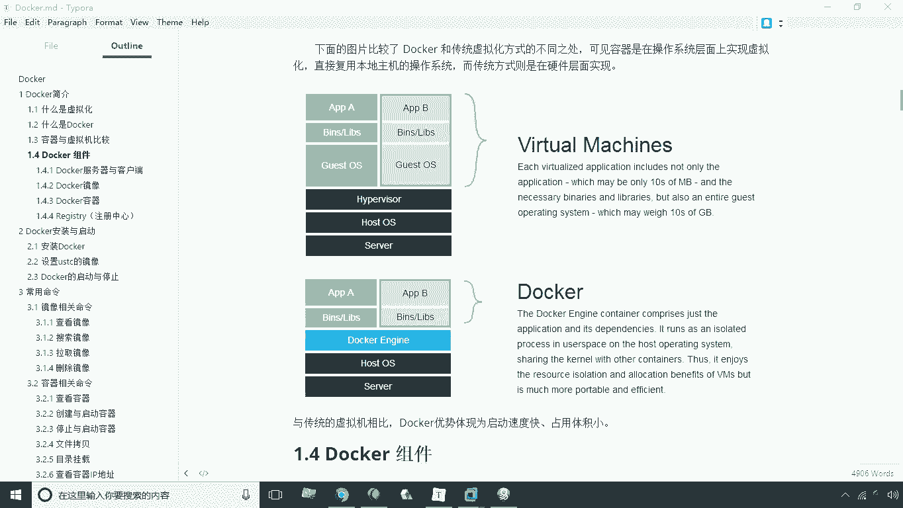
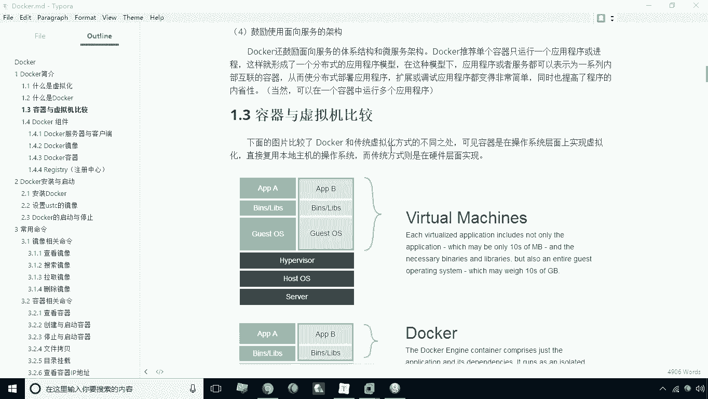
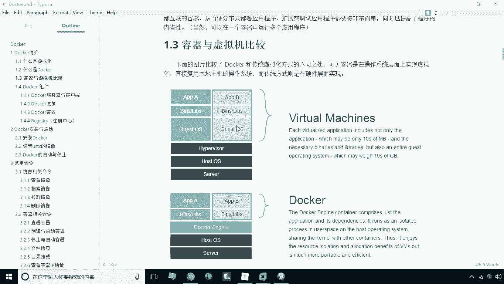
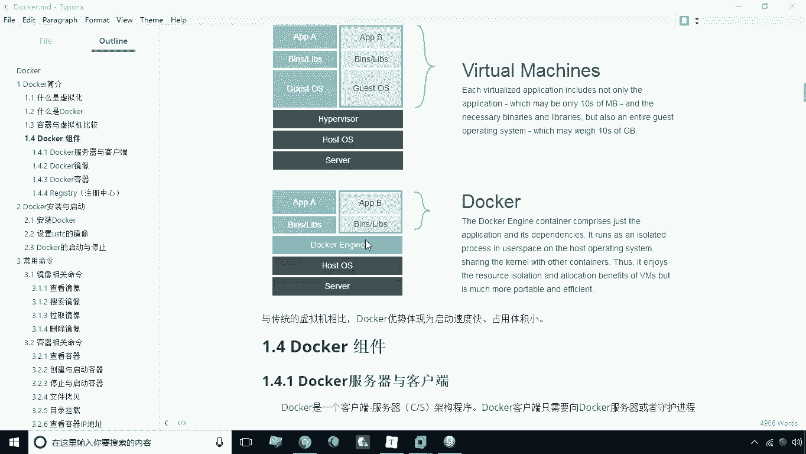
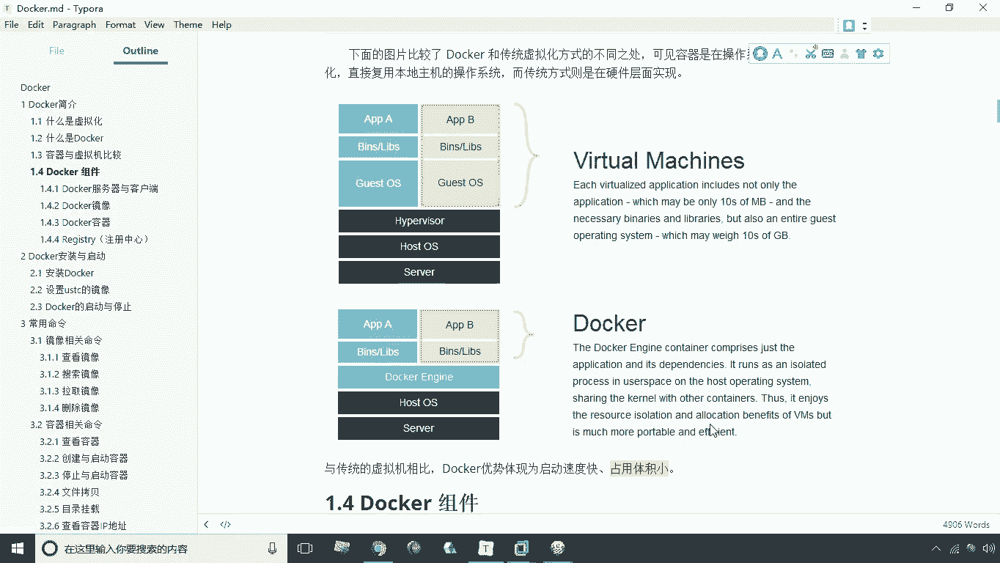

# 华为云PaaS微服务治理技术 - P3：03.容器与虚拟机比较 - 开源之家 - BV1wm4y1M7m5

接下来呢我们就将容器技术和虚拟机之间呢，啊这种传统的虚拟化技术之间啊，进行一个比较啊，我们说这个传统的虚拟化技术呢，这里头我们以这个软件为例啊。

就叫happy vera啊，这么以这个软件为例啊，那这个软件其实和我们的VR是有点类似的啊，就是我们传统的虚拟化方式，那么在传统的虚拟化方式之下，大家看一下它的这种层次结构啊。

最底层的部分呢就是server，其实也就是我们的服务器的硬件，这一层就是服务器的硬件，那么在硬件之上，当然运行的就是我们这个服务器，本身的操作系统对吧，也就是本地的操作系统。

那么本地操作系统之上会装安装一个软件，这个软件我们通常把它称之为什么呢，叫虚拟层对吧，唉就是用来管理虚拟机的这么一个软件，那么管理虚拟机的这个软件之上大概看一下啊，就会安装什么。

安装我们的虚拟机的一个操作系统啊，那么这个虚拟机操作系统呢我们可以装很多个，而且这些虚拟机操作系统，和我们本地的这个虚拟机之间什么的，本地的这个操作系统之间是没有任何关系的，对不对。

因为它们之间它是运行在哪里呢，是运行在这个虚拟层这个软件之上的，而这个虚拟层软件它可以干嘛呢，它可以去虚拟出各种类型的硬件，那么而且这个他这个各个各个操作系统啊，各个虚拟的操作系统实际上是运行在什么呢。

实际上是运行在这个虚拟层的这个软件之上，所以说在这种传统的这个虚拟机的，这种系统之下呢，它这个操作系统和这个底层的本地的，操作系统之间其实是没有任何关系的啊，是没有什么直接的关系的啊。

那这是我们说的第一种方式，而第二种方式大家来看一下。

第二种方式呢就是我们说的这个docker啊，以docker为来说一下容器相关的这种容器的，这么一个这么一种工作机制，那么容器大家看一下，底层仍然是我们的server，上一层是什么，是本机操作系统。

那本机操作系统之上，大家看一下，注意这一层是什么，就是我们docker引擎啊，就是docker引擎，也就是我们所安装的docker软件，那么在这个软件之上。

大家来看一下直接运行的什么，运行的就是我们的一些二进制的一些啊库啊，二进制的一些库，然后二进制库事实上我们在安装什么呢，在安装我们的各种应用软件，那我们可以将这两个图之间做一个比较，做一个什么比较呢。

我们可以看一下这两个部分是一样的啊，就是我们的底层的硬件，这一层和我们的本机操作系统这一层是一样的，而上面这个部分有区别，这个呢是我们的虚拟层，而这个是什么呢，这是我们的docker引擎。

实际上这两个职能啊，啊这个其实职能它本身也是类似，但是呢我们来看一下它的区别在哪里呢，哪里呢，这个虚拟虚拟层啊，它主要是它可以虚拟一些硬件，所以说在虚拟硬件上，我们可以说虚拟不同的操作系统。

也就是说我们这个操作系统和这个操作本地的，操作系统之间，它不一定是一个类型的，我本机可以是windows，而虚拟出来操作可以是LINUX，而我们在这种情况下，大家看一下，在上面上面这一层啊。

在docker引擎上面这一层是没有什么的，没有本机操作系统，所以说呢这种情况之下，你的这个每一个容器它的环境实际上它什么呢，它实际上是依赖于你本机的这种操作的环境，看似好像是每一个容器内部。

是有一个操作系统的，但实际上来说呢，这种这个操系统本身是什么呢，本身其实调用的是你本机的操作系统，这一些一些功能，它是通过这种，它是通过什么呢，它是通过这个刀客的引擎来什么呢，来将本地操作系统之间。

本地操作系统之间的啊去去进行一个隔离，那么这样一来呢，我们就可以在不同的容器之间啊，不同的容器内部去安装各种应用，而这些应用呢看似好像什么呢，好像是啊之间是没有任何关联的啊。

他就是通过这个docker引擎来进行一个环境的隔离，那在这种情况之下，我们说你的这个本机的操作，本机的操作系统和我们说容器内部的操作系统，时间是必须是同等类型啊，在这种墙是必须同等类型。

那么我们说了说既然说这个传统的虚拟机啊，相比比它呢，它之间，那么我们说我们会选择哪一种呢，我们可以说了，他这种情况下呢它更加灵活，对不对，就是你的本机动系统上面，可以虚拟出很多类型操作系统。

但是这种情况下也存在一个问题，就是它所占用的系统资源会比较多，那么这样一来必然会产生一个限制啊，它产生什么呢，就是你的这个一在一个物理机上所运行，虚拟或虚拟化出来的，这个操作系统个数是有限的。

因为每一个操作系统之间，每一个操作系统都是独立的，它要占用大量的内存才可以运行，所以说在一个主机下，这种传统传统的虚拟机下，它所能够虚拟出来的这个系统的个数啊，受到这种限制，内存受限制，那么另外一点呢。

如果说是这种docker引擎的话，他这种限制就啊就是很小很小了啊，因为什么呢，因为因为各个容器它所运行所使用的一些内存，和这个什么呢，和你本机的这个操作系统，本机的操作系统之间是一种共享的关系。

所以说呢他这种占用体积会更小啊，无论是你的硬盘空间也好，还是占用的内存越小，它都占这种docker都是非常有优势，另外一点就是从启动速度来看啊，那么如果传统的虚拟机使用启动速度，其实它启动一个操作系统。

它的启动速度和我们启动一个物理的操作系统，它的启动速度是完全一样，而我们说启动容器通过docker容器技术来启动啊，他这个速度就非常快了啊，它因为它本身它这种底层机制，并不是完全构建一个新的操作系统。

而是它调用你本机的操作中，它的一些内核来实现相应功能好，这是关于我们说的一个这两种方式的一个对比，所以说和传统的讯息相比，它的优势就在于它的启动速度快，占用体积小，这是它最大优势。

所以说在实际的生产环境中啊，我们说docker啊。

