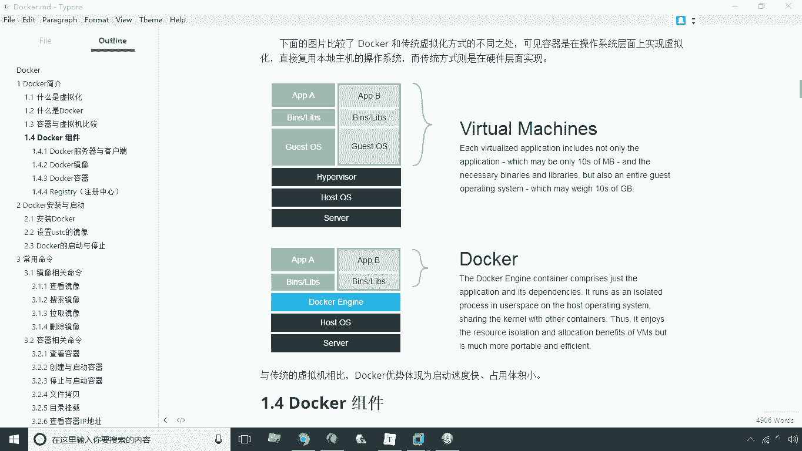
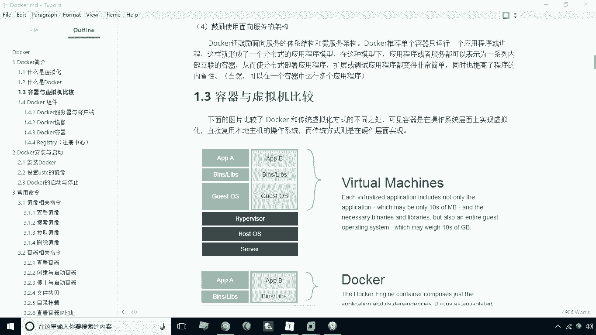
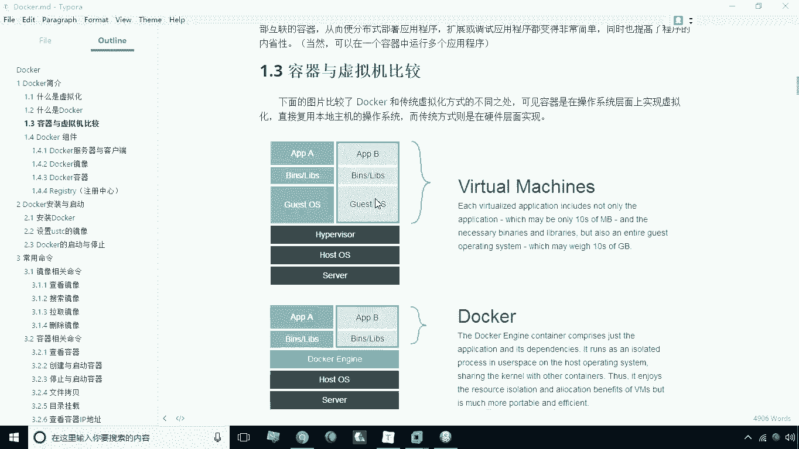
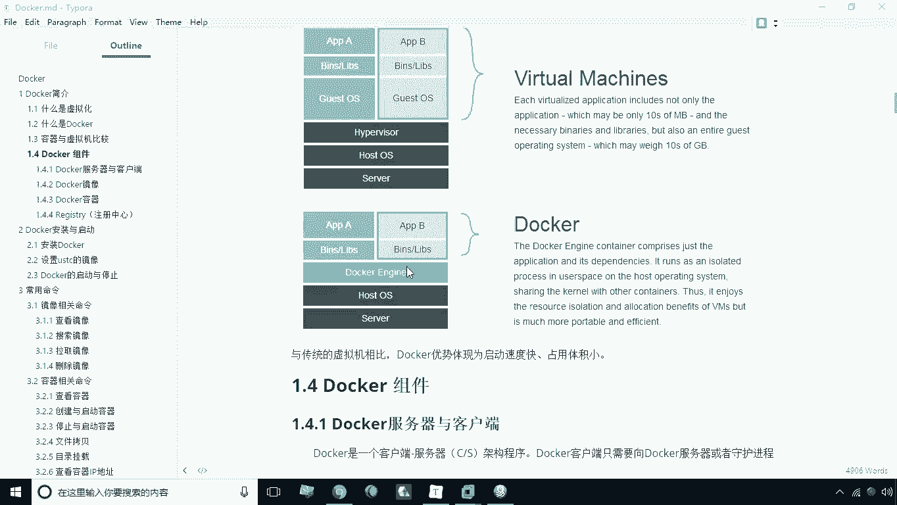
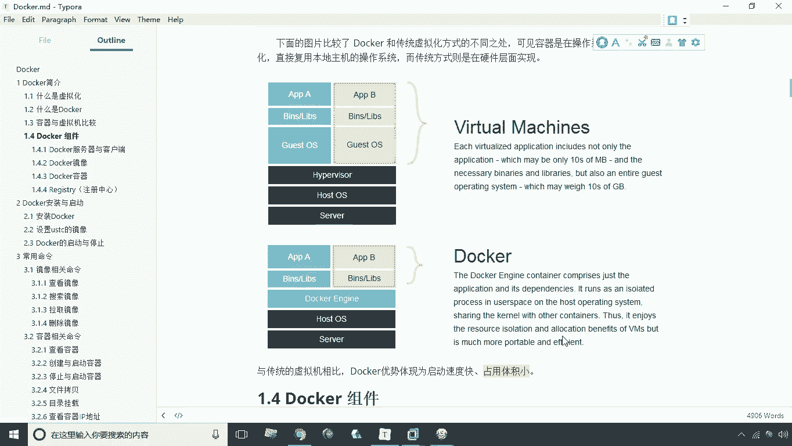

# 华为云PaaS微服务治理技术 - P3：03.容器与虚拟机比较

在本节课中，我们将要学习容器技术与传统虚拟机技术之间的核心区别。我们将通过对比两者的架构和工作原理，来理解为什么容器技术在现代云计算和微服务架构中如此流行。

## 架构对比：传统虚拟机

上一节我们介绍了微服务的基本概念，本节中我们来看看两种不同的应用部署与隔离技术。首先，我们来分析传统的虚拟化技术。

我们以常见的虚拟化软件（例如 VMware）为例来说明传统虚拟化方式。这种技术与我们熟知的虚拟机（VM）类似。

在传统的虚拟化架构下，其层次结构如下：

以下是传统虚拟机的层次结构：
*   **最底层**：服务器的物理硬件（Server Hardware）。
*   **第二层**：运行在硬件之上的本地主机操作系统（Host OS）。
*   **第三层**：安装在主机操作系统上的虚拟化层软件（Hypervisor）。该软件负责管理和创建虚拟机。
*   **第四层**：在虚拟化层之上安装的多个客户机操作系统（Guest OS）。每个虚拟机都拥有自己独立的操作系统。

在这种架构中，各个客户机操作系统与底层的主机操作系统之间没有直接关系。它们运行在虚拟化层软件之上，而虚拟化层软件负责虚拟出各种硬件资源（如CPU、内存）。因此，每个虚拟机都包含一个完整的、独立的操作系统环境。

## 架构对比：容器技术

了解了传统虚拟机的架构后，我们再来看看以 Docker 为代表的容器技术的工作机制。

以下是容器技术的层次结构：
*   **最底层**：服务器的物理硬件（Server Hardware）。
*   **第二层**：运行在硬件之上的本地主机操作系统（Host OS）。
*   **第三层**：安装在主机操作系统上的容器引擎（如 Docker Engine）。
*   **第四层**：在容器引擎之上直接运行的是各种应用及其所需的二进制库文件（Binaries/Libraries）。

现在，我们可以将两种架构进行对比。它们的底层硬件和主机操作系统层是相同的，主要区别在于上层。

## 核心差异分析

通过对比，我们可以总结出容器与虚拟机的几个核心差异：

以下是两者的关键区别：
1.  **操作系统依赖**：
    *   虚拟机：每个虚拟机包含完整的客户机操作系统，与主机操作系统类型可以不同（例如，主机是Windows，虚拟机可以是Linux）。
    *   容器：容器**没有**自己的操作系统内核。它们通过容器引擎共享主机操作系统的内核，因此容器内的环境必须与主机操作系统类型兼容（例如，Linux主机只能运行Linux容器）。

2.  **资源占用与效率**：
    *   虚拟机：每个独立的操作系统会占用大量的磁盘空间、内存和CPU资源。这限制了单台物理主机上能够运行的虚拟机数量。
    *   容器：容器非常轻量，因为它们共享主机内核，并且只包含应用及其依赖。这极大地减少了资源开销，使得单台主机可以运行成百上千个容器。其资源占用公式可以简化为：`容器资源 ≈ 应用资源 + 依赖库资源`。

3.  **启动速度**：
    *   虚拟机：启动速度慢，因为需要启动一个完整的操作系统，其过程与启动一台物理机类似。
    *   容器：启动速度极快（通常只需几秒），因为它们本质上只是启动一个主机上的隔离进程，无需引导完整的操作系统。

## 总结

本节课中我们一起学习了容器技术与传统虚拟机技术的对比。与传统虚拟机相比，容器技术的核心优势在于**启动速度快**和**资源占用小**。正是这些优势，使得以 Docker 为代表的容器技术成为现代云原生应用、持续集成/持续部署（CI/CD）和微服务架构的理想选择。在实际生产环境中，容器技术能够提供更高的部署密度和更敏捷的应用交付能力。