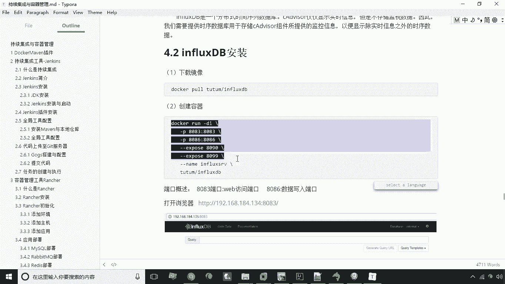
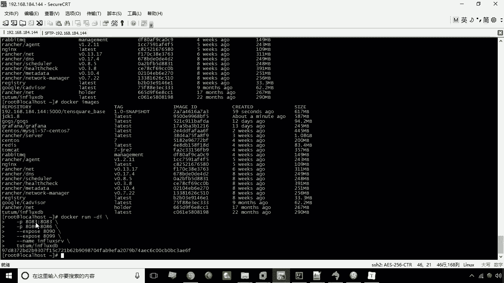

# 华为云PaaS微服务治理技术 - P40：20.influxDB - 开源之家 - BV1wm4y1M7m5

好接下来呢我们来讲解本章的第四个知识点，Influx db，那么什么是influx dB，从名称上来看啊，这个应该是一个数据库的产品，没错，它是一种数据库，但是和我们之前所学的数据库，有明显的一个区别。

它属于一种什么呢，叫分布式时间序列数据库，这个数据库有点特殊啊，那么通常不适用于我们的一些应用系统开发，而是用来干嘛的呢，主要是用来存储啊，我们系统的一些监视用的数据。

也就是说比如说我们可以像这个数据库啊，这个插入一些，比如说当前的内存有多大呀，CPU的占用情况啊等等啊，这些数据我们可以通过influence dB来进行存储，所以说这个influx TP呢。

它实际上是运维经常使用的一种数据库，那我们接下来呢就给大家演示一下，influence dB的一个安装与使用，首先我们来看一下安装，安装我们仍然可以容器的方式来进行安装啊，那么需要去下载镜像。

叫total guinflutb，这个镜像我已经提前给大家下好了，那么大家直接可以用了，那么第二步就是我们要创建容器啊。

要创建这个容器，好创建的容器呢，这里头我们用这个端口映射啊，映射两个端口，一个是8083。

一个是8086，那么这个8083和8086是什么呢，啊下面有显示啊，8083呢就是它的web访问端口，也就一会儿呢，我们就可以通过8083来访问这个数据库，而8086呢是数据写入端口啊。

也就是说其他的软件要想去操作这个数据库，进行写入，那么8086端口就是它写入的端口，另外呢它还要暴露两个端口，是8090和8099啊，两个端口是需要他要求暴露出来的啊。

并且指定了一个名字为includes s r v啊，这么一个名称好，这就是我们创建容器就创建成功了，那么创建容器之后，那么接下来呢就可以访问，通过8083的这个端口来进行访问了，144冒号8083好。

现在呢我们就就打开了这个influence dB，的这么一个界面啊，就表示我们已经创建成功了，那么当然现在呢它有一个默认的一个数据库，叫internal啊，这么一个默认的数据库。

那么我们说怎么去创建一个新的数据库呢，唉这时候呢我们来看一下啊，如果说我们要创建一个新的主题库，这里头它有一个模板，有个查询模板，我们可以通过这个选择查询模模板。

来快速的输入我们的一些啊数据库的一些命令，比如说我们现在选择一下这个create database好了，这个query这个框里就自动有create database。

然后呢一个引号引号这个部分写的就是什么呢，写的就是你的数据库的名称啊，那比如说我们在这里可以给它起个名，叫CADVANA，我们建立这么一个数据库，叫c advisor，好回车回车之后。

那这时候呢这个语句就会被执行了，执行之后呢，我们来看一下，在这个数据库的列表中，就能看到这个c advisor了啊，就能看到这个CAYA，这是我们说关于数据库的一个创建嗯。

那比如说我要去啊查询有哪些数据库，也是一样的，这里有一个show database，然后呢我们回车，这时候我们就可以看到啊，当前的数据库的列表，也就是说我们这里有个query的这个框。

这个框呢其实就是用来执行数据库命令的，这么一个框，好，接下来我们再往下看，那么除了建库，我们还可以去创建用户并且授权啊，比如我们下面这句话，这一块的意思是什么呢，我们来看一下，就是创建用户。

这个用户叫CADVENTER，然后呢指定密码为CADVENTER，并且给它赋予啊所有的这个特权啊，我们回车好，我们现在呢这个回合之后，这个用户呢就已经创建成功了，创建成功之后，我们一样啊，可以去查询。

可以去查询这个用户，这里有一个c adv，那么接下来呢我们还可以什么呢，还可以进行用户的授权，也就是说，我们可以把这个用户赋予某一个数据库，让它有这个数据库的权限，你比如说第一句话就是赋予这个用户。

赋予这个用户啊所有的这种特权，然后呢啊on on数据库名to用户名，我们这里只不过这两个名称是一样的哈，on后边是数据库名to，后面是用户名，好我们现在回车，这时候呢我们就执行了一个父权操作。

当然我们下面还有比如说这句话，这句话的意思就是说，赋予这个用户写这个数据库的权限啊，如果是读呢就是对的，读就是red的好，这就是啊对用户进行复权这样一个操作，这是关于我们的一些父权操作。

那另外一个还有的说可以通过下面这个命令啊，就是去查看一下我们的这个采集的一些数据啊，也就是查看数据，我们在执行之后，我们会发现啊，他现在并没有进行输出对吧，并没有进行输出。

因为我目前呢这个数据库是刚刚建立，所以说现在还没有数据产生啊，所以说我们现在无法去查看数据，那么一会儿呢我会结合其他软件啊，结合其他软件，像这个influx dB去插入一些运行数据。

那这时候呢我们就可以使用这个命令，来进行查看数据了，关于INFLUXDB的一个软件的一个基本使用。

