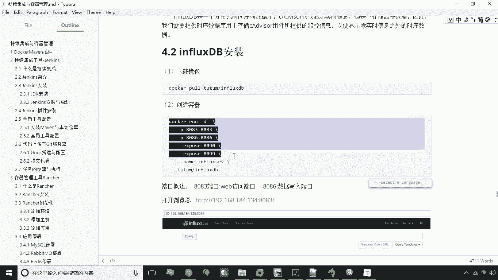
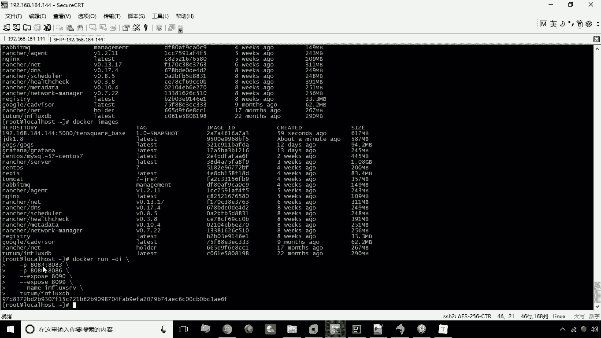
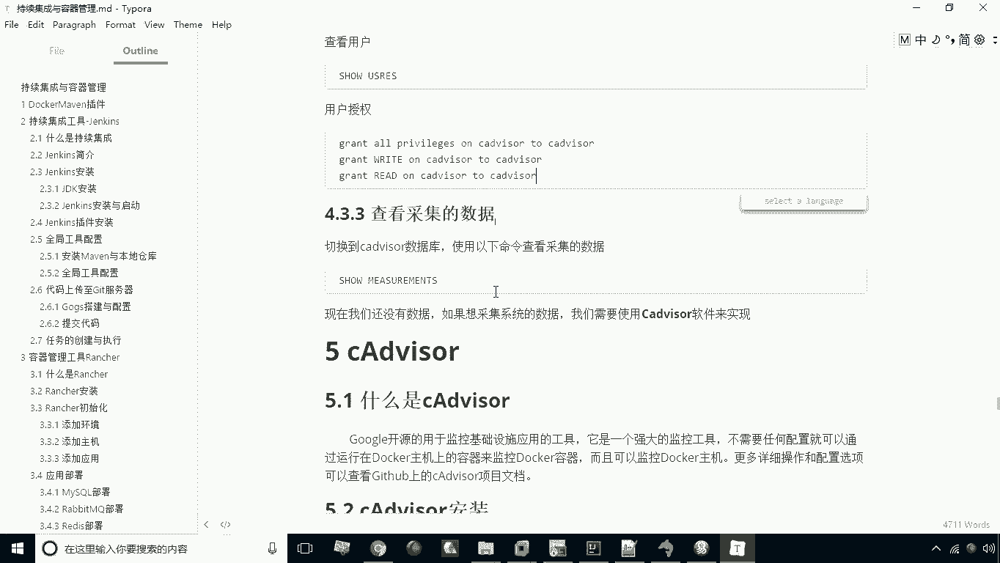

# 华为云PaaS微服务治理技术 - P40：20. InfluxDB 📊

在本节课中，我们将要学习 InfluxDB。这是一种特殊的数据库，主要用于存储系统监控数据，例如内存使用量和CPU占用率。我们将介绍其基本概念，并演示如何安装、创建数据库、管理用户以及进行基本的数据操作。

## 什么是InfluxDB？🤔

上一节我们介绍了微服务治理中的其他组件，本节中我们来看看 InfluxDB。从名称上看，它应该是一个数据库产品。没错，它是一种数据库，但与我们之前学习的数据库有明显区别。

它属于一种**分布式时间序列数据库**。这种数据库比较特殊，通常不适用于常规的应用系统开发，而是主要用于存储系统的监控数据。例如，我们可以向这个数据库插入当前内存大小、CPU占用情况等数据。因此，InfluxDB 实际上是运维工作中经常使用的一种数据库。

## InfluxDB的安装与使用 🛠️



接下来，我们给大家演示一下 InfluxDB 的安装与使用。首先我们来看安装步骤，我们将以容器化的方式进行安装。



以下是安装步骤：

1.  **下载镜像**：需要下载 `tutum/influxdb` 镜像。此镜像已提前下载好，可以直接使用。
2.  **创建容器**：使用以下命令创建容器，并进行端口映射。

```bash
docker run -d -p 8083:8083 -p 8086:8086 --expose 8090 --expose 8099 --name influxsrv tutum/influxdb
```

在创建容器的命令中，我们映射了两个端口：
*   **8083**：这是 InfluxDB 的 Web 访问端口，稍后我们将通过此端口访问数据库的管理界面。
*   **8086**：这是数据写入端口，其他软件如需向此数据库写入数据，需通过此端口。

此外，命令还暴露了 8090 和 8099 端口，这是软件要求暴露的，并指定了容器名称为 `influxsrv`。

容器创建成功后，即可通过 `http://服务器IP:8083` 来访问 InfluxDB 的 Web 界面。打开界面后，表示安装成功。目前，系统中已有一个默认的数据库 `_internal`。

## 数据库与用户管理 📁

现在，我们来看看如何创建新的数据库并进行用户管理。

### 创建数据库

在 InfluxDB 的 Web 界面中，有一个查询模板（Query Templates）功能，可以快速输入数据库命令。

以下是创建数据库的步骤：

1.  在查询模板中选择 `Create Database`。
2.  查询框中会自动出现 `CREATE DATABASE “”` 命令。
3.  在引号内输入数据库名称，例如 `cadvisor`。
4.  按回车键执行命令。

执行成功后，在数据库列表中就能看到新创建的 `cadvisor` 数据库。若要查询所有数据库，可以在查询框中输入 `SHOW DATABASES` 并执行。

### 创建用户与授权

除了建库，我们还可以创建用户并为其授权。

以下是相关操作命令：

1.  **创建用户**：执行 `CREATE USER “cadvisor” WITH PASSWORD ‘cadvisor’ WITH ALL PRIVILEGES`。此命令创建了一个名为 `cadvisor`、密码为 `cadvisor` 并拥有所有特权的用户。
2.  **查询用户**：可以通过相应命令查询已创建的用户。
3.  **为用户授权**：将特定数据库的权限赋予用户。
    *   `GRANT ALL ON “cadvisor” TO “cadvisor”`：授予用户对 `cadvisor` 数据库的所有权限。
    *   `GRANT WRITE ON “cadvisor” TO “cadvisor”`：授予用户对 `cadvisor` 数据库的写入权限。若为读取权限，则将 `WRITE` 替换为 `READ`。

## 数据查询 👀

最后，我们来看看如何查询数据。在查询框中输入查询命令（例如 `SELECT * FROM “”`）即可查看数据。

需要注意的是，由于我们刚刚建立数据库，目前还没有数据产生，因此执行查询命令可能没有输出。稍后，当我们结合其他监控软件（如 cAdvisor）向 InfluxDB 插入运行数据后，就可以使用这些命令来查看数据了。



本节课中我们一起学习了 InfluxDB 的基本概念，它是一种用于监控的时间序列数据库。我们逐步演示了其容器化安装、数据库创建、用户管理与授权以及基本的数据查询操作。这些是使用 InfluxDB 进行系统监控数据存储和管理的基础。