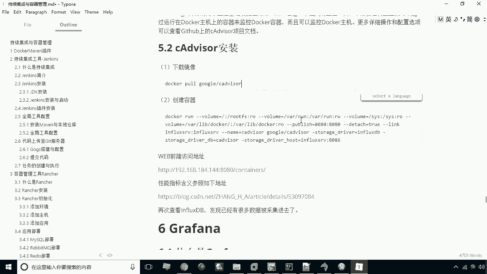
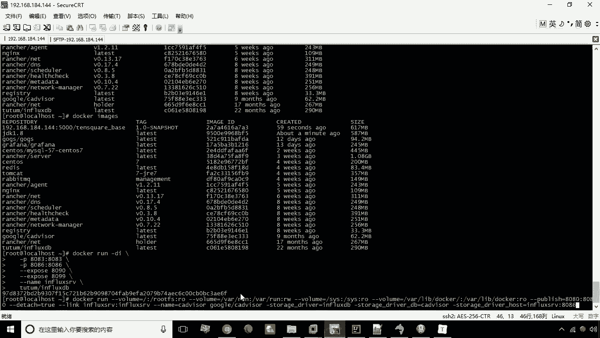
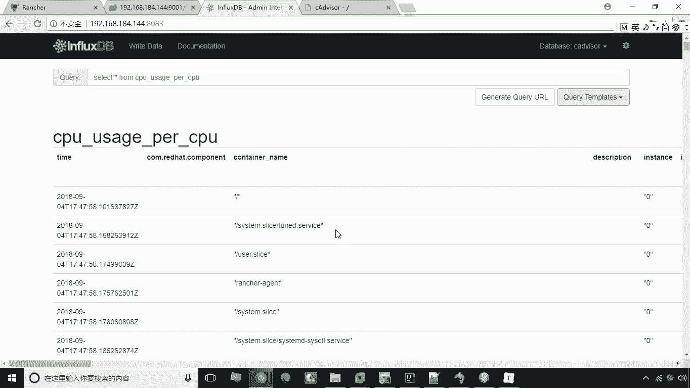

# 华为云PaaS微服务治理技术 - P41：21.cAdvisor - 开源之家 - BV1wm4y1M7m5

好接下来呢我们来讲解本章的第五个知识点，叫CADVANA，那么什么是CADVANCER呢，这个CADVOR啊，其实是谷歌出品的一个，用于监控容器的这么一个运维工具啊，它是一个监视工具。

那么它主要的作用呢，就是用来监视我们容器的一些啊运营的数据，比如说内存呢CPU啊啊的这些占用情况，我们主要用来监控，那么这个监控呢这里头啊他只是负责监控，那么它最终啊它最终要把数据存在哪里呢。

那么接下来这个操作呢，就是要啊这个下载它的镜像，然后呢创建容器，创建容器之后它就开始运行了啊，它运行时候运行之后，这时候他其实就已经开始去采集这些数据啊，采集了数据之后呢。

我们一会儿就可以看到这个数据被插入到，if looks dB这样的一个效果好，咱们先来看一下第一个下载镜像，我们这步就不用做了，因为我已经提前把这个镜像下好了。

那么接下来我们直接执行第二句啊，第二句我们先执行看看有没有问题好。

现在已经成功了，成功之后呢，我们来看一下嗯，现在已经有这个已经在运行这个容器了，运行这个容器之后啊，其实这里头这句话挺长啊，那这里头呢，其实大家只要关心哪个部分就行了呢。

关心这部分就是我们要去这里有一个连接，这个influce dB这部分啊，连接这个INFLUDB，也就是说我们要将它的存储啊存储存储在哪呢，这里指定为advisor这个数据库，那这两句是大家需要关心的。

因为以后如果说大家以后用这个东西，其实也就是需要改的部分，就是改这个名称啊，改个名称，其他呢这里有一个杠杠杠V啊，这个这个呢其实就相当于我们来原来这杠V，原来是杠V。

然后呢杠杠publish就相当于杠P啊，就像端口映射，只不过这里呢是另外一种写法而已啊，这是我们说的这个嗯关键词创建容器啊，还有就是杠杠，link表示是连接连接到另外一个容器。

那这个零件另外一个容器呢这个influx s v2，就是刚才我们所创建的这个这个名称，创建的这个这个if loodb的容器的名称啊，这两个这几个关键点大家知道就可以了，好我们创建完成之后。

那接下来呢我们可以通过啊，8080端口去访问一下这个这个项目啊，本身呢它也提供了一个web界面，他也提供了web web界面了，然后他这里头可以去看到，他所监视的一些数据啊，我现在稍等好。

现在呢已经打开这个界面了啊，已经打开这个界面了，打开这个界面之后呢，大家会看到这个啊，这上有一些仪表对吧，包括什么CPU啊，内存啊等等，这些仪表就是来监控的啊，这是一个实时的数据。

然后这里有些CPU的一个动态的图表啊，随时在再给你展现出来啊，一些动态图表，那么它在运行之后，运行之后呢，其实他也在做一件事情，因为刚才我们所创建的这个语句，其实就是要连接什么，其实就在连接。

我们说刚才那个衣服look look b这样一个容器，并且把数据存到这个c adv，那咱们接下来看一下这个if lose v，这个数据到底有没有采集进去啊。

那还是切换到这个influence dB的页面，然后呢咱们还执行这句话，这时候大家会发现哎哎这些有这些数据了对吧，哎这些数据就存在了，就是我们说的这个呃关于这个数据啊。

那当然你要去想查看具体的数据也是一样的啊，比如说select星，啊去查看一些具体的数据啊，啊也是可以的啊，啊这是我们说的这个数据就查询出来了，这是关于这个c advisor啊。

