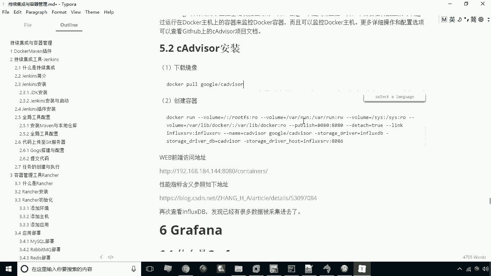
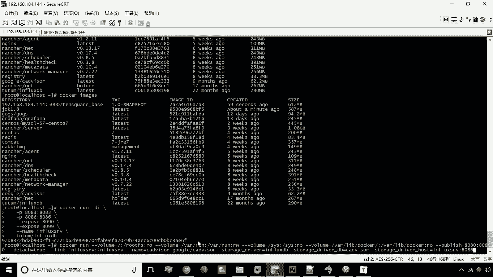
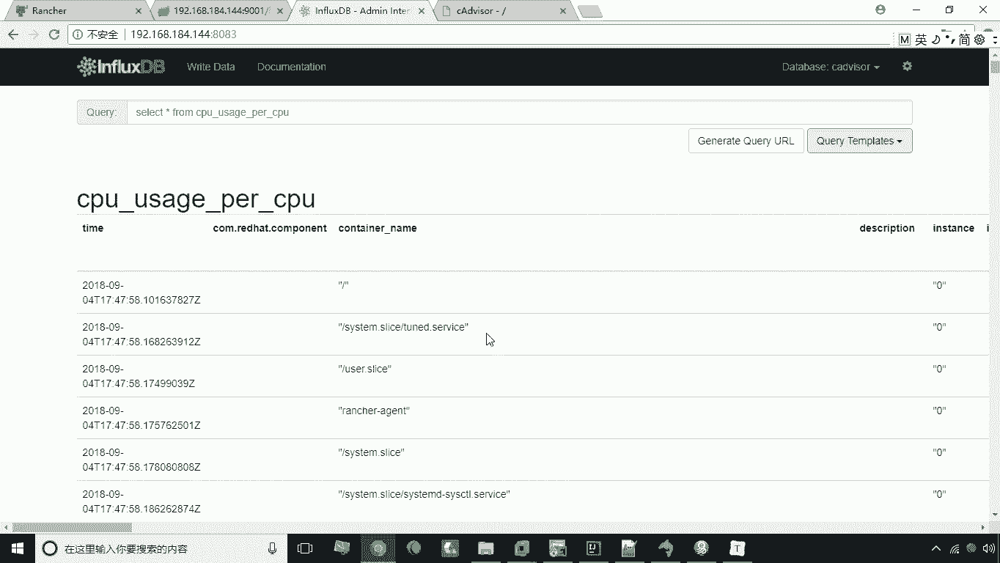

# 华为云PaaS微服务治理技术 - P41：21.cAdvisor

## 概述
在本节课中，我们将要学习一个名为cAdvisor的容器监控工具。我们将了解它的定义、作用，并通过实际操作演示如何部署cAdvisor，以及如何查看它采集到的容器监控数据。

## 什么是cAdvisor？ 🛠️
cAdvisor是谷歌出品的一个用于监控容器的运维工具。它是一个监视工具。

它的主要作用是监视容器运行时的数据，例如内存和CPU的占用情况。它主要负责监控数据的采集。



## 部署与运行cAdvisor 🚀
上一节我们介绍了cAdvisor的基本概念，本节中我们来看看如何部署和运行它。cAdvisor本身只负责监控，它需要将数据存储到其他地方，例如我们之前部署的InfluxDB。



以下是部署cAdvisor的关键步骤：

1.  **下载镜像**：首先需要获取cAdvisor的Docker镜像。
2.  **创建并运行容器**：通过Docker命令启动cAdvisor容器，并配置其将数据存储到InfluxDB。

我们已经提前下载好了cAdvisor的镜像，因此可以直接执行创建容器的命令。

```bash
docker run \
  --volume=/:/rootfs:ro \
  --volume=/var/run:/var/run:ro \
  --volume=/sys:/sys:ro \
  --volume=/var/lib/docker/:/var/lib/docker:ro \
  --volume=/dev/disk/:/dev/disk:ro \
  --publish=8080:8080 \
  --detach=true \
  --name=cadvisor \
  --link influxsrv2:influxsrv2 \
  google/cadvisor:latest \
  -storage_driver=influxdb \
  -storage_driver_db=cadvisor \
  -storage_driver_host=influxsrv2:8086
```

命令执行成功后，cAdvisor容器就开始运行并采集数据了。这个命令较长，但有几个关键部分需要理解：
*   `--publish=8080:8080`：将容器的8080端口映射到宿主机，以便通过Web界面访问。
*   `--link influxsrv2:influxsrv2`：连接到名为`influxsrv2`的InfluxDB容器，这是数据存储的目标。
*   `-storage_driver_db=cadvisor`：指定数据存储在InfluxDB中名为`cadvisor`的数据库。
*   `-storage_driver_host=influxsrv2:8086`：指定InfluxDB服务的主机和端口。

## 访问cAdvisor Web界面 🌐
容器运行后，我们可以通过访问宿主机的8080端口来打开cAdvisor提供的Web监控界面。

在界面中，你可以看到实时的仪表盘，展示了CPU、内存等资源的占用情况，以及动态变化的监控图表。

## 验证数据存储 📊
cAdvisor在运行时会根据我们的配置，将采集到的数据写入InfluxDB。现在，让我们验证数据是否成功存储。

切换到InfluxDB的管理页面，执行查询命令查看`cadvisor`数据库中的数据。

```sql
SHOW MEASUREMENTS ON cadvisor
```

执行后，如果能看到返回的数据表（measurements）列表，则证明cAdvisor采集的数据已成功存入InfluxDB。你还可以使用`SELECT`语句查询具体的数据内容。

```sql
SELECT * FROM "cpu_usage_total" LIMIT 10
```



## 总结
本节课中我们一起学习了cAdvisor。我们了解到cAdvisor是一个开源的容器资源监控工具，能够采集容器的CPU、内存等运行指标。我们通过Docker命令部署了cAdvisor，并将其配置为将监控数据存储到InfluxDB数据库中。最后，我们通过Web界面和数据库查询验证了其监控功能与数据存储的有效性。