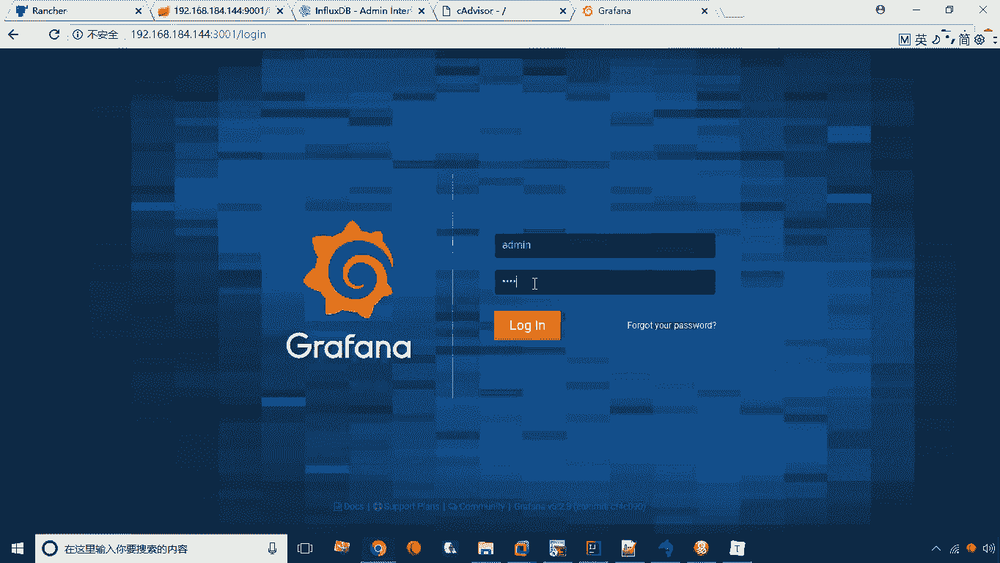

# 华为云PaaS微服务治理技术 - P42：22.grafana的安装 - 开源之家 - BV1wm4y1M7m5

好刚才呢我们已经完成了这么几步啊，就是完成了一个时间序列库的一个安装，以及我们的CADVENTOR这个监控工具的安装，而监控是工具啊，它主要是把监控出来的数据去插入到。

我们的influence dB之中，但是influx dB这种数据呢，我们查看起来并不是很方便对吧，因为它都是一些零散的数据，我们更希望是能够看到一个直观一些的数据，比如说我现在展示一个图表。

而这个图表呢就可以把每一个节点的一些数据，给它穿起来，比如说形成一个折线图啊，曲线图啊啊类似于这样的一个报表啊，这样一来看起来会更加的直观啊，那么怎么样才能做呢。

这个时候这个就是由GRAPHA这个软件来实现了，GRANVA实际上是什么呢，就是一个可视化面板，也就是它可以去啊，从什么呢，从这个INFLUXDB等这些数据库作为数据源，来展现一些图表啊。

就这么一个工具，这个GRAPHA呢也是比较常用的一个，运维的一个工具，那么首先下来呢，我们现在要做的就是一个格尔发达的一个安装，那安装呢这里需要下载一个叫镜像，一个镜像就叫GRAPHA杠GRANA。

在下载完这个镜像之后，那咱们现在呢需要去创建一个容器啊，那创建容器的话，我们就是用这个语句来创建就行了，好这个语句呢其实指定了什么呢，这里又指定了一些这个啊环境变量啊。

比如说这个influx dB的这个host啊，就是指定的这个容器的名称值，还有呢就是指定它的这个端口啊，还有指定这个if lose数据库的名称啊等等，就是还有数据库的用户名啊，密码啊，这样一来呢。

我们说他才可以去连接我们的influence dB啊，连接influence tb就这样一个啊这么一种软件，那我们在创建完成之后，接下来要做的事儿就是要访问了，因为我们在这里头创建这个语句呢。

是将3000端口映成为宿主机的3001端口，所以说我们现在可以通过3001去访问一下，这个软件啊，就是192。168。184。144。

冒号3001。

现在呢就已经进入了这个，格拉芬达的一个登陆界面，我们现在呢可以通过它的用户名密码来登录，叫admin，默认是admin admin啊。

初始的面是admin admin，然后点登录啊，登录之后呢，他让你去修改一个密码，去修改这个admit这个密码，那这时候你可以写123456，123456好save，现在呢我们就已经进入到了。

我们这个隔热放量的一个主界面了啊，那么主界面这里头呢啊，左侧呢它有一个菜单啊，左侧有菜单，那么这些菜单呢分别是什么意思呢，第一个加号表示主要创建啊，我要创建什么东西，第二个呢是一个什么呢。

啊第二个代表的是一个仪表盘啊，就是仪表盘的一个管理，那么这个呢其实是比较比较主要的一个功能啊，第三个呢就是告警管理啊，就可以设置一个告警啊，那么下面我们会详细说，那么下面那部分呢就是一些设置啊。

或者是一些配置，可以配置一些数据库用户啊等等啊，这些会有一些插件啊，这些是它的一些主要的核心功能啊，这就是我们说的GRAPHA的一个登录啊，咱们就完成了，那么接下来呢咱们就可以详细去讲解。

