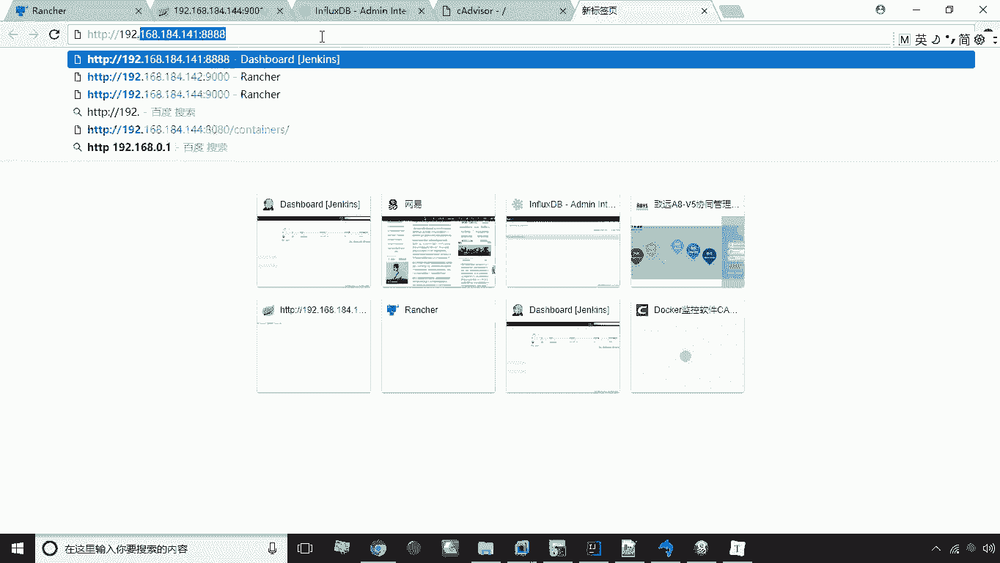
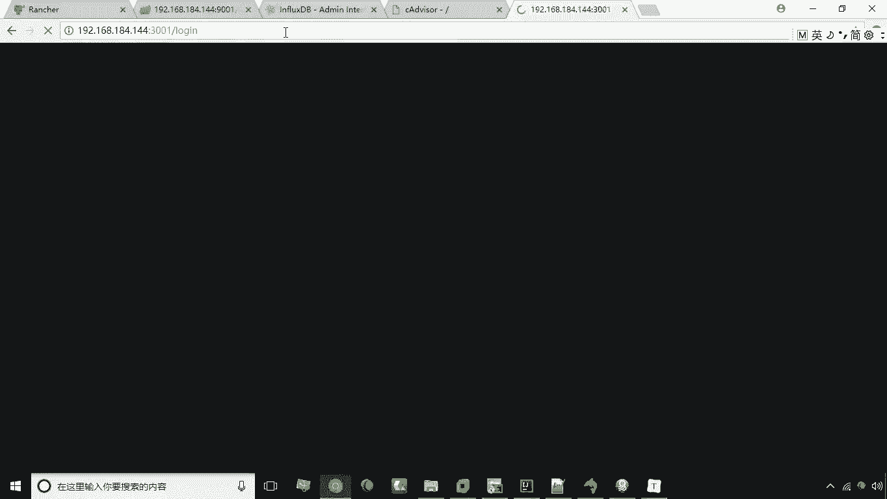
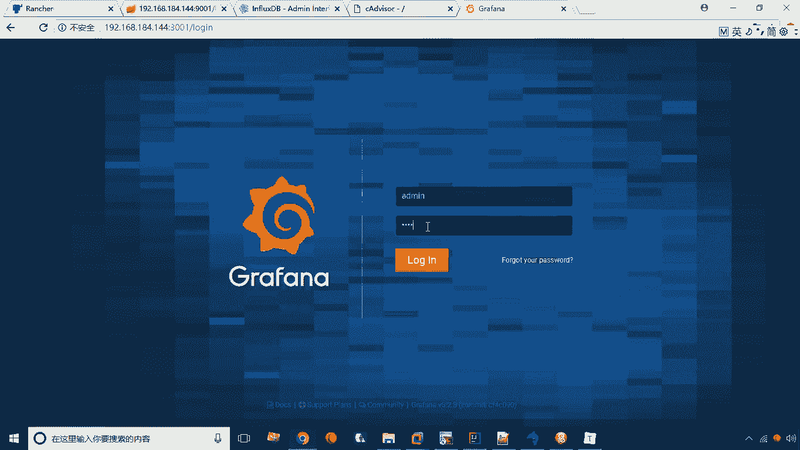
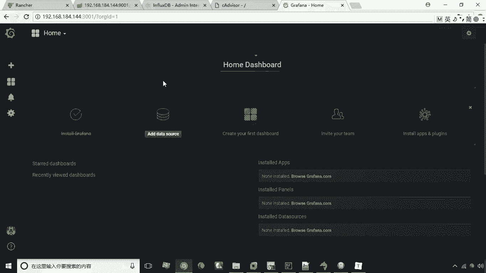

# 华为云PaaS微服务治理技术 - P42：22. Grafana的安装 📊

在本节课中，我们将要学习如何安装和初步配置Grafana。Grafana是一个强大的数据可视化工具，它能够从多种数据源（如我们之前安装的InfluxDB）中获取数据，并将其转化为直观的图表和仪表盘，从而帮助我们更好地监控和分析系统状态。

上一节我们介绍了时间序列数据库InfluxDB和监控工具cAdvisor的安装。cAdvisor负责收集监控数据并存入InfluxDB，但这些数据本身是零散的，查看起来并不直观。本节中我们来看看如何通过Grafana将这些数据可视化，形成易于理解的图表和报表。

## 什么是Grafana？

Grafana是一个开源的可视化面板工具。它的核心功能是从InfluxDB等数据库作为数据源，将数据以图表（如折线图、曲线图）的形式展现出来，生成直观的运维报表。

## 安装Grafana

安装Grafana的第一步是下载其官方Docker镜像。

以下是下载镜像的命令：
```bash
docker pull grafana/grafana
```

下载完成后，我们需要创建一个Docker容器来运行Grafana服务。

以下是创建并运行Grafana容器的命令。该命令指定了连接InfluxDB所需的环境变量，如数据库主机地址、端口、数据库名称、用户名和密码，并将容器的3000端口映射到宿主机的3001端口。
```bash
docker run -d \
  -p 3001:3000 \
  --name=grafana \
  -e "GF_SECURITY_ADMIN_PASSWORD=123456" \
  -e "GF_INSTALL_PLUGINS=grafana-clock-panel,grafana-simple-json-datasource" \
  grafana/grafana
```

## 访问与登录Grafana



容器创建并运行后，即可通过浏览器访问Grafana的Web界面。



访问地址为：`http://192.168.184.144:3001`



首次访问将进入登录页面。Grafana的默认用户名和密码均为 `admin`。

登录成功后，系统会要求修改默认密码。按照提示，将密码修改为 `123456` 并保存。

## Grafana主界面概览

成功登录后，您将进入Grafana的主界面。界面左侧是功能菜单栏，以下是其主要功能项的简要说明：

*   **加号 (+)**：用于创建新的仪表盘、文件夹或数据源。
*   **仪表盘图标 (Dashboards)**：仪表盘管理核心区域，可以浏览、搜索和管理所有已创建的仪表盘。
*   **告警图标 (Alerting)**：用于设置和管理系统告警规则。
*   **配置图标 (Configuration)**：包含数据源、用户、插件等系统设置功能。

至此，我们已经完成了Grafana的安装和初步登录。接下来，我们就可以开始详细讲解如何配置数据源和创建可视化仪表盘了。



本节课中我们一起学习了Grafana的作用、通过Docker安装Grafana的步骤、以及如何登录并初步认识其主界面。Grafana作为数据可视化的桥梁，将为我们后续的监控数据展示提供强大的支持。