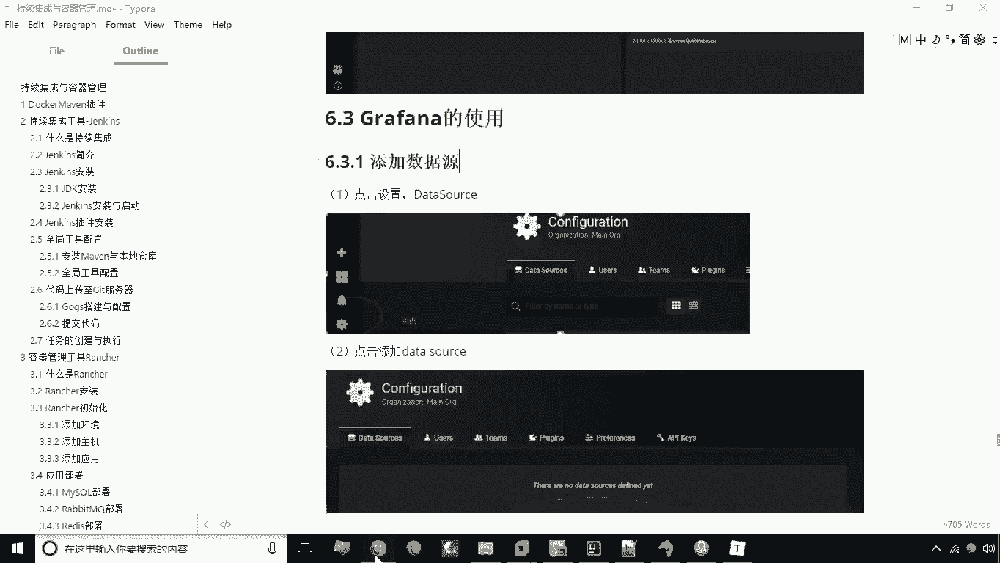
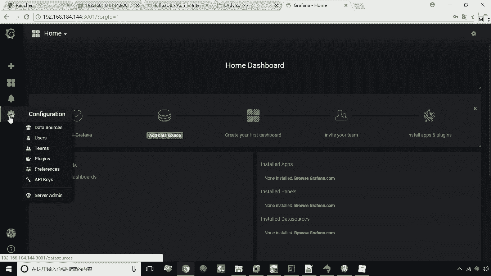
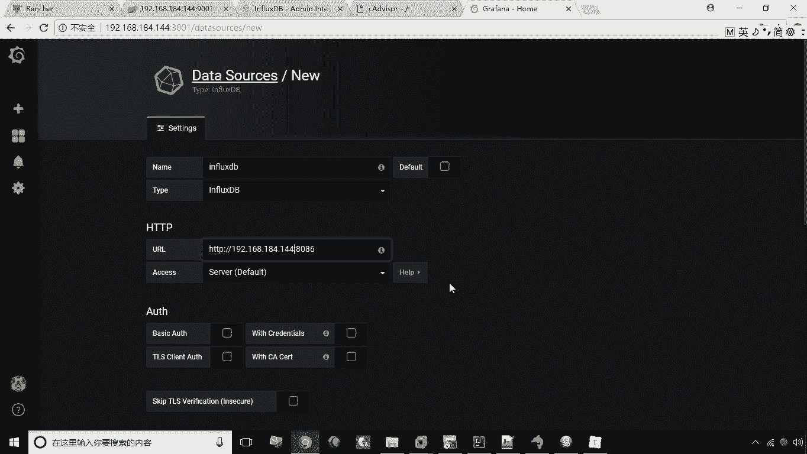
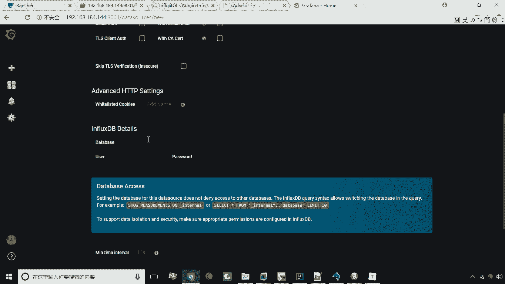
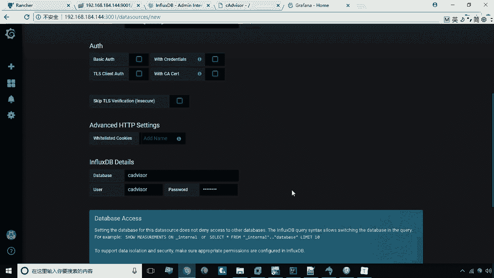
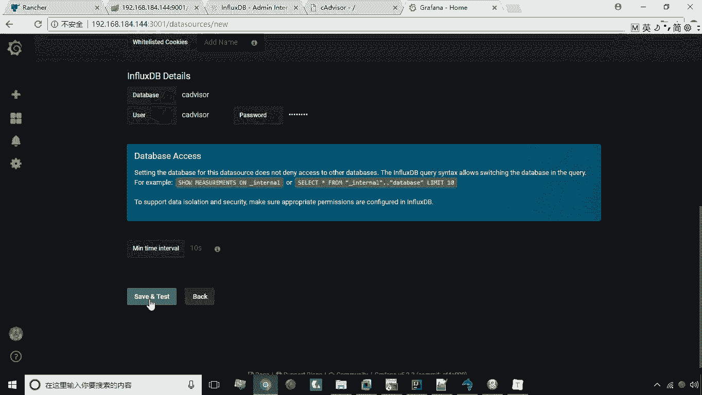
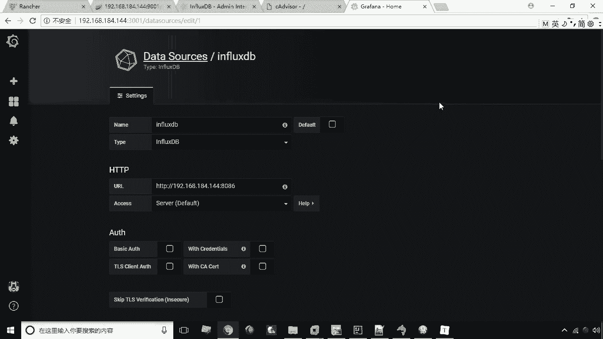

# 华为云PaaS微服务治理技术 - P43：23.添加数据源 - 开源之家 - BV1wm4y1M7m5

好接下来呢给大家演示一下GRAPHA的使用，首先我们第一项啊，给大家演示一下如何来添加数据源啊，那么数据源如何来添加。

咱们看一下这里头有一个有一个设置是吧。

一个齿轮的一个标志设置设置，这里有一个data source，好data source之后呢，这里有一个很大的按钮啊，绿色的按钮叫ADD source，就是添加数据源，我们点击一下，点进去之后呢。

这里有个数据源的设置，那我们这里可以啊，为这个数源起个名字，比如说叫influx dB啊，比如我们写influx dB这个类型呢，它支持这么多类型啊，我们这里选择influx dB啊，Infludb。

那么这个URL这个幼儿的把这个log house改下名，192。168。184。144就行了。

然后紧接着再往下拉啊，拉到下面之后呢。

这个if looks dB的一个详细设置，这里有一个数据库，数据库呢叫C2的，啊叫这个名啊，CADVA用户名密码都是CADVANA。

这样一来呢，我们就添加了这么一个数据源了，然后点击save and test。

好。

