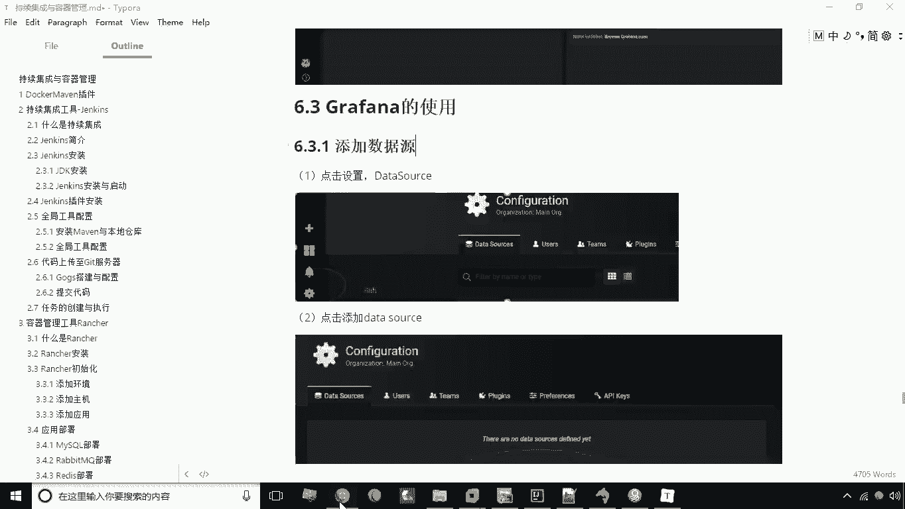
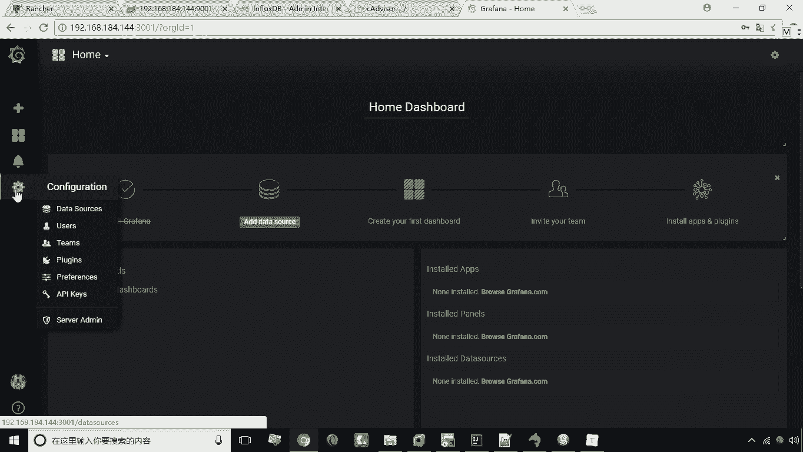
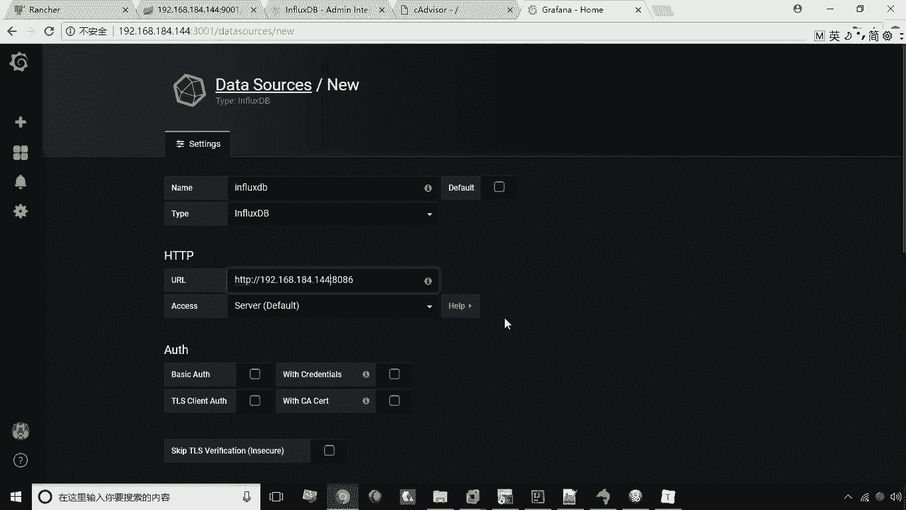
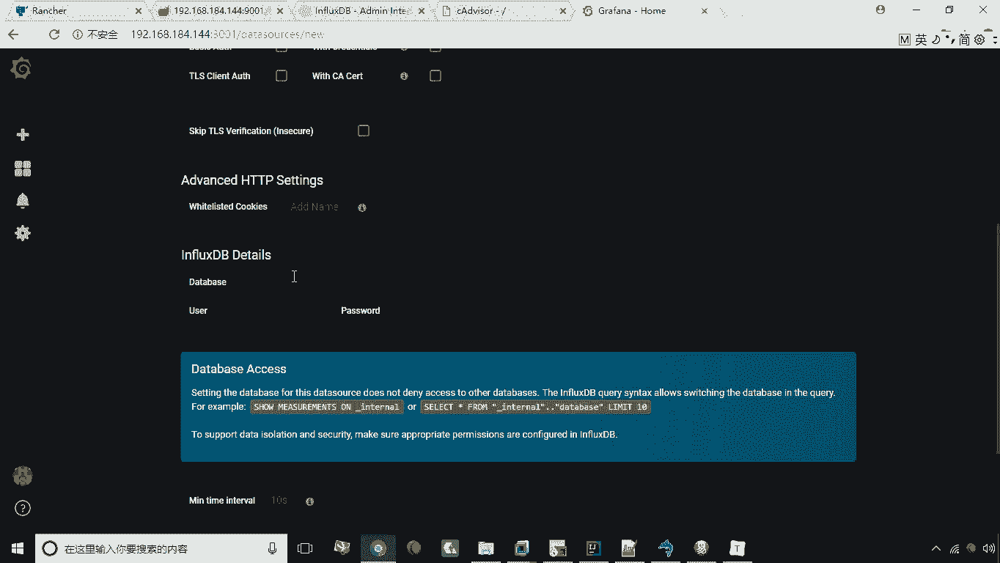
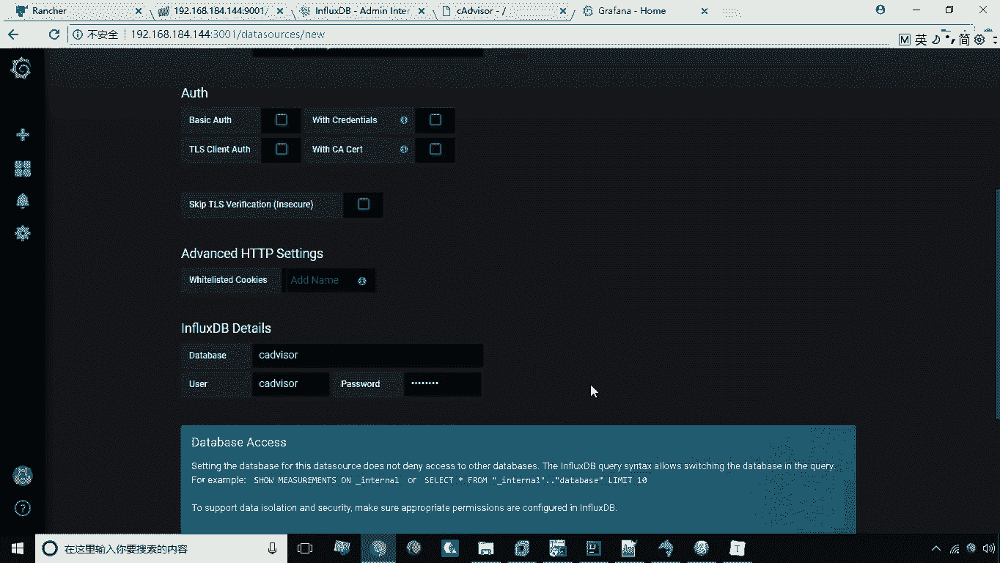
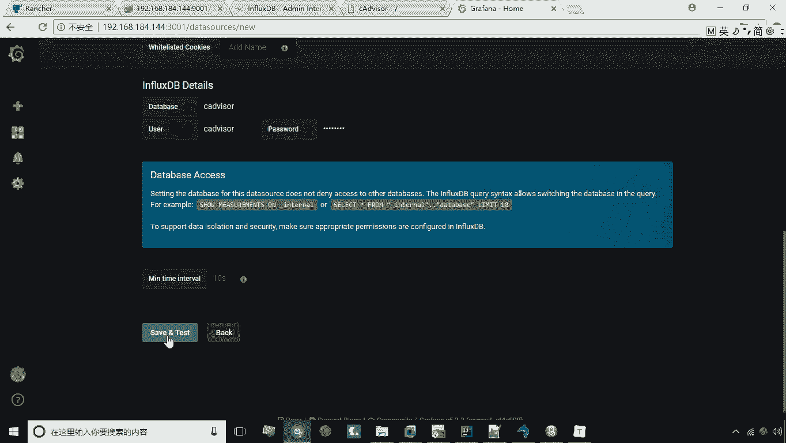
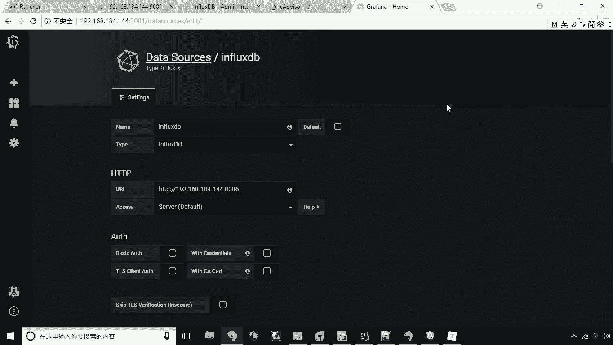

# 华为云PaaS微服务治理技术 - P43：23.添加数据源 📊

在本节课程中，我们将学习如何在Grafana中添加数据源。数据源是Grafana连接并获取监控数据的来源，这是创建仪表板和图表的第一步。

## 概述

我们将通过以下步骤，演示如何将一个InfluxDB数据库添加为Grafana的数据源。

## 操作步骤

以下是添加数据源的具体流程。

1.  **进入设置页面**
    在Grafana主界面左侧导航栏中，找到并点击齿轮形状的“设置”图标。

2.  **选择数据源选项**
    在设置菜单中，点击“Data Sources”选项。

3.  **添加新数据源**
    进入数据源管理页面后，点击绿色的“Add data source”按钮。

4.  **配置数据源基本信息**
    在数据源配置页面，首先需要填写基本信息：
    *   **Name**: 为数据源命名，例如 `influxdb`。
    *   **Type**: 从下拉列表中选择数据源类型，这里我们选择 `InfluxDB`。

5.  **配置连接信息**
    向下滚动页面，配置InfluxDB的连接详情：
    *   **URL**: 输入InfluxDB服务的地址，例如 `http://192.168.184.144:8086`。
    *   **Database**: 输入数据库名称，例如 `cadvisor`。
    *   **User** 与 **Password**: 输入访问数据库的用户名和密码，例如均为 `cadvisor`。

6.  **保存并测试**
    完成所有配置后，点击页面底部的“Save & Test”按钮。如果配置正确，Grafana会提示“Data source is working”，表示数据源添加成功。

## 总结

本节课我们一起学习了在Grafana中添加数据源的方法。我们首先进入设置页面，然后创建了一个新的InfluxDB类型数据源，并配置了其名称、连接地址、数据库及认证信息，最后通过保存测试确保了数据源可用。这是使用Grafana进行数据可视化的基础操作。