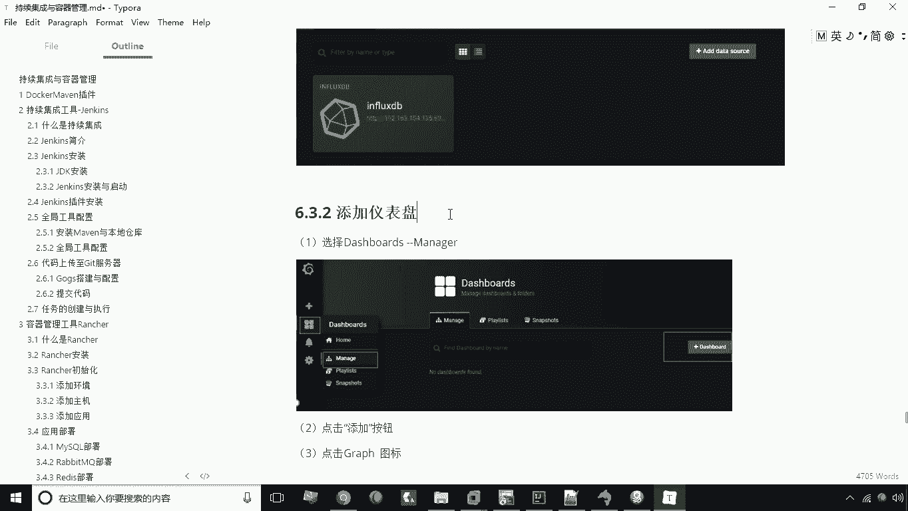
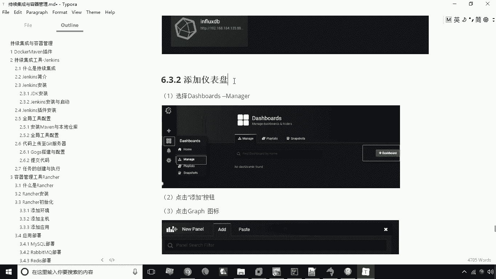
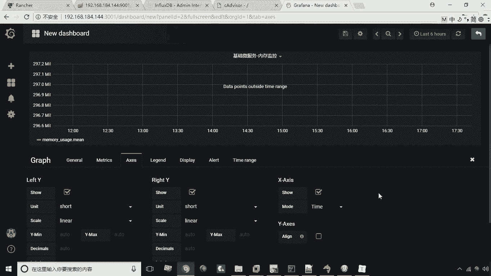
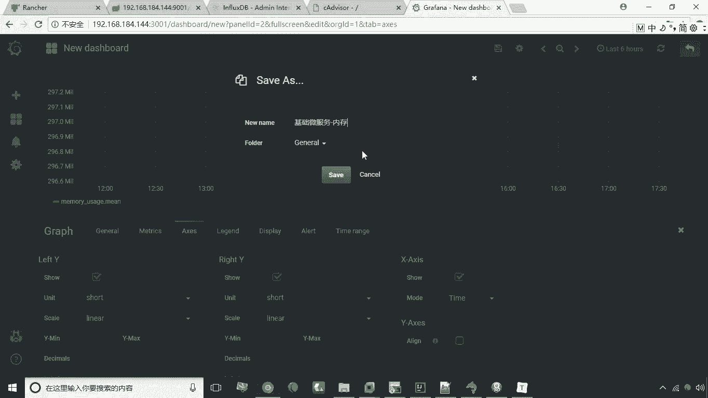
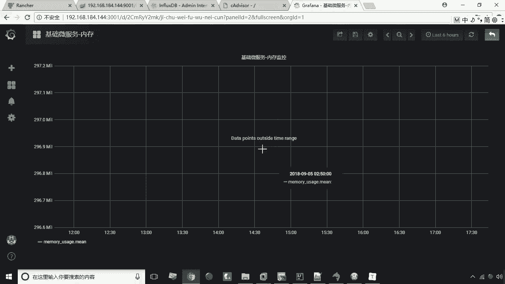

# 华为云PaaS微服务治理技术 - P44：24.新增仪表盘 - 开源之家 - BV1wm4y1M7m5

好接下来呢咱们给大家演示一下，如何去添加仪表盘，那么所谓添加仪表盘呢，也就是说我们通过配置啊来新增一个报表啊，或者图表，然后呢让这个图表呢能够以一个啊这个可视化。

非常直观的方式来展现这个运维相关的数据，那我们接下来看一下如何操作。

首先我们在这儿有一个仪表盘，有一个manager卖，在这之后这里有一个添加仪表盘，我们点击点击之后呢，这里有一个有九个按钮，我们选择第一个啊，第一个呢就是图表的意思，我们新增一个图表。

那么新增好这个图表之后呢，我们应该对他这个图表进行编辑啊，点击这个下拉的这个箭头，然后这里有editor编辑，编辑之后呢，这里头我们首先可以去改它的名称啊，比如说叫基础基础微服内存，监控啊。

基础微服务内存监控啊就行了，然后接下来呢我们再往下看，下面那个部分呢要指定一个这个这个数据源，指定数据源为influx dB，就是刚才我们所配置的这个数据库啊，那么配置这个数据库呢。

这里头可以去设置一个选项，那在这里呢是间隔30秒采集一个数据啊，间隔30秒的，然后呢下面这个部分我们来看这里要select，这里要其实就是要查什么数据是吧，你比如说我现在查的是一个内存数据。

那这时候我们就可以上memory是吧，然后选择那个内存数据，那内存数据呢这里头我们一样可以去加VR条件，有点类似于测后有线啊，那加这个V2条件，外设条件的话，我们这里可以指定什么呢。

可以指定我们的容器的名称啊，这里有容器名称，有各种条件啊，我们可以对它进行一个筛选，比如说我们这个容器名称，我们指定一下容器名称呢，这里头我们可以去选择这个哪个容器呢。

比如说我们选择这个base service杠一啊，比如说选择这个容器，选择这个容器好了，这时候我们所采集的数据呢就是这个容器的嗯，就采集这种数据容器的，然后呢我们下面这个部分呢也可以去啊，指定啊。

他的啊这个对它进行这个值呢进行获取啊，或者进行一些函数的运算呢啊等等啊，这是我们说关于这个查询啊，去查询，那么下面这个部分第三个啊，就是可以去指定Y轴X轴的这么一个配置啊。

那这里头你可以去修改我们的计量单位啊，可以去修改这个计量单位啊，啊还有其他的一些设置，比如说这个Y轴最小值，最大值，这个呢都可以去设定，那么当然默认的话是自动的啊，默认是自动。

这是关于我们说的这个新增新增这个仪表盘，那我们现在把所有的都设置好之后啊。

接下来我们就可以点这个保存，保存之后，这里头起个名，比如说叫基础微服，基础微服，然后内存。

好这时候我们点击C，这时候呢我们就新增了一个图表了啊，啊当我们那个微服务运行起来之后呢，它会产生一些数据，那么这个数据呢就会体现在这个报表上，好这是我们说的这个啊内存监控啊，我们就说到这儿。

这是关于图表，新增仪表盘。

