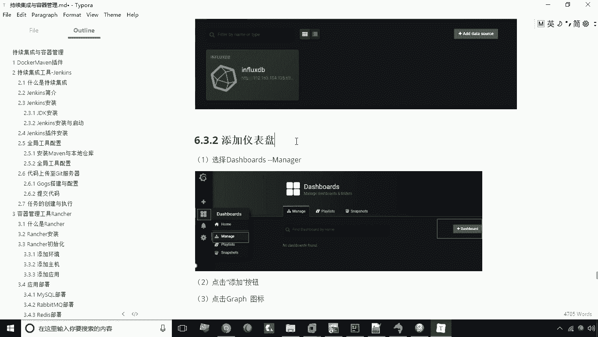
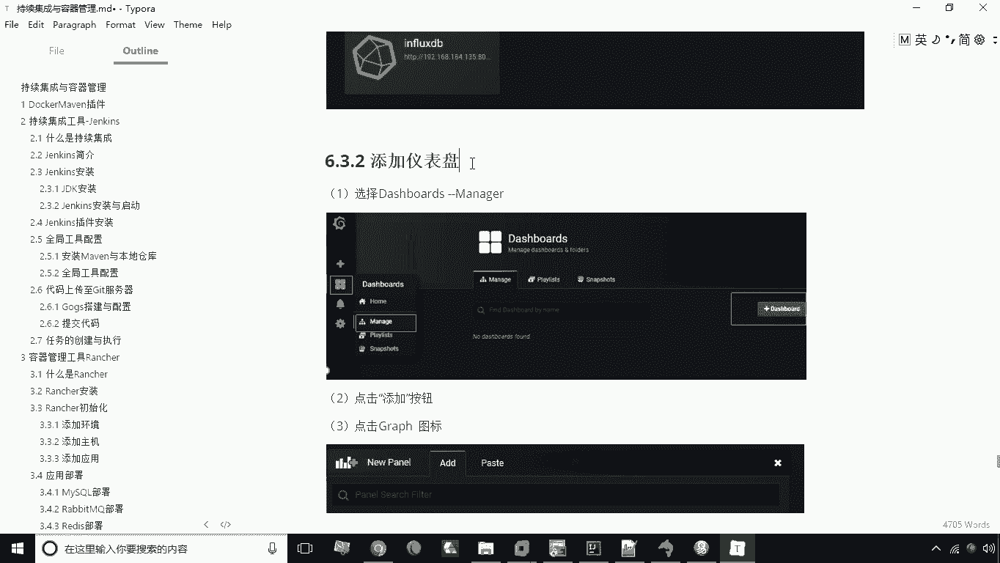
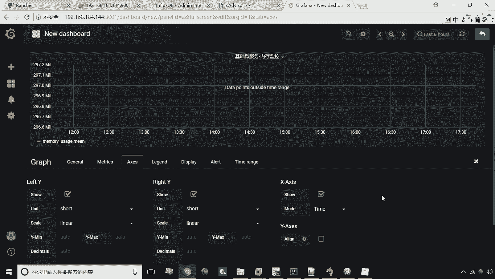
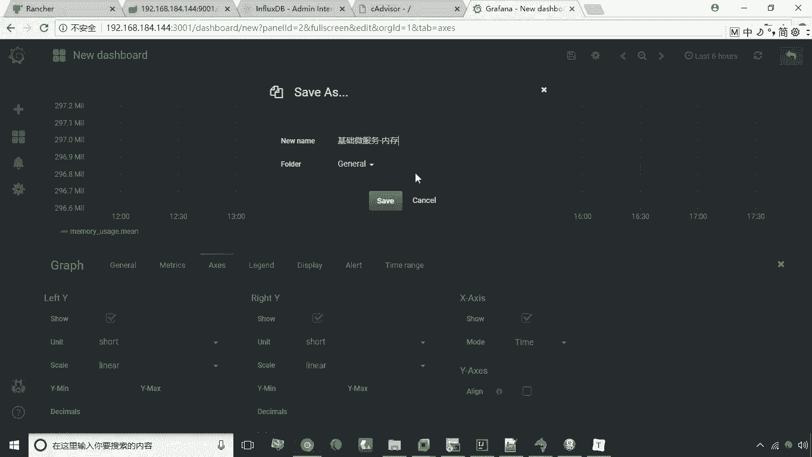
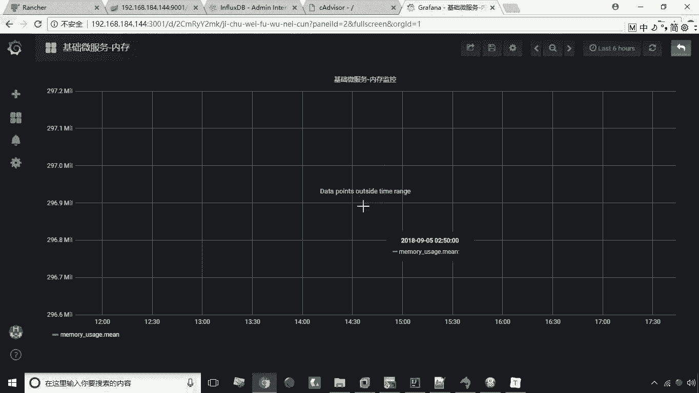

# 华为云PaaS微服务治理技术：P44：24.新增仪表盘 📊

在本节课中，我们将学习如何在华为云PaaS微服务治理平台中新增一个仪表盘。仪表盘能够以可视化的方式直观地展示运维相关的数据，帮助我们更好地监控系统状态。

---

上一节我们介绍了仪表盘的基本概念，本节中我们来看看如何具体操作，新增一个图表。

首先，在仪表盘管理界面，点击“添加仪表盘”按钮。

在弹出的选项中，选择第一个“图表”按钮来新增一个图表。

新增图表后，需要对其进行编辑配置。点击图表的下拉箭头，选择“编辑”选项。

编辑界面主要包含几个部分。首先，可以修改图表的名称，例如将其命名为“基础微服务内存监控”。

接下来是指定数据源。需要将数据源设置为之前配置的 **`influxdb`** 数据库。这里可以设置数据采集间隔，例如间隔 **`30`** 秒采集一次数据。

然后是最关键的查询部分。以下是配置查询的步骤：

1.  在 `SELECT` 区域，选择要查询的数据指标。例如，要监控内存数据，就选择 **`memory`** 相关指标。
2.  可以添加 `WHERE` 条件来筛选数据，这类似于SQL查询。例如，可以指定容器名称作为筛选条件。
3.  在容器名称条件中，选择具体的容器，例如 **`base-service-1`**。这样，图表就只会采集和展示该容器的数据。
4.  下方还可以对获取到的值进行函数运算等处理。

第三个部分是坐标轴配置。在此可以修改Y轴的计量单位，也可以手动设置Y轴的最小值和最大值。默认情况下，这些值会自动适配数据。

将所有配置设置完毕后，点击保存按钮。

在保存时，为这个仪表盘图表命名，例如“基础微服务内存”，然后确认保存。

保存成功后，就新增了一个图表。当对应的微服务运行并产生数据后，这些数据就会实时展示在这个报表图表上。

---

本节课中我们一起学习了新增仪表盘图表的完整流程。我们了解了如何从创建图表开始，逐步配置其名称、数据源、数据查询条件以及坐标轴显示，最终保存得到一个可监控微服务内存等指标的可视化图表。