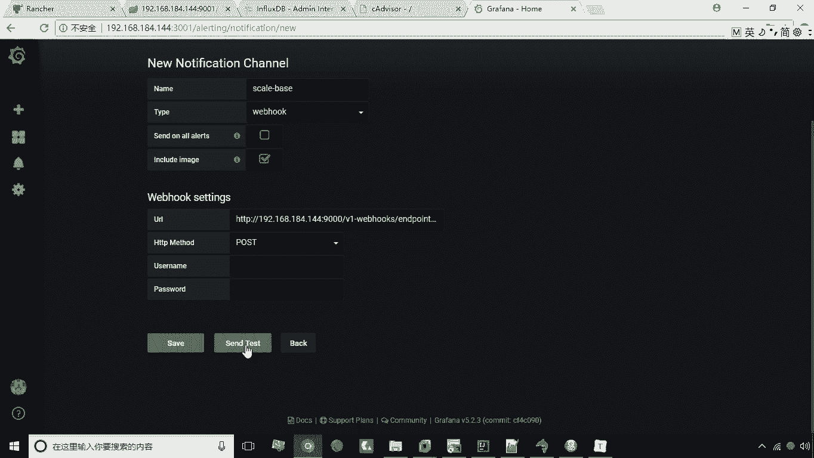
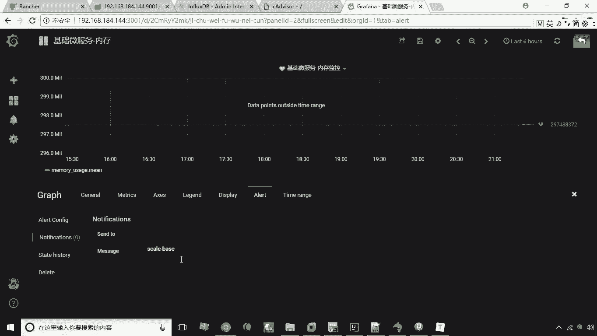
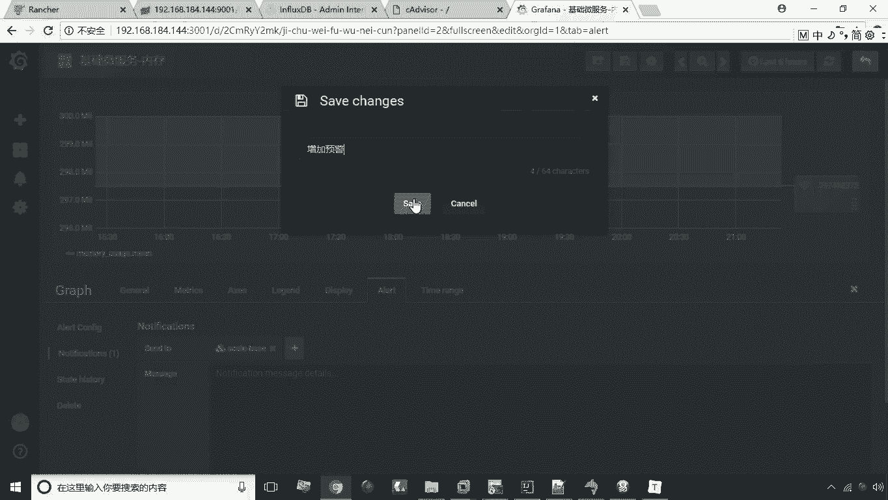

# 华为云PaaS微服务治理技术 - P45：25.预警通知设置 - 开源之家 - BV1wm4y1M7m5

好，接下来呢我们看一下GRAPHA的预警通知的设置，我们设置预警通知呢啊，可以在我们的图表上设置某一个边界点，或者是阀值啊，那么我们通过我们当我们这个值达到，这个时候呢，它会自动触发一个预警。

那我们在这里分为两步操作，第一我们要设置一个预警通知，设置预警通知主要就是设置以什么方式去通知，比如说你是以邮件的方式去通知呢，还是以web钩子的方式，还是以其他的方式啊。

主要这里头我们就可以通过设置这个预警通知，来去啊，定义这个预警以什么方式啊，我们现在呢就来做这个预警通知的设置。

大家来看，首先在GTA这个部分选中第三个啊，就是我们的预警预警，这里头呢第二个菜单项。

然后呢我们选择添加添加ADD channel，然后在这个地方我们要写个名字，这个名字呢啊，这个名字随便起就行了啊，我们起个名字，然后呢类型类型的话，我们选择web钩子。

那么外部构造这个地址，其实就是我们原来这个rancher的这个。

web构筑地址，我们把它复制一下，然后呢把它粘到这个位置，这个地方呢我们仍然是用post on you post好，这就是我们新增了一个预警通知。

我们我们现在呢可以把它点击这个send and test。

来进行测试，好，我测试之后大家观察观察这个里头这个应用啊，看他这个这个地方它会发生变化是吧，那现在呢已经变成了五个容器了，原来是三个容器好。

这就是我们说的web钩子啊，也就是说在这个界面我们可以通过这个send test，就是进行一个发送测试，来看一下这个web钩子是不是能够成功调用啊，如果成功了，那这时候我们点击save把它保存起来好了。

这个Y这个预警通知的名字叫什么呢，叫这个名字，那么我们说这个名字呢写好之后，接下来在哪用呢，在哪用呢，其实我们在这还是回到我们的这个仪表盘啊，还是回到仪表盘，咱们咱们找到咱们之前设置这个基础微服务。

内存这个部分啊，就是刚才我们设置这个仪表盘，点击进入，这个时候呢我们点击下拉箭头，然后呢选择编辑，编辑之后呢，还是要进到这个界面，对不对，还是进到这个界面，那么我们在这选择a lot预警。

然后呢在这儿有个create a lot，就是创建一个预警，好创建这个预警呢，这里头有一个有一个值啊，有一个值，这个时候呢它是取60秒啊，平均每60秒算一个平均值，如果平均值超过某一个值。

比如说我定义是800啊啊，或者说是这个时候你在写这个值的时候，这个这个线会出现在这啊，这个线会出现在这，当然你可以可以去去拖动这个线啊，还可以拖动这个线，那么拖动这个线的话，这个值也会跟着变化。

也会跟着变化好了，那这时候呢我们把这个这个线呢拖动，这或者说我们直接输入这个值都可以啊，那也就是说当这个值如果达到这个点的时候，那这时候呢就会自动触发某一个预警，那么预警在哪设置呢。

在这大家看下面这个部分，有一个这个通知的这么一个设置，然后在这儿有一个send to点击加号。

然后选择刚才我们设置这个预警通知，下面这个部分呢是可以写一个消息啊，可以写个消息，这个消息呢其实在发邮，如果是你发一个邮件的话，这个是会用到的，如果是一个外卖钩子的话，这个是其实他是用不上啊。

我们现在呢把它编辑完成之后呢。

再保存就可以了，那么这个实际运行中呢，如果说是这个这个运行中，如果说这个这个值啊超过来的值超过这个值。

那这时候呢它就会自动触发这个钩子啊，自动触发这个钩子，然后呢它就会自动的去在ranch中啊，去增加容器的数量。

好我们现在呢把它保存一下，保存一下，然后呢我们现在啊可以选择是增加预警，就是选择选择这个这次保存啊。

好了我们现在呢就保存成功了，然后返回，这样一来呢。

