# 华为云PaaS微服务治理技术 - P45：25.预警通知设置 🚨

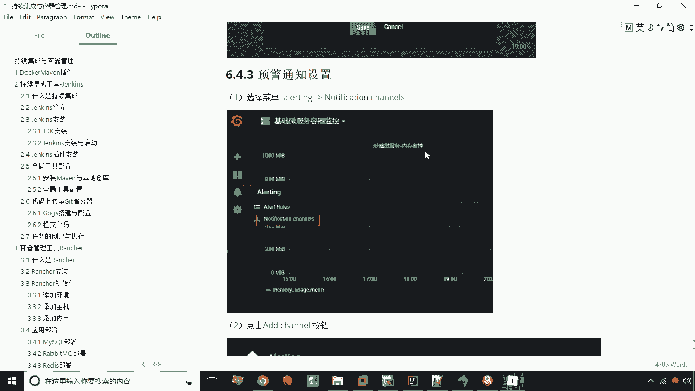

在本节课中，我们将学习如何在Grafana中设置预警通知。通过配置预警规则，当监控指标达到预设的阈值时，系统可以自动触发通知，例如通过Web钩子调用外部系统，从而实现自动化的运维响应。

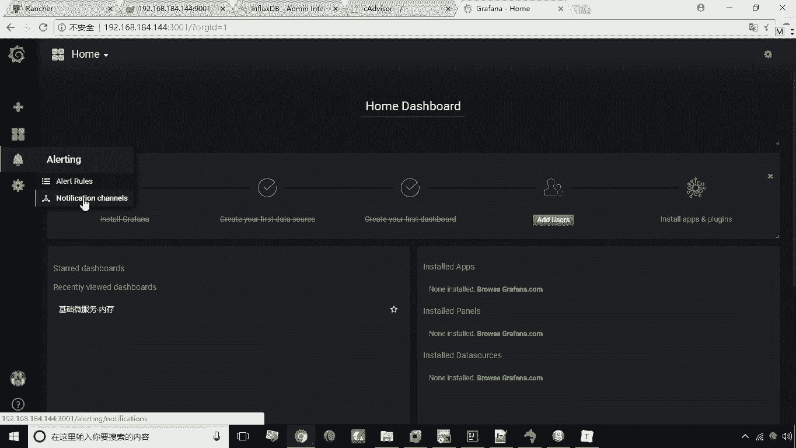

上一节我们介绍了仪表盘的创建与面板编辑，本节中我们来看看如何为监控指标设置预警通知。

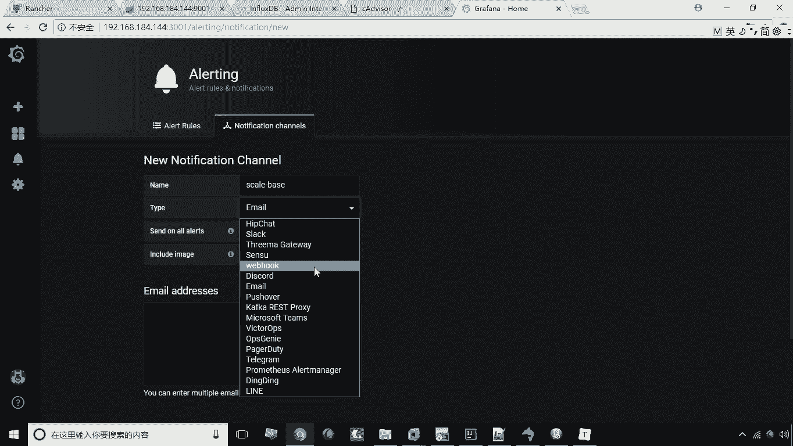

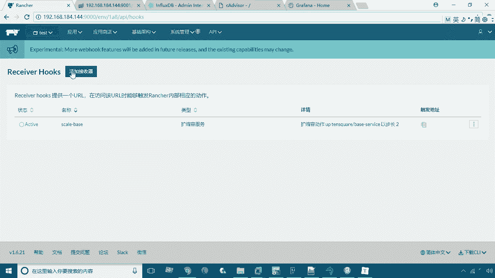

## 创建预警通知渠道

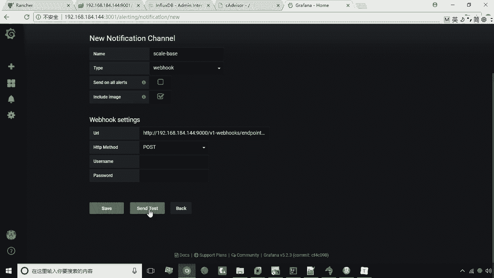

预警通知设置分为两步。第一步是创建通知渠道，即定义预警触发后以何种方式（如邮件、Web钩子）发送通知。

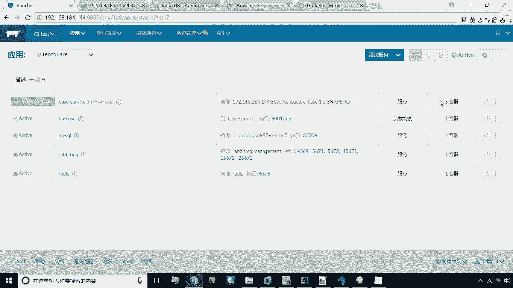

以下是创建Web钩子通知渠道的步骤：

1.  在Grafana侧边栏，选中第三个图标（铃铛图标）进入“Alerting”预警管理界面。
2.  选择第二个菜单项“Notification channels”。
3.  点击“Add channel”按钮。
4.  在创建页面，填写渠道名称。
5.  在“Type”类型下拉框中，选择“webhook”。
6.  在“Url”字段中，粘贴你的Web钩子地址（例如Rancher的Web钩子地址）。
7.  在“Http Method”中选择“POST”。
8.  配置完成后，可以点击“Send test”按钮测试该Web钩子是否能被成功调用。
9.  测试成功后，点击“Save”保存该通知渠道。

## 在仪表盘图表上设置预警规则

创建好通知渠道后，第二步是在具体的监控图表上设置预警规则和阈值。

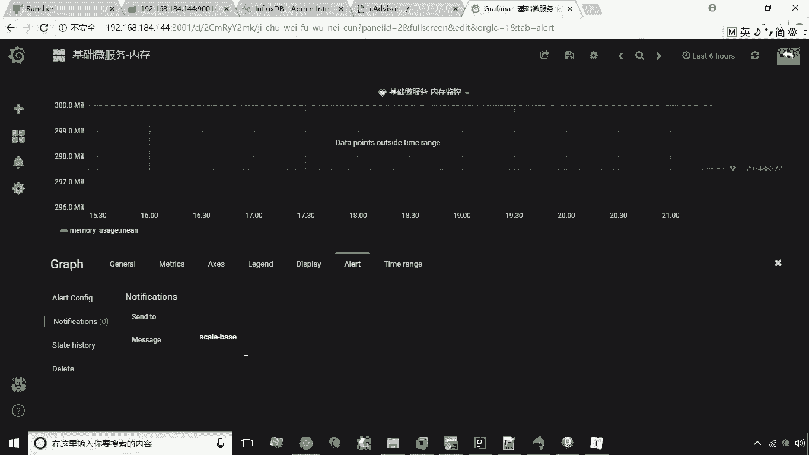

以下是设置预警规则的步骤：

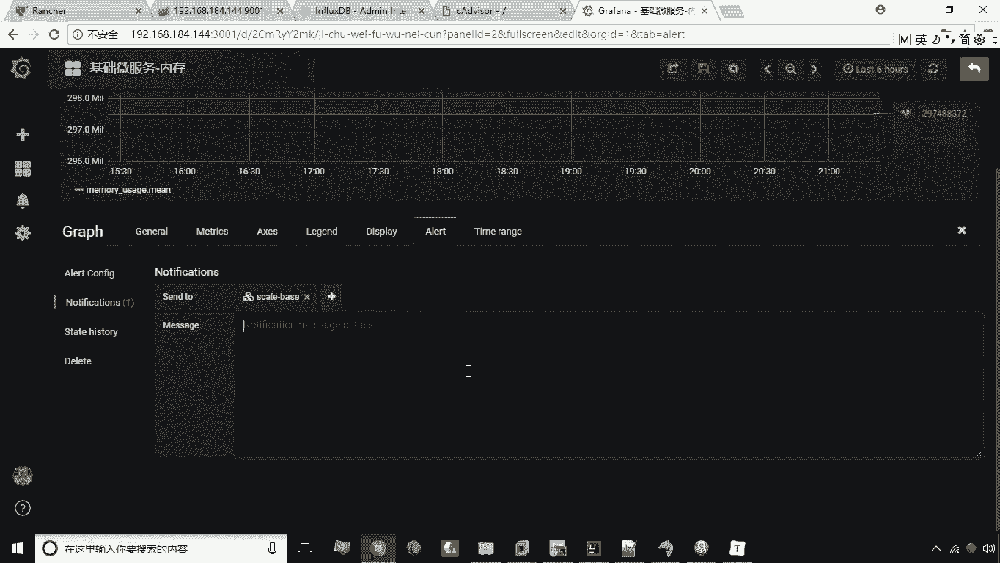

1.  回到之前创建的仪表盘，找到需要设置预警的图表面板（例如“基础微服务内存使用”）。
2.  点击面板标题的下拉箭头，选择“Edit”进行编辑。
3.  在编辑界面，切换到“Alert”预警标签页。
4.  点击“Create alert”按钮创建预警规则。
5.  在规则配置中，系统默认会计算过去60秒指标的平均值（`avg() of 60s`）。你可以通过拖动图表中的阈值线或直接输入数值来设定触发预警的阈值。
6.  在“Notifications”部分，点击“Send to”后的加号，选择第一步中创建的预警通知渠道。
7.  下方的“Message”字段可以填写预警消息，对于Web钩子通知方式，此内容可能不会被使用。
8.  完成所有配置后，点击面板右上角的“Save”保存图表。在弹出的对话框中，选择“Save alert rule”保存预警规则。

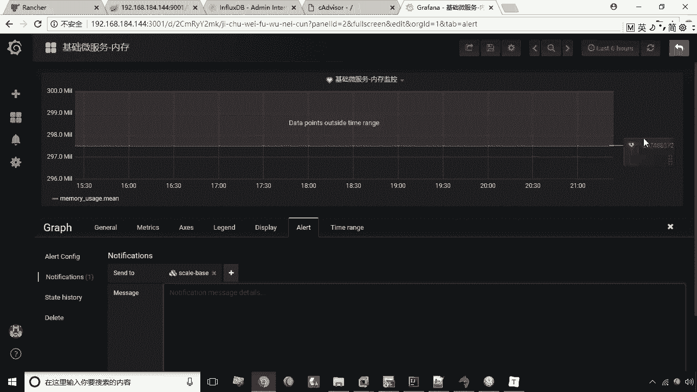

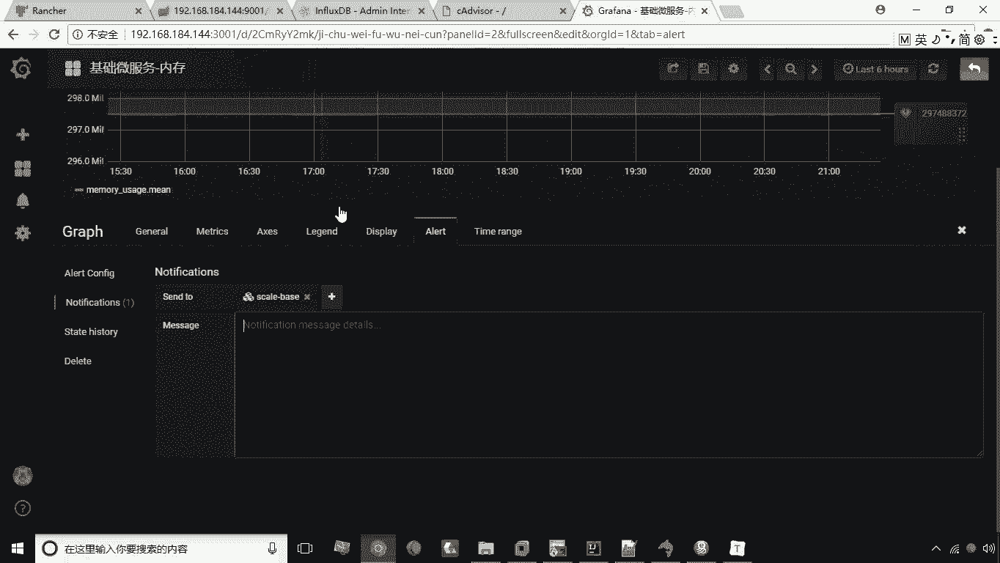

设置完成后，在实际运行中，当该监控指标的平均值超过设定的阈值时，Grafana便会自动触发预警，并调用你配置的Web钩子地址，从而执行后续操作（例如通知Rancher自动扩容容器实例）。

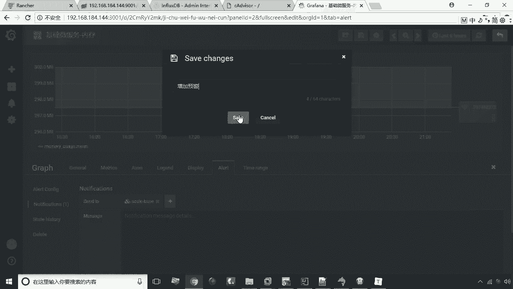

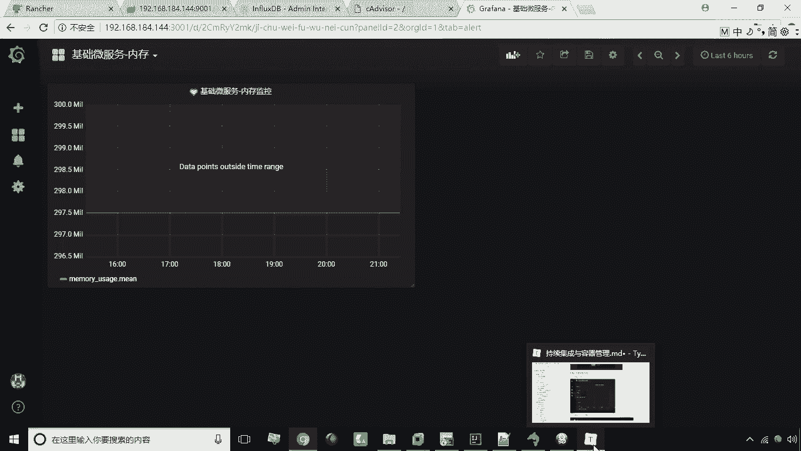

本节课中我们一起学习了Grafana预警通知的完整设置流程。我们首先创建了一个Web钩子类型的通知渠道，然后在具体的监控图表上设置了预警规则和阈值。这样，当系统指标出现异常时，就能实现自动化的预警与响应，是微服务治理中保障系统稳定性的重要手段。