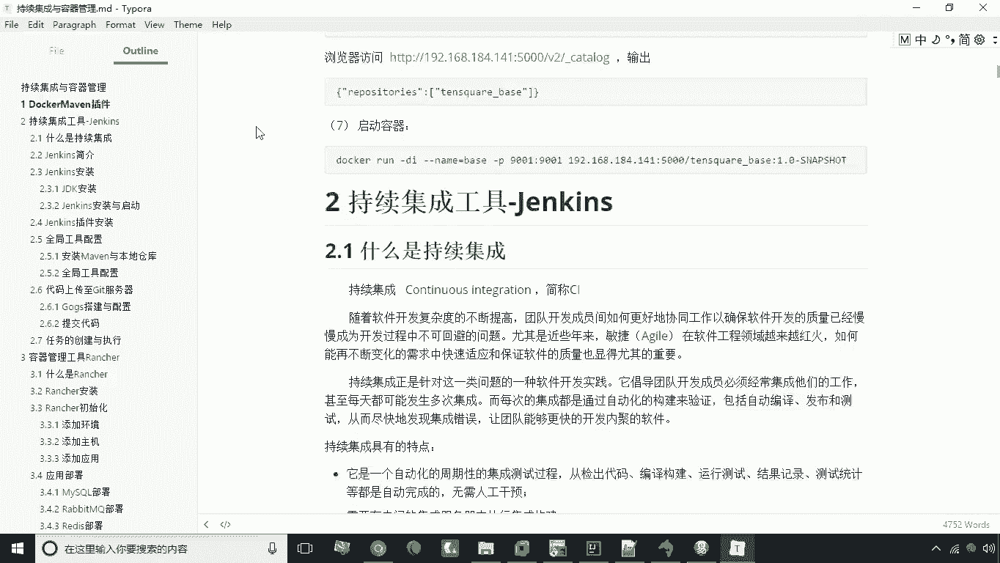

# 华为云PaaS微服务治理技术 - P46：26.总结 - 开源之家 - BV1wm4y1M7m5

最后呢我们对本章内容做一个总结，今天我们主要学的啊其实就是一个插件，五种软件的一个使用，那么第一个我们讲的这个插件是叫docker main插件。

那么这个插件主要的作用是什么呢。

主要作用就是可以使我们的微服务工程能够啊。

能够实现什么呢，这个自动的生成一个镜像，并且将这个镜像上传到这个私有仓库之中啊。

这是我们说maven插件的一个使用，那么接下来我们要讲的这个持续集成工具。

JINS的这么一个安装和使用，那么这时候什么叫持续集成呢，这个持续集成，实际上就是我们在开发的过程中啊，可以通过这个工具，通过这个工具，能够这个经常性地将我们的软件产品，部署到一个这个测试的环境之中。

来产生这么一个测试版本，那么这样的话呢，就使我们的集成呢就可以常态化，那这样做的好处是什么呢，第一我们能够不断的产生啊，最新的这个软件版本，第二呢我们可以在集成之后。

尽早地发现我们软件中存在的一些问题啊，这是我们说持续集成工具的一个使用，那么在互联网开发中呢，持续集成是一个很常见的这么一个操作，那么当然这个持续集成呢，它要依赖于这个git这样的软件啊。

因为呢这个这个持续集成呢，它需要从git上来获取这个源代码，然后呢通过调用本地的JDK啊和一些maven啊，就是来去生成一些容器啊，生成一些容器和镜像，这是我们说的这个持续集成工具的一个使用。

那么接下来我们讲的就是容器相关了啊，容器相关的工具就是RT，那么这个ranch是干嘛的呢。

我们说这个JS主要是用来去生成，根据代码来生成镜像，那么这个ranch的作用就是，根据镜像来生成容器和管理容器啊，那么我们说docker本身它也是管理容器的。

而ranch是基于docker的一个图形化管理界面，那么通过它呢啊可以实现对容器的管理，另外呢还提供了负载均衡等等这些功能啊，这是非常这个实用的啊。

那么我们在这里头呢也是啊，这个需要对它进行一些初始的设置。

比如说我要添加环境，添加主机，添加应用，然后呢我们在应用上去增加一些服务啊，比如说我们可以配MYSQL配rap DQ，配REDIS以及我们自己的微服务啊，都可以通过图形化的界面的方式来进行构建了。

它还提供了一个啊非常强大的功能，叫扩容与缩容，那这样一来呢，我们可以去扩充我们的微服务的容器的数量，这样的话呢就可以使我们的这个呃，这个这个某一个服务啊，能够自建，自动搭建一个可扩充的一个集群。

这是非常常用的，然后接下来呢我们再看INFLUCB。

INFLUCB和和我们的这个rancher，以及我们后面讲的sea advana，GRANA这几个软件之间其实都是有联系的啊，这个influx b是什么呢，是一个时间序列数据库，它的作用是用来存储。

它的作用是用来存储我们的这个容器的。

一些运营的一些数据，那么我们说seed advor是干嘛的呢，它是作为监控数据，它是作为监控的一个工具，它主要作用是监控docker容器，那么监控docker容器产生的一些数据放哪呢。

那么放到INFLUDB之后呢，我们这个GRAPHA他又是干嘛的呢，他也是负责，他是负责读这个INFLUTEGB，这个c advisor是负责往这里写，而这个GRANA作用是负责读读取这个INFLUDB。

然后呢展示一个图表的数据，那么当然它还有个功能叫预警啊，那么预警就是当我达到了某一个值的时候，它会自动触发一个预警，那么这个预警呢会去什么呢，他会去操作我们ranch里的一个web构筑地址。

这样的话呢可以实现这个容器的扩充与缩减，这是我们说的这个呃，关于今天啊，我们所讲的这个持续集成和容器管理啊。

