# 华为云PaaS微服务治理技术：P46：26.总结 🎯

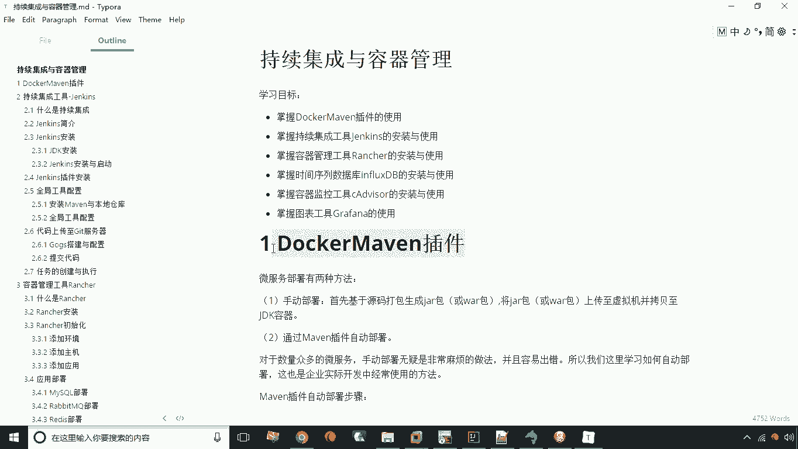

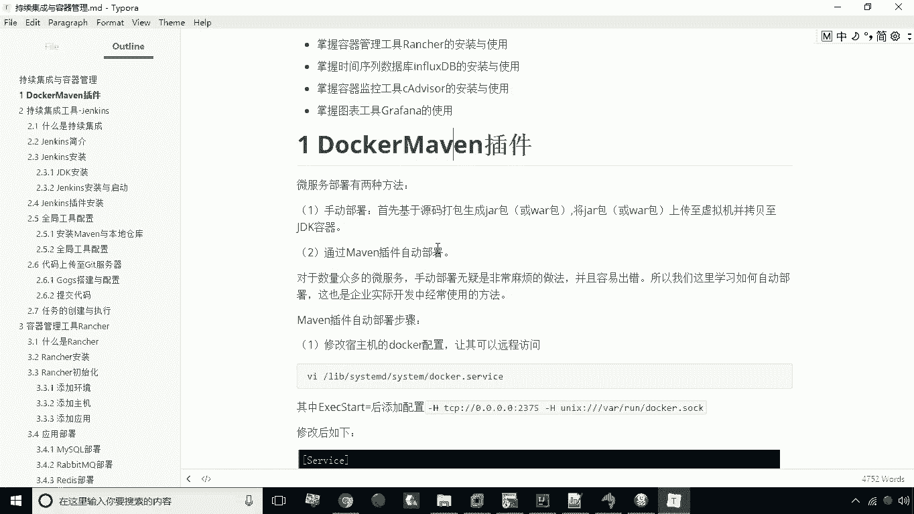

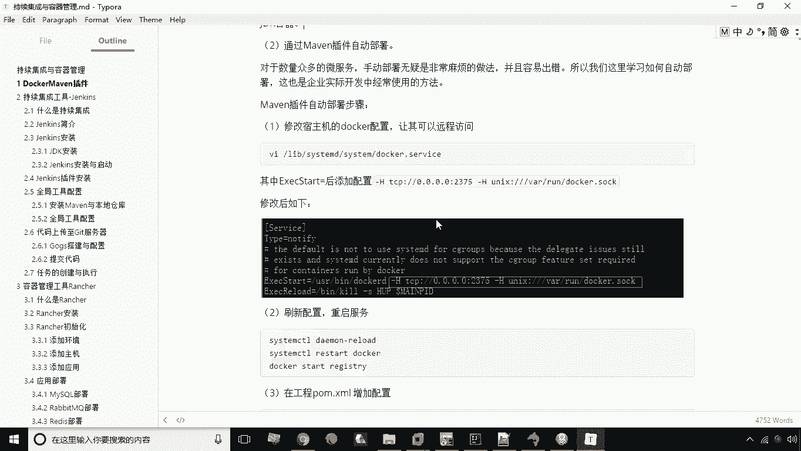

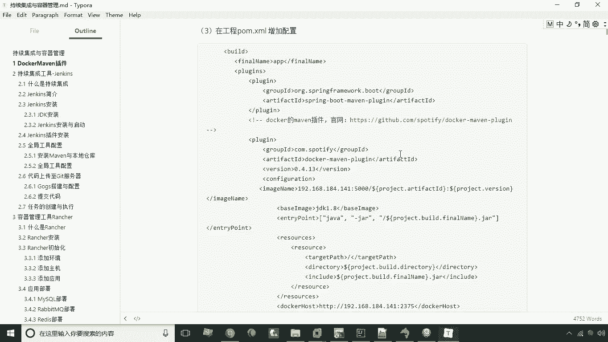

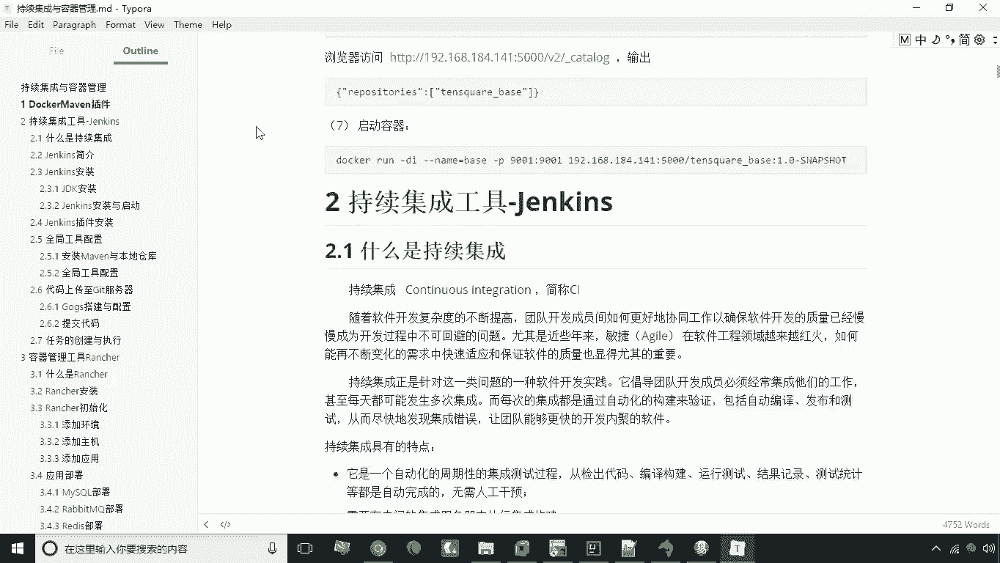

在本节课中，我们将对本章内容进行总结。本章主要围绕一个核心插件和五种关键软件工具的使用展开，旨在帮助初学者理解微服务持续集成与容器化管理的完整流程。

上一节我们介绍了监控与预警的联动，本节中我们来回顾本章的全部核心内容。

以下是本章学习的核心工具与概念总结：

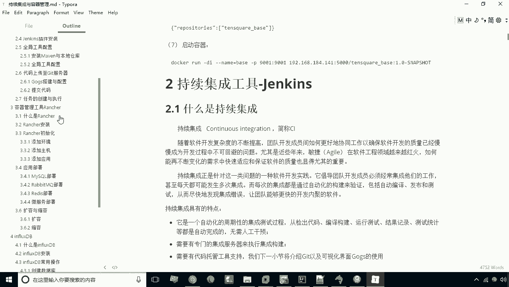

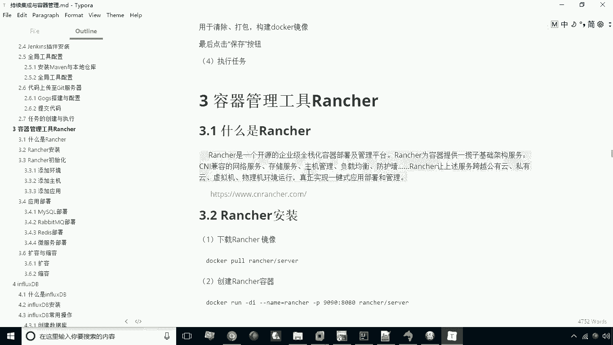

1.  **Docker Maven插件**
    该插件的主要作用是使微服务工程能够自动生成Docker镜像，并将该镜像上传至私有仓库。其核心配置通常在项目的 `pom.xml` 文件中完成。
    ```xml
    <plugin>
        <groupId>com.spotify</groupId>
        <artifactId>docker-maven-plugin</artifactId>
        <version>1.2.2</version>
        <!-- 具体配置 -->
    </plugin>
    ```

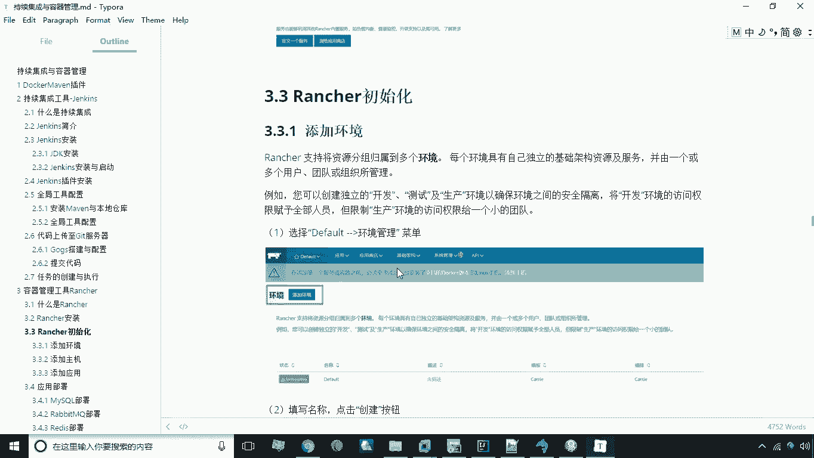

2.  **持续集成工具 Jenkins**
    Jenkins 是一个持续集成工具。持续集成是指在开发过程中，频繁地将代码集成到共享主干，并自动部署到测试环境以生成测试版本。这样做的好处是能持续产出最新的软件版本，并尽早发现集成问题。其工作流程依赖于 Git 等版本控制工具来获取源代码，并调用本地的 JDK、Maven 等工具来构建应用和容器镜像。

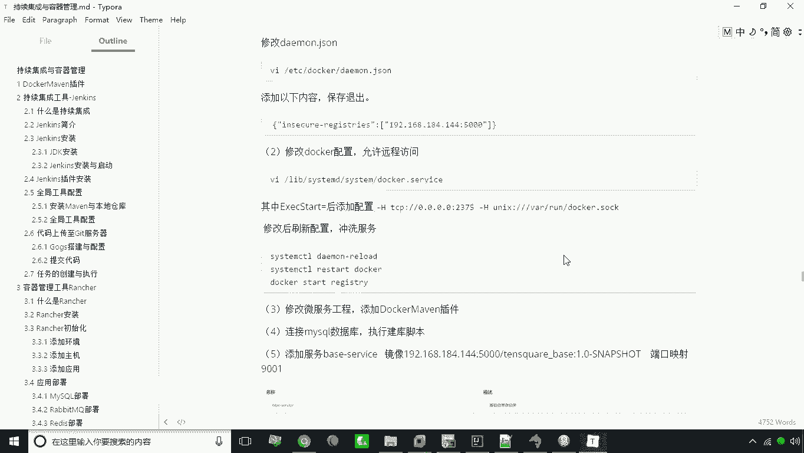

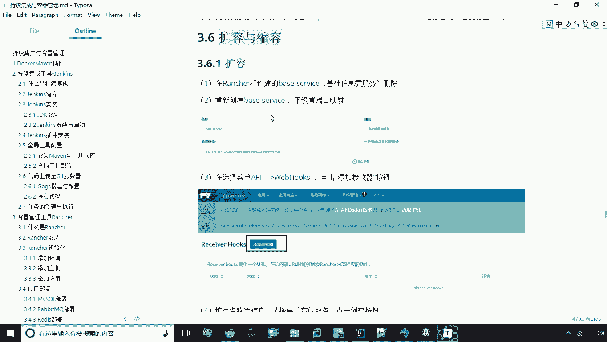

3.  **容器管理平台 Rancher**
    Rancher 是一个基于 Docker 的容器管理平台。如果说 Jenkins 是根据代码生成镜像，那么 Rancher 的作用就是根据镜像来生成和管理容器。它提供了图形化界面，简化了容器、应用和服务的部署与管理。通过 Rancher，可以方便地添加环境、主机、应用，并配置 MySQL、RabbitMQ、Redis 及微服务等组件。其核心功能之一是**扩容与缩容**，可以动态调整微服务容器的实例数量，以构建可弹性伸缩的集群。

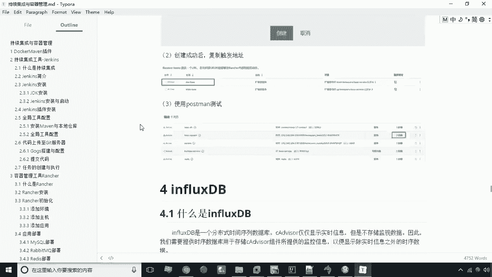

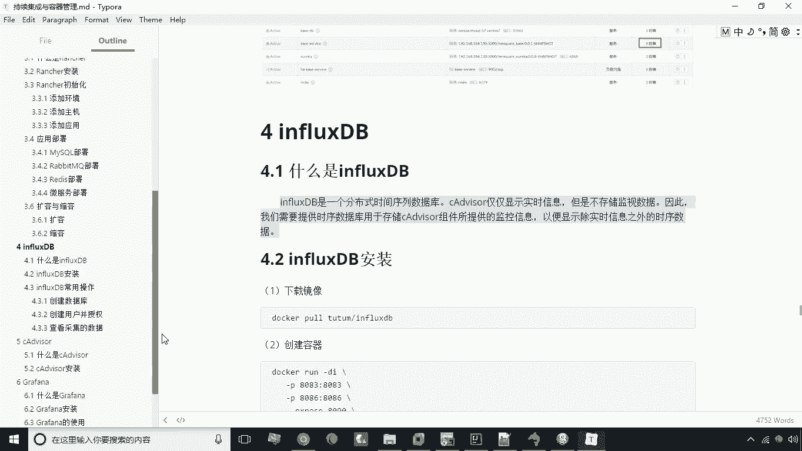

4.  **时序数据库 InfluxDB**
    InfluxDB 是一个时间序列数据库。在监控体系中，它的作用是存储容器运行时产生的性能指标等时间序列数据，为上层监控展示提供数据源。

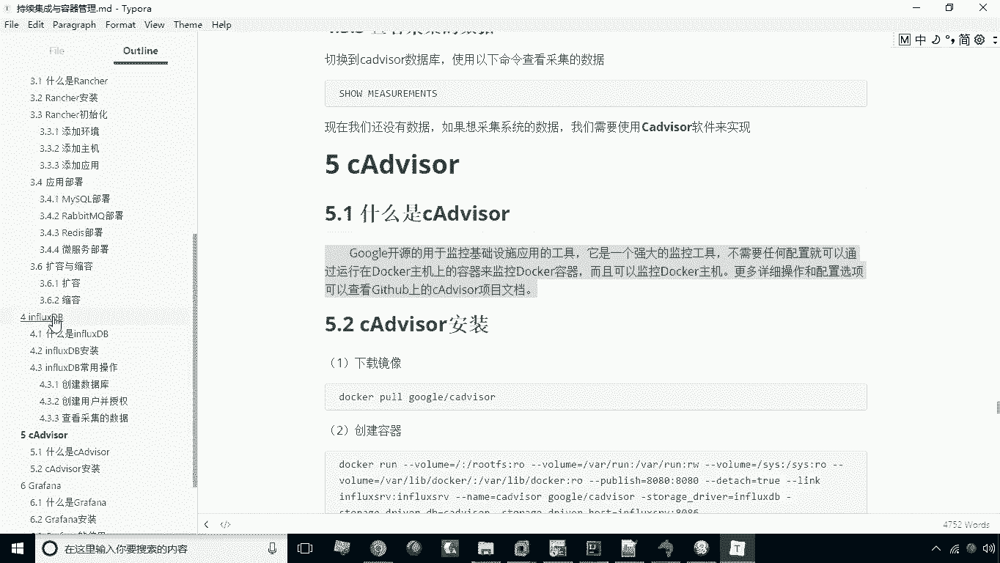

5.  **容器监控工具 cAdvisor 与数据可视化工具 Grafana**
    这两个工具与 InfluxDB 紧密关联。cAdvisor 负责监控 Docker 容器，并将收集到的数据写入 InfluxDB。Grafana 则负责从 InfluxDB 中读取数据，并以丰富的图表形式进行可视化展示。此外，Grafana 还具备预警功能，可以设定阈值，当监控数据达到条件时自动触发预警。预警可以配置为调用 Rancher 的 Webhook 地址，从而实现基于监控指标的容器自动扩容与缩容。

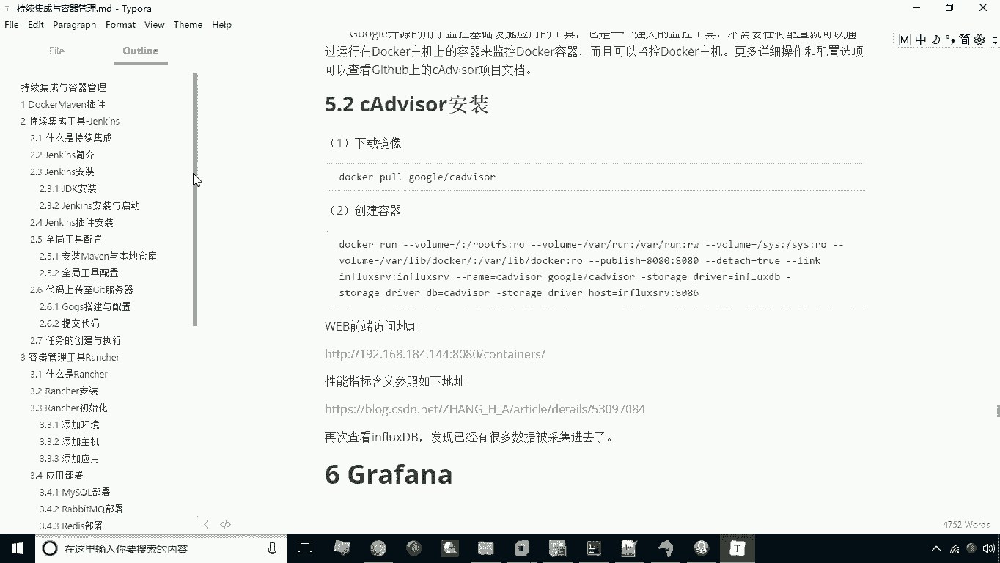

本节课中我们一起学习了微服务从代码到部署、监控的完整工具链。我们掌握了一个插件（Docker Maven插件）和五种软件（Jenkins, Rancher, InfluxDB, cAdvisor, Grafana）的核心作用与协作关系，理解了持续集成、容器化部署与自动化运维的基本流程。