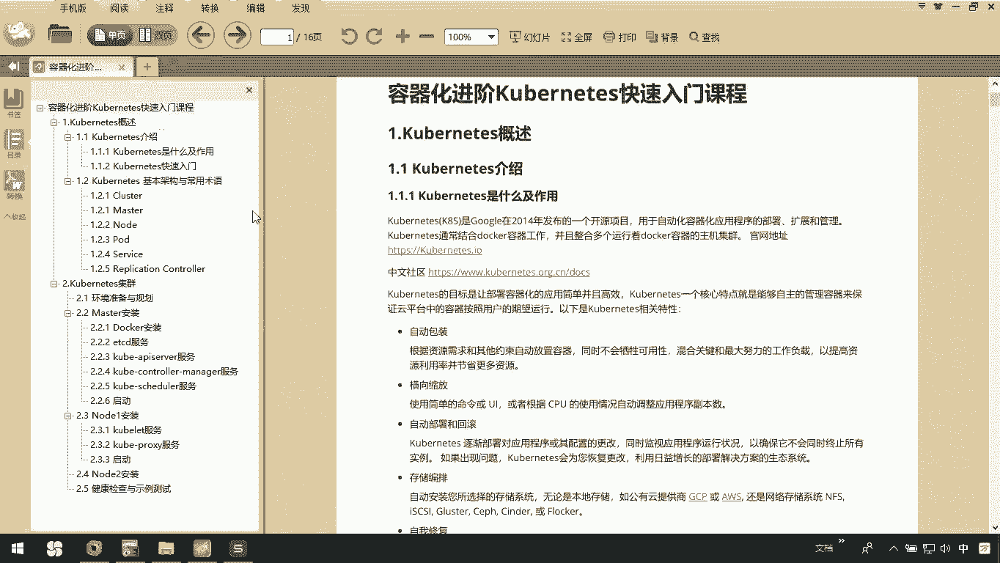
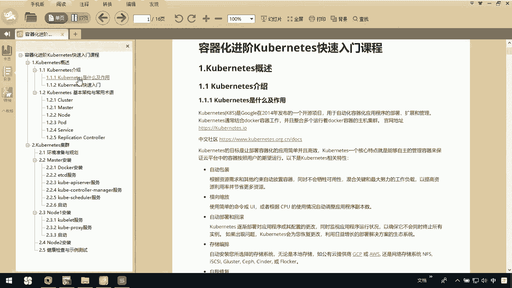
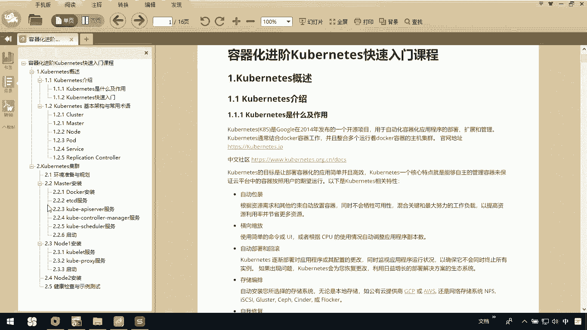
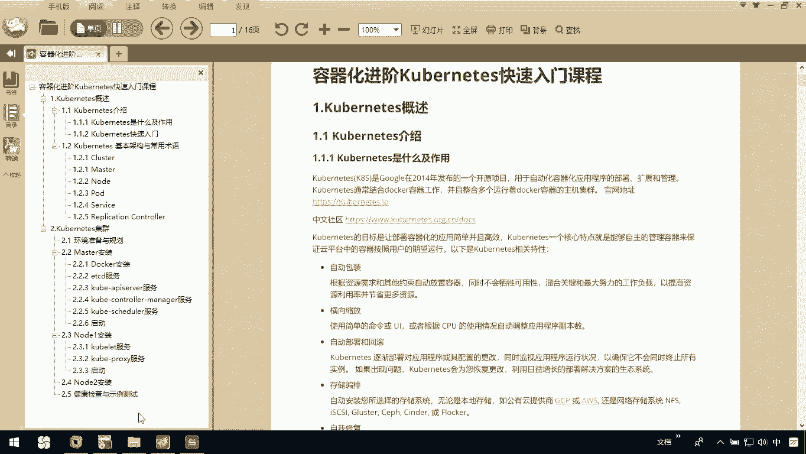

# 华为云PaaS微服务治理技术 - P47：0.课程介绍 - 开源之家 - BV1wm4y1M7m5

大家好，我们CHISE快速入门这个课程主要讲解了两大块。

第一大块呢我们是对cornice啊，进行了一个简要的概述。

那么主要讲解一下我们CORONNET是什么，它有什么作用。

以及通过一个快速入门案例，让大家先了解我们promise。

那第二部分呢，讲的是cornice的基本架构和常用的术语。

那这里边呢会给大家讲一下我的master啊，node呀，pod service这些基本的codas的概念。

那我们另外的一大块关于cox集群这部分。

这部分呢我们主要是通过一个master节点，两个node节点来演示一个cop nice。

通过我们这种二进制文件进行安装时。

是如何做到的，那我们详细讲解了master的安装。

note安装，以及我们在整个集群搭建过程中。

出现的一些问题如何解决，最后呢我们进行了一个简单的测试。

