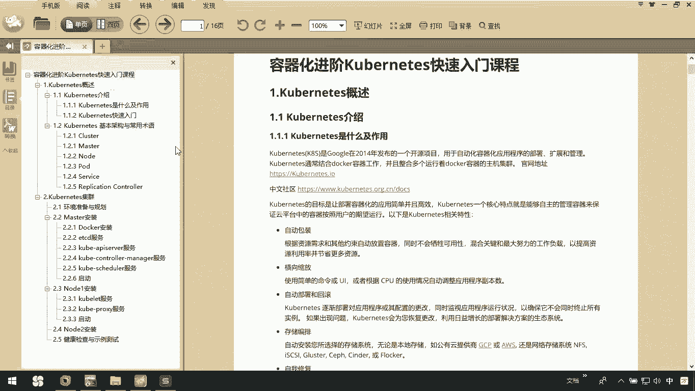
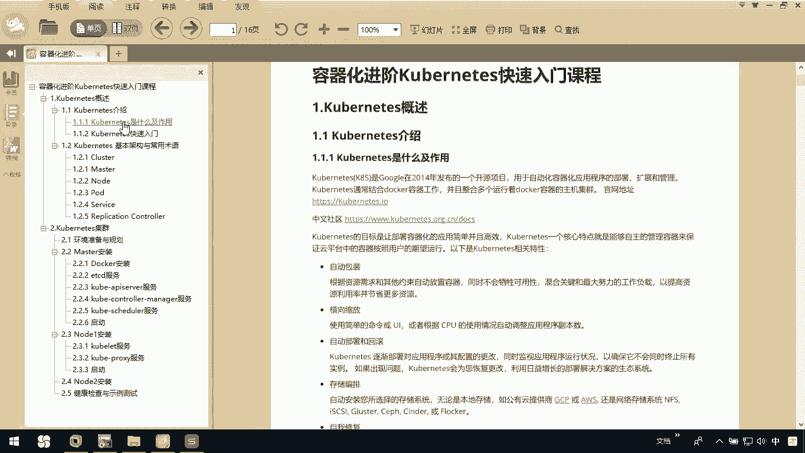
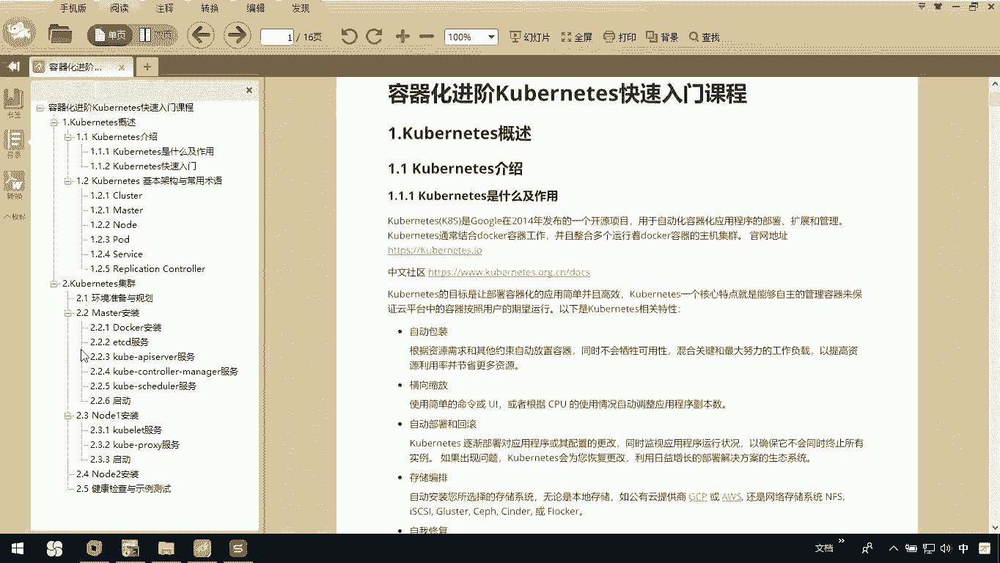
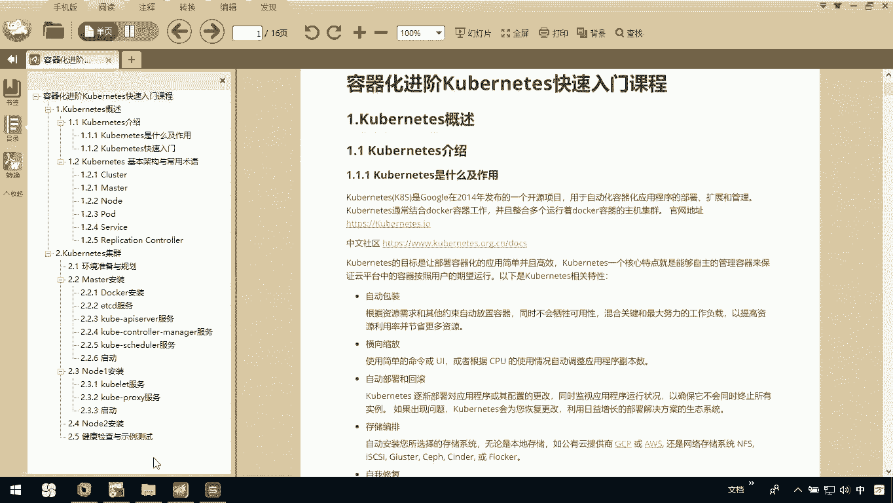

# 华为云PaaS微服务治理技术：P47：0.课程介绍 🎬

在本节课中，我们将要学习《CHISE快速入门》课程的整体内容框架。本课程旨在帮助初学者快速理解并掌握Kubernetes的核心概念与基础集群搭建。

## 课程内容概述

本课程主要分为两大核心部分。

上一节我们介绍了课程的整体目标，本节中我们来看看具体包含哪些内容。

以下是课程第一部分的主要内容：
*   **Kubernetes概述**：讲解Kubernetes是什么及其核心作用。
*   **快速入门案例**：通过一个实践案例，帮助大家初步了解Kubernetes。

接下来是课程的第二部分，我们将深入Kubernetes的内部结构。

以下是课程第二部分的主要内容：
*   **基本架构与术语**：介绍Master、Node、Pod、Service等Kubernetes基本概念。

除了核心概念，本课程的另一大重点是动手实践。

以下是关于Kubernetes集群实践部分的主要内容：
*   **集群搭建演示**：使用一个Master节点和两个Node节点，演示如何通过二进制文件安装方式搭建Kubernetes集群。
*   **安装详解**：详细讲解Master节点和Node节点的安装步骤。
*   **问题排查**：探讨在集群搭建过程中可能遇到的问题及其解决方案。
*   **集群测试**：在搭建完成后，进行简单的功能测试以验证集群状态。

本节课中我们一起学习了《CHISE快速入门》课程的两大模块：Kubernetes核心概念介绍与基于二进制文件的集群搭建实践。通过本课程，您将对Kubernetes有一个清晰、全面的入门级认识。