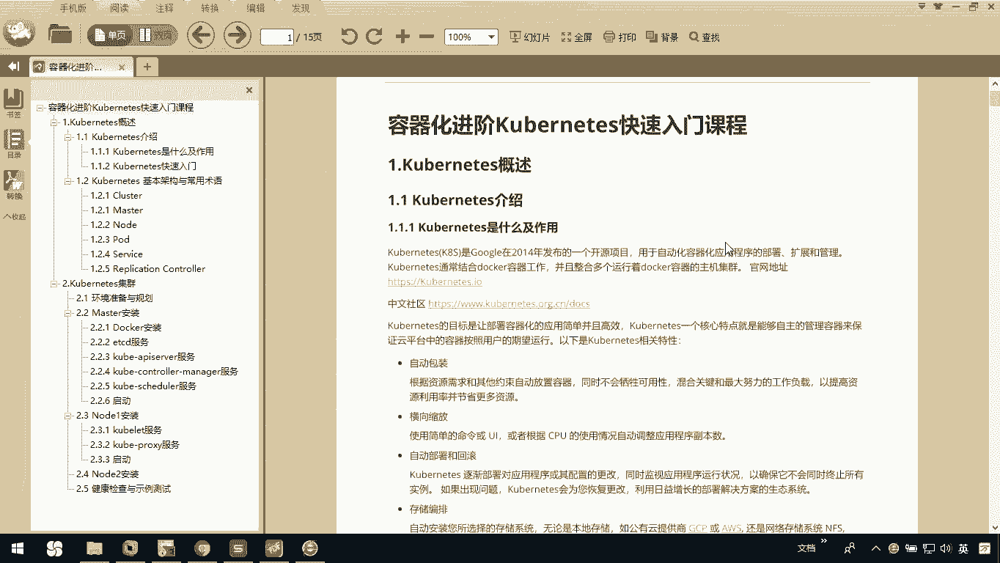
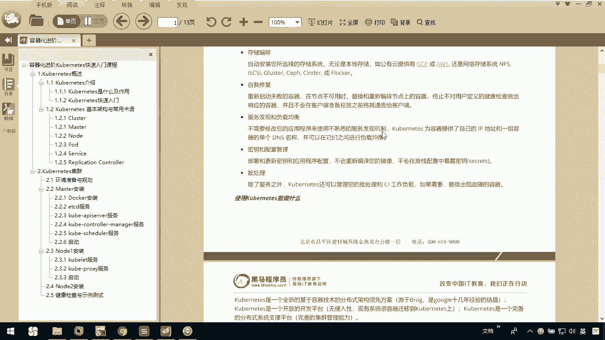
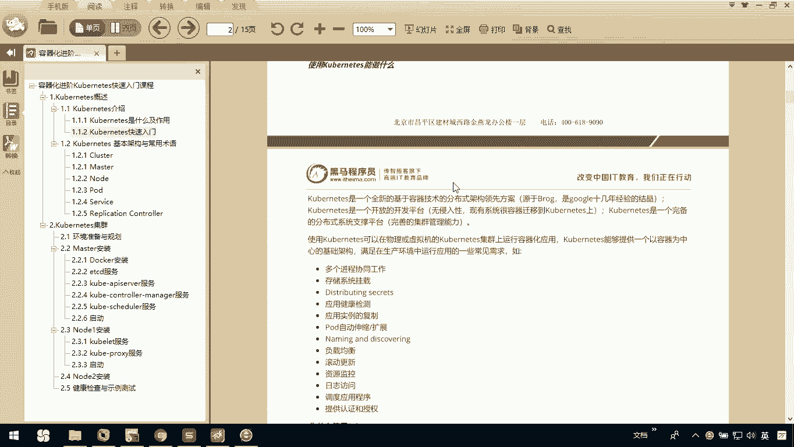
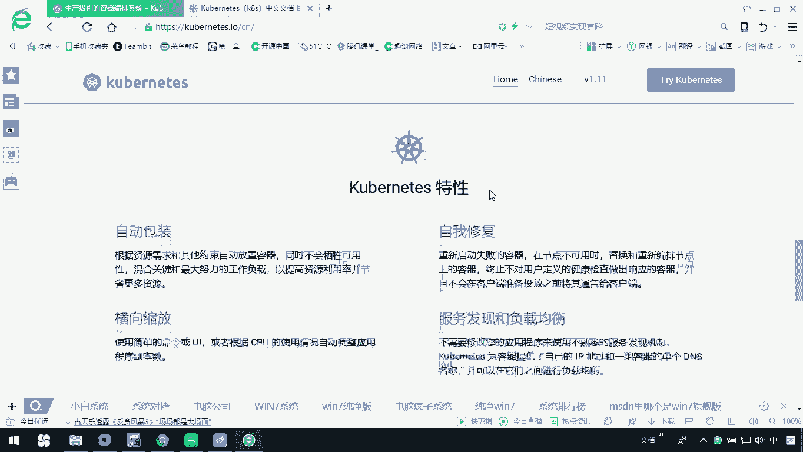
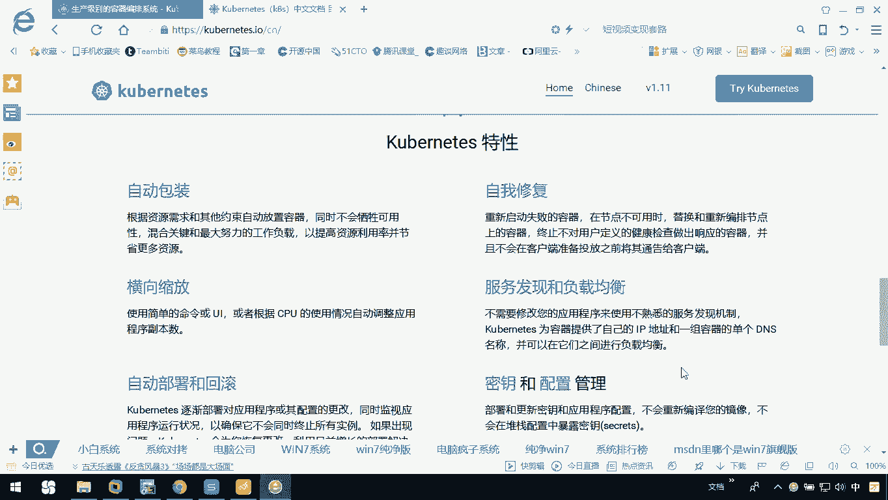
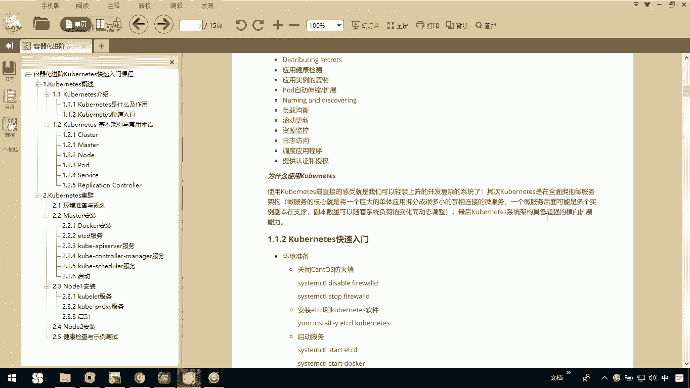

# 华为云PaaS微服务治理技术 - P48：1.Kubernetes介绍 - 开源之家 - BV1wm4y1M7m5

大家好，下面呢我们讲解容器化进阶课程，ROMANIZE的一个快速入门课程，首先呢我们要对connect做一个简单的介绍。

我们了解什么是connect，它有什么作用。

那我们使用good night呢能做什么，那这是我们这节课的一个主要内容。

首先来看一下CNICE啊，是谷歌在2014年发布的一个开源项目，那么我们把它简称叫做K8S，是因为K和S中间呢我们有八个英文字母，所以我们简称叫K8S，那我们使用coat最主要是用于什么呢。

自动化容器应用程序的部署扩展和管理，那我们使用CNET一般是结合着docker容器工作，它能帮助我们整合多个运行的docker，容器的主机集群，可以，那cortex目标呢是让我们部署。

容器化的应用程序啊，简单高效，它的一个核心特点就是能够自主的管理容器，来，保证云平台中的容器呢按照用户的期望去运行，下面呢是关于cornet相关特性，这些特性啊是在CODNET官网上提供的。

大家可以打开cornet I/O，我这里边呢已经为大家打开了，看一下，在这呢你可以把它切换到中文或者英文，那刚才我给大家展示的关于空难的特性呢。

其实就是在这里边给大家截取的，那我们这里面说到了，它能自动包装，自我修复，横向的缩放啊，服务的发现和负载均衡，自动的部署和回滚，还有呢密钥和配置的管理嗯，还有这里边存储的编排批处理。

那这些特性它就使得我们使用cop啊。

可以更加高效的去工作，那这些介绍完以后呢，大家来看一下我们使用扩展到底能做什么呢，刚才我们介绍了说connect是一个全新的，基于我们这种容器化技术的，分布式的一个架构的领先方案。

那它是谷歌一个啊开源项，以这个谷歌啊对这么一个项目的开源，那connect呢是一个开放平台，它无侵入性，现在系统呢很容易都迁到这个Knight上，那Knight呢是一个完备的分布式的一个系统支撑。

支撑平台，我们使用空light，可以在物理机或虚拟机的空载集群上啊，运行我们的容器化应用，那connect能提供一个以容器为中心的基础架构，满足我们生产环境中，以及我们这个开发环境的一些需求。

那大家可以看一下下面的列了一些说，例如我们多个进程协同工作呀，存储系统的挂载呀，应用健康检查呀，pod的自动伸缩和扩展负载呀等等，这里边它都可以帮助我们去完成操作，那我们为什么要使用co呢。

其实刚才我们在前期已经说过了，Com net，它在设计设计之初的一个核心的这个目标，就是能让我们自主的管理容器，来保证云平台中的容器按照用户的期望去运行，那这里呢又给大家做了一次总结，你可以看一下。

我们使用com light，最直接的感受就是我们可以轻装上阵，开发复杂的系统，那其次呢connect呢在全面拥抱微服务这方面，他做的非常好，那我们知道微服务呢现在是我们的一个主流。

我们使用com net呢啊，跟我们的微服务集成啊，我们现在呢可以使我们的这开发更加简单，他这里面说了，微服务的核心就是将一个巨大的单体应用，拆分为很多小的互相连接的微服务。

一个微服务呢还可以有很多的副本，那副本数量呢，可以随着我们这个系统的负荷变化动态调整，也就是说我们知道你真的一个微服务架构啊，它最终的每一个服务呢他都可能会有副本，那他这个随着这个系统越来越大。

那我们整个需要管理的监控呢就越来越多，那connect呢可以帮助我们去简化一些操作，它可以帮助我们动态的扩容，前期我们已经提到过了，那最后呢，cornet的系统具有超强的横向的一个扩容能力。

这也是我们为什么要去熟悉。