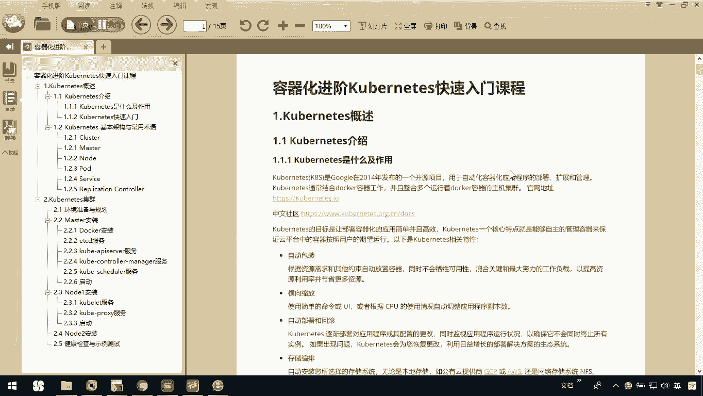
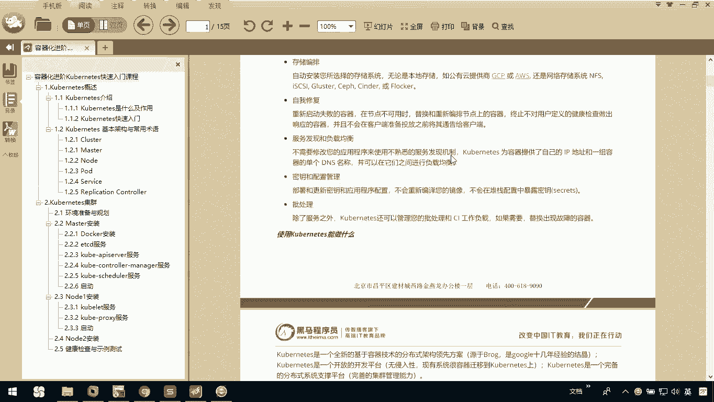
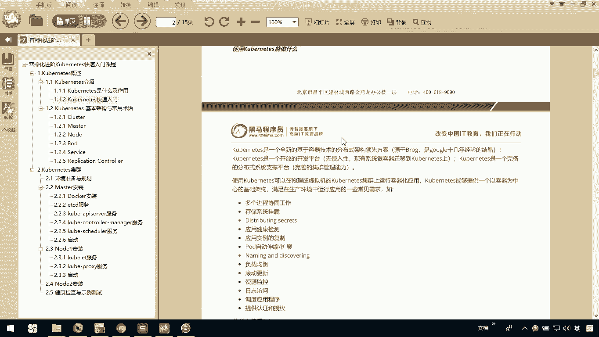
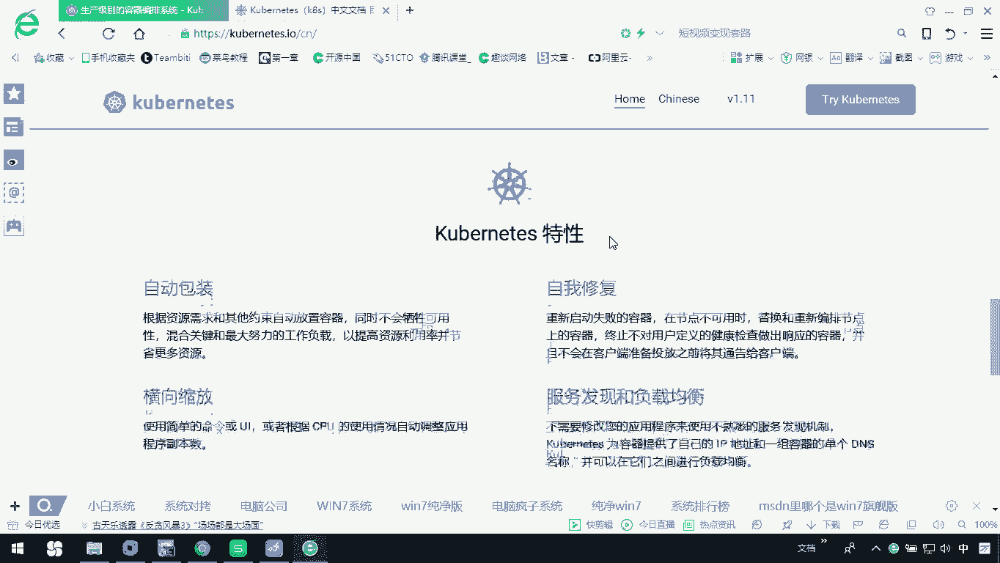
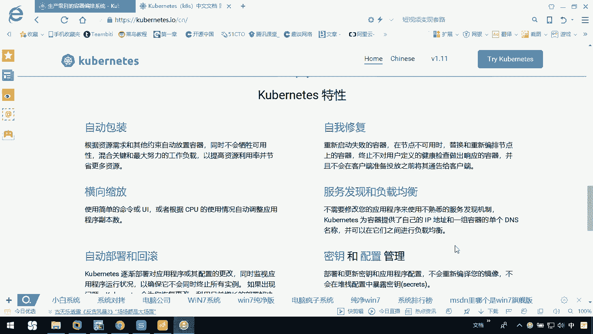
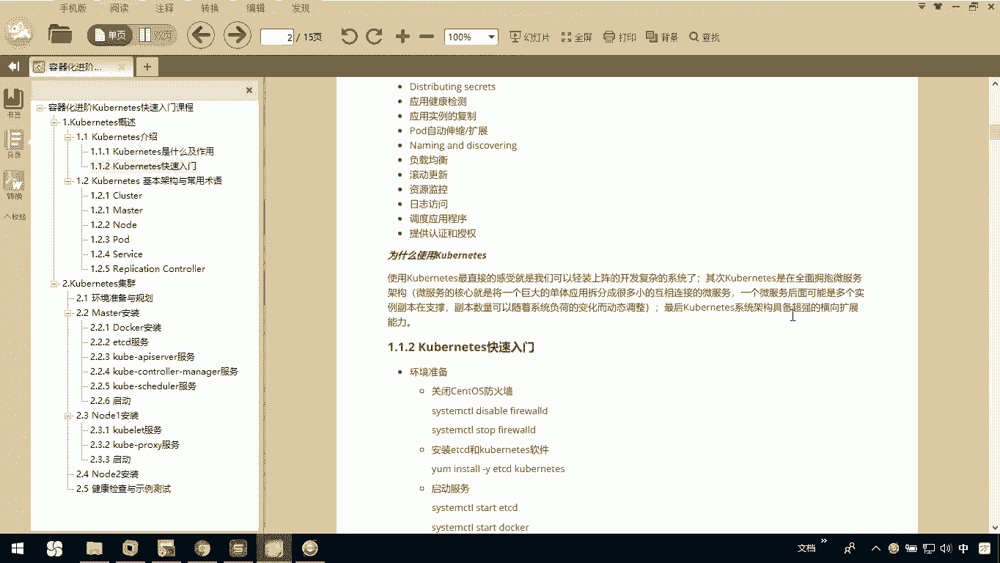

# 华为云PaaS微服务治理技术：P48：1.Kubernetes介绍 🚢

在本节课中，我们将要学习Kubernetes的基础知识，了解它是什么、能做什么以及为什么在现代应用开发中如此重要。

## 什么是Kubernetes？

上一节我们介绍了容器化技术，本节中我们来看看容器编排领域的核心工具——Kubernetes。

Kubernetes是谷歌在2014年发布的一个开源项目。它的简称是K8S，因为K和S中间有八个英文字母。Kubernetes主要用于自动化容器化应用程序的部署、扩展和管理。

它通常与Docker容器协同工作，能够整合多个运行Docker容器的主机，形成一个集群。Kubernetes的核心目标是让容器化应用的部署变得简单高效。其核心特点是能够自主管理容器，确保云平台中的容器按照用户的期望状态运行。

## Kubernetes的核心特性

了解了Kubernetes的基本定义后，我们来看看它提供了哪些强大的功能。以下是Kubernetes官方提供的主要特性：

*   **自动包装**：根据资源需求和其他约束，自动将容器调度到合适的节点上运行。
*   **自我修复**：自动重启失败的容器、替换和重新调度容器，杀死不健康的容器。
*   **横向缩放**：根据CPU使用率或其他自定义指标，轻松地通过命令或UI手动/自动缩放应用副本数量。
*   **服务发现与负载均衡**：无需修改应用程序即可使用服务发现机制。Kubernetes能为容器组提供自己的IP地址和单个DNS名称，并可以在它们之间实现负载均衡。
*   **自动部署与回滚**：可以描述已部署容器的所需状态，并以受控速率将实际状态更改为所需状态（例如，滚动更新）。
*   **密钥与配置管理**：可以部署和更新密钥与应用程序配置，而无需重新构建容器镜像，也无需在堆栈配置中暴露密钥。
*   **存储编排**：允许自动挂载选择的存储系统，例如本地存储、公共云提供商等。
*   **批处理**：除了服务外，Kubernetes还可以管理批处理和CI工作负载，在需要时替换失败的容器。

这些特性使得使用Kubernetes进行应用管理和运维工作更加高效。

## Kubernetes能做什么？

在认识了Kubernetes的特性之后，本节中我们来看看它的具体应用场景。

Kubernetes是一个全新的、基于容器化技术的分布式架构领先方案。它是一个开放平台，无侵入性，现有系统可以相对容易地迁移到Kubernetes上。作为一个完备的分布式系统支撑平台，Kubernetes允许在物理机或虚拟机的集群上运行容器化应用。

它提供了一个以容器为中心的基础架构，能够满足生产环境及开发环境中的多种需求。例如：

*   协调多个进程（容器）协同工作。
*   管理存储系统的挂载。
*   执行应用健康检查。
*   实现Pod的自动伸缩和扩展。
*   提供服务负载均衡。

## 为什么使用Kubernetes？

最后，我们来总结一下选择Kubernetes的主要原因。

Kubernetes在设计之初的核心目标就是自主管理容器，保证云平台中的容器按照用户的期望运行。使用Kubernetes最直接的感受是，开发者可以“轻装上阵”去开发复杂的分布式系统。

其次，Kubernetes全面拥抱微服务架构。微服务的核心是将一个庞大的单体应用拆分为许多小型、相互连接的微服务。一个微服务可以拥有多个副本，并且副本数量能够随着系统负载的变化而动态调整。随着系统规模扩大，需要管理和监控的组件会越来越多，Kubernetes能够帮助简化这些操作，实现动态扩容。

最后，Kubernetes系统本身具备超强的横向扩容能力，这也是它成为云原生时代基石的重要原因。

---

本节课中我们一起学习了Kubernetes的基本概念、核心特性、主要能力以及其核心价值。简单来说，Kubernetes是一个强大的容器编排系统，它能自动化管理容器化应用的生命周期，是构建和运行现代可扩展应用的关键工具。