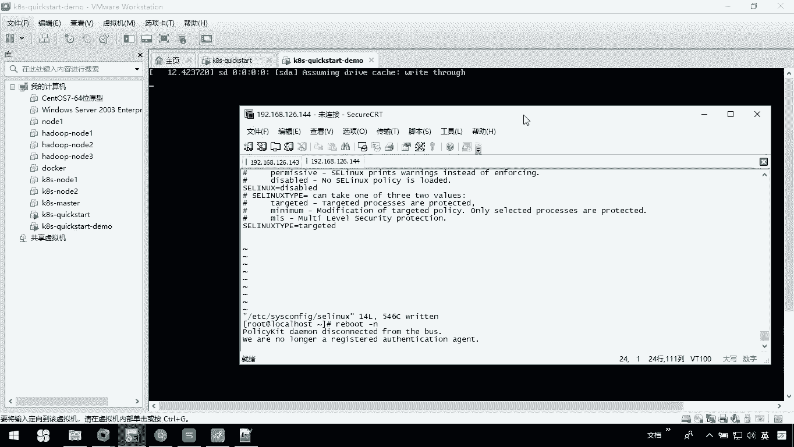

# 华为云PaaS微服务治理技术 - P49：2.Kubernetes快速入门 - 开源之家 - BV1wm4y1M7m5

接下来呢我们用一个com net快速入门阿里啊，来把我们这个cos的这个使用，或者说它的作用呢再介绍一下，那来看一下啊，CORNEX快速入门案例，我们主要三步，第一步呢是做一个环境的准备。

那我们要去关闭我们的防火墙，然后安装我们的ETCD呃，然后我们把相关的服务启动，第二步呢我们要去做一个配置，那这里边配置呢我们主要是去使用空net，做一个top hat的一个部署。

那第三步呢我们就进行一个测试，其实我当前电脑上啊已经完成了一次呃，我们当前这个快速入门的案例，那你可以在浏览器上呢直接访问我的143，可以看到我们当前的这个tom cat服务器。

那在这里呢呃我们的配置过程中啊，有两个文件，一个是我们tom cat的一个replication control，的一个配置文件，还有一个是我们tom cat一个SVC的配置文件。

这两个配置文件呢都是我们connect需要的，它是帮助我们建立我们的这个应用，以及进行我们的服务的这个控制，那这里边说到这儿呢，我们就来去把我们刚才说的这个快速入玛利亚，去做一下。

那我当前呢又新建了一台这个机器，这是一个144，那在这里呢我们按照讲义上所讲解的，去做一下操作，首先呢你关闭防火墙，然后呢我们刚才是A宝，让他去disc宝啊，去把它禁用了，然后我们现在stop呃。

第二步呢，他告诉你说你要去安装ETCD和CONNX软件，那这里呢有个问题，就是说大家呢在安装前呢，建议先去亚美尼斯update一下啊，我的电脑已经update过了，你保证你的亚马是一个最新版本。

然后呢再去执行我们当前这个操作，把我们ETCD啊，以及我们的connect相关的一些软件都装一下，相关的服务都装一下，那这个过程中，大家会发现它其实也会帮助我们把docker都装上，那这个过程啊。

我们稍等一下，它稍微有点慢好了，我们这里边已经安装完成了，那接下来呢我们就要把相关的服务起来，首先呢我们启动ETCD，那么我启动完以后呢，你可以通过system control。

然后呢stays去TCD查看一下，看到我们当前的这个服务，是一个active writing状态啊，我们当前用的是SDOS7这个版本啊，那接下来呢我们要去启动docker。

大家在启动docker的时候呢，可能会出问题，我们可以看一下，在这里边我启动docker，它是显示我们启动失败了，那这里告诉你说如果docker启动失败啊，请参考我们当前这个配置文件的。

这个一个叫做S这个文件夹里面的参数改一下，然后再重启你的机器，再重启到分就可以了，那我们照着做一下vi，我们etc下的cs configure下的，然后我们在这里边呢，去把当前的这个参数改一下。

改成我们的叫d i s a b l e d disabled，OK然后呢是不是JJ我们退一下，接下来呢我去重启一下我的电脑啊，重启以后呢，我们再去把我们这个doer服务起来，就应该OK了啊，稍等一下。

我现在这个服务看一下我们是否起来了。

这是我当前当前这台机器啊，他还没有起来。

好了，现在呢已经启动成功，我们重新连一下，然后呢我把我的这个防火墙啊，system Ctrl stop一下FREWLD，然后呢我们再去看一下system Ctrl，我们去start一下我们的ETCD嗯。

然后再去system c t r，我们的s t RT start一下我们的docker ok了，然后我们可以看一下u c k r docker，他的状态也是一个running，接下来呢。

你就照着讲义上把我们CNAS相关的一些服务啊，都起来，这是他的API server的，然后呢这是我们的一个control manager，还有他的schedule，Ctrl c，嗯还有一个是他的CLI。

还有一个是cover proxy Ctrl c，这样呢我把相关的服务都启动了，那建议大家呢，其实在每个服务啊起完以后呢，你去简单查看一下它的状态，它是否是启动的，OK吧，那这样呢我们整个呃快速入门。

第一部分就是关于环境准备这块我就完成了，那下面呢我们需要去做配置，那我可以在我当前的user下的local下，我创建一个K8S这么一个目录，我进入到这里边去K8S这个目录，那我呢可以新建两个文件。

一个是我们当前的一个replication，CONTROLER的配置文件，还有一个是关于我们的server配置文件，那这个配置文件内容呢我们先不用深究啊，你只需要知道它里面其实呃，配置了我们当前的镜像。

例如说我们的tom cat镜像，还有呢它配置了我们服务对外暴露的接口，我们访问的是8000，其实他真正对外暴露的是一个30001，OK吧，那我们在这里呢可以找到我准备好的配置文件。

你可以把内容呢直接粘贴过去啊，那在这儿我去新建一个，我现在呢去创建一个my tomcat，我们的一个RC点yo文件，我们这个配置文件都是压缩格式的，呃我们先把这个内容，拿过来CTRLC嗯。

I然后我们去把它粘起来保存一下，是不是JJ大家在写这个配置文件的时候，如果你自己想手动写啊，一定要注意这个压缩文件的一些特殊性啊，像我们这个呃applica p s version。

然后冒号后面一定要有空格，OK吧，嗯还有呢我们需要一个文件是叫做my tom cat，杠SVC点压缩文件，这个文件里面呢我们要copy的是这样的，CTRLVCTRLC保存一下，Shift z z。

这样的话呢我两个配置文件都准备好了，接下来呢你要在这里边呢去执行一下命令，通过我们的这个空呃，Cooper controller，第一个呢是我们cooper controller。

我们一个create杠F5呃，My tom act，我们的RC的配文件执行，他就会告诉你呢，我们会把我们当前replication control macom cat created。

也是我们现在已经把它创建出来了，你可以通过get pose之类的，你可以看骚扰，应该是啊get pose啊，但是现在看不到对吧，一会儿我给大家说解决这个问题啊，啊现在我们再来看一下cob cdr。

我们再去把刚才的这个server my ca pan cat，这个server文件呢我也把它创建一下，这样的话the service也创建了。

你可以通过cooper controller get s v c，你可以看一下，这时候我们是不是就有了一个service，这叫my tomcat，OK吧。

那刚才我在这里边呢去执行那get pose的时候，他拿不到数据呢，讲义上也跟大家说了，这里面有些问题啊，例如说我们现在呢不能去看到这个pose，就说你NO NO resource found。

这个问题呢你需要怎么办呢，他告诉你啊，首先呢你要去编辑一个文件，我们参照它去做一下啊，这里边告诉你说呀，首先我们要啊vi一个配置文件，etc下的CRIMINNIS下的一个API server。

这么一个配置文件，然后告诉你在这里找到一个叫做cooper admire，什么controller，我们这么一个东西，我们找一下应该是最后一个，我记得是，啊不是他是吧，应该是这吗，他他告诉你在这里边呢。

你要去去掉一个选项，调哪个选项呢，有个叫做service account，比如说我们在这里面找一下，看看它是不是有个service account值，你把这个值啊删掉，I我把这个值呢删掉。

然后呢保存一下，保存完以后我记得没错，它好像需要你去重启一下我们的这个API服务，也就是说你在这里边呃，system Ctrl restart下的cooper API s e r v e r。

你把这个服务重启一下，然后呢你再通过cooper ku b e c t r get pose，你就能看到我们当前有两个麦，他们cat这么一个pod，这个两个值啊，或者说为什么有两个呢。

其实是在我们的配置文件里面去定义的，在这里边我们在这定义的时候，你看到了吧，我定义它的值为两个，其实它就会帮助我去创建两个OK了，那这样的话呢我们整个操作啊基本OK了，但是呢你通过浏览器去访问的时候。

你会发现其实还是有问题的，也就是说你还会访问失败，在这里边你在访问的过程中啊，他应该是有问题的，那这里边呢问题其实有很多，我们可以看一下，就是说在我们的讲义里边也跟大家说了，在整个过程中。

如果你遇到了一些问题，什么样的问题呢，例如docker pro失败呀，还有你访问不了外网，这些问题应该如何解决，那这里呢我就先停一下，我们先把刚才讲的关于快速入门的案例啊，过程再说一下，第一个过程呢。

第一个操作就是我们需要做一个环境准备，我们需要关闭防火墙，然后呢安装我们的这个ETCD和CODX软件，然后把相关的服务起来，最后呢这个位置你需要注意一下，刀哥如果启动失败怎么办。

第二个呢就是我们需要做配置文件，你要配置一个replication control的配置文件，还有一个是service的，那第三个呢做测试，而我们刚才的测试是失败的，是存在问题的。

