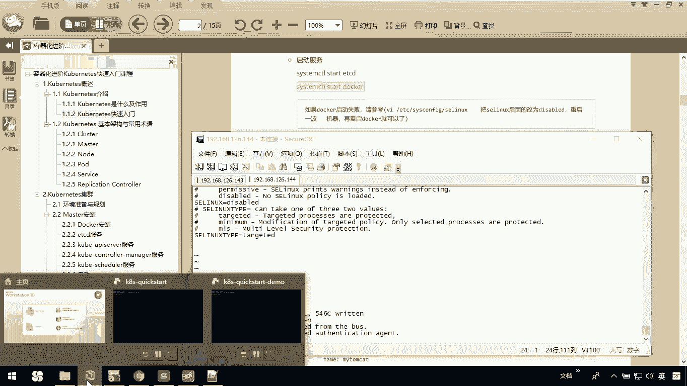
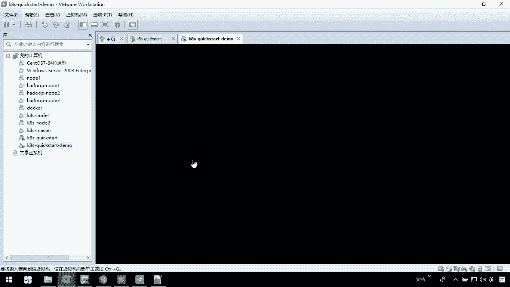
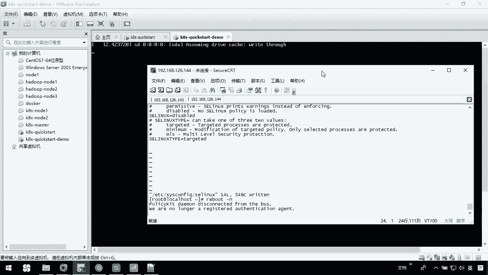
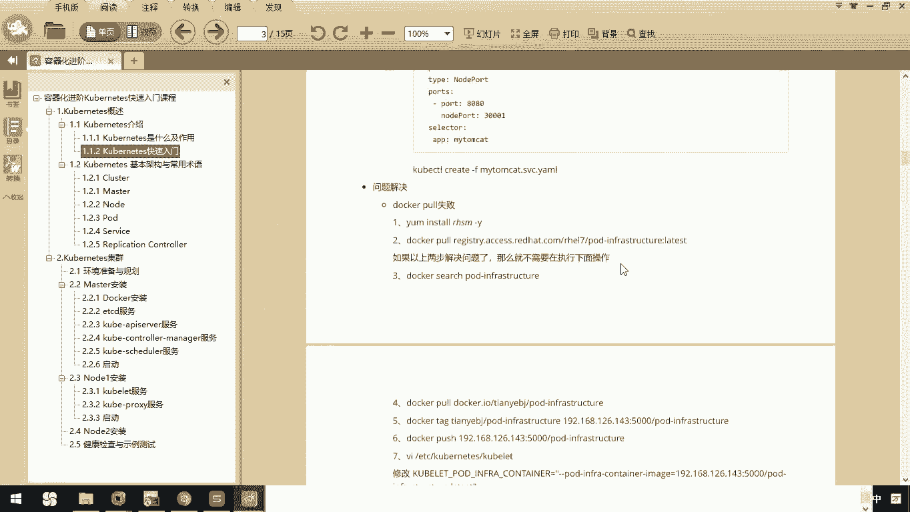

# 华为云PaaS微服务治理技术：P49：2.Kubernetes快速入门 🚀

在本节课中，我们将通过一个Kubernetes快速入门案例，来介绍Kubernetes的基本使用和作用。我们将分三步完成：环境准备、配置部署和测试验证。

---

## 环境准备

上一节我们介绍了Kubernetes的基本概念，本节中我们来看看如何搭建一个基础的运行环境。以下是环境准备的具体步骤：

1.  **关闭防火墙**：执行命令 `systemctl stop firewalld` 并禁用其开机自启 `systemctl disable firewalld`。
2.  **更新系统**：执行 `yum update -y` 以确保软件包为最新版本。
3.  **安装软件**：使用Yum安装etcd和Kubernetes相关组件。此过程也会自动安装Docker。
    ```bash
    yum install -y etcd kubernetes
    ```
4.  **启动服务**：依次启动etcd和Docker服务。
    ```bash
    systemctl start etcd
    systemctl start docker
    ```
5.  **启动Kubernetes服务**：启动Kubernetes的各个核心服务。
    ```bash
    systemctl start kube-apiserver
    systemctl start kube-controller-manager
    systemctl start kube-scheduler
    systemctl start kubelet
    systemctl start kube-proxy
    ```

**注意**：若Docker启动失败，需编辑 `/etc/sysconfig/docker` 文件，将 `--selinux-enabled` 参数改为 `--selinux-enabled=false`，然后重启系统再尝试启动。

---







## 配置部署

环境准备就绪后，接下来我们需要配置应用部署。我们将部署一个Tomcat应用，这需要创建两个核心的Kubernetes配置文件。

首先，创建一个工作目录并进入：
```bash
mkdir -p /usr/local/k8s
cd /usr/local/k8s
```

以下是需要创建的两个配置文件及其核心内容：

1.  **Replication Controller配置文件 (`my-tomcat-rc.yaml`)**：此文件定义了应用副本的数量和所使用的容器镜像。
    ```yaml
    apiVersion: v1
    kind: ReplicationController
    metadata:
      name: my-tomcat
    spec:
      replicas: 2
      selector:
        app: my-tomcat
      template:
        metadata:
          labels:
            app: my-tomcat
        spec:
          containers:
          - name: my-tomcat
            image: tomcat:latest
            ports:
            - containerPort: 8080
    ```
    关键参数 `replicas: 2` 表示期望运行2个Tomcat实例。

2.  **Service配置文件 (`my-tomcat-svc.yaml`)**：此文件定义了如何将应用服务暴露给外部访问。
    ```yaml
    apiVersion: v1
    kind: Service
    metadata:
      name: my-tomcat
    spec:
      type: NodePort
      ports:
      - port: 8000
        nodePort: 30001
        targetPort: 8080
      selector:
        app: my-tomcat
    ```
    关键配置 `nodePort: 30001` 表示可以通过节点的30001端口访问到容器内的8080端口。

创建好配置文件后，使用 `kubectl` 命令部署应用：
```bash
kubectl create -f my-tomcat-rc.yaml
kubectl create -f my-tomcat-svc.yaml
```

部署完成后，可以查看资源状态：
```bash
kubectl get pods
kubectl get svc
```

**常见问题**：若执行 `kubectl get pods` 无显示，可能需要编辑 `/etc/kubernetes/apiserver` 文件，移除 `--admission-control` 参数中的 `ServiceAccount` 选项，然后重启API服务：`systemctl restart kube-apiserver`。

---

## 测试验证

配置部署完成后，理论上即可进行测试。然而，在实际操作中可能会遇到无法通过浏览器访问服务的情况。

可能的问题包括：
*   Docker镜像拉取失败。
*   网络策略或防火墙规则阻止访问。
*   节点端口（如30001）未被正确映射或开放。

解决思路是检查Docker日志、Kubernetes Pod状态以及节点的网络配置。由于网络环境差异，具体解决方案需根据实际情况调整。

---

## 总结



本节课中我们一起学习了Kubernetes的快速入门。我们完成了**环境准备**，包括安装核心组件并启动服务；进行了**配置部署**，通过YAML文件定义了应用的副本控制器和服务；最后探讨了**测试验证**阶段可能遇到的问题。这个案例展示了使用Kubernetes部署和管理一个简单应用的基本流程，虽然在实际中可能会遇到网络或配置挑战，但它清晰地揭示了Kubernetes在声明式部署和服务暴露方面的核心价值。