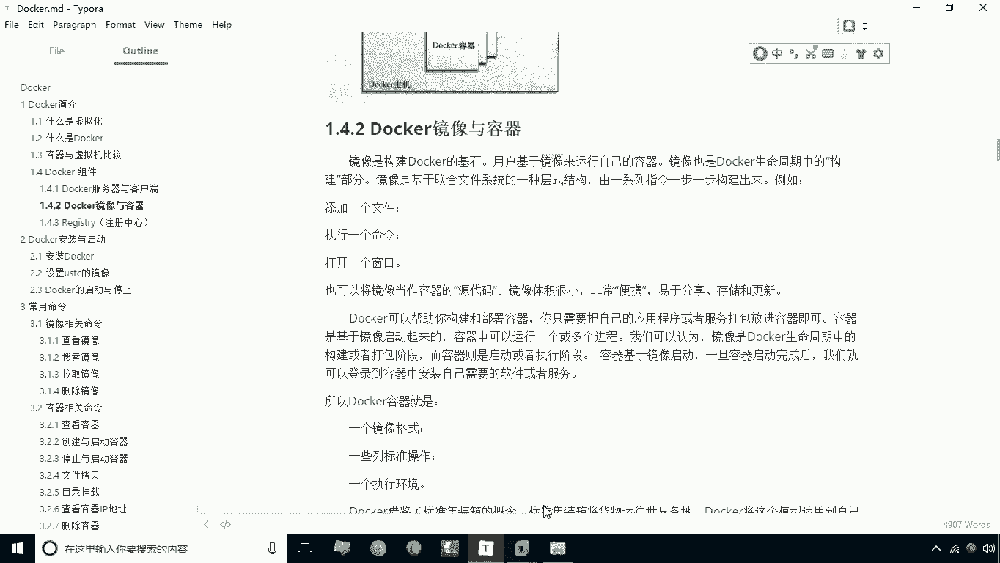
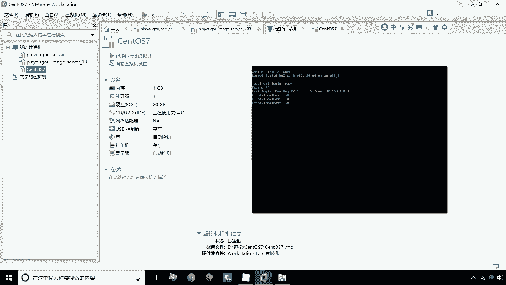
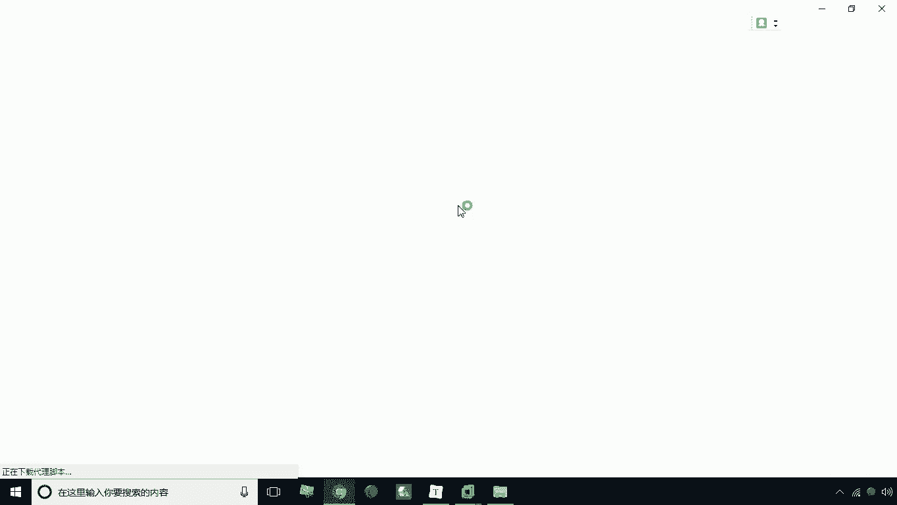
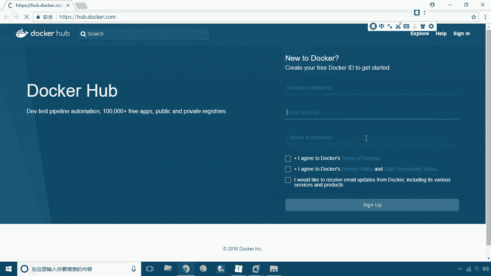
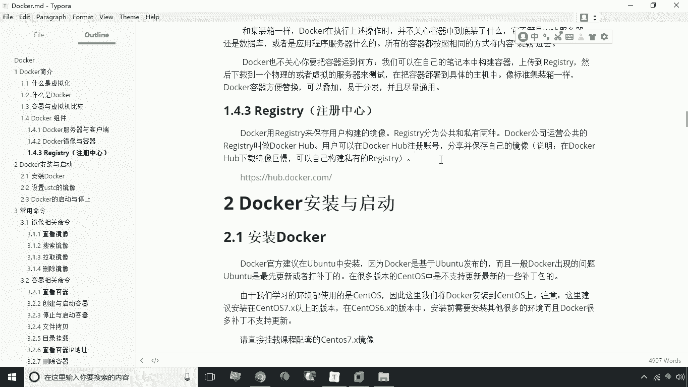

# 华为云PaaS微服务治理技术 - P4：04.docker组件 - 开源之家 - BV1wm4y1M7m5

好接下来呢咱们来讲解docker组件，那么docker组件呢，我们这里首先给大家介绍一下，docker的服务器与客户端，那么docker呢它其实是一种cs的架构程序，那么所谓cs就是指客户端和服务器。

这样一个架构，那么大家看一下啊，下面这个图实际上就是讲解了这个docker啊，它是如何的啊，进行一个进行一个容对容器的管理，那首先看一下下面这个部分，下面部分呢讲的是一个刀客主机。

docker主机呢这里有一个叫docker守护进程，其实这个守护进程是什么呢，其实就是我们的docker的服务端，就是docker的服务端，那么docker服务端我们这里头把它运行起来之后啊。

这时候呢这个他就开始工作了，那么它主要干嘛呢，唉管理这些docker容器，那么至于这些docker容器容器是什么意思呢，后面我们会讲啊，这总之他是管理一些docker容器的。

那么这个本身呢它还除了这个服务端之外呢，还有一个叫刀客客户端，那么这个客户端主要干嘛的呢，它主要是负责连接这个docker的守护进程，也就连接这个服务端，那么连接这个服务端之后呢。

我们就可以在docker的客户端来进行呃，来执行一些相应的一些命令来操作这个docker，通过这个docker守护进程来操作docker容器，就是这样一种形式，当然这个客户端呢。

可以和docker主机是处于同一台机器，那么我们说也可以是不同的机器，那么不同机器的话就可以远程来登录，那么当然了，我们说运行了docker，docker这个这个守护进程的这台机器呢。

我们也可以成为docker主机或者叫宿主机啊，叫宿主机，这是我们说的这个啊，关于这个docker啊，关于docker它的一个服务器和客户端啊，这么一个概念，我们就讲解到这好。

接下来呢咱们再讲解一下刀和的镜像与容器，这个docker镜像与容器是非常重要的两个概念，也是我们在学习docker之前，必须要啊理解的一个概念，那么docker镜像和容器分别是指什么呢。

我们来看一下它上面解释，镜像呢是构建docker的基石，也就是说用户来基于镜像来运行自己的容器，所以这个里头我们来看一下镜像和容器的关系，实际上就是镜像是用来运行容器的，一组文件的集合。

那也就是说我们这个镜像呢，它其实是一种逻辑结构，对应的其实就是你的这个宿主机的一些文件，那么这些文件呢组织起来我们称之为一个镜像，而这个镜像是什么呢，这个镜像实际上啊，就是代表了一个容器的一个模板啊。

代表一个容器模板，比如说我们现在下了一个什么呢，我们可以从我们的网上啊，或者说自己来构建一个镜像，这个镜像其实就是比如说一个MYSQL镜像啊，或者说一个CENTOS镜像，那好了。

那这个镜像我们就可以通过这个MYSQL镜像来创建，一个MYSQL容器，当然也可以创建很多个容器，就比如说我们需要运行三个MYSQL，那这时候我们就可以通过这一个MYSQL镜像，来去构建什么。

来去构建三个MYSQL容器，而这三个容器实际上是什么，是通过镜像来启动的啊，镜像就是我们说在docker里管理的，一组一个逻辑结构，一个逻辑结构，那这个呢其实和我们的啊。

普通的这种这个像这种传统的虚拟机软件呢，其实不太一样啊，我们说学传统的虚拟软件也有镜像这个概念，那么这个镜像是什么呢，其实就是对应的，我们这个磁盘的某一个文件是吧，那么也就是说。

我们现在可以通过这个镜像直接运行，那么在这种情况下呢，它其实就没有容器的概念了，它就是一个镜像，一个镜像对应的其实就是一个系统，而我们说这里头。

这个镜像可以通过这一个镜像运行多次，然后呢产生多个容器，而这个多个容器呢其实都具有相同的特征，安装相同的软件，就是这样一个关系，那么如果说我们将这个镜像和容器之间，做一个对比，相当于什么呢。

相当于这个镜像，比如说是一个类，而这个容器呢相当于对象，有点类似于这样一个关系，我们是通过镜像来构建容器，而我们操作呢实际上操作就是这个容器好，这是我们说的这个关于镜像和容器啊，这两个概念。

这个呢一定要去理解，那么第三个方面呢，我们要讲的就是我们的注册中心啊，就注册中心，那么这个注册中心呢其实呢分为两种，一种叫公有，一种叫私有，那么公有呢实际上就是就是叫什么呢，叫dog号啊。

这个呢其实和我们的这个GITHUB有点像是吧啊，就是一个服务端，就是一个全球的一个注册中心，那么这个注册中心干嘛呢，其实主要是用来装载一些镜像了，那比如说我们在这个注册中心上去，注册了一个账号，那好了。

你可以什么呢，你可以将自己本地构建好的镜像，去上传到这个注册中心，当然你也可以从注册中心怎么的，去下载一些别人做好的镜像啊，做好景象，那么这个这个这个dog hub呢，这个网址就是下面这个地址。

我们可以打开看一下。

好，这就是我们说docker hub的这么一个，这么一个主界面啊，其实是比较简单的啊，那在这个界面中，我们可以去进行这个镜像的搜索啊，也可以是啊去注册一个账号。

可以注册一个账号，好这是关于这个注册中心啊，咱们在这里就了解一下，好在这个环节主要我们讲的就是这么几个概念，一个是服务端，客户端啊，这个大家要理解，然后呢，重点要理解就是这个镜像和容器之间的关系啊。

另外一个就是大家要知道，有这么一个叫注册中心的这么一个啊，这么一个网站啊，实际上我们啊接下来要将要什么呢，要去下载一些镜像，其实就是从注册中心啊去下载好，这是关于docker组件。

