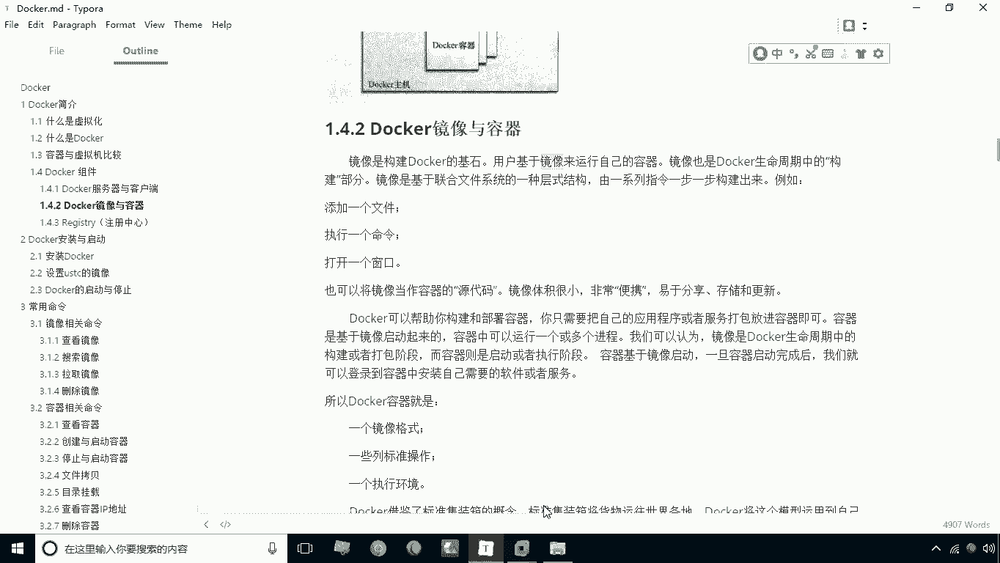
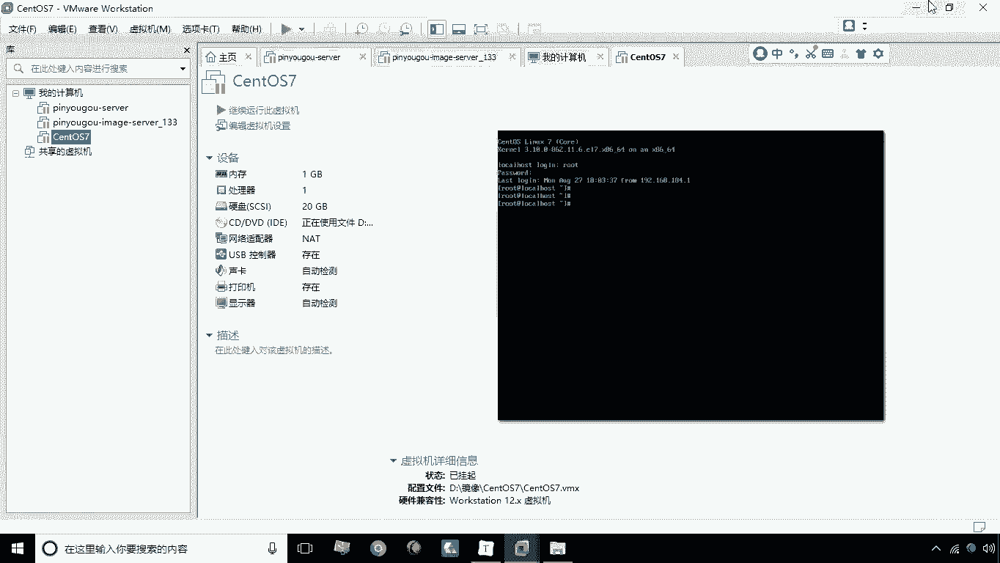
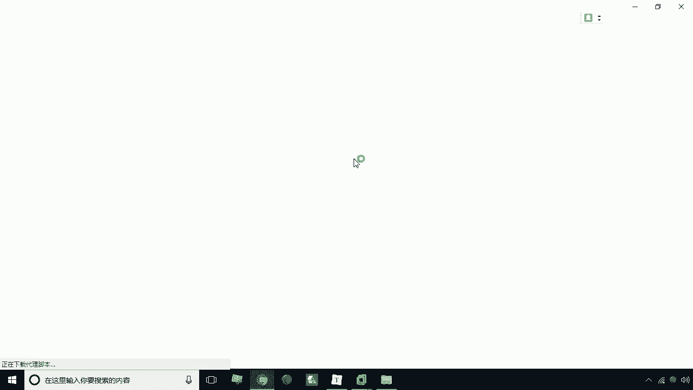
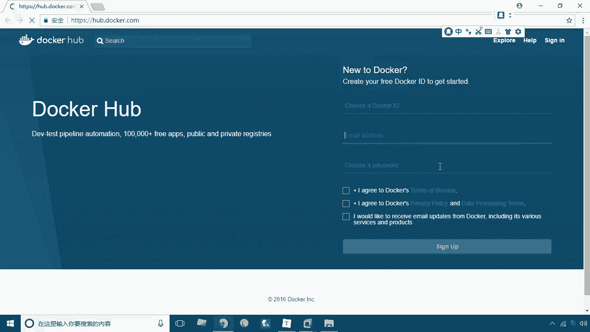
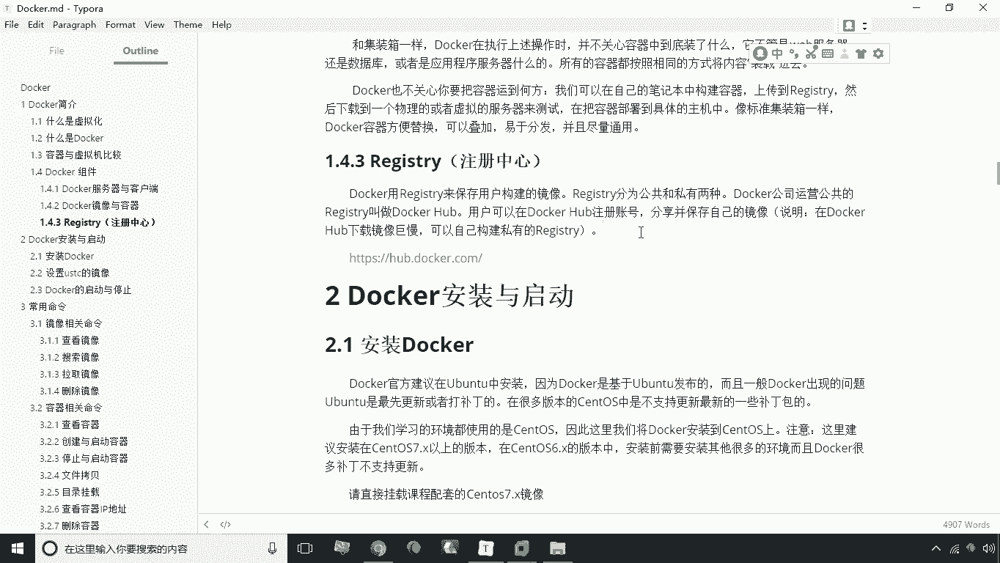

# 华为云PaaS微服务治理技术：P4：Docker组件 🐳

在本节课中，我们将要学习Docker的核心组件，理解其基本架构和关键概念。我们将介绍Docker的客户端-服务器模型、镜像与容器的关系，以及镜像的注册中心。

## Docker的服务器与客户端

上一节我们介绍了微服务治理的基本概念，本节中我们来看看Docker的基础架构。Docker采用客户端-服务器（C/S）架构。

Docker守护进程（Docker Daemon）是运行在宿主机上的服务端，负责管理Docker容器。Docker客户端（Docker Client）则是一个命令行工具，用户通过它来连接并与Docker守护进程通信，从而执行各种操作。

以下是关于Docker C/S架构的几个要点：
*   **守护进程**：作为服务端，常驻后台，负责创建、运行和监控容器。
*   **客户端**：用户通过客户端发送命令（如 `docker run`）给守护进程。
*   **连接方式**：客户端与守护进程可以运行在同一台机器上，也可以通过配置远程连接不同的宿主机。

## Docker的镜像与容器

理解了Docker的运行架构后，本节我们来深入探讨其两个核心概念：镜像与容器。它们是构建和运行应用的基础。

镜像是构建Docker的基石，是一个只读的模板，包含了运行应用所需的文件系统、库和配置。容器则是镜像的运行实例，是一个轻量级、可执行的独立环境。

镜像与容器的关系，可以类比为面向对象编程中的**类与对象**。镜像是类，定义了容器的蓝图；容器是对象，是根据镜像创建的具体实例。

以下是镜像与容器的核心特点：
*   **镜像**：静态的、分层的、只读的文件集合。一个镜像可以用于创建多个容器。
*   **容器**：动态的、可写的、隔离的运行环境。每个容器都是相互独立的。
*   **创建关系**：通过 `docker run <镜像名>` 命令，可以从一个镜像启动一个容器。

## Docker注册中心

我们已经知道镜像是创建容器的基础，那么这些镜像从哪里来呢？本节我们来了解Docker的镜像仓库——注册中心。

注册中心（Registry）是集中存储和分发Docker镜像的服务。它分为公有和私有两种类型。

最著名的公有注册中心是 **Docker Hub**（`https://hub.docker.com`）。它是一个由Docker公司维护的公共仓库，用户可以从中搜索、下载（拉取）他人共享的镜像，也可以注册账号后上传（推送）自己构建的镜像。

以下是注册中心的主要作用：
*   **镜像存储**：集中存放大量的Docker镜像。
*   **镜像分发**：方便用户获取（`docker pull`）和分享（`docker push`）镜像。
*   **版本管理**：镜像通常带有标签（如 `nginx:latest`），便于进行版本控制。

---

本节课中我们一起学习了Docker的三大核心组件。我们首先了解了Docker的C/S架构，明确了客户端与守护进程的分工。接着，我们重点剖析了**镜像**与**容器**的关系，这是理解Docker如何工作的关键。最后，我们介绍了Docker注册中心，它是我们获取和共享镜像的公共平台。掌握这些基础概念，是后续进行Docker操作和微服务部署的前提。