# 华为云PaaS微服务治理技术 - P50：3.Kubernetes环境搭建常见问题解决 - 开源之家 - BV1wm4y1M7m5

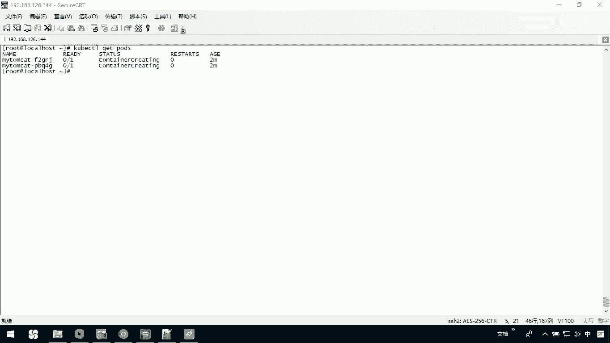

接下来呢我们就说一下嗯，在我们这个快速入门案例里面呢，我们经常会遇到的一些问题，第一个就是一个关于docker不失败的原因，那这个原因呢其实非常简单，就是因为我们当前的网络，那么国家呢对这个一些国外的。

这些域名进行了屏蔽，那我们在下载的时候呢，他这个刀客拉近镜像会失败，那这里边给大家提供两种方案。

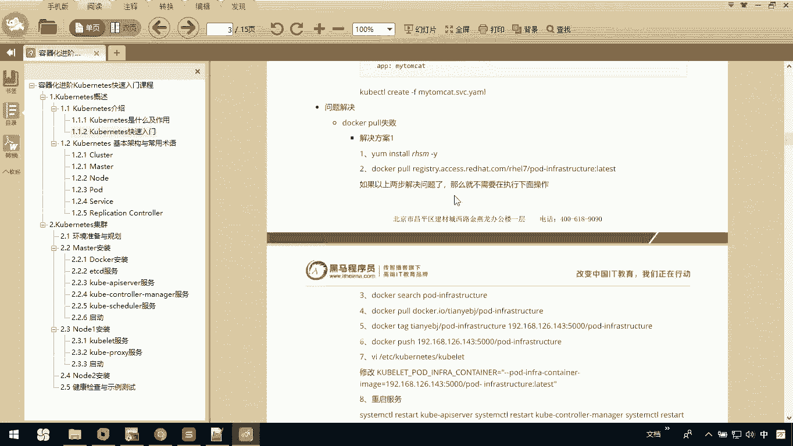

那大家呢可以去参考的这个方案呢，去执行操作就可以了，那这里边呢我就不过多去执行了，那么你执行完以后啊，其实这里面有一个比较重要的，就是说我们要对cos下的COPINE，这个配置文件进行修改。

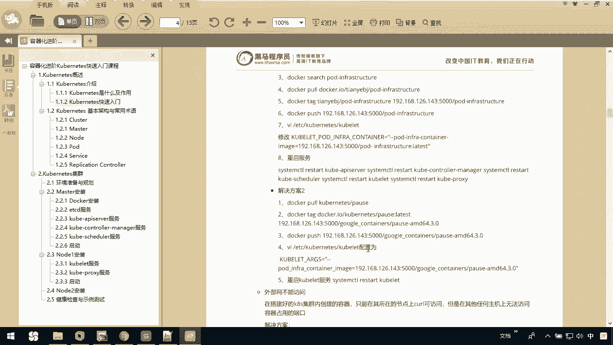

比如说我们在执行完操作以后啊，我们要去做这么一件事，就是对我们当前etc下的connect下的一个叫做cooper light，这么一个配置文件进行修改，而这个配置文件修改的时候，我们呃给了两种方案。

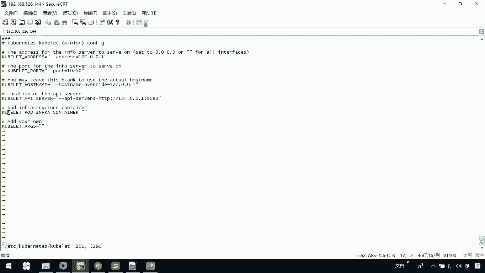

第一种方案呢，我们是要去修改，我们当前这个配置文件里面的值这么一个值，我把它copy过来。

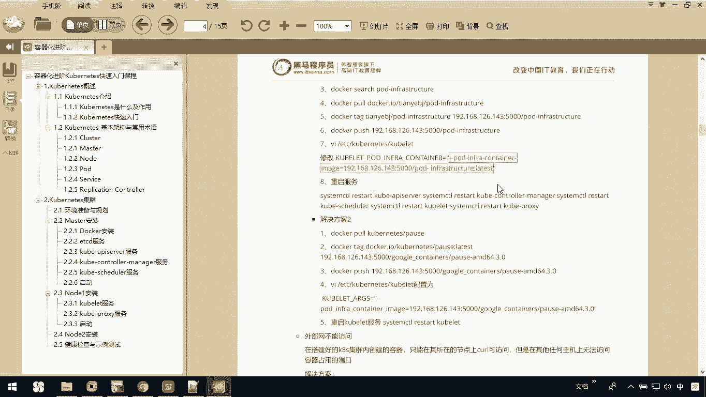

CTRLC回到我当前的配置文件里，在这边I我去给它copy一下，那这个位置啊，你一定要注意，我们其实是相当于把这个镜像下载到了本地，我在本地呢会生成这么一个镜像文件，然后呢我们去把它下载。

那第二种方案呢其实是对这个参数进行修改。

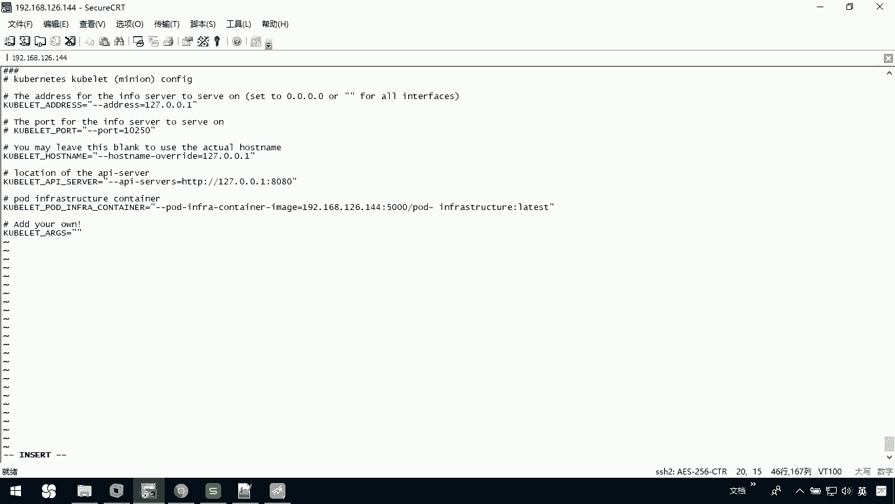

我们也是把镜像呢下载下来了，然后呢我们在里面呢对它进行了一个本地化的，镜像的一个指向。

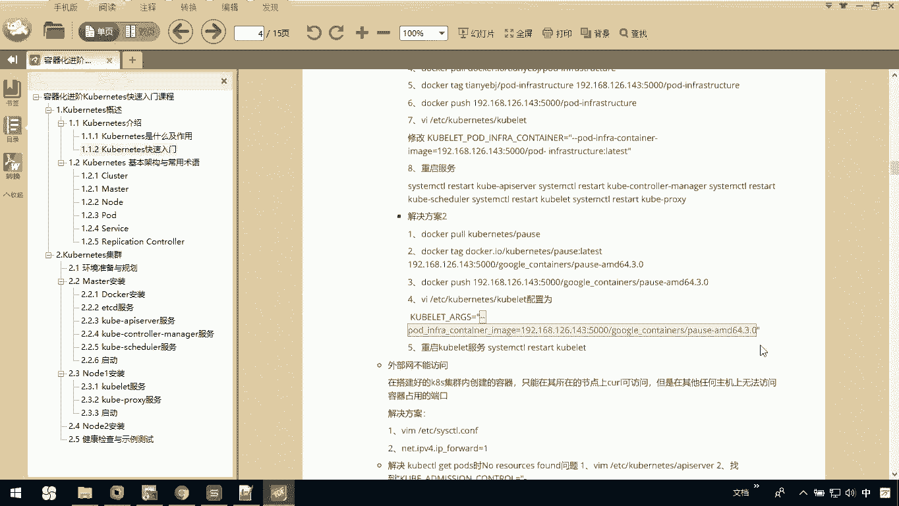

我把它copy过来，在这边，呃我们无论怎么玩呢，这两个操作都是呃，把我们这些原本在网上down下来的这些镜像啊，我们干什么呢，在本地啊去重新给他当了一下，OK我们shift jj提出一下，那退出以后呢。

我们在这里边需要去做一件事，System control，然后我们要去restart一个叫做cooper lie，这么一个服务。

然后呢你在这里边通过cooper controller去get pose的时候，你看一下我当前这个服务的状态还是这种read，也就说是我们的container create creating状态。

你呢可以去稍等一下，他因为应该有点慢啊，你看我们现在是不是已经跑起来，一个一个是running了，两个是不是都OK了，running了，也就是我们现在呢通过刚才给大家看到的。

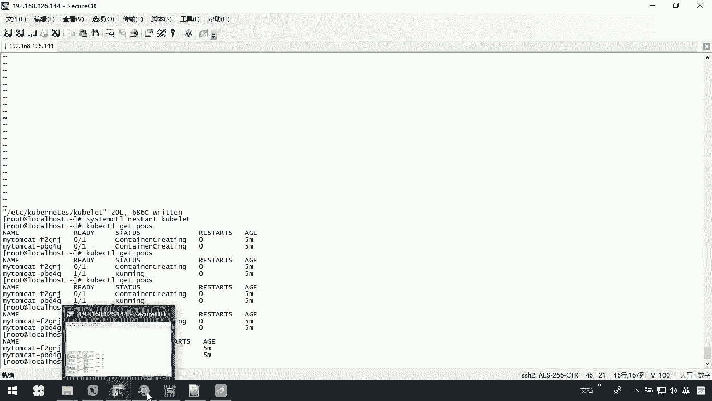

讲义上的这两种方案呢，你呢能解决我们拉取镜像失败的问题。

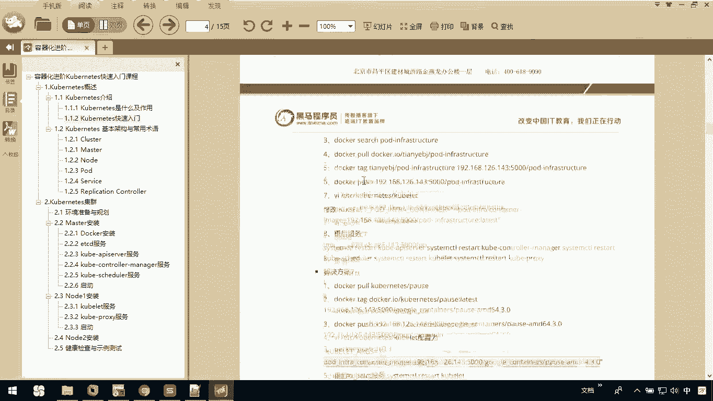

那么拉取新图像失败以后呢，我们再去访问的时候，其实还是会遇到一个问题，就是我们的外网是不能访问的，我们需要对我们当前etc下的一个叫做cs，CDL和fig文件的做一些修改。

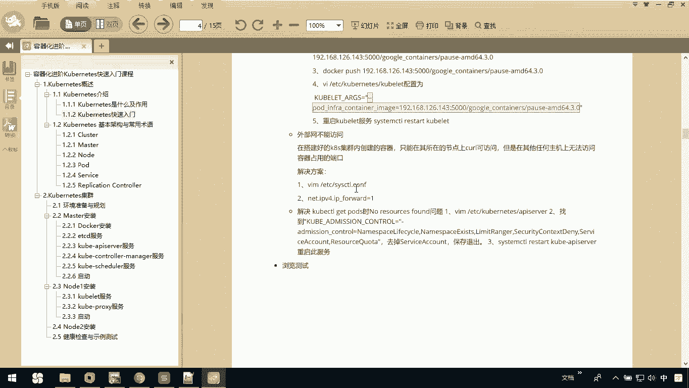

在它的里边呢，你需要去添加这么一个参数，也就是回来嗯。

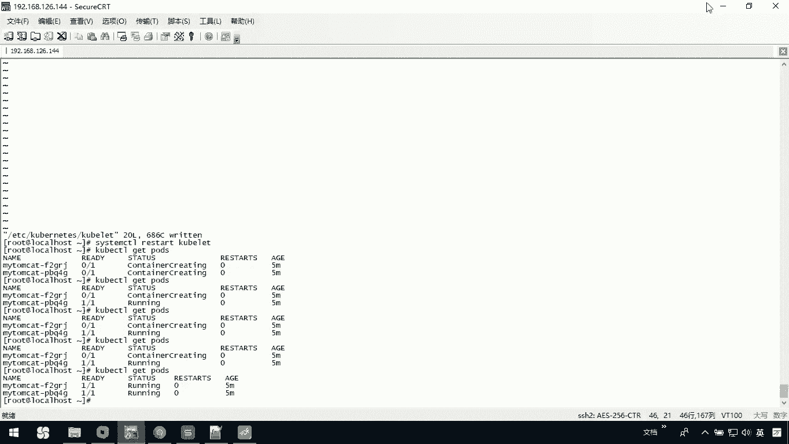

你可以看一下啊，我们这里呢有一个文件，我们cat一下嗯，杠etc下的有一个叫做cs Ctrl点CPM文件，在这个文件呢我最后加了这么一行，看到了吧，这一行呢其实是帮我做自动跳转。

那如果你这个没问题以后呢。

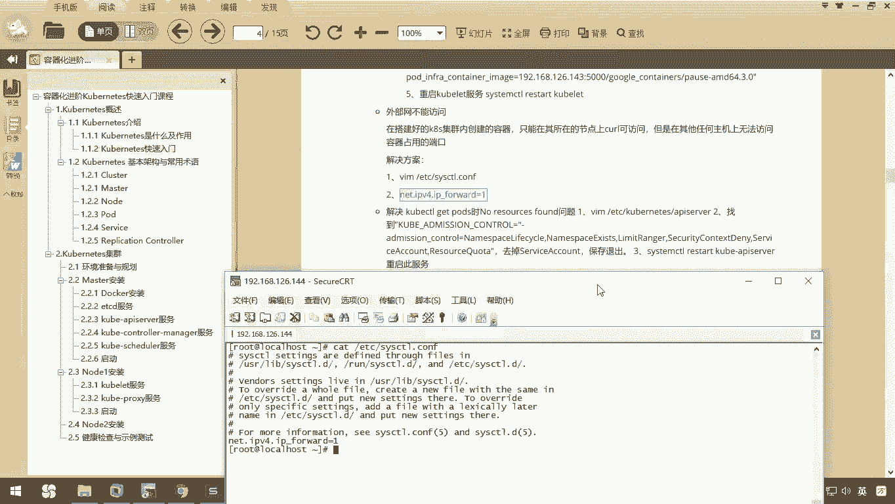

哎我们就可以干什么，去进行一个浏览器的访问了，在这里呢我再去看一下东西啊，Cover city l，点get s vc。

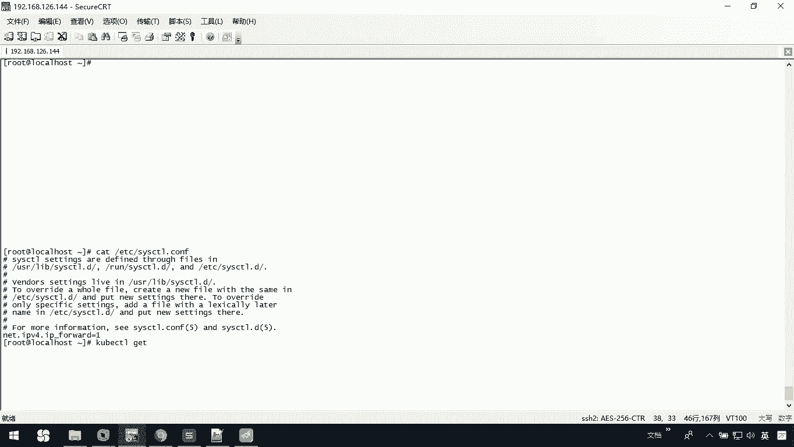

我看一下我的服务，我这服务也有的对吧，那在这里呢我们去重新把它打开一次。

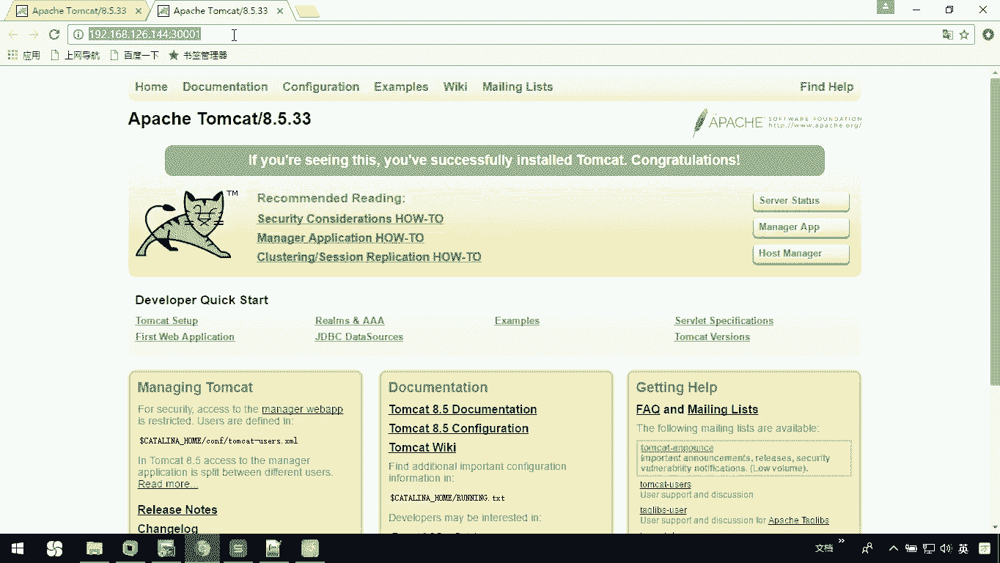

你应该啊，我们现在应该还是加载不上，稍等我们这边还是加载不上是吧。

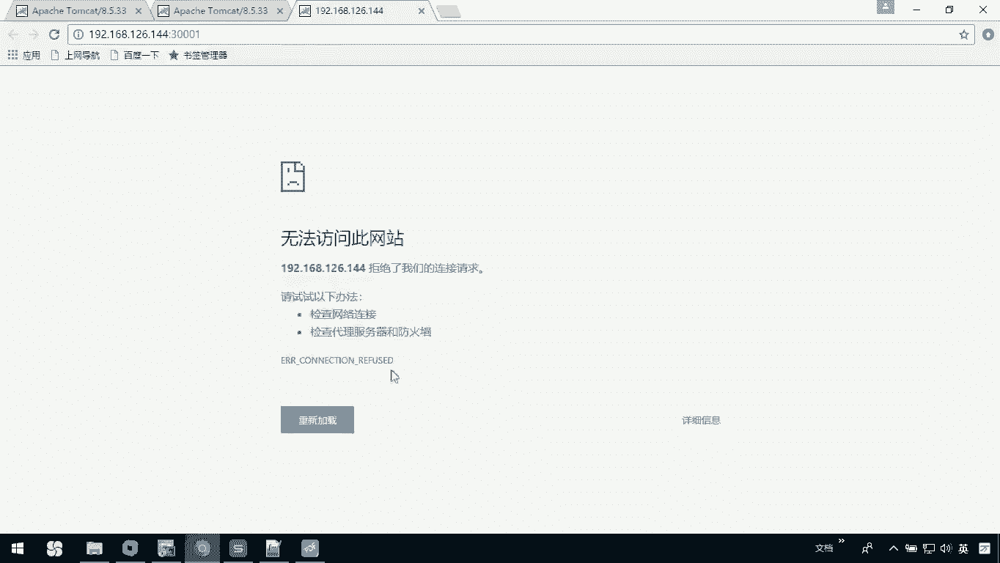

加载不上的话，那应该是我们嗯进入到我们的user下的location，K8S里面，我在这呢去把我们所有的这些服务呢，我都重新去创建一下嗯。

cooper Ctrl我replace一下我们当前的mi tok的RC，我让他去重新replace一下，然后呢，我cooper Ctrl，我们去delete一下我们当前的这个所有的服务啊。

Cooper c t l delete，Sorry，拉了一个，刚好这样的话呢，我再去通过他呀，create一下我们当前的my tom cat s vc这个文件，OK了，然后呢我们再试一下。

看看是否可以访问的。

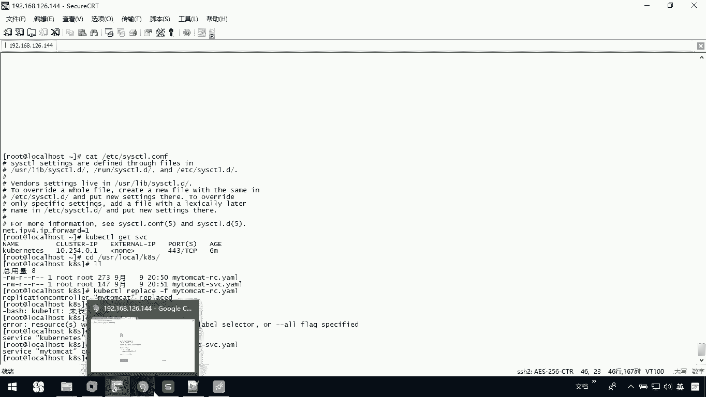

OK这样的话呢，我们就访问到我们当前这个容器了。

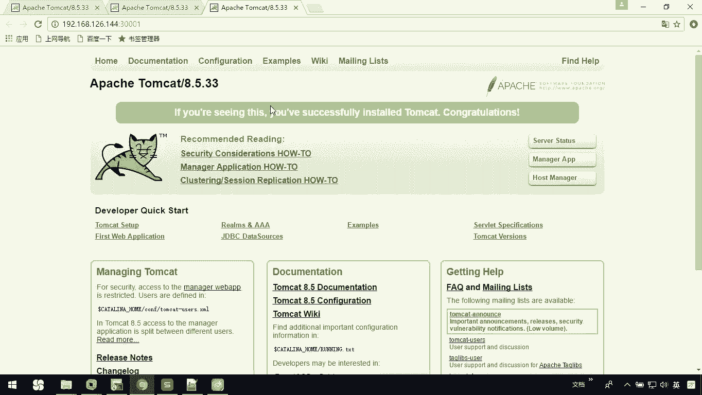

那这是给大家做了一个简单的例子。

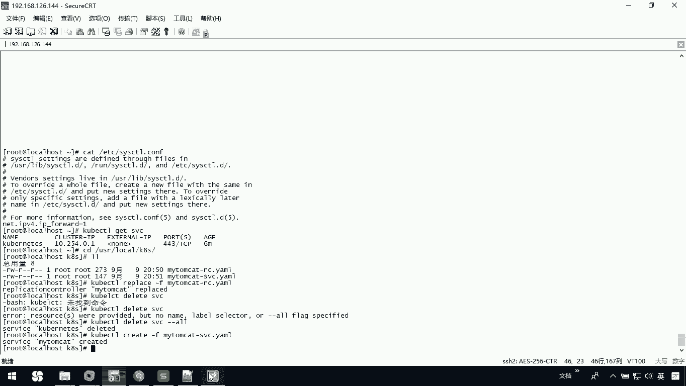

去展示了一下，我们通过FNICE啊去管理我们的容器，那在这里我要强调一点啊，我虽然是在一台机器上去操作，其实我这台机器既是master也是NO的，那这里边我们在快速入门的案例里面，所涉及到一些概念。

像我刚才说的master node呀，还有我们这个light呀，这些呢我们后续呢都会给大家介绍，我希望大家能通过这个快速入门案例啊，你参考我的讲义呢去把它完成以后呢，能大概理解说。

我们通过这个空plus，可以去快速的去把我们的这个整个呃，集群的应用啊去建立起来，并且呢我们可以去方便的进行去扩容。

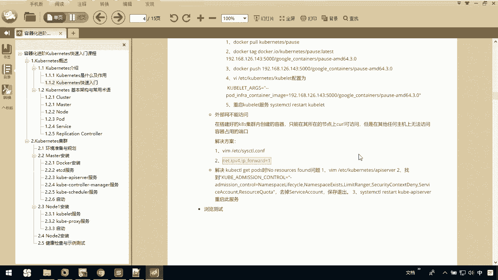

这个扩容操作其实也比较简单，就是我之前说的，你在这里边replace等于二。

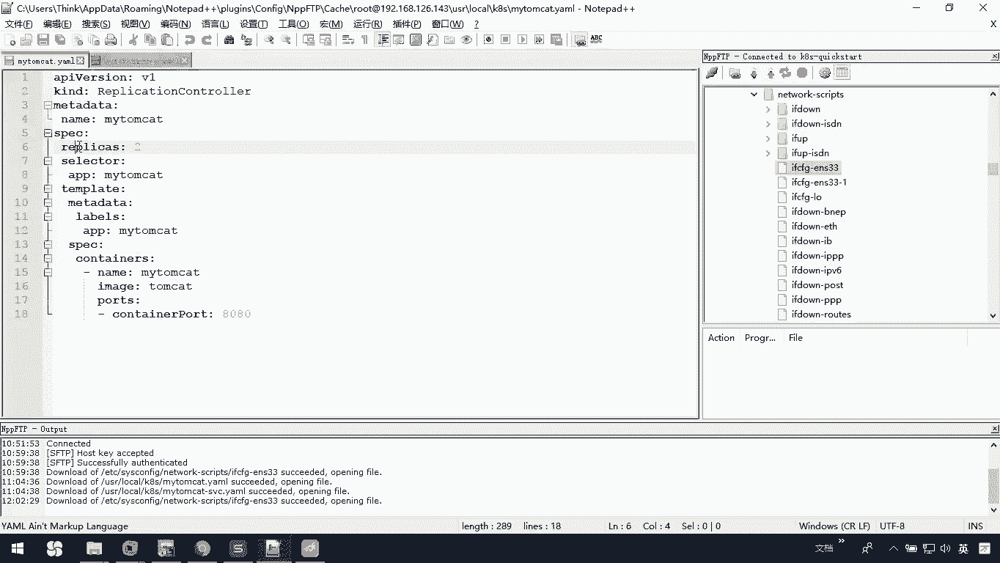

你其实就相当于去建立两个pod，那大家呢如果在做这个案例过程中，遇到的问题呢，可以参考我讲义上的这几个方案，这里面说了一下关于PO拉取失败的问题，还有说了一下外网不能访问。

还有我们前期的带你去get pose的时候，你会拿不到这个数据。

