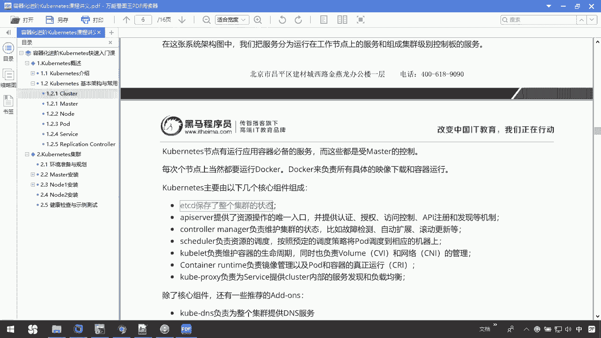
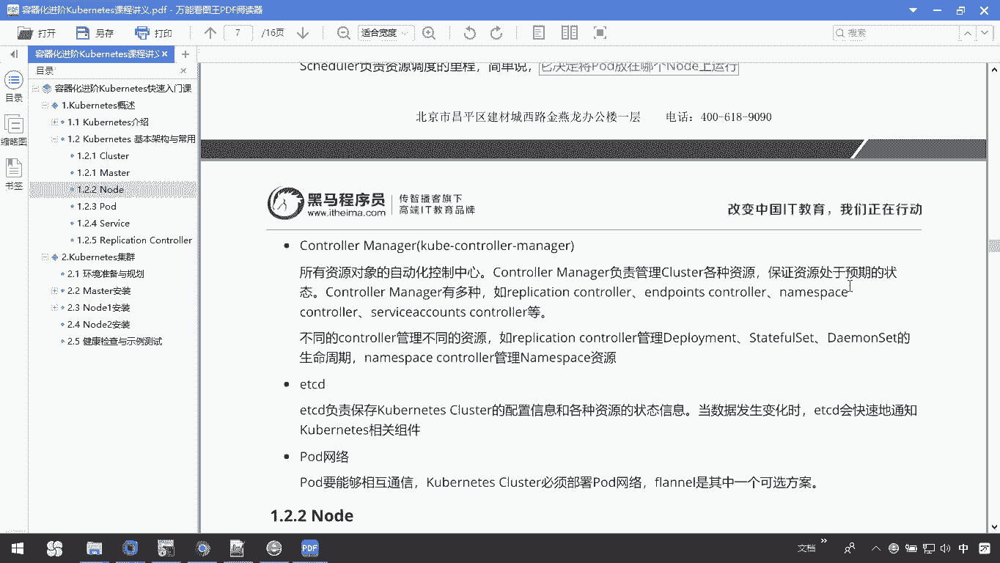
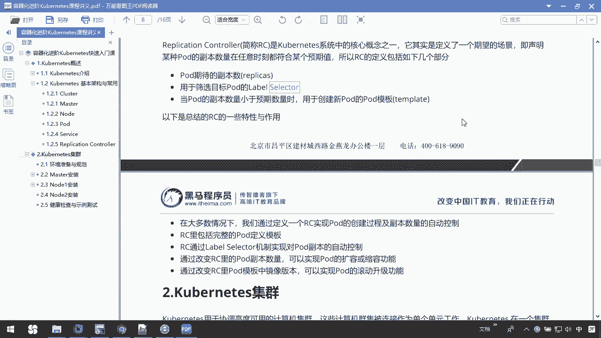

# 华为云PaaS微服务治理技术 - P51：4.Kubernetes基本架构与常用术语 - 开源之家 - BV1wm4y1M7m5

接下来呢我们介绍一下cos的基本架构，以及一些常用的术语，那cop lies集群呢包含有节点代理，COOPLIGHT和master，那它的一切都是基于这种分布式的存储系统。

下面这张图就是关于COOKI些基本架构，那大家刚才提到的看到的这个节点代理，就是指的我们当前这个cooper proxy，还有呢我们的COOPLIGHT。

那整个左边这部分呢其实是master，那在这张图里边呢，我们看到了，我们是把服务啊，分为什么运行在工作节点上的服务，和组成集群级别控制板的服务，也就是说大家看到的右边那部分。

就是我们的工作在节点上服务，有我们也管它叫做node节点。

而左边那部分呢其实就是整个的master，那我们COOLINE节点呢有运行应用容器必备的服务，这些呢都是受master控制的，那就是说我们的所有的note都是受master控制。

那每个节点上呢都要运行我们的docker，在我们的每个note上都有docker，docker呢是负责我们的具体的image的下载和运行，那COMPLICE主要由以下几个核心的组件组成。

首先第一个叫ETCD，它是保存整个集群的状态。

那在这里边我们看到的这一部分，就是我们的ETCD。

它是保存整个状态的，然后呢还有一个叫API server，它是提供资源操作的唯一入口认证啊，授权的访问控制，API注册和发现等机制。

那你看到的这一部分，其实就是我们的一个发现服务，然后还有一个是叫做control manager。

它是负责维护集群的状态，我们的比如故障检测呀。

自动扩展的滚动更新，那在这张图里边，我们当前的这一部分就是我们的control。

还有呢大家往下看schedule schedule的，一看这个名字，你就应该知道他是负责我们的资源调度的对吧。

那在这个图里边，我们这一部分就是我们的schedule container。

Container，RT呢是负责进线管理，以及pod和容器的真正运行，还有一个是cooper proxy，刚才我们已经看到了，他们是负责我们service提供cluster内部的服务。

发现和负载的，那除了这些核心组件呢。

还有一些推荐的组件，大家可以自己去看一看，那这些呢我们在后面的高级课程里面会讲解。

那整个com它涉及的理念呢和功能。

其实就是一个类似于LINUX的分层架构，它的核心层呢就是connect最核心的功能，对外提供API的构建，高层的应用，对内提供这种插件式的应用执行环境，然后呢应用层就是我们这种部署啊和路由。

还有管理层系统的这个质量啊，基础设施啊，容器和网络的质量，还有自动化呀。

自动的扩容啊等等，还有这种接口条，那么cooper cooper Ctrl的命令并命令行工具客户端SDK，那后续我们在做这个呃练习的时候。

我们就可以用到这个cooper s t l，那它的生态系统呢是在接口层次上的，庞大容器集群管理调度，生态系统可以分为以下两个范畴啊。

空内部的和cooper s web的，那刚才跟大家在这里边提到，说我们这个里面提到一个叫cluster对吧，那这cluster指的是什么呢。

cluster啊，其实是我们的计算存储和网络资源的一个集合，CHISE资源呢是利空，是利用这些资源的运营，各个基于容器的应用。

那整个codx class呢是由master和note组成，也就是说我们刚才看到的整个这张图里面。

它其实整个我们都叫做什么呢，Cluster，那么节点上运行的若干的CONDX服务O。

那刚才我们也提到说，我们整个空大学也是它这里边架构呢。

呃我们分成这个master和node对吧，那这个master他干什么的呢，master主要职责是调度，即决定将应用放在哪运行，master运行LINUX系统可以是物理机或者是虚拟机。

master是我们整个这个cos cluster的一个大脑运行的，我们DEO的服务包括了cooper a p s2，Our cooper schedule，Cooper controller。

然后我们的etc啊和pod网络，那刚才你在这张图里面其实也看到了。

我们这里边有server，有我们的manager，有我们的schedule。

还有我们的etc等等，那在这里大家看一下，刚才我们提到的说master里面包含这几部分，那这几部分分别具体功能像我们的API server。

那API server呢它是提供这种HTTP的Rest for的API，那既是我们的cookie的API，那是connect里所有资源，CROD就是增删改查等操作的唯一入口。

也是我们整个集群控制的一个入口，那schedule呢我们说过了，他是一个负责我们资源调度的，它决定了是将pod放在哪个node上运行，那这里面提到一个pod pod呢，后续我们会去把它去讲解一下。

hold呢，这里面其实大家看到了，它就是我们整个CNAS里面的最小的一个单元啊。

那control manager，它是所有资源对象的一个自动化控制中心，那control major呢负责管理我们class各种资源，也就是说它相当于一个大管家，那这些资源处于啊。

保证我们这些资源呢处于这种预期的状态。

我们不同的control啊管理不同的资源，比如我们这个replace controller，它是管理我们deployment，然后呢什么state full set呀。

DEMSC等等，那我们还有个etc d，那ETCD呢他是负责保存我copnect class，配置信息和各种资源状态信息，当数据发生变化时呢，EDCD呢，会快速的通知我们这个cos相关的组件。

还有个PO网络，他们是干什么的，保障我们这个部署的pod网络，然后保证我们相互之间的pod中的通信。

那这是整个master master其实就是一个核心的控制。

那node刚才我们说过，node其实是真正做事的，那除了master以外呢，cox集群中其他的这个机器都成为note节点，node职职责就是运行我们的容器，我们的容器呢就是跑到我们的具体的镜像。

node是由master管理的，node呢负责我们监控并汇报容器的状态，同时根据master的要求管理容器的生命周期，note也是运行在我们的LINUX系统上，那在node节点上运行的一些相关的组件。

那我们在这张图里面其实也看到了。

我们node里面有呃呃，Cover cooper light，还有proxy，那大家看一下COOLINE，还有proxy，cat呢是负责pd对应的容器的创建启动的。

那同时也是master节点密集器这个协作的实现，我们集群的管理，proxy呢它你看那个名字，你就知道它是一个代理对吧，它呢是保证我们connect server的通信以及负载等。

还有一个是docker引擎。

也就是刚才我们在这张图里边，其实你发现proxy我们的bat其实还有一个docker引擎。

这是我们node，那我们再来看看pd pd呀。

它的是我们cover net一个最小的单元。

在这张图里面大家发现了，我们这里面是不是都是一个个破对吧，那这是呃我们当前空这个呃技术里边。

它最核心或者说呃最最有特色的一点，那pose呢是cos最小单元，也是最重要和最基本的概念，每个pod包含一个或多个容器，pod里边你可以去有一个容器，docker或者是多个。

那pod容器呢会作为整体被master调到我们note运行，ROLEX为每个pod分配唯一的IP地址，称为pod IP，一个pod有多个容器共享的i pod IP地址，在GODX里面。

一个pod的容器与另外主机上，pod容器之间是能够直接通信的，这一点大家知道，pod和pd之间是可以直接通信的，它呢不局限于说我们是在不同的主机上。

所以在这张图里面大家看到了你这个pd pd，那这些pose呢它是可以互相通信的。

还有一个概念就是service service呢，刚才我们其实提提到了，它是外界访问我们地地主特定的pose唯一的方式，或者说指定那么一个服务，那service呢有自己的IP和端口。

它也有自己的IP和端口啊，跟code pod不一样，那service呢为pod提供了负载，它提供了简单的这些负载操作，它与CODX最核心的资源对象之一。

然后每个service其实就是我们经常提到的微服务，架构中的一个微服务，那大家知道一下，就是我们的cos啊，跟我们的微服务的其实是紧密相连的。

那最后一个叫做replace replication controller，那replication controller呢简称我们叫做RC，那cos系统中的核心概念之一，它其实是定义了一个期望的场景。

即声明某种破盾副本数量。

在任意时刻都符合某个预期，所以P的定义了如下的一些呃内容。

大家看一下to后期待的副本数，那我们之前呢再去定义我们当前的这个呃，replication的时候，其实看到有一个叫REPLIC，他写个二，这就是说我们可以去控制，我们当前的一个副本数。

然后呢用于筛选目标破的label selector。

那刚才你看到这里边我们的label selector，这里边可以去通过我们呃设置我们的标签。

然后还有呢pod机副本数量小于预期时，用于创建pod的一个pod模板，刚才我们指定这个副本数时。

当你把某一个pod干掉时，它会自动的去创建我们这个pose的模板。

那在大多数情况下，我们可以通过一个RC实现pd的创建过程，以及副本数量的自动控制。

那简单说就是只要我创建了这个一个RC，75就可以设置我们的镜像啊，以及我们的这个副本数量，以及它这个最小的这个数量呃。

还有呢RC里面包括完整的一个pod定义的模板，RC通过label select机制实现对Poke副本的自动控制。

也就是说整个这个RC啊，对于我们来说是比较重要的，它们定义了我们一个期望的，一个运行的一个场景，并且规范了我们整个pod的一个数量。

那这是对我们当前这个cos的一个，基本及架构的介绍，以及我们一些常用术语，其实我们这里边这个关于一些常用的术语啊，还有很多，那我们先了解到这，后续我们在高级课程里边呢。

