# 华为云PaaS微服务治理技术 - P52：5.Kubernetes集群搭建环境准备 - 开源之家 - BV1wm4y1M7m5

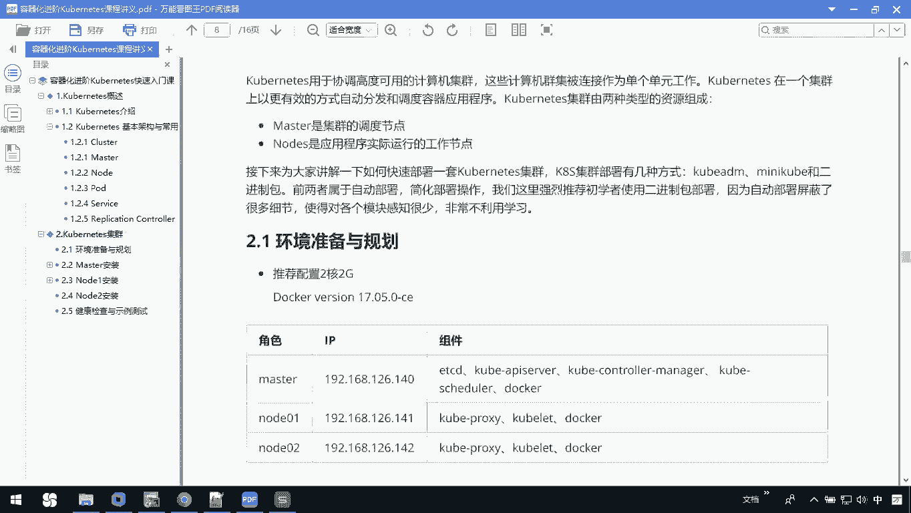

下面呢我们要去搭建一下我们的CORNEX集群，前期我们的快速入门啊，其实也是一个单机版的集群，只不过呢我们的master和node呀还是在同一台机器上，我没有分的特别清晰，那现在呢我们要做的事情是。

让我们的master和node是分别处在不同的虚拟机上，大家来看一下TNICE啊，用于协调高度可用的计算机集群，那这些计算机集群呢，被连接成为单个的单元工作，以更有效的方式。

自动分发和调度容容器的应用程序，那CORNEX集群呢有两种资源，前期我们已经介绍过了，一种是master，一种是node，那master呢是一个集群的调度控制节点。

那node呢它是应用程序实际上真正运行的节点，比如说note才是真正干活的，那我们接下来呢就讲解一下，如何快速的部署一套FLIX集群。

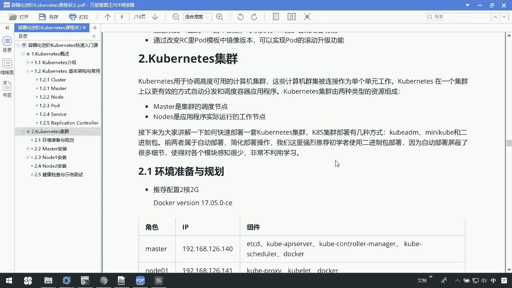

那connect呢我们之前也说过，它简称叫K8S，那K8S集群的部署有几种方式啊，我们可以通过这个CODM啊，啊mini cooper啊，或者是二进制包，那么前两者属于这种自动的部署。

然后呢简化部署操作，我们这里面呢其实建议大家使用这种二进制包，因为这种部署呢可以让大家了解更多的细节，那你对我们每个模块啊可以知道的更多。

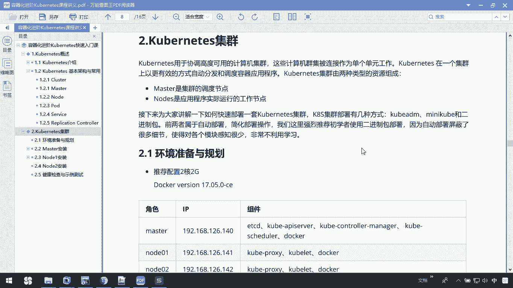

那大家来看一下，在我们整个针对于这个空战集群部署时，让我们推荐的这个配置是两个2G的电脑，那我们我们如果没有这个宠物理机，虚拟机也可以，那我们这个docker呢是用的是17。05。

这个版本我们整个呢会分成master node，那master呢我们只有一个node呢，我们是有两个节点，也就是说我们有一个master，两个node，那这是我们master IP。

这是我node IP，然后master上面有组件呢，大家看到了ETCD啊，server啊，然后我的quick control，还有我们的schedule docker。

那在我的note上面有我们的proxy cl，那docker是必备的，那在你做整个这个操作之前，你需要把你无论是master还note上，你的防火墙都进行关闭，那我们可以去查看防火墙的状态。

关闭我们的防火墙，然后呢禁止我这个防火墙开机启动，那整个这些都做完以后呢，你首先呢要下载下来我们相关的二进制包。

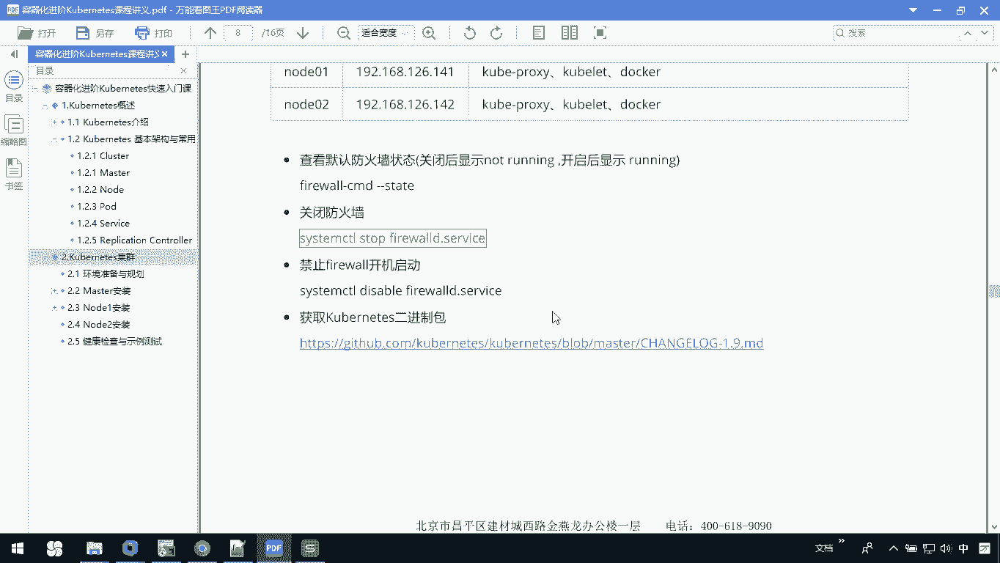

那这个网址呢我们可以打开看一看。

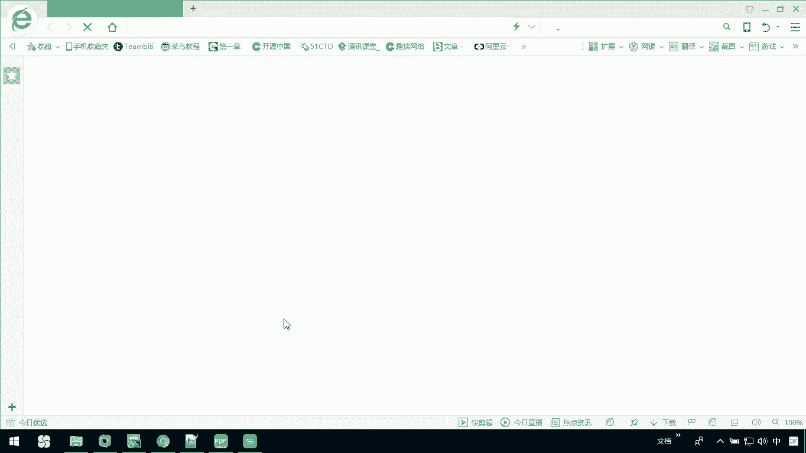

你下载包的时候你注意了，我们只需要下载这个就可以。

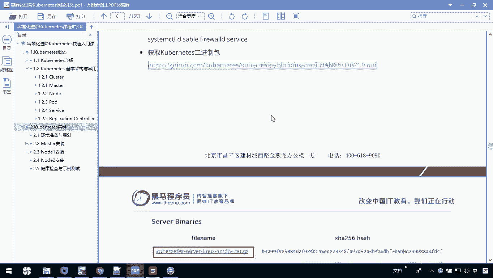

就是cookise server linux，AMD64位就可以，因为这个包里面呢，它包含了我们整个这个K8S需要运行的，全部的服务程序。

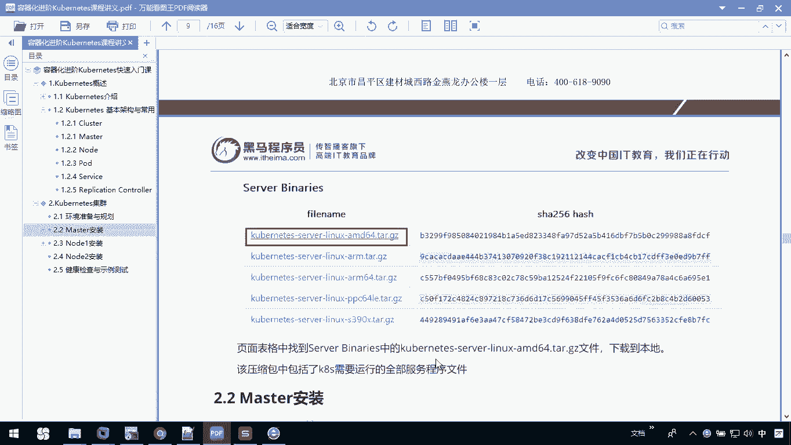

你可以打开稍微有点慢啊，因为我们这是一个外网。

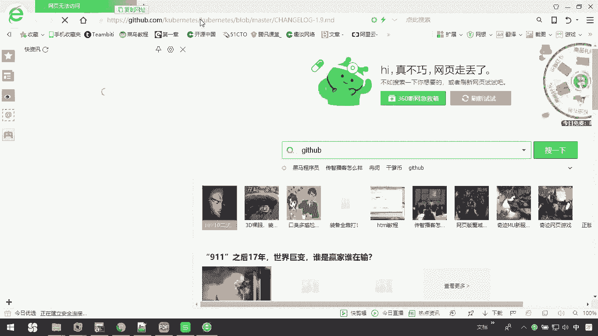

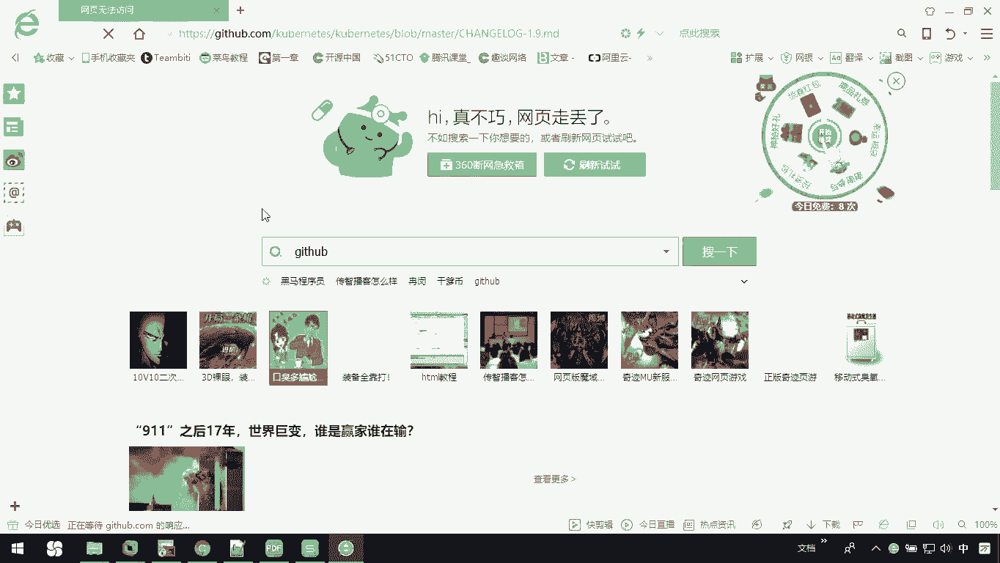

好了，我们已经打开了，然后呢你在下载的时候，例如说假如1。9。0，你可以把它打开。

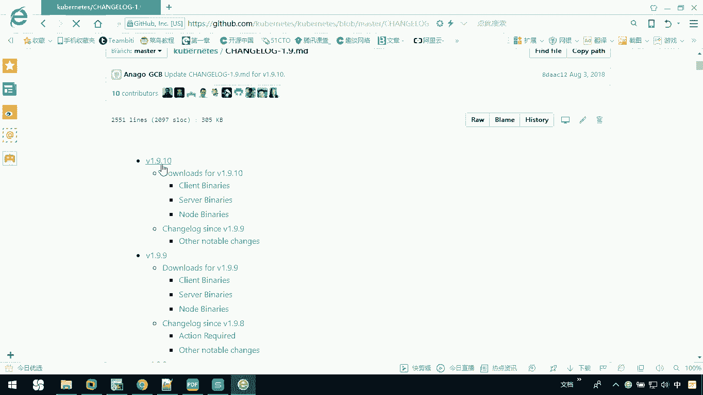

现在我已经把它打开了。

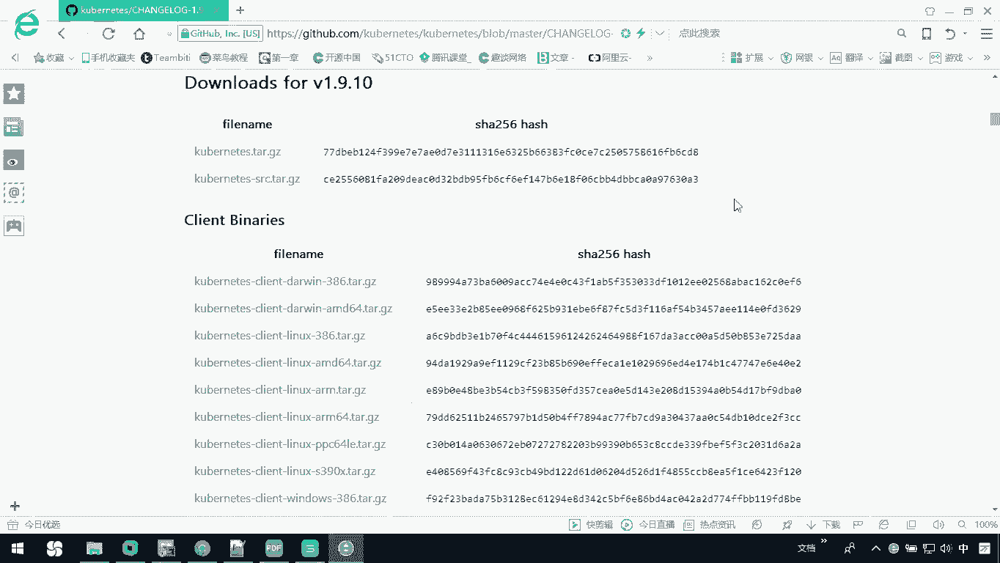

然后呢你要找的是哪一个呢，是我们的server binaries，也就是说我们可以把它下载下来。

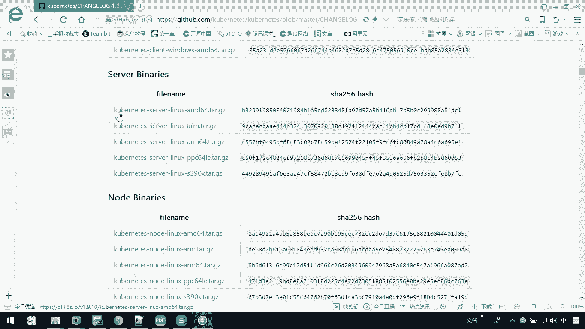

那这里边呢我就为大家演示，其实我已经把它下载下来了。

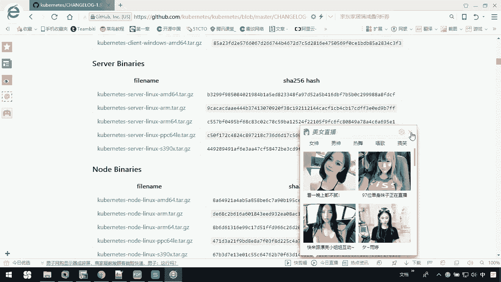

OK那这样的话呢，我们前期的准备工作都准备好以后。

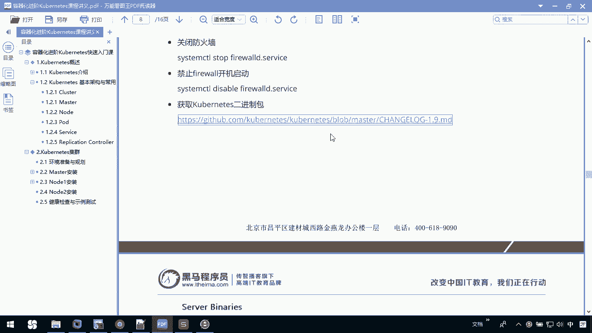

接下来我们就可以去搭建我的master。

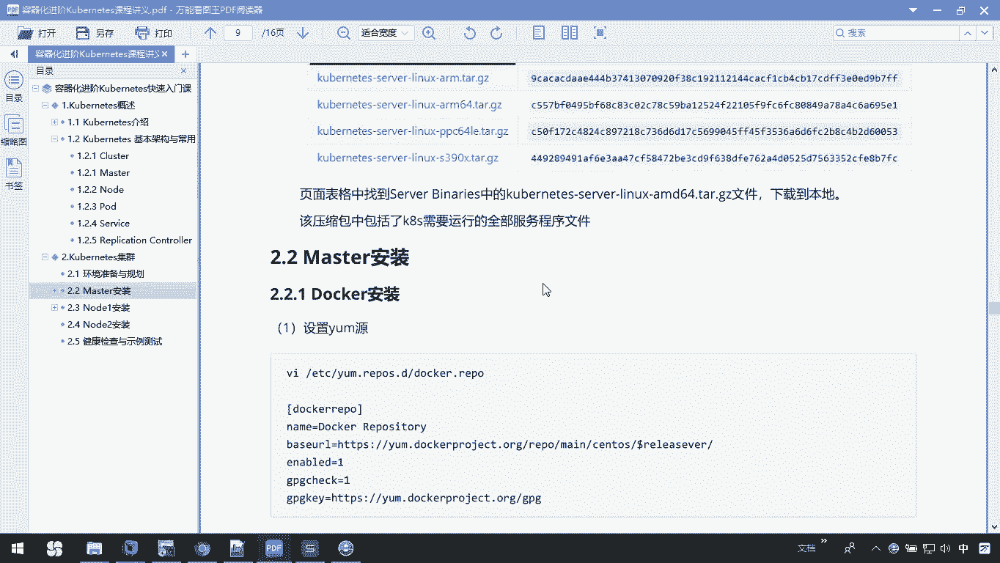