# 华为云PaaS微服务治理技术：P52：5.Kubernetes集群搭建环境准备 🛠️

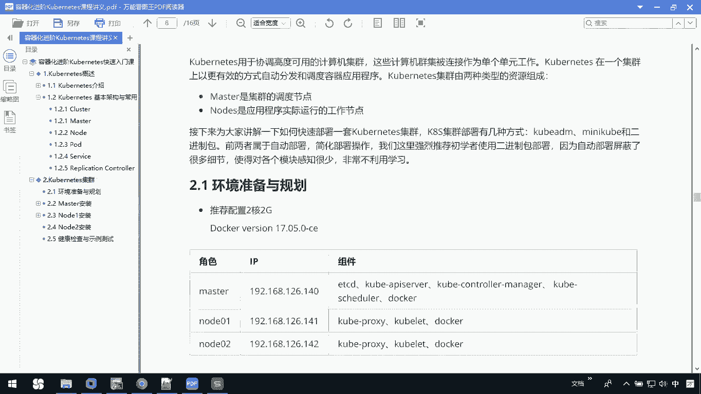

在本节课中，我们将学习如何为搭建一个多节点的Kubernetes集群做准备。我们将了解集群的基本架构、部署方式的选择，并完成搭建前的所有环境准备工作。

## 集群架构概述

Kubernetes（简称K8S）用于协调高度可用的计算机集群，这些计算机被连接成为单个单元工作，以更有效的方式自动分发和调度容器应用程序。

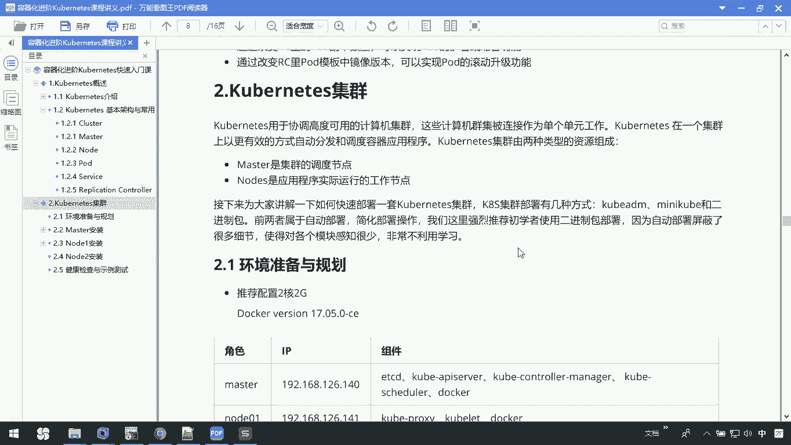

Kubernetes集群包含两种核心资源：**Master** 和 **Node**。
*   **Master** 是集群的调度控制节点。
*   **Node** 是应用程序实际运行的节点，是真正“干活”的节点。

上一节我们介绍了Kubernetes的基本概念，本节中我们来看看如何搭建一个Master和Node分离的多节点集群。

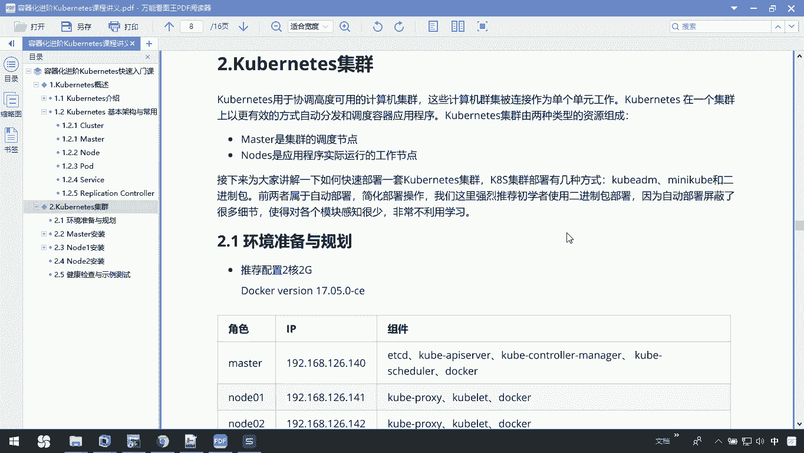

## 部署方式选择

Kubernetes集群的部署有几种方式，例如 `kubeadm`、`minikube` 或二进制包。前两者属于自动部署，可以简化操作。本教程建议使用**二进制包**进行部署，因为这种方式能让大家了解更多的实现细节，对每个模块有更深入的认识。

## 环境准备与规划

在开始部署Kubernetes集群之前，我们需要准备好相应的环境。以下是推荐的配置和需要完成的准备工作。

### 硬件与节点规划

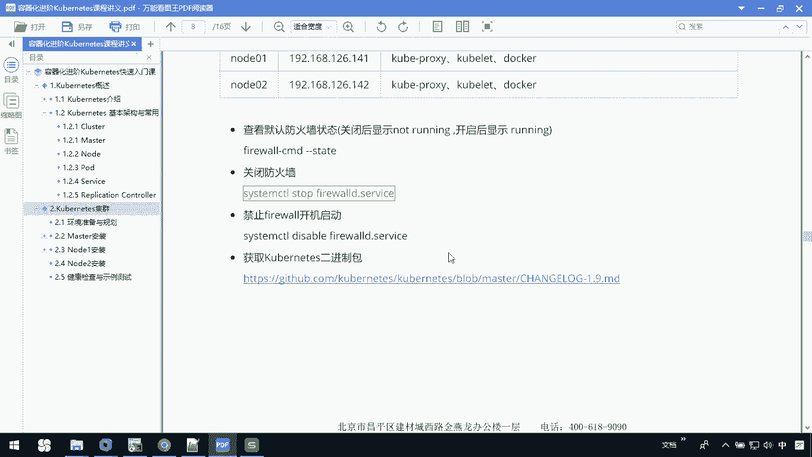

我们计划搭建一个包含1个Master节点和2个Node节点的集群。
*   **机器配置**：建议使用两台2G内存的电脑。如果没有物理机，使用虚拟机也可以。
*   **软件版本**：Docker使用 **17.05** 版本。
*   **节点规划**：
    *   Master节点 IP: `192.168.66.10`
    *   Node-1 节点 IP: `192.168.66.11`
    *   Node-2 节点 IP: `192.168.66.12`

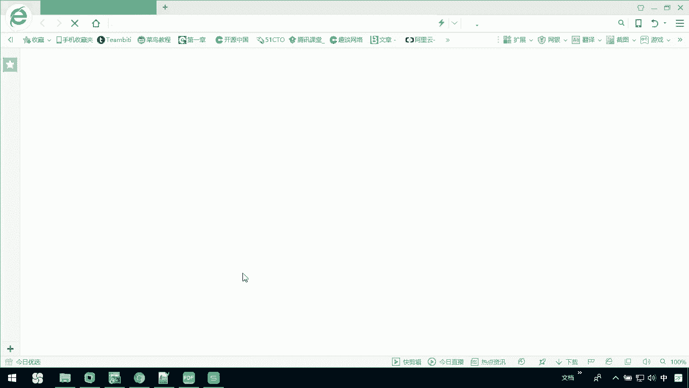

### 组件分布

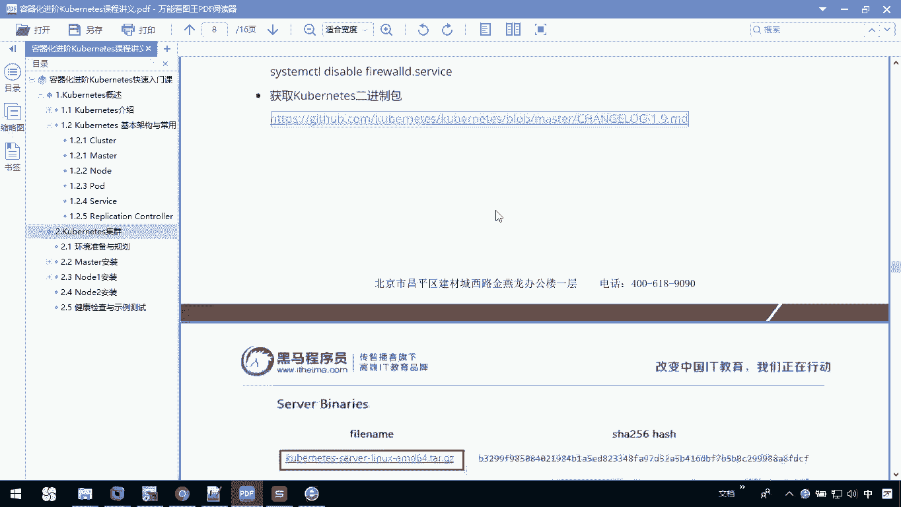

以下是各个节点上需要安装的核心组件：
*   **Master节点**：`etcd`, `kube-apiserver`, `kube-controller-manager`, `kube-scheduler`, `docker`。
*   **Node节点**：`kubelet`, `kube-proxy`, `docker`。

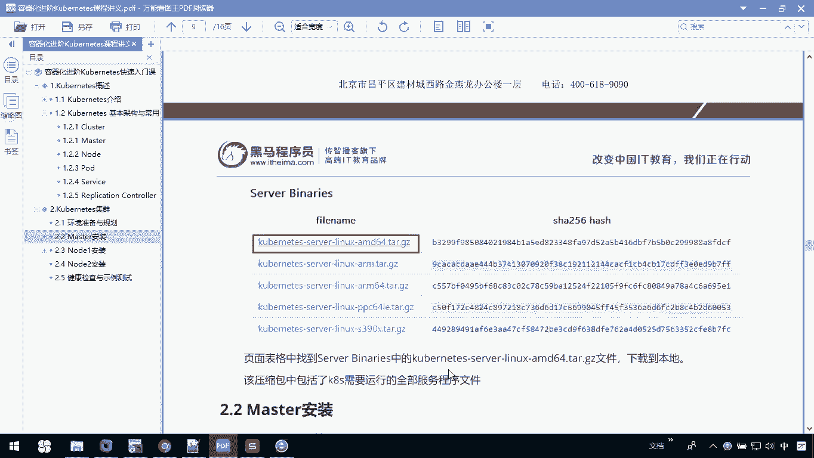

### 前置操作步骤

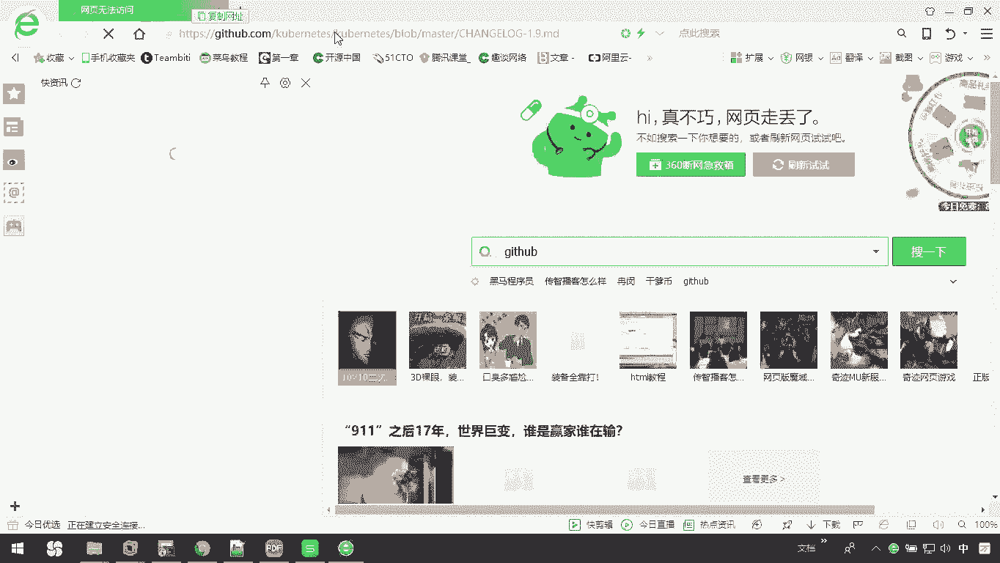

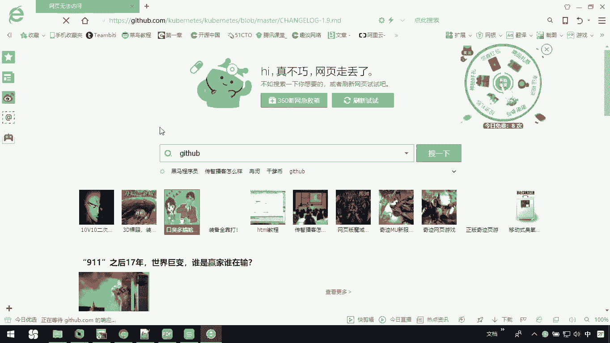

在进行具体安装之前，需要在所有节点（Master和Node）上完成以下通用操作。

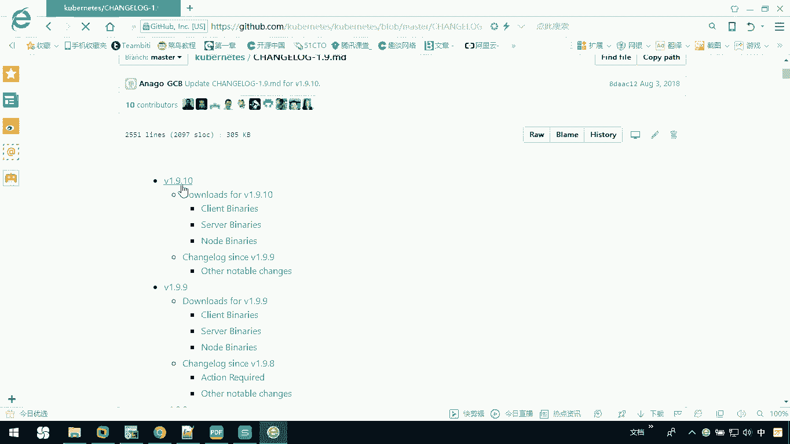

**1. 关闭防火墙**
为了保证集群组件间的正常通信，需要关闭系统的防火墙。
```bash
# 查看防火墙状态
systemctl status firewalld
# 停止防火墙
systemctl stop firewalld
# 禁止防火墙开机自启
systemctl disable firewalld
```

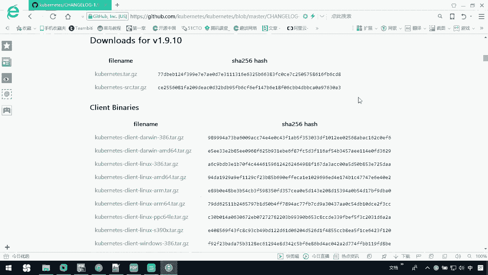

**2. 下载Kubernetes二进制包**
我们需要下载包含K8S所有服务程序的二进制包。
*   访问Kubernetes的GitHub发布页面：`https://github.com/kubernetes/kubernetes/releases`
*   找到目标版本（例如 `1.9.0`），下载 `Server Binaries` 中的 `kubernetes-server-linux-amd64.tar.gz` 文件。
*   这个压缩包内包含了部署集群所需的全部服务程序。

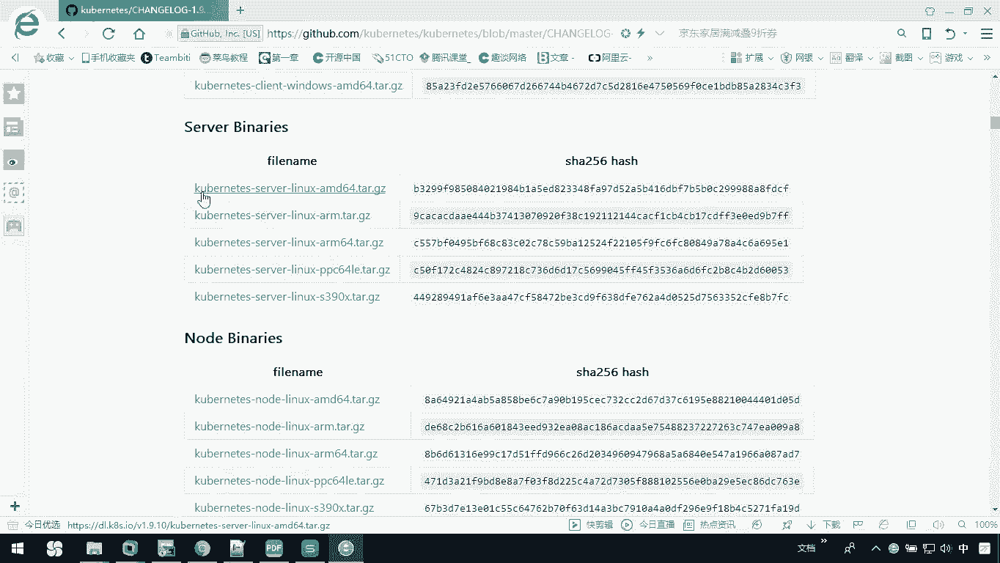

准备工作完成后，接下来我们就可以开始搭建Master节点了。

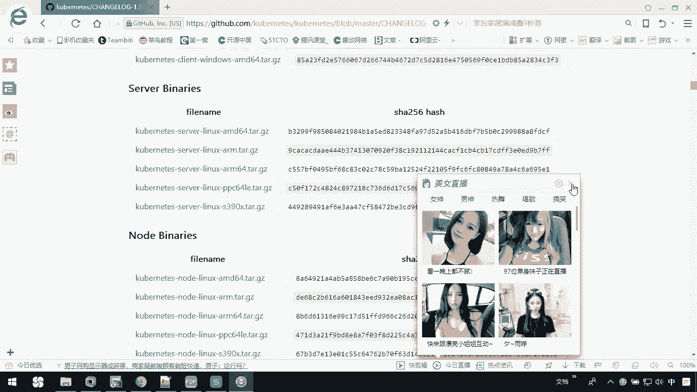

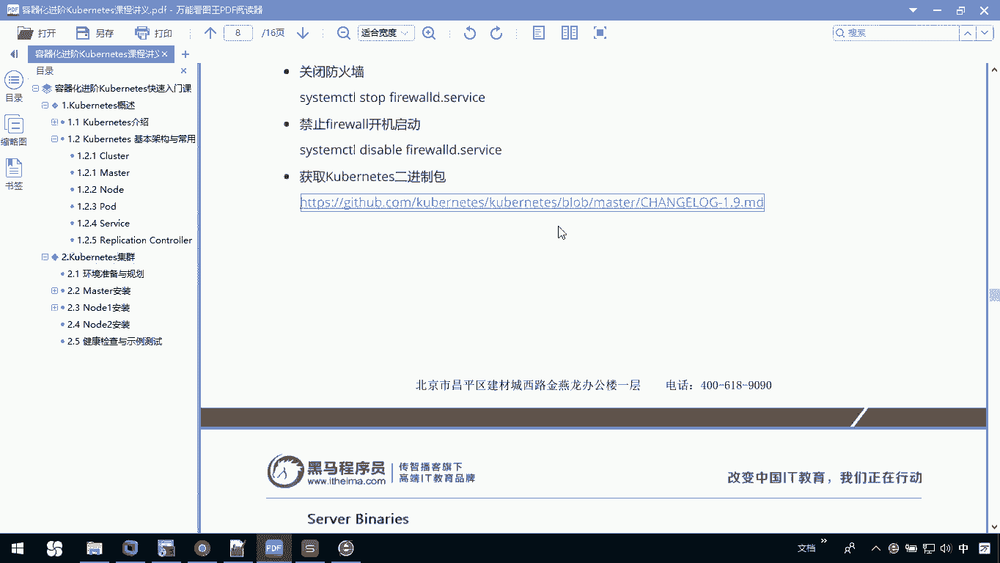

## 总结

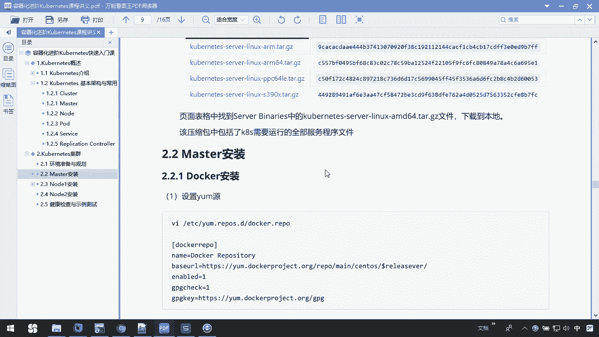

本节课中我们一起学习了搭建Kubernetes多节点集群的前期准备工作。我们明确了Master和Node的角色分工，选择了通过二进制包进行部署以深入了解细节，并完成了包括环境规划、防火墙配置以及安装包下载在内的所有预备步骤。下一节，我们将开始Master节点的具体安装与配置。