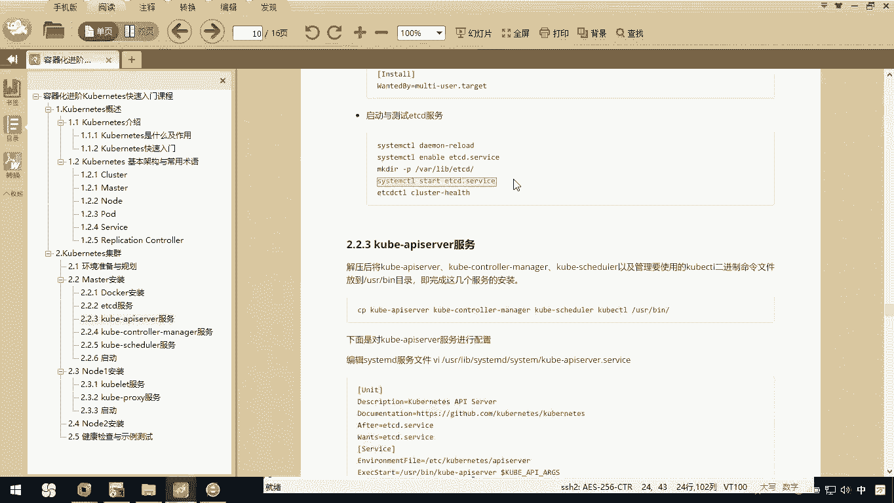

# 华为云PaaS微服务治理技术 - P54：7.Kubernetes集群搭建Master安装-etcd服务 - 开源之家 - BV1wm4y1M7m5

下面呢我们去安装一下ETCD这个服务。那么ETCD啊，它作为我们集群的一个主要服务啊。那在安装各个服务之前呢，你要先把ETCD的服务安装并启动。那我们可以到这个网址啊去把它下载下来。那下载下来以后呢。

你可以把它上传到你的linux服务器。那我下载的是当前这个linuxMD的这这个版本。那我在这边不下载了，我的电脑已经下载完了。那你如果已经下载完了，你可以通过我们这个LGS啊去安装。

如果你的电脑没有呢，你直接执行这个代码去可以安装啊，我的电脑已经安装上了。所以呢我在这里直接呢把它上传上来。在这呢我在我的userlo下去创建一个目录就叫做K8。我进入这个K8S目录下，大家注意一下。

我这个目录是us下的。那我现在呢通过RG命令。

去把它上传一下，我呢到我的桌面上，我桌面上有个K8S。这里边我们有一个资料，就是这个文件把它上传下来。确定。好了，那上传上来以后呢，我把它解压一下。

OK那现在呢我就进入这个ETCD这个目录下面，大家可以看这些文件。那文件上这个讲义上告诉你说呀，你呢要把我们当前这个目录下的ETCD和ETCDTL就这个文件和这个文件copy到user目录下。

所以你要去copy谁呢？我的ETCD还有ETCDTL这两个文件到哪呢？到我的user的B目录下OK吧。然后呢你还需要去编辑一个stem d的服务。所以我们这里边需要VI一下。

我们一个user下的B下的叫做s sYSTM。

然后呢，我们下面有一个system。看一下我顺不哪写错了VIuser BI啊，sorry好了，变安全RIB下的，然后我们的sstem D。然后我们的sstem在这下面呢，我们新创建一个文件。

就叫ETCD的SERVICEOK在这个文件里边，我们要copy一下这段话。回来粘贴进去，把它保存CJJ。

好了，那这样呢我们就可以去执行了。但是大家注意一下啊，这里边有个叫VARLIBETCD这么一个叫做working directory，我们是没有的。所以下面告诉了。

你要去手动的make一下make DIR我们当前的。VR下的LIB下，我们要有1个ETCD这么一个目录，他告我已经存在，那就说明我的电脑是有的，你们的应该是没有的那这个有了以后呢。

我们就可以去执行这些命令了。我重新reload一下就C。然后呢，我们先进一下。然后我们去把它启动。

这个时候你可以去看一下我们当前这个服务的状态。

你看我们当前这个服务是activerunning，正在运行中OK了。你可以看看我们当前的健康状态。

OK我们当前是一个健康的状态。所以这样呢我们就把我们当前的ETCD服务安装完成。

