# 华为云PaaS微服务治理技术：P54：7.Kubernetes集群搭建Master安装-etcd服务 🛠️

在本节课程中，我们将学习如何在Kubernetes集群的Master节点上安装和配置etcd服务。etcd是一个高可用的键值存储系统，是Kubernetes集群的核心组件，用于存储所有集群数据。

## 概述

etcd是Kubernetes集群状态存储的关键服务。在安装其他Kubernetes组件之前，必须先成功安装并启动etcd服务。本节将指导您完成从下载、上传、配置到启动etcd的完整过程。

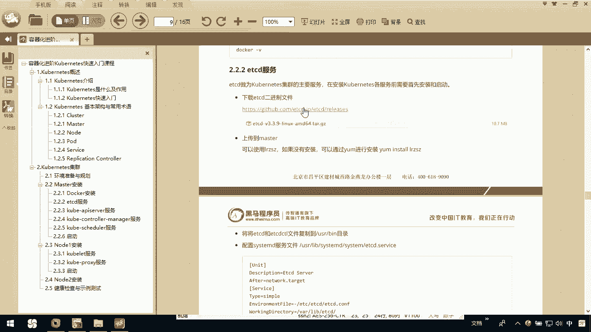

## 下载与上传etcd

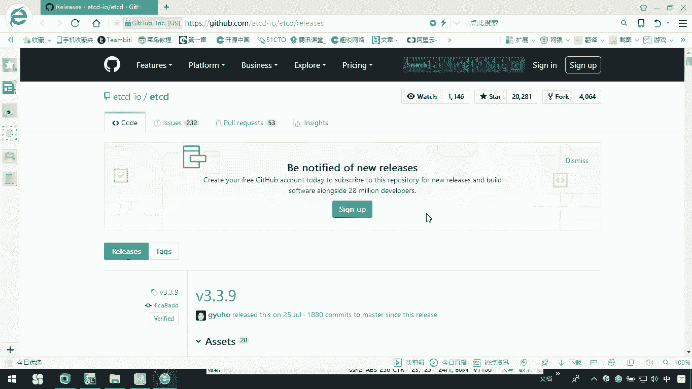

首先，您需要从etcd的官方网站下载适用于您Linux系统的二进制文件。下载完成后，需要将文件上传到您的Linux服务器。

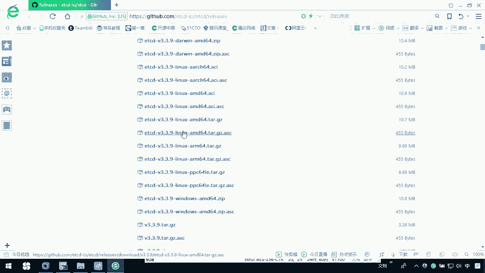

以下是操作步骤：

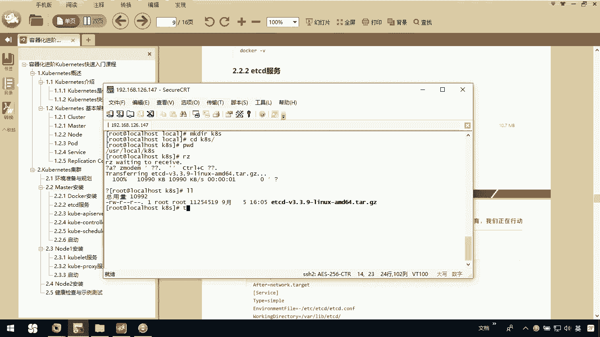

1.  在服务器上创建一个用于存放Kubernetes相关文件的目录。
    ```bash
    mkdir -p /usr/local/k8s
    cd /usr/local/k8s
    ```
2.  使用文件传输工具（如`rz`命令或SCP）将下载好的etcd压缩包上传到该目录。
3.  解压上传的etcd文件包。
    ```bash
    tar -xzf etcd-v3.5.0-linux-amd64.tar.gz
    ```

## 安装与配置etcd

解压完成后，需要将etcd的可执行文件复制到系统目录，并为其创建systemd服务配置文件。

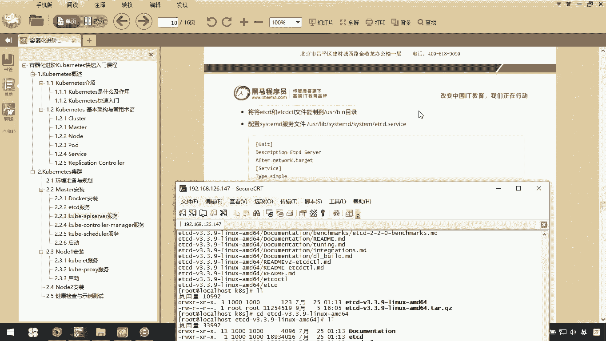

以下是具体步骤：

1.  进入解压后的目录，复制`etcd`和`etcdctl`文件到`/usr/bin/`目录。
    ```bash
    cd etcd-v3.5.0-linux-amd64
    cp etcd etcdctl /usr/bin/
    ```
2.  创建etcd的systemd服务配置文件。
    ```bash
    vi /usr/lib/systemd/system/etcd.service
    ```
3.  在打开的文件中，粘贴以下配置内容：
    ```ini
    [Unit]
    Description=Etcd Server
    After=network.target
    After=network-online.target
    Wants=network-online.target

    [Service]
    Type=notify
    WorkingDirectory=/var/lib/etcd/
    ExecStart=/usr/bin/etcd \
      --name=default \
      --data-dir=/var/lib/etcd/default.etcd \
      --listen-client-urls=http://0.0.0.0:2379 \
      --advertise-client-urls=http://0.0.0.0:2379
    Restart=on-failure
    LimitNOFILE=65536

    [Install]
    WantedBy=multi-user.target
    ```
    编辑完成后，保存并退出编辑器。

## 创建数据目录并启动服务

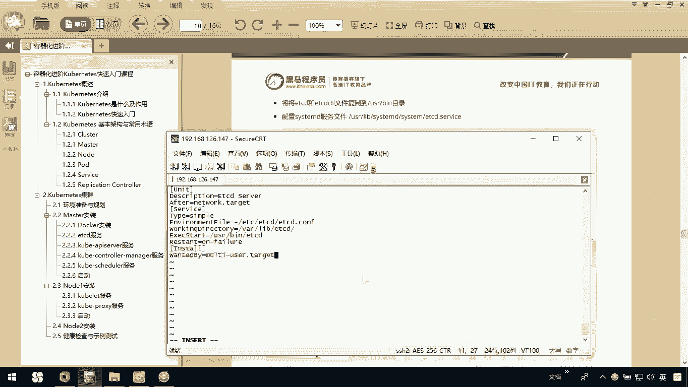

在启动服务之前，需要确保配置文件中指定的工作目录存在。

以下是操作步骤：

1.  创建etcd的数据存储目录。
    ```bash
    mkdir -p /var/lib/etcd
    ```
2.  重新加载systemd配置，使新的服务文件生效。
    ```bash
    systemctl daemon-reload
    ```
3.  设置etcd服务开机自启，并立即启动服务。
    ```bash
    systemctl enable etcd
    systemctl start etcd
    ```

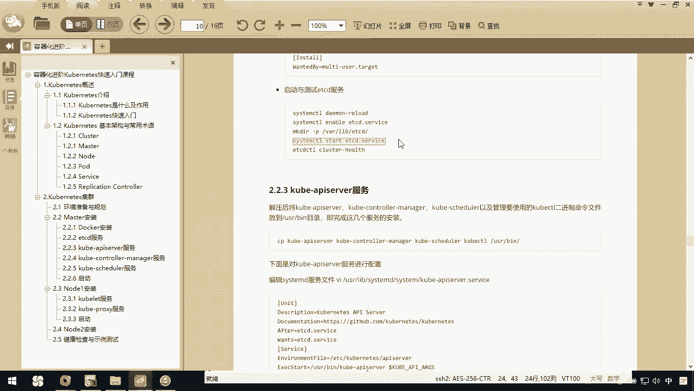

## 验证服务状态

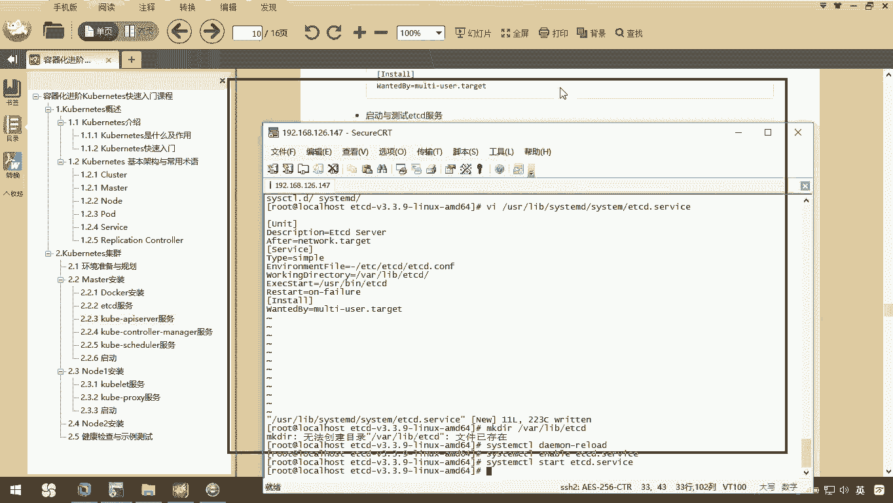

服务启动后，需要验证其是否正常运行以及健康状态。

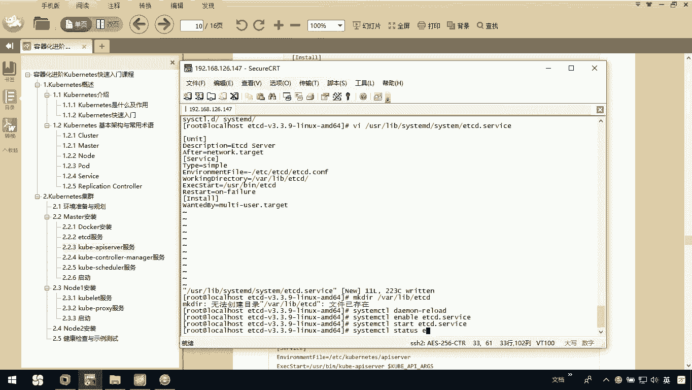

以下是验证步骤：

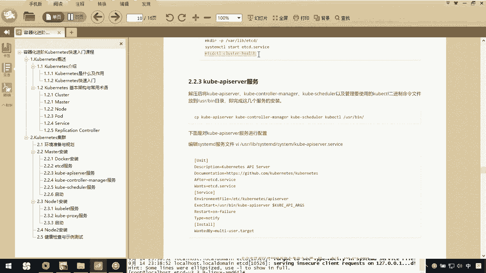

1.  检查etcd服务的运行状态。
    ```bash
    systemctl status etcd
    ```
    如果看到状态显示为`active (running)`，则表示服务已成功启动。
2.  使用`etcdctl`命令检查集群的健康状态。
    ```bash
    etcdctl endpoint health
    ```
    返回结果为`healthy`，则表明etcd服务运行健康。

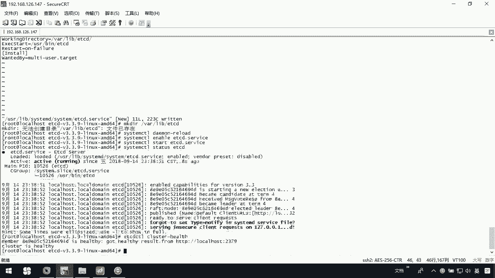

## 总结

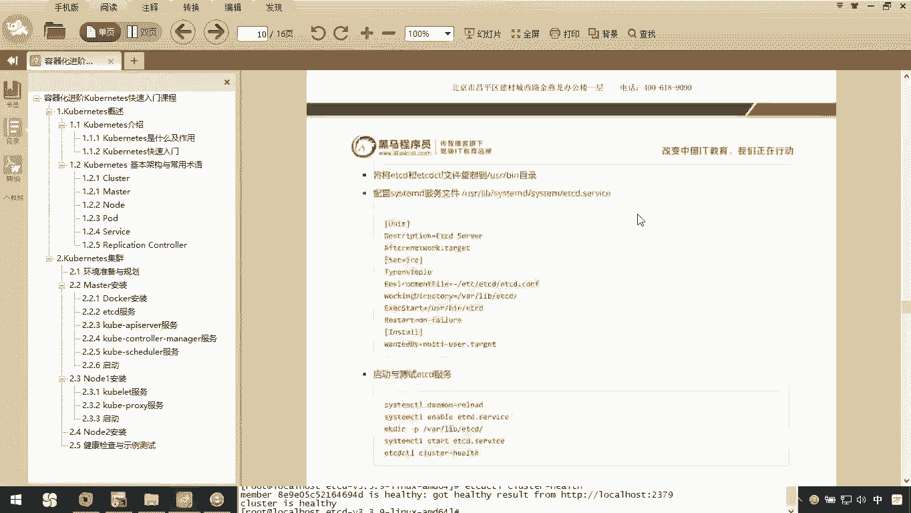

本节课中，我们一起学习了在Kubernetes Master节点上安装etcd服务的完整流程。我们首先下载并上传了etcd二进制文件，然后将其安装到系统路径并配置了systemd服务。最后，我们创建了必要的数据目录，启动了etcd服务，并通过命令验证了其运行状态和健康状况。至此，etcd服务已准备就绪，为后续安装其他Kubernetes组件奠定了基础。