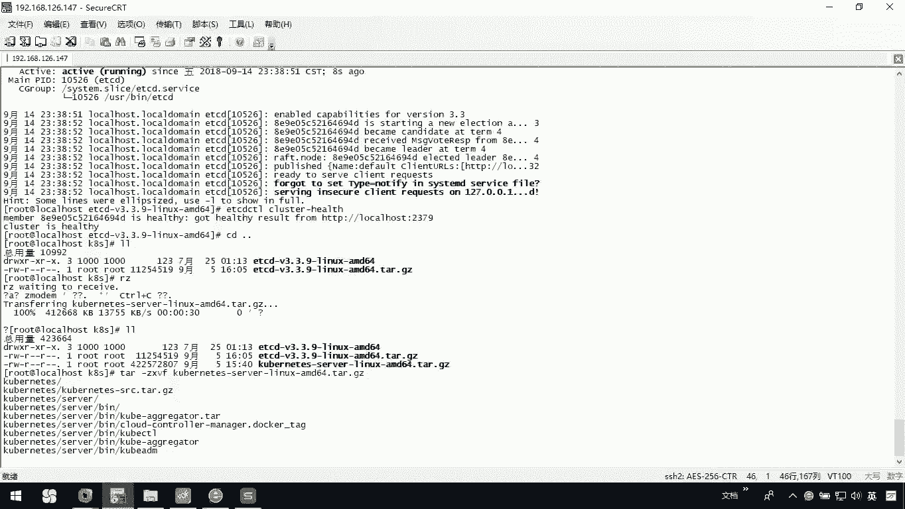
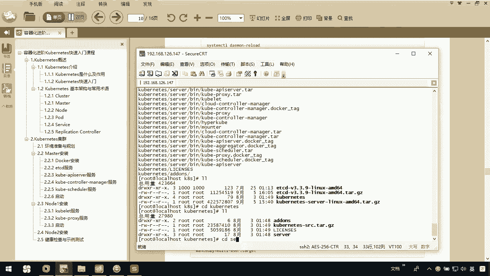

# 华为云PaaS微服务治理技术 - P55：8.Kubernetes集群搭建Master安装-kube-apiserver服务 - 开源之家 - BV1wm4y1M7m5

下面呢我们去把我们的相关的服务安装上。首先第一个呢我们去安装一下 nice API server。那我们需要把我们这个安装这个文件呢去呃导导入到我们当前的这个目录下呃，我们退一下CD我们KB里边呢。

我们要RG去把我们当前的这个。

K8S的相关的文件呢导进来，我们这里面应该有个K8S这儿。我们的资料里边这个。我们要把g serverlin这个文件呢导进来。那之前呢我们已经介绍过了，你可以在网上呢把它下载下来。那这样的话呢。

我一会儿把它再解压开，我们就可以去来进行我们当前croronize的APIserv服务的安装。那我们来看一下啊，它这里边还没有完成。

有点慢，这个文件呢稍微有点大。OK了，我这个已经上传完了，然后呢，我们可以看一下，那我们把它解压开JSVF我们的。

我们等它解压完，我们去进入它的这个目录下面去看一看。那在我们这个API server安装啊，其实跟刚才的步骤是一样的那我们呢需要把我们指定的这三个文件呢copy一下，也是copy到user的闭目下。

那你呢可以去执行这条命令。在我们当前这下面在嵌创建一个coer杠Iserv这么一个服务，那再去做它的一个配置文件就可以了。

那我们看一下啊，这面完成呗。

解压完了以后呢，我们LL一下。现在呢我已经解压开了。那我进入这个conize这个目录下面，大家看进入这个server这个目录啊，在这个下面呢还有个B目录。在这下面我们可以找到我们想要的文件。

这里边说我们首先要做的事情是。

将这么几个文件呢copy过去，稍等。一个是coer杠I server。那我们这里边应该可以找到coer杠 a server。还有一个是coer杠 controllertroller manager。

就是它还有一个是coer schedule，那我们就可以把它copy一下。刚才说的coer杠I server。然后还有一个是coer杠 controller manager。

还有一个是coer杠 scheduleO你把这几个文件呢都copy到user下的B目录下。

把他们都 copypy过去。copy过去以后呢，其实我们就相当于已经把服务安装完了。接下来呢你在这个下面去编辑我们当前的这么一个文件，也就是它的service文件。

我们需要VI一下user下的lab下的我们的ssem下的sstem再去创建一个文件coer杠APISERVER点SERVSE这个文件是不存在的，我们去把它手动编辑一下。在这里呢你把这段配置粘贴过来。

OKshiftftJJ这样的话就OK了。然后呢，你再去创建一下它的配置文件，把这个相关的配置信息标注一下。那我们需要呢去先创建一个。

makeDIR目录ETC下我们的ET。sorry啊，应该是ETC下的KUBERNETESKUBRNETS我们创建这个目录。然后呢，我们在这个目录下呀去创建它的一个配置文件叫APISERVER这个文件。

注意这个文件里边呢，我们要写些命令。你粘贴的时候也要注意了。这个命令啊是这样的。

首先呢我们来看一下啊，这里呢我们指定ETCD的服务的IP，然后呢，指定了一下我们谁可以去访问，也就说0。000都可以这个。注意一下。然后呢，我们又指定了对外开放的端口，然后指定了我们这个整个集群的一些。

整个集群的哎，稍等，整个集群的这个网关。我们把这都给他往上缩进一下。OK。这个里边是我们把这个格式啊稍微调整一下，要不然呢我们后续会有问题的。好了，这样的话呢，我们这个配置文件就可以了。对不对？

这那你把这些都做完以后呢，我们其实对于我这个coer APIserv就已经安装完成了。

