# 华为云PaaS微服务治理技术：P55：8.Kubernetes集群搭建Master安装-kube-apiserver服务 🚀

在本节课中，我们将要学习如何在Kubernetes集群的Master节点上安装和配置`kube-apiserver`服务。`kube-apiserver`是Kubernetes集群的核心组件，负责提供集群的API接口，是所有资源操作的入口。

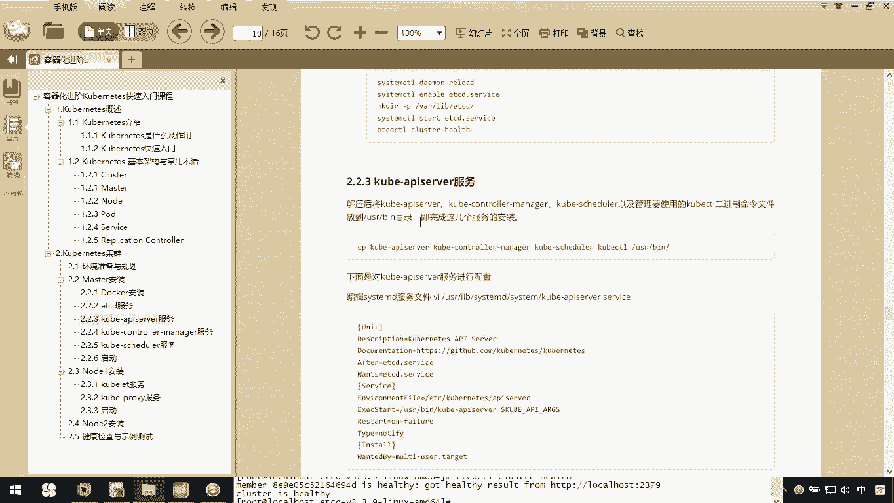

## 概述

上一节我们介绍了Kubernetes集群的基础环境准备，本节中我们来看看如何安装第一个核心服务——`kube-apiserver`。我们将从获取安装文件开始，逐步完成文件的复制、服务配置文件的创建以及启动前的准备工作。

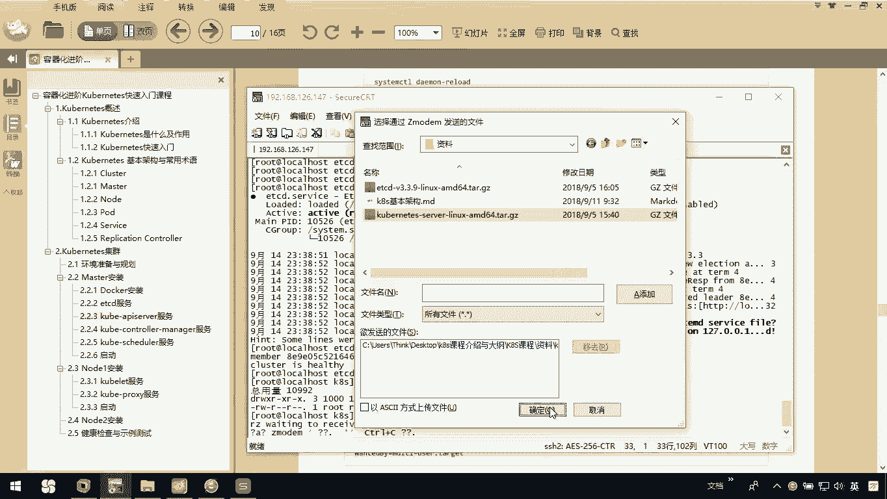

## 获取安装文件

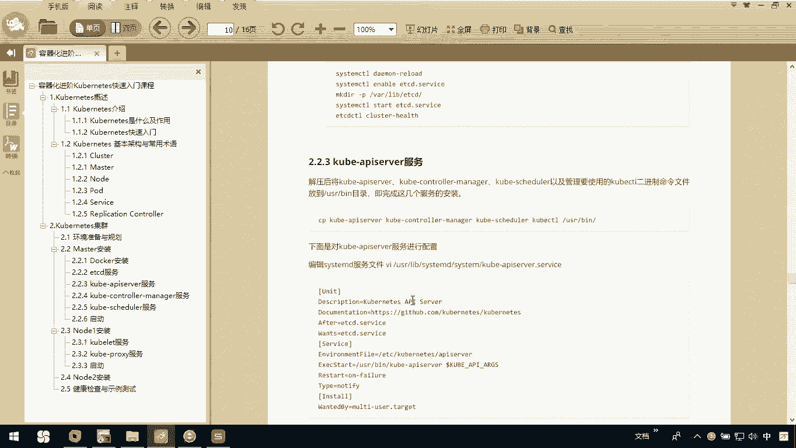

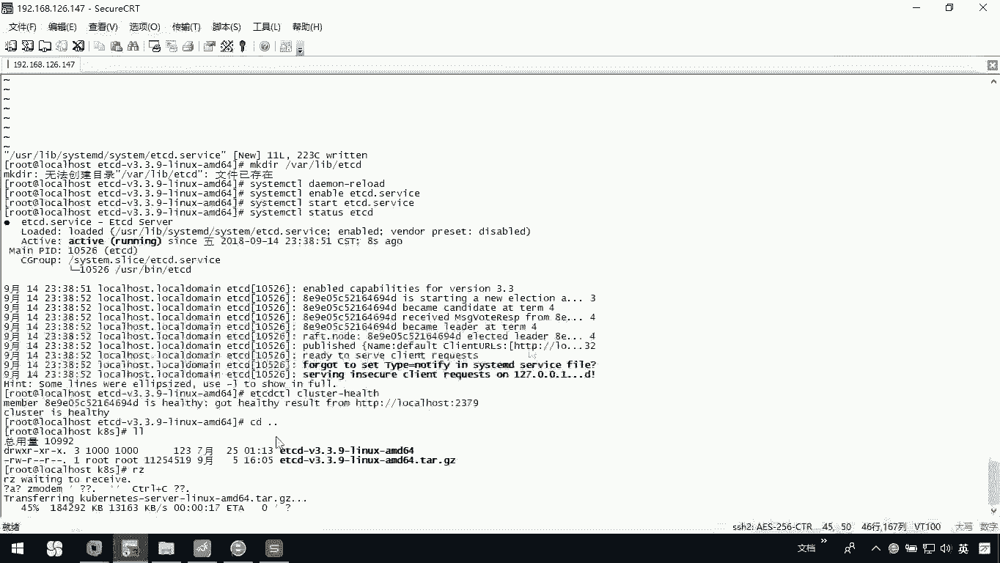

首先，我们需要获取`kube-apiserver`的安装文件。这些文件通常包含在一个压缩包中，可以从官方渠道下载。

以下是获取并解压文件的步骤：

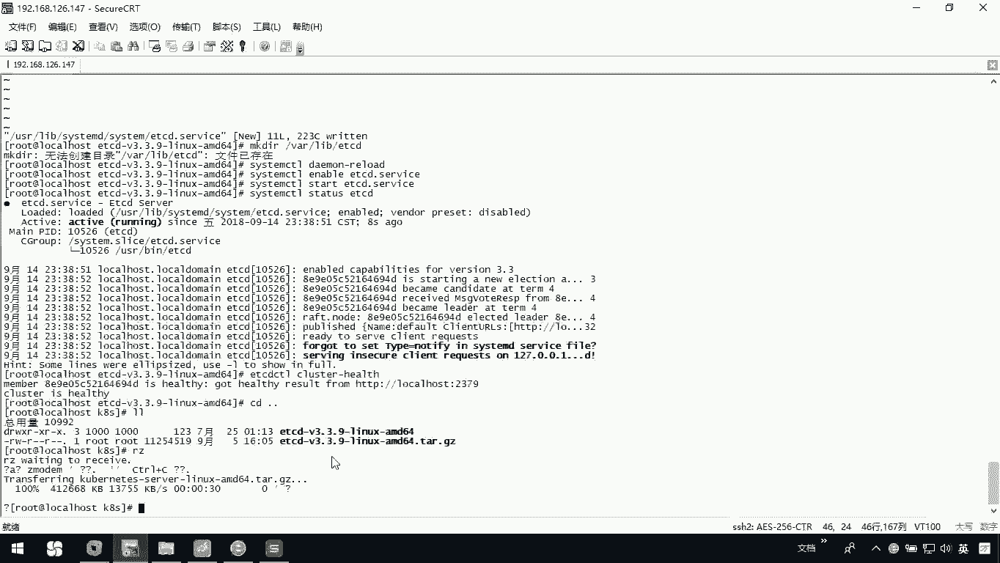

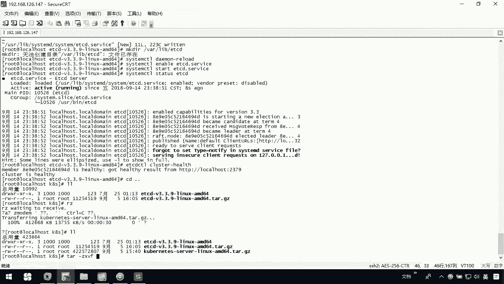

1.  将包含Kubernetes组件的压缩文件上传或下载到服务器的工作目录（例如 `/opt/k8s`）。
2.  使用 `tar` 命令解压该文件。

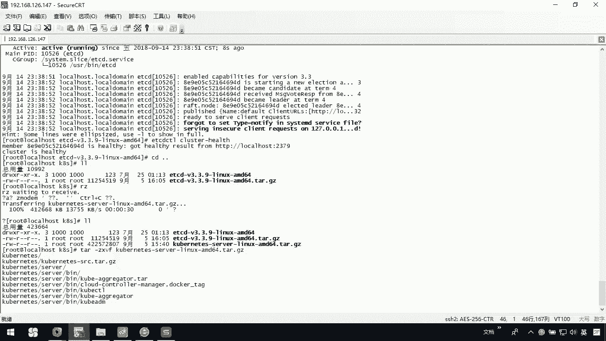

```bash
# 切换到工作目录
cd /opt/k8s
# 解压文件 (请将 `kubernetes-server-linux-amd64.tar.gz` 替换为你的实际文件名)
tar -zxvf kubernetes-server-linux-amd64.tar.gz
```

解压完成后，进入解压目录，可以在 `kubernetes/server/bin/` 路径下找到我们需要的二进制文件。

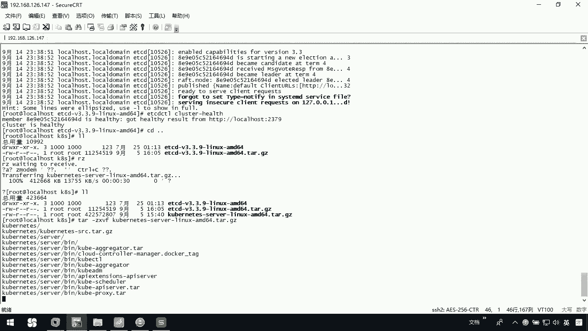

## 复制核心二进制文件

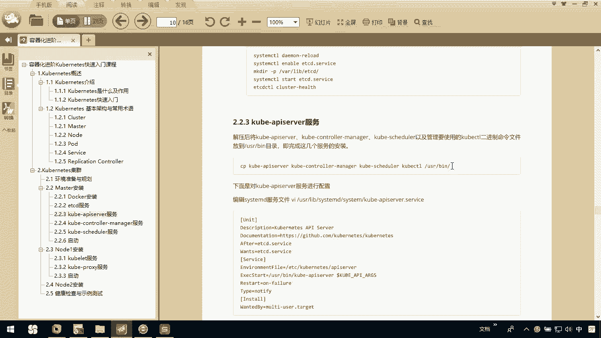

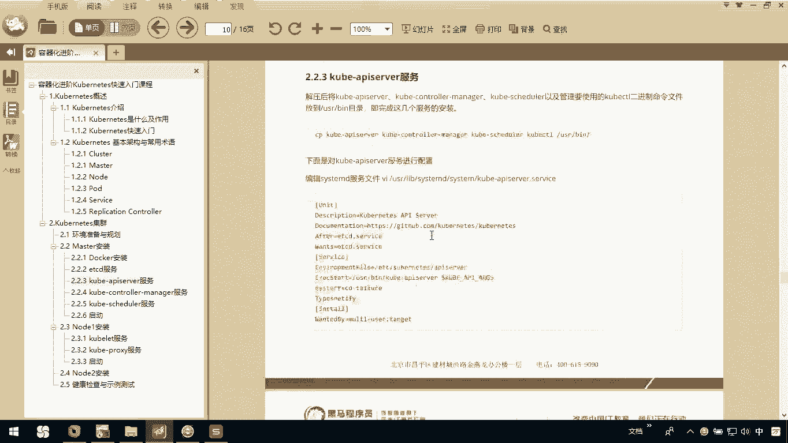

解压后，我们需要将几个核心的Master节点组件二进制文件复制到系统的可执行路径下。

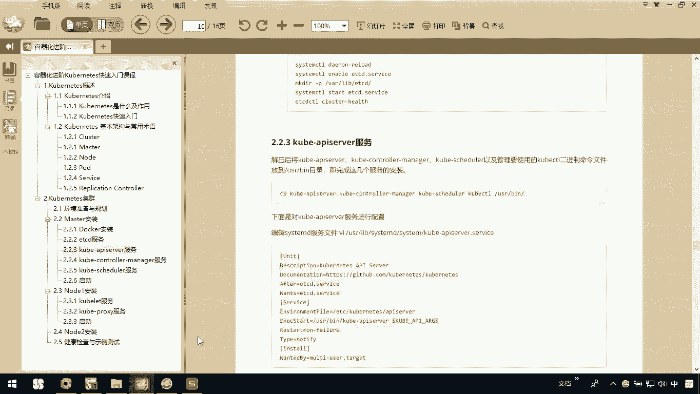

以下是需要复制的文件列表：

*   `kube-apiserver`： API服务器主程序。
*   `kube-controller-manager`： 控制器管理器。
*   `kube-scheduler`： 调度器。

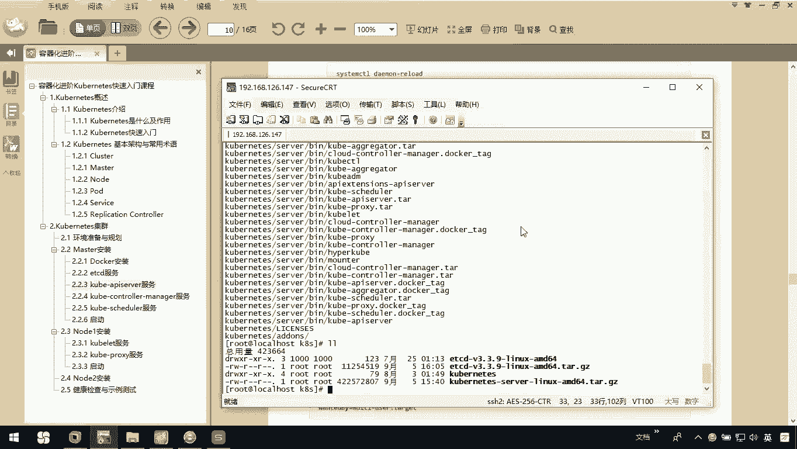

使用 `cp` 命令将它们复制到 `/usr/bin/` 目录。

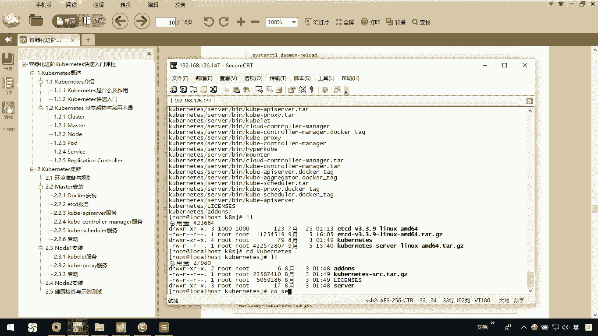

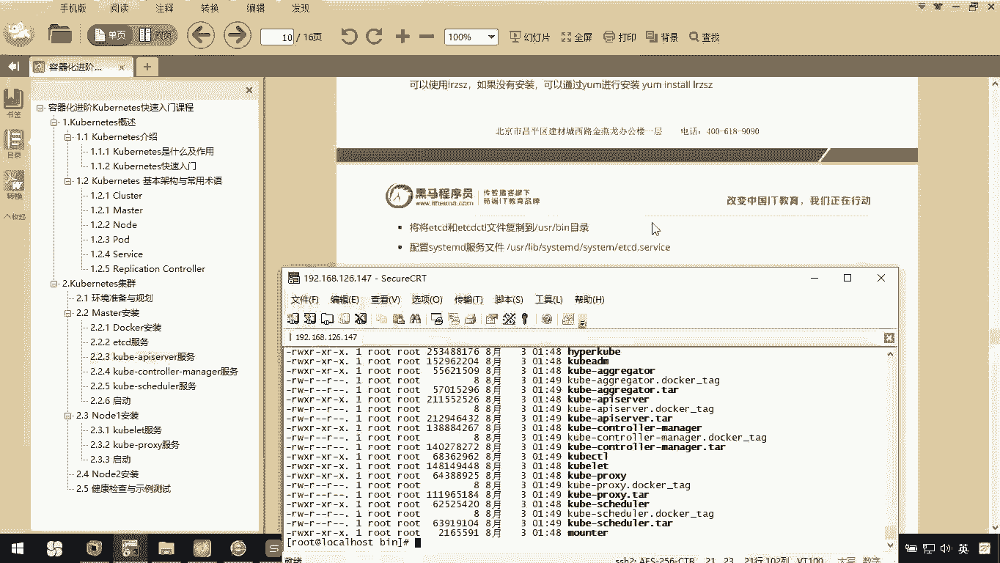

```bash
# 进入二进制文件目录
cd kubernetes/server/bin/
# 复制文件到系统目录
cp kube-apiserver kube-controller-manager kube-scheduler /usr/bin/
```

## 创建Systemd服务文件

为了让`kube-apiserver`能够作为系统服务运行和管理，我们需要为其创建一个Systemd服务单元文件。

以下是创建服务文件的步骤：

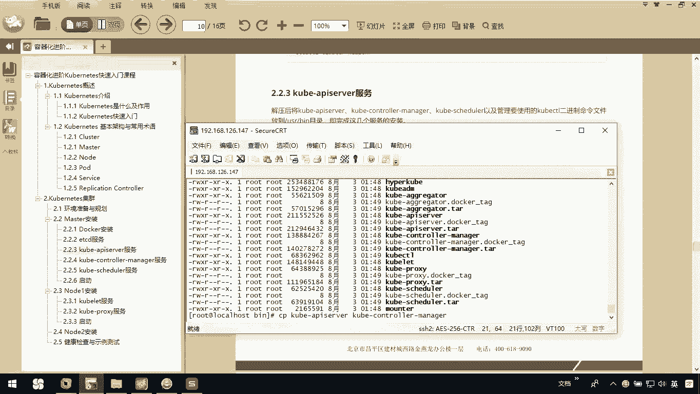

1.  使用 `vi` 或 `nano` 编辑器创建文件 `/usr/lib/systemd/system/kube-apiserver.service`。
2.  将以下服务配置内容粘贴到文件中。

```ini
[Unit]
Description=Kubernetes API Server
Documentation=https://github.com/kubernetes/kubernetes
After=network.target

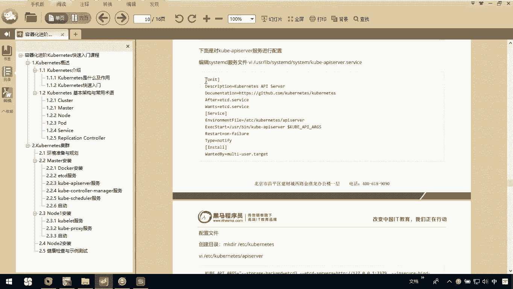

[Service]
ExecStart=/usr/bin/kube-apiserver \
  --advertise-address=192.168.31.71 \
  --allow-privileged=true \
  --authorization-mode=Node,RBAC \
  --client-ca-file=/etc/kubernetes/pki/ca.crt \
  --enable-admission-plugins=NodeRestriction \
  --enable-bootstrap-token-auth=true \
  --etcd-cafile=/etc/kubernetes/pki/etcd/ca.crt \
  --etcd-certfile=/etc/kubernetes/pki/apiserver-etcd-client.crt \
  --etcd-keyfile=/etc/kubernetes/pki/apiserver-etcd-client.key \
  --etcd-servers=https://127.0.0.1:2379 \
  --kubelet-client-certificate=/etc/kubernetes/pki/apiserver-kubelet-client.crt \
  --kubelet-client-key=/etc/kubernetes/pki/apiserver-kubelet-client.key \
  --kubelet-preferred-address-types=InternalIP,ExternalIP,Hostname \
  --proxy-client-cert-file=/etc/kubernetes/pki/front-proxy-client.crt \
  --proxy-client-key-file=/etc/kubernetes/pki/front-proxy-client.key \
  --requestheader-allowed-names=front-proxy-client \
  --requestheader-client-ca-file=/etc/kubernetes/pki/front-proxy-ca.crt \
  --requestheader-extra-headers-prefix=X-Remote-Extra- \
  --requestheader-group-headers=X-Remote-Group \
  --requestheader-username-headers=X-Remote-User \
  --secure-port=6443 \
  --service-account-key-file=/etc/kubernetes/pki/sa.pub \
  --service-cluster-ip-range=10.96.0.0/12 \
  --tls-cert-file=/etc/kubernetes/pki/apiserver.crt \
  --tls-private-key-file=/etc/kubernetes/pki/apiserver.key
Restart=on-failure
RestartSec=5

[Install]
WantedBy=multi-user.target
```

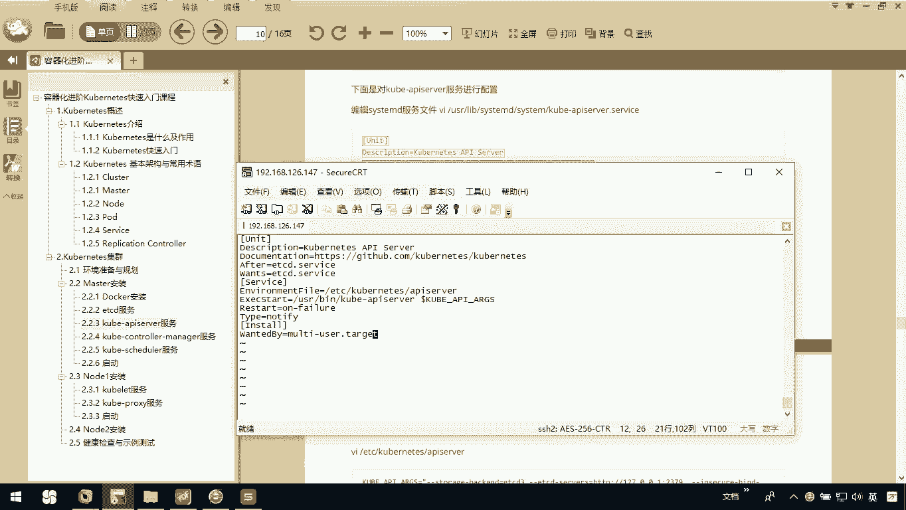

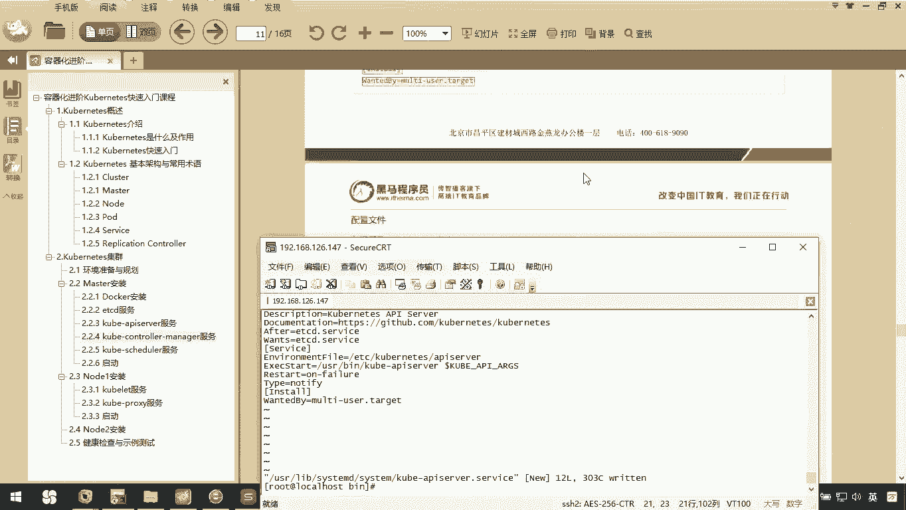

> **注意**：配置文件中的IP地址（如`192.168.31.71`）、证书路径和`etcd`服务器地址需要根据你的实际集群环境进行修改。

## 创建配置文件目录

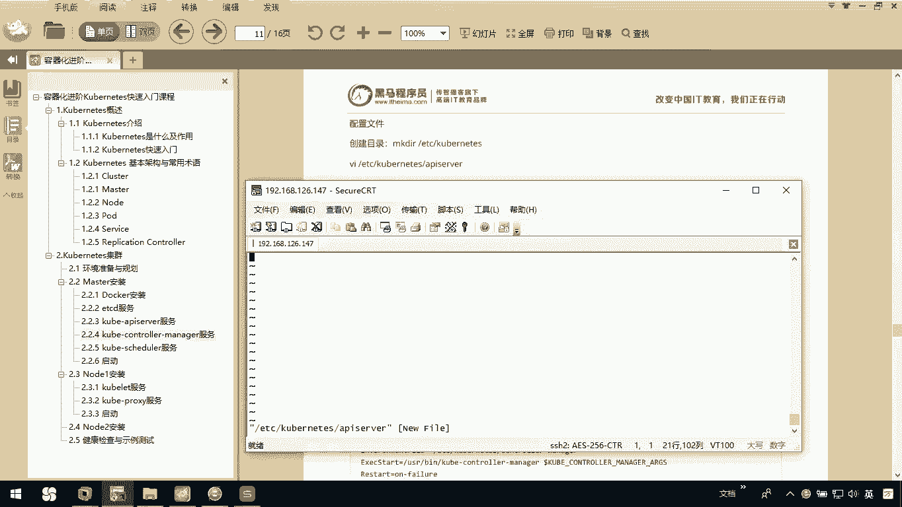

`kube-apiserver`的启动依赖于一系列配置文件，主要是TLS证书和密钥。我们需要提前创建好存放这些配置文件的目录。

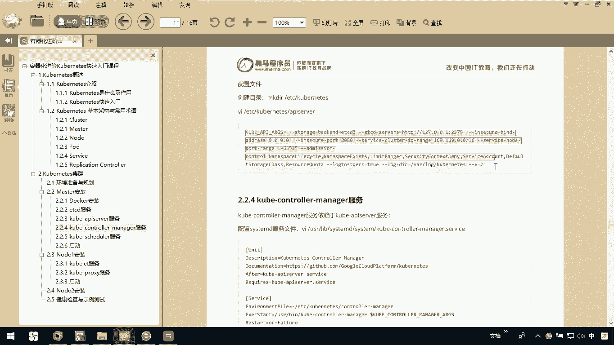

执行以下命令创建目录：

```bash
mkdir -p /etc/kubernetes
```

后续步骤中，你需要将生成的CA证书、API Server证书、私钥等文件按照服务配置中指定的路径（如`/etc/kubernetes/pki/`）放置在此目录下。

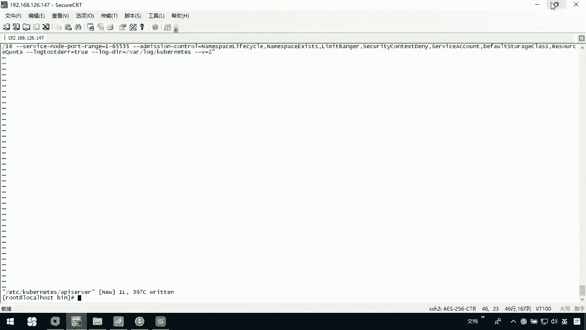

## 总结

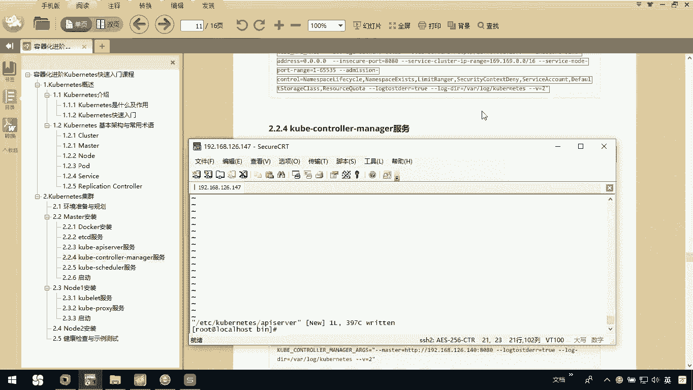

本节课中我们一起学习了`kube-apiserver`服务在Master节点上的安装流程。我们完成了从获取安装包、复制二进制文件、创建Systemd服务单元文件到准备配置文件目录的全过程。`kube-apiserver`的配置参数较多，核心是正确指定**etcd集群地址**、**安全端口**、**各类证书路径**以及**集群内部服务网段**。在启动服务之前，请务必确保所有依赖的证书文件已正确生成并放置到位。下一节，我们将继续安装Master节点的其他核心组件。