# 华为云PaaS微服务治理技术 - P56：9.Kubernetes集群搭建Master安装-kube-controller-manager服务 - 开源之家 - BV1wm4y1M7m5

接下来呢我们就要安装这个叫做coer controller manager。那这里面有这句话非常重要。coer controller manager服务它是依赖于coer API server的。

所以呢你要注意，如果你之前的coer API server失败了安装。那么我们coer controller manager肯定是不okK的那这个时候呢你也需要去执行一下操作。所以我们来看一下。

首先他告诉你啊，还是在 system地下，你要去创建一个叫做coer controller manager service这个文件，这里边我就不写了，我直接copy过来。

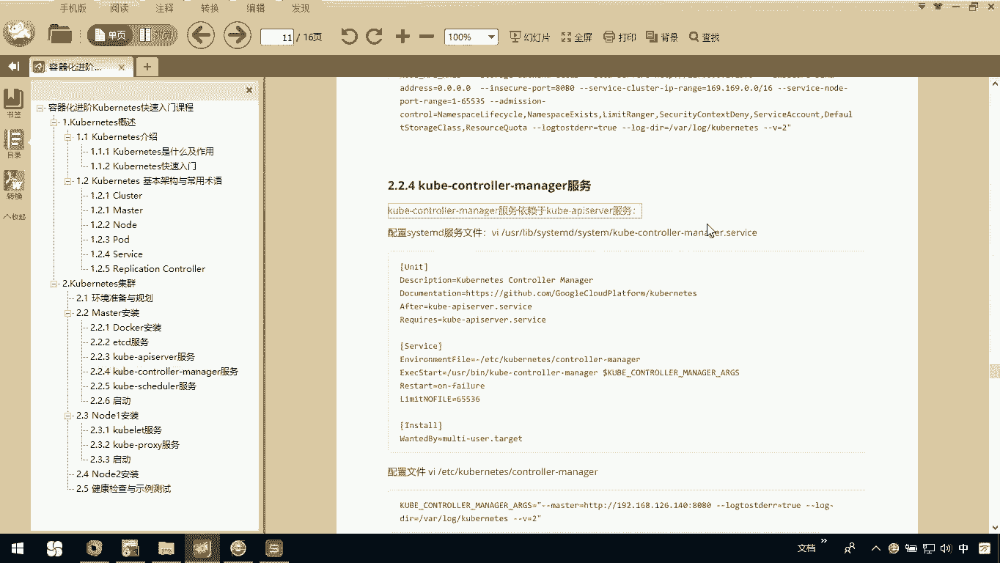

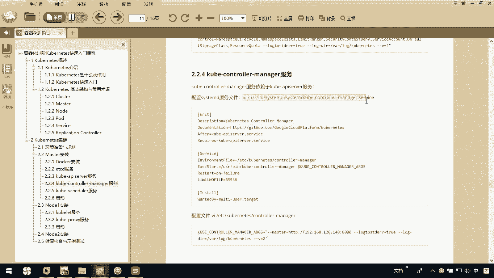

UC在这里呢我们去。编辑这个文件。在这个文件里边呢，你看一下它要写一些东西。

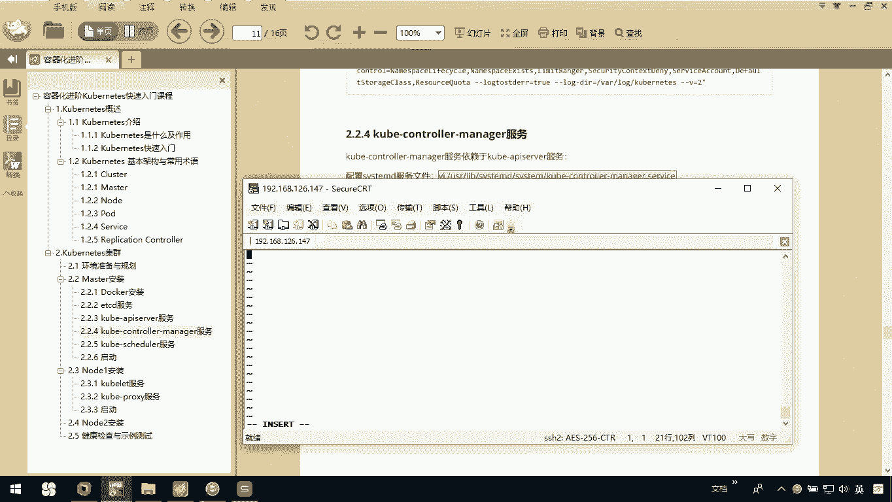

OK把这一部分ctl C粘贴过来。

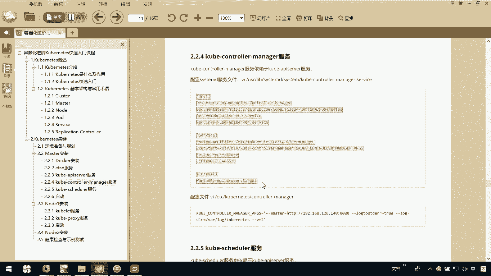

这样呢我们当前的coer controllert manager就安装完成。然后呢，我们需要去配置一下这里边配置的时候，你注意了，一定要注意你的IP地址。注意，那我们当前的电脑的IP是147。

所以你再去用的时候，你不能说我只是把这个粘贴过来了，你要去注意一下你自己的IP地址ok所以这里边我们看一下它呢需要去。

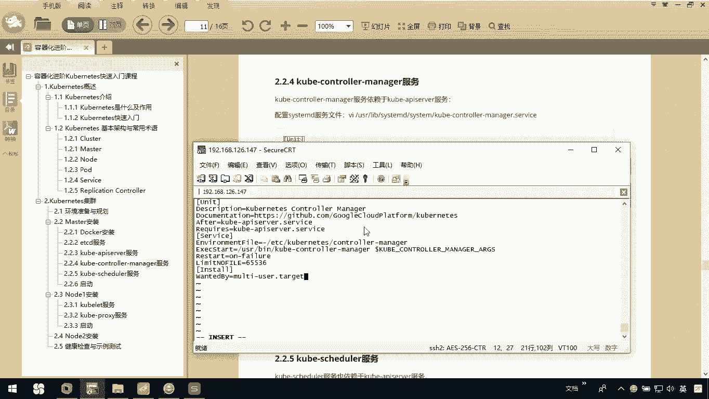

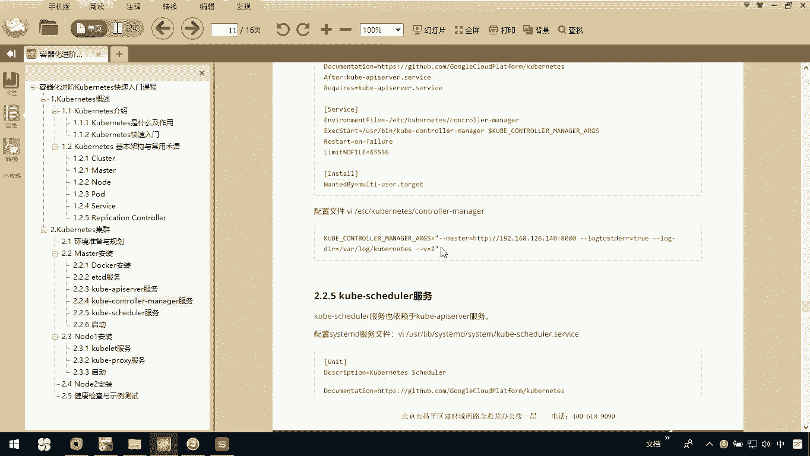

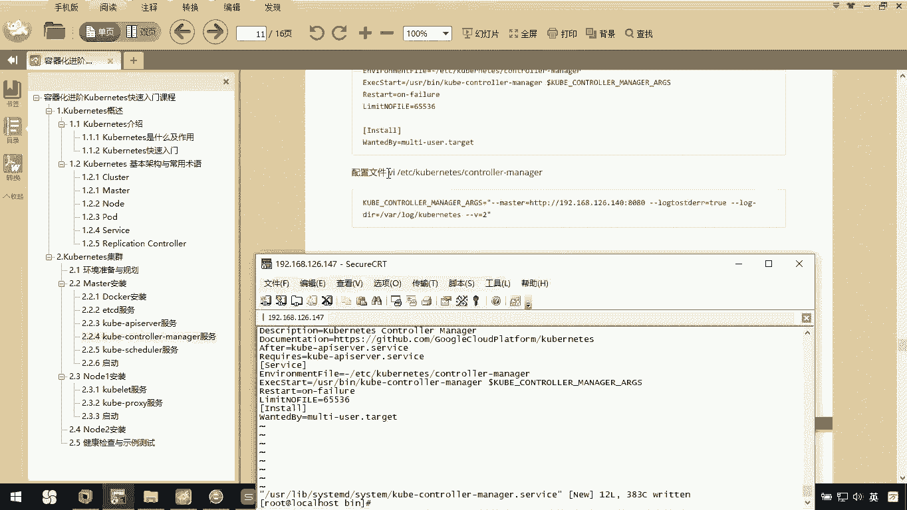

创建这么一个文件。

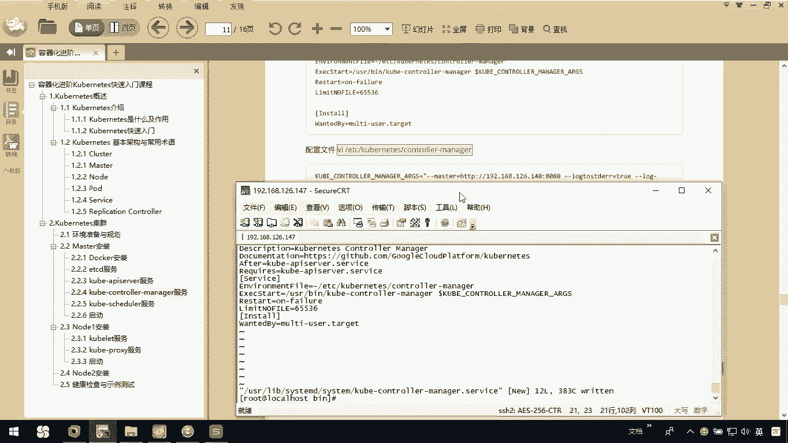

那这个文件呢，我们把这些配置信息copy一下。

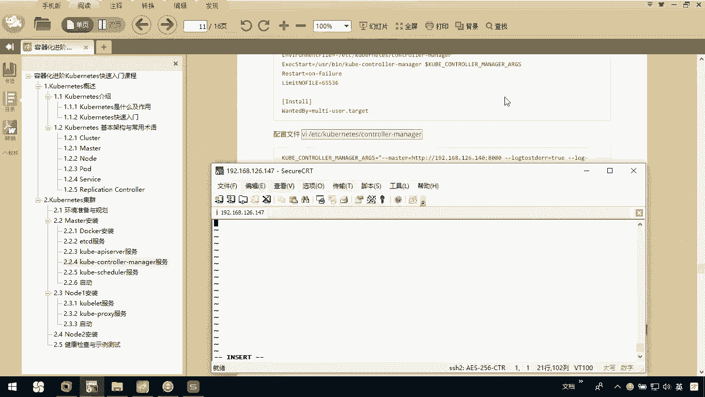

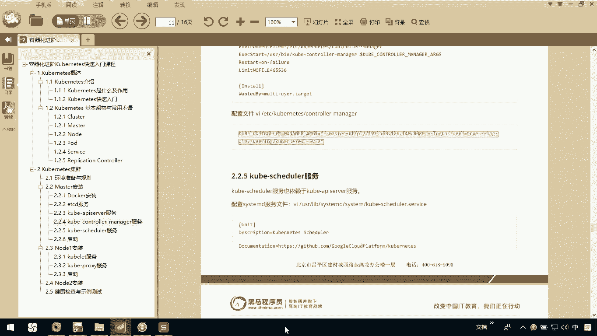

粘贴过来这个路径啊。这格式我也缩进一下。

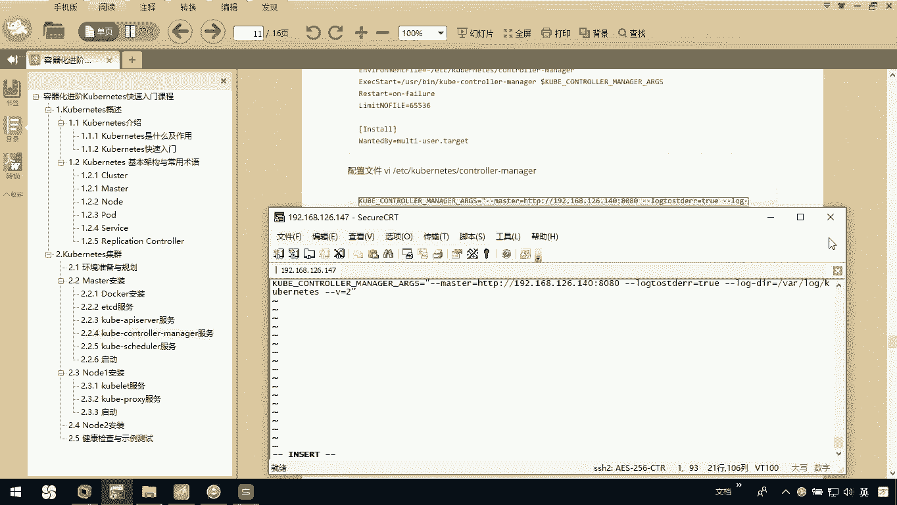

然后呢，我们一定要去把这块改了，我master这个机器，它是147OK吧，192168点1266。147。那你在安装时，你要根据你自己master这个主机的IP啊去设置。那如果你设置有问题。

那我们这个服务啊就不会起来了，okK吧。那这样的话呢，我现在把我这个conttroroller manager这服务啊也就安装完成。

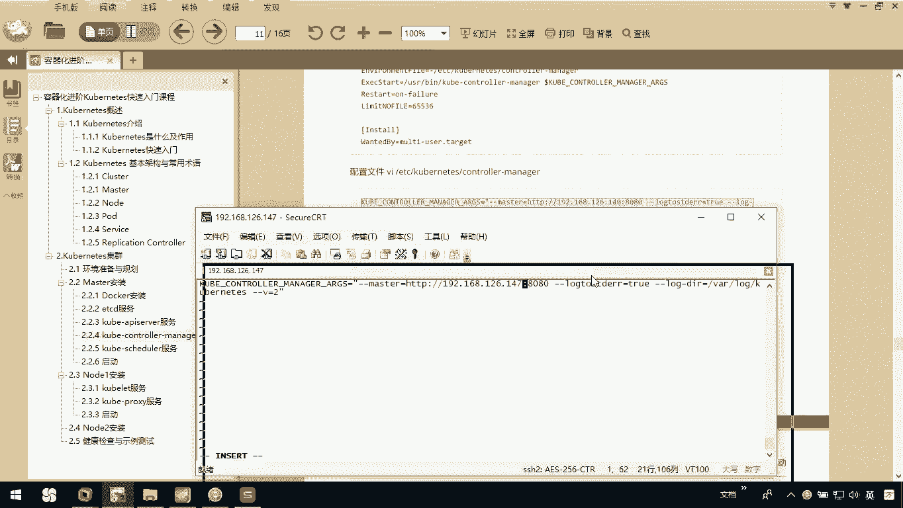

CJJ退出保存。

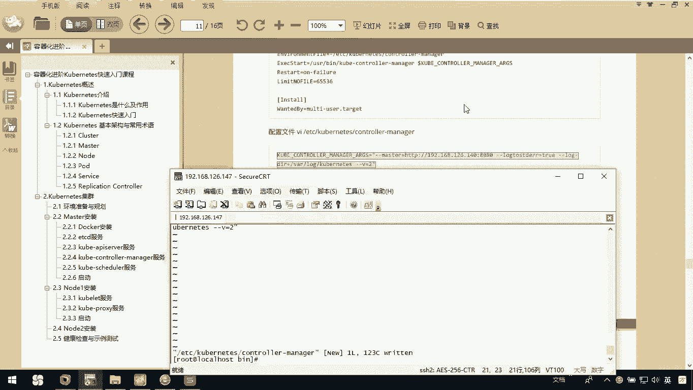