# 华为云PaaS微服务治理技术：P56：9.Kubernetes集群搭建Master安装-kube-controller-manager服务 🛠️

在本节课中，我们将要学习如何在Kubernetes集群的Master节点上安装`kube-controller-manager`服务。`kube-controller-manager`是Kubernetes的核心控制组件之一，负责运行各种控制器进程，确保集群的实际状态与期望状态保持一致。

## 概述

上一节我们介绍了`kube-apiserver`的安装。本节中我们来看看`kube-controller-manager`的安装步骤。需要特别注意的是，`kube-controller-manager`服务的正常运行依赖于`kube-apiserver`。如果之前的`kube-apiserver`安装失败，那么`kube-controller-manager`也将无法正常工作。

## 安装步骤

以下是安装`kube-controller-manager`的具体步骤。

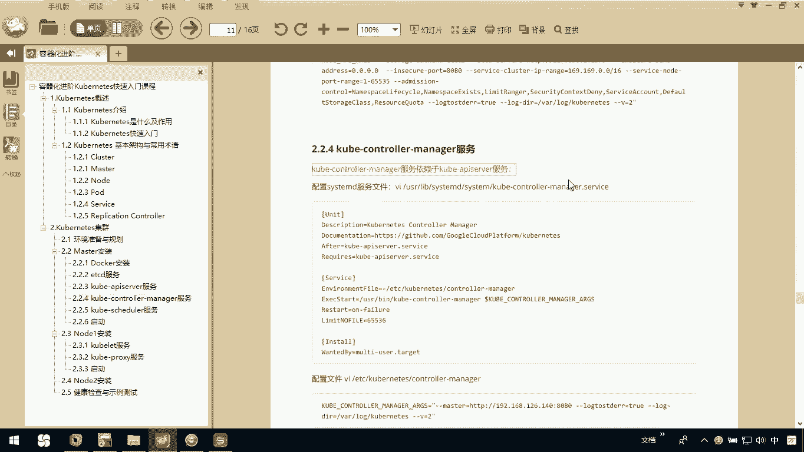

### 1. 创建服务文件

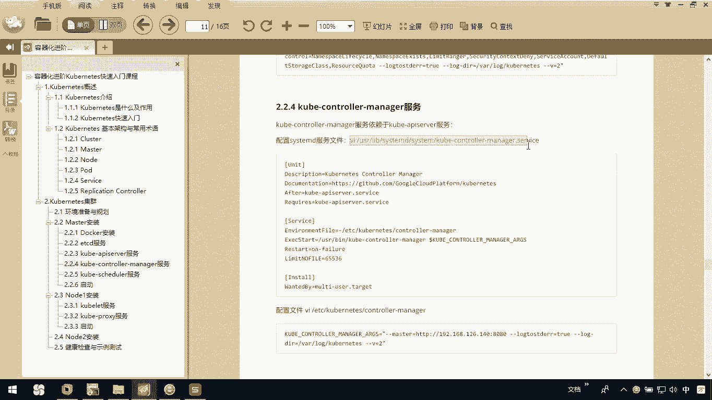

首先，我们需要在`/etc/systemd/system/`目录下创建`kube-controller-manager.service`服务文件。

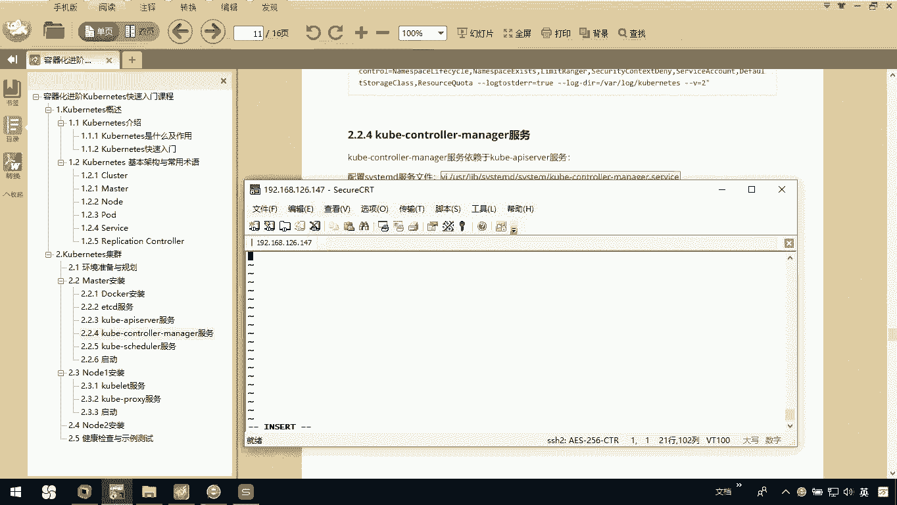

```bash
sudo vim /etc/systemd/system/kube-controller-manager.service
```

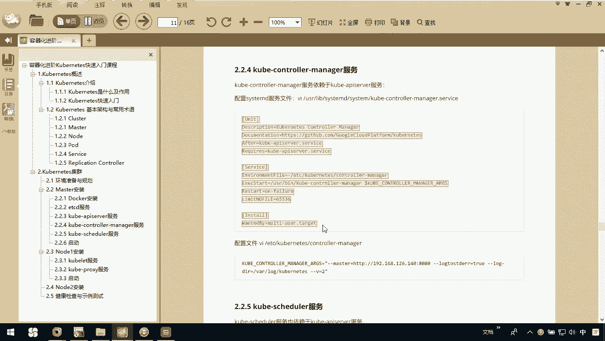

### 2. 编辑服务文件内容

将以下配置内容复制并粘贴到上一步创建的文件中。

```
[Unit]
Description=Kubernetes Controller Manager
Documentation=https://github.com/kubernetes/kubernetes

[Service]
ExecStart=/usr/local/bin/kube-controller-manager \
  --address=127.0.0.1 \
  --kubeconfig=/etc/kubernetes/controller-manager.conf \
  --authentication-kubeconfig=/etc/kubernetes/controller-manager.conf \
  --authorization-kubeconfig=/etc/kubernetes/controller-manager.conf \
  --bind-address=127.0.0.1 \
  --cluster-signing-cert-file=/etc/kubernetes/pki/ca.crt \
  --cluster-signing-key-file=/etc/kubernetes/pki/ca.key \
  --controllers=*,bootstrapsigner,tokencleaner \
  --leader-elect=true \
  --root-ca-file=/etc/kubernetes/pki/ca.crt \
  --service-account-private-key-file=/etc/kubernetes/pki/sa.key \
  --use-service-account-credentials=true \
  --v=2
Restart=on-failure
RestartSec=5

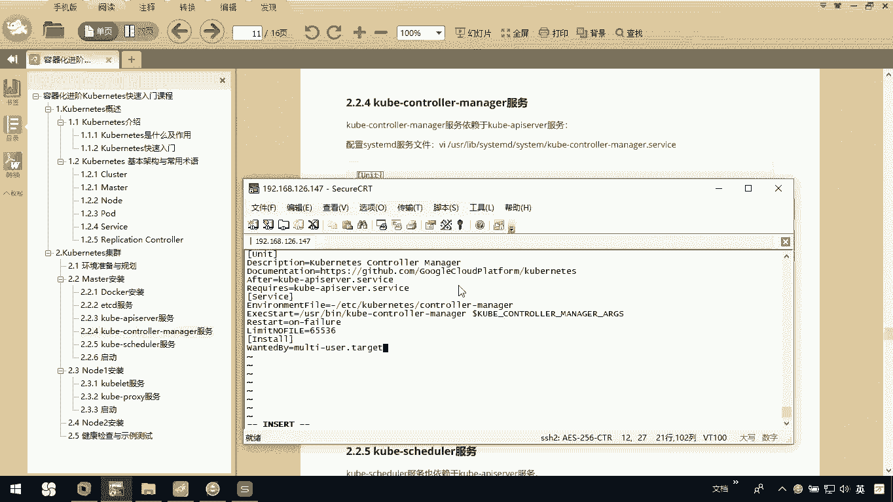

[Install]
WantedBy=multi-user.target
```

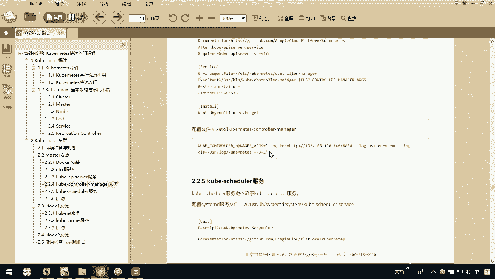

### 3. 创建配置文件

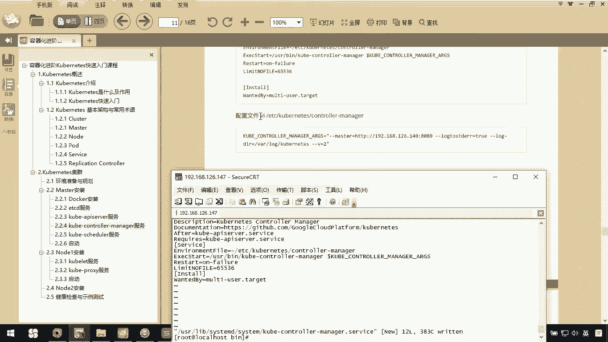

接下来，我们需要创建`kube-controller-manager`的配置文件。请注意，配置文件中的IP地址必须根据您Master节点的实际IP进行修改。

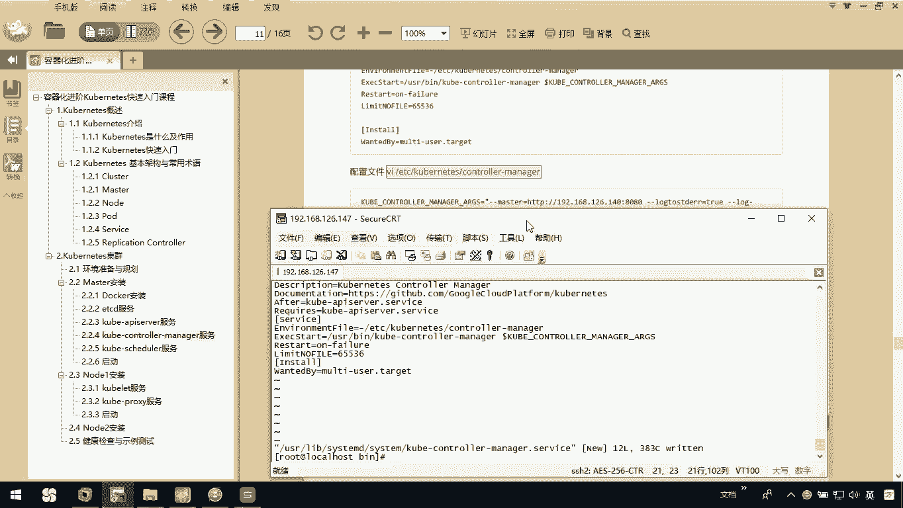

```bash
sudo vim /etc/kubernetes/controller-manager.conf
```

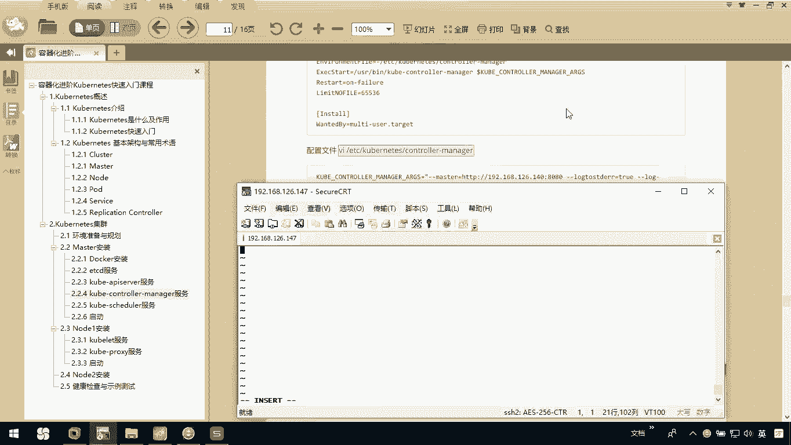

### 4. 编辑配置文件内容

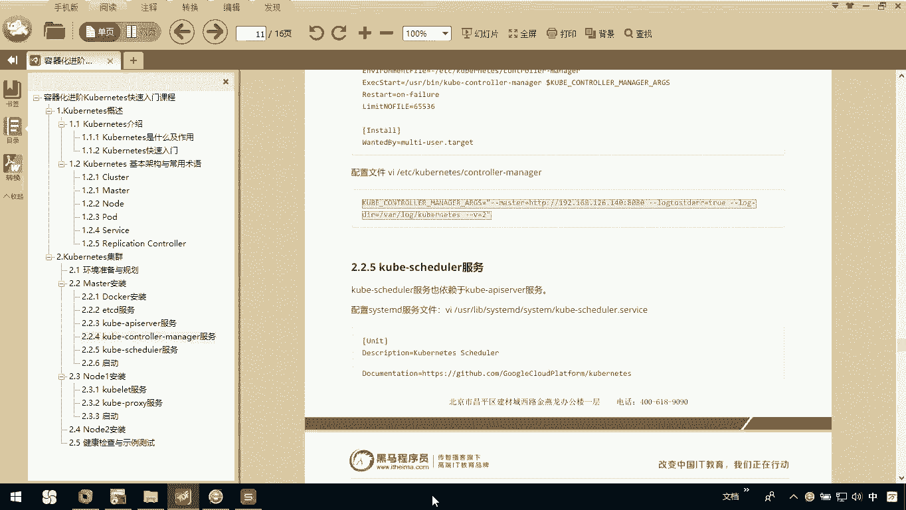

将以下配置内容复制并粘贴到配置文件中。**请务必将示例IP地址`192.168.126.147`替换为您Master节点的真实IP地址。**

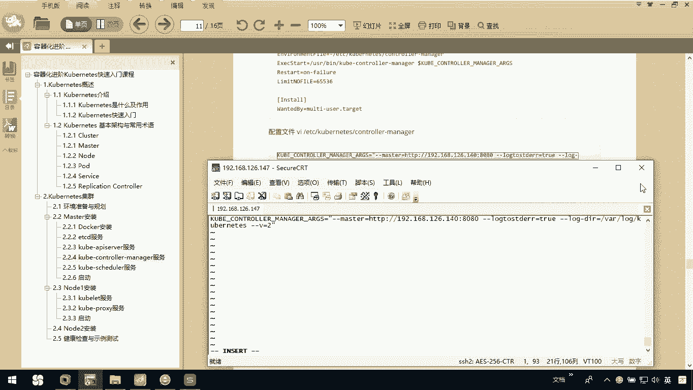

```yaml
apiVersion: v1
clusters:
- cluster:
    certificate-authority: /etc/kubernetes/pki/ca.crt
    server: https://192.168.126.147:6443
  name: kubernetes
contexts:
- context:
    cluster: kubernetes
    user: system:kube-controller-manager
  name: system:kube-controller-manager@kubernetes
current-context: system:kube-controller-manager@kubernetes
kind: Config
preferences: {}
users:
- name: system:kube-controller-manager
  user:
    client-certificate: /etc/kubernetes/pki/controller-manager.crt
    client-key: /etc/kubernetes/pki/controller-manager.key
```

**关键点**：配置文件中的`server`字段（例如`https://192.168.126.147:6443`）必须指向您Master节点的`kube-apiserver`地址。如果IP地址配置错误，服务将无法启动。

### 5. 保存并退出

完成上述编辑后，保存并退出配置文件。

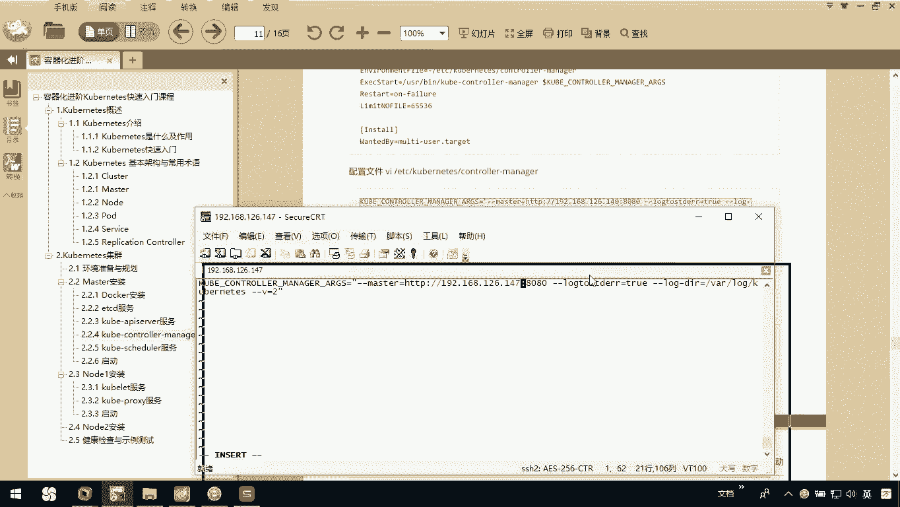

## 总结

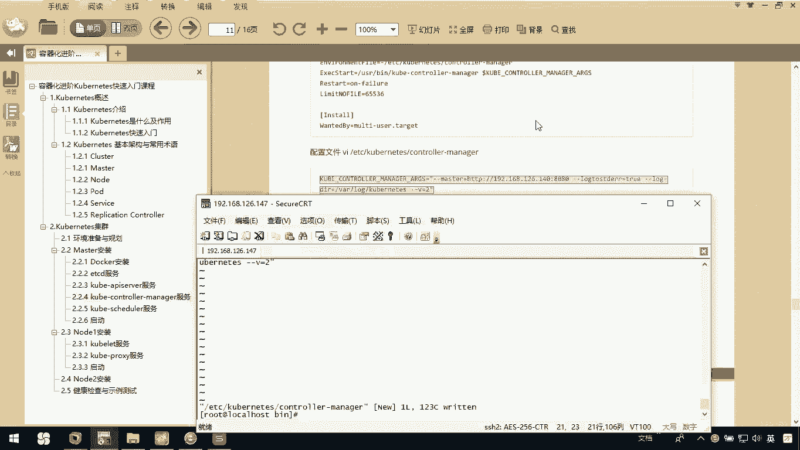

本节课中我们一起学习了`kube-controller-manager`服务的安装过程。我们创建了systemd服务文件，并配置了连接`kube-apiserver`所需的配置文件。请牢记，**`kube-controller-manager`依赖于`kube-apiserver`**，且配置中的IP地址必须准确无误，这是服务成功启动的关键。完成本步骤后，Master节点的核心控制组件安装就向前迈进了一步。