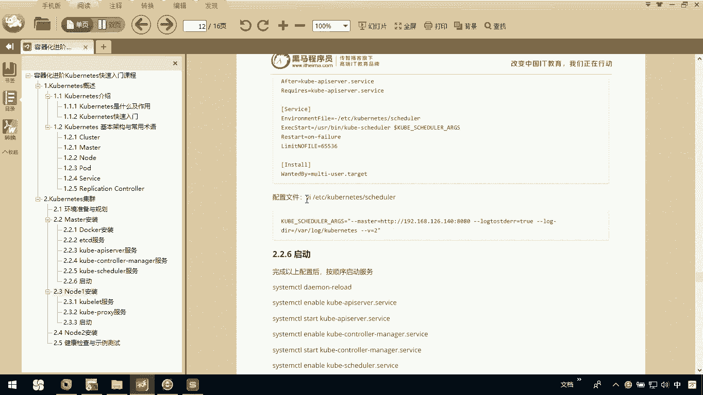

# 华为云PaaS微服务治理技术 - P57：10.Kubernetes集群搭建Master安装-kube-scheduler服务 - 开源之家 - BV1wm4y1M7m5

接下来呢我们就是coer schedule服务。那么它也一样的，它也是依赖于这个coer APII服务。所以呢我们首先也去编辑一下它的service，你编辑它service的时候。

其实你就会看到它里边呢会指定啊我们当前是依赖于我们刚才所说的coer APII这里边不有个reres嘛？coer杠API点service，所以大家呢要看一下这个我粘贴的时候注意一下。

我别去把所有东西都粘过来，因为这个讲义上中间会有一些东西啊，所以这里边呢我这么一点点分开粘。

OK那粘贴完以后呢，我们退出保存。

接下来呢我们就要去做它的一个配置文件，跟刚才差不多。

我们过来编辑这个文件。那这个文件大家也注意看啊，原来我们那个叫做什么呢？上面这个服务，我们叫coer controllert manager，看到了吧？而现在这个是cer schedule。

所以这里边大家粘贴也要注意了啊。然后同样的道理，你一定要注意的就是我们要修改我当前的IP地址。因为这时候会涉及到什么？我们当前的master的IP，你就必须得告他我当前masterIP是谁。

所以在这里边告诉他我们当前是147。

OK吧，保存。

退出。那这样呢我们整个kubernet这个集群的相关服务啊，我们都配置完了。那么我们kubernet的AP serverkunet controller manager。

还有kunet schedule一会呢我们就要去启动它。

