# 华为云PaaS微服务治理技术 - P57：10.Kubernetes集群搭建Master安装-kube-scheduler服务

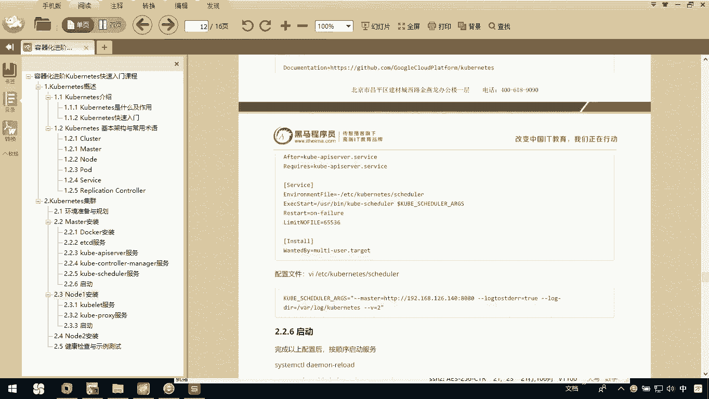

在本节课程中，我们将学习如何在Kubernetes集群的Master节点上安装和配置`kube-scheduler`服务。`kube-scheduler`是Kubernetes的核心组件之一，负责将新创建的Pod调度到集群中合适的节点上运行。它的运行依赖于`kube-apiserver`服务。

上一节我们介绍了`kube-controller-manager`的安装，本节中我们来看看`kube-scheduler`的配置过程。

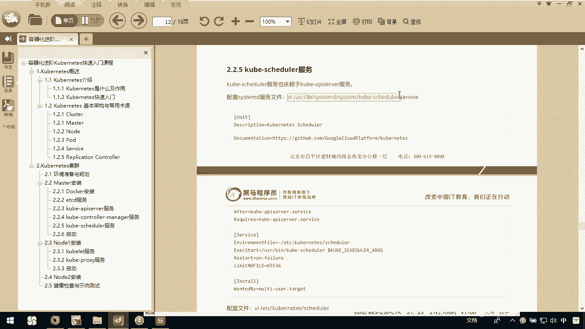

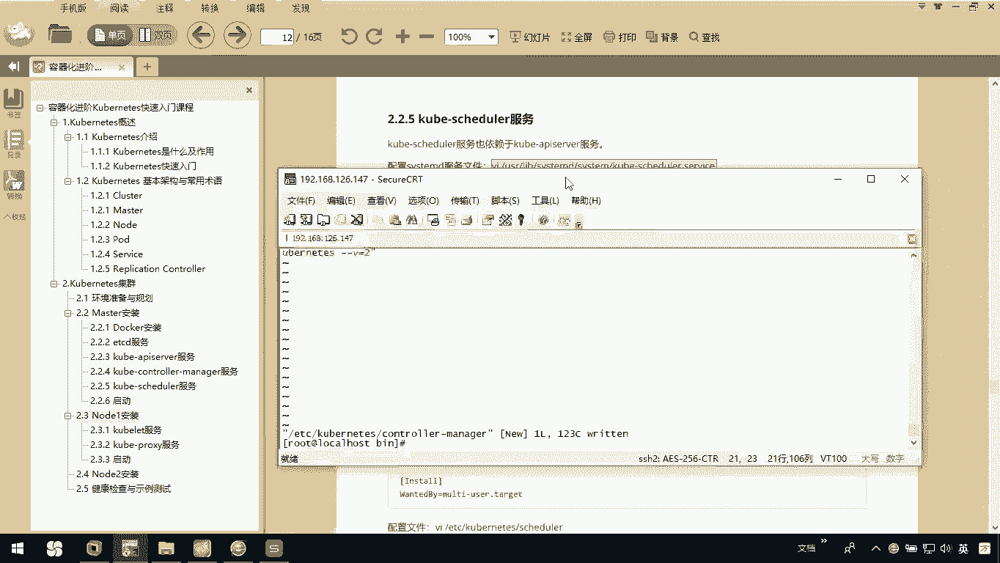

## 配置 kube-scheduler 服务

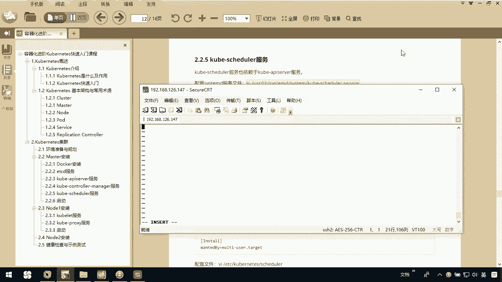

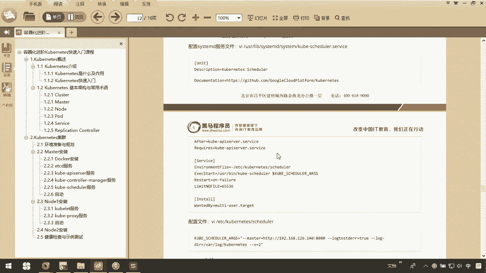

首先，我们需要创建`kube-scheduler`的systemd服务单元文件。这个服务文件定义了如何启动和管理`kube-scheduler`进程。

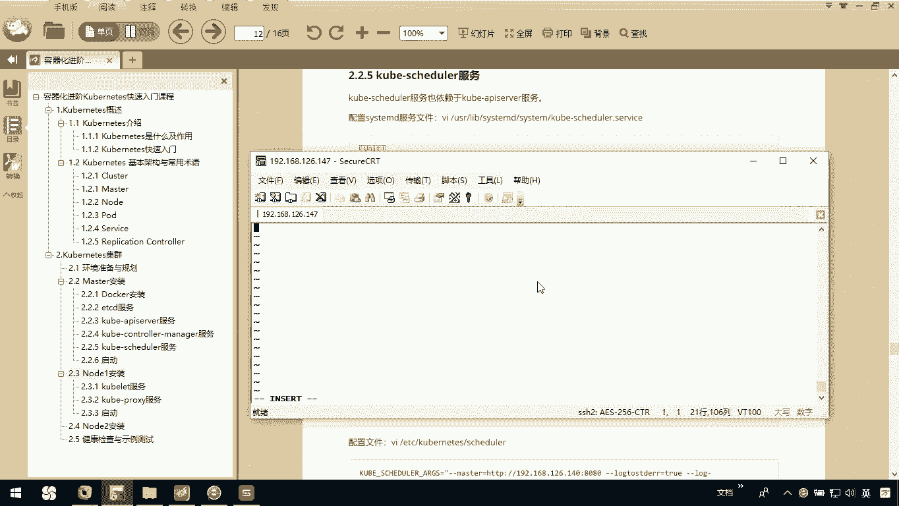

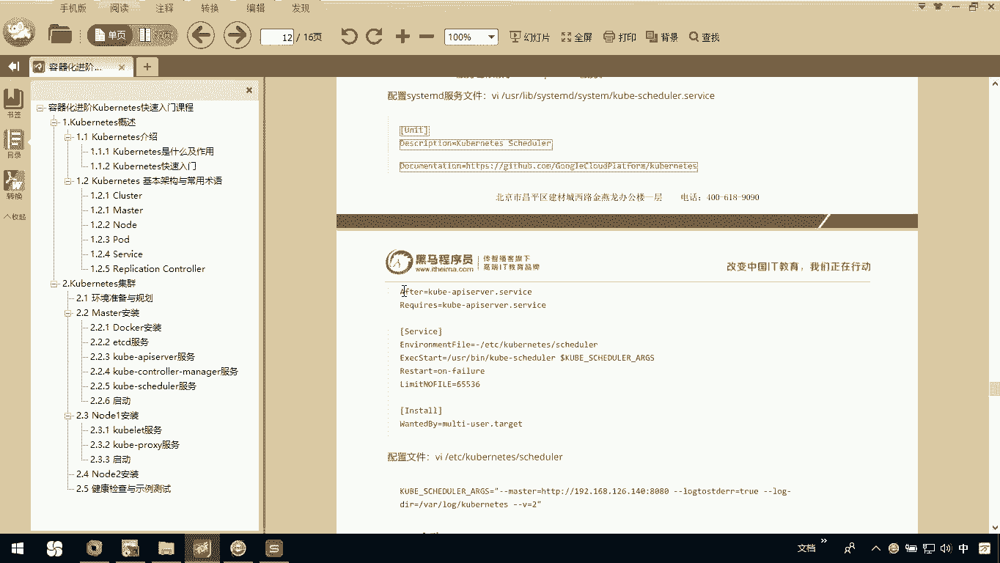

以下是创建和编辑服务文件的步骤：

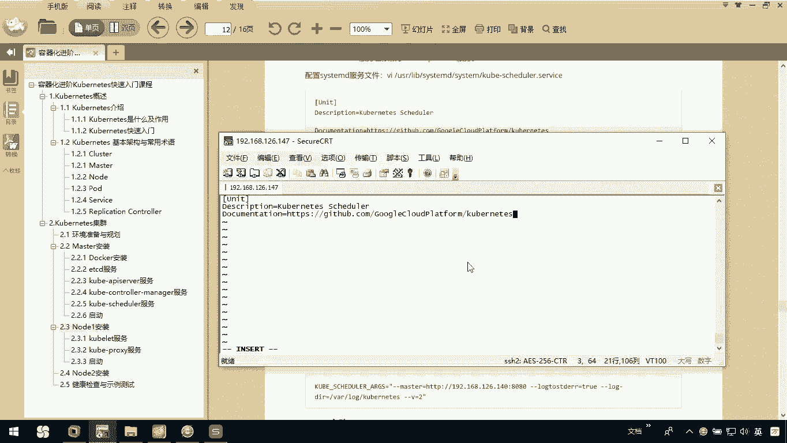

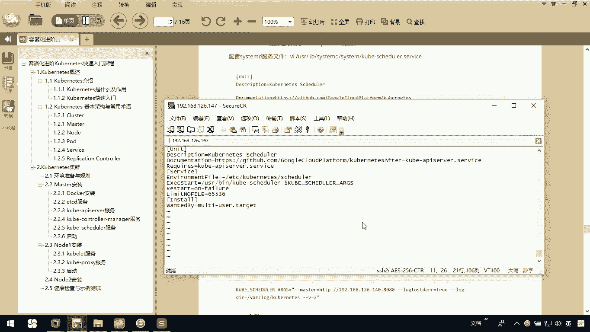

1.  使用文本编辑器创建并打开服务文件。
    ```bash
    vim /usr/lib/systemd/system/kube-scheduler.service
    ```
2.  将以下服务配置内容粘贴到文件中。请注意，此服务依赖于`kube-apiserver.service`。
    ```ini
    [Unit]
    Description=Kubernetes Scheduler
    Documentation=https://github.com/kubernetes/kubernetes
    After=kube-apiserver.service
    Requires=kube-apiserver.service

    [Service]
    ExecStart=/usr/local/bin/kube-scheduler \
      --config=/etc/kubernetes/scheduler-config.yaml \
      --v=2
    Restart=on-failure
    RestartSec=5

    [Install]
    WantedBy=multi-user.target
    ```
3.  编辑完成后，保存并退出编辑器。

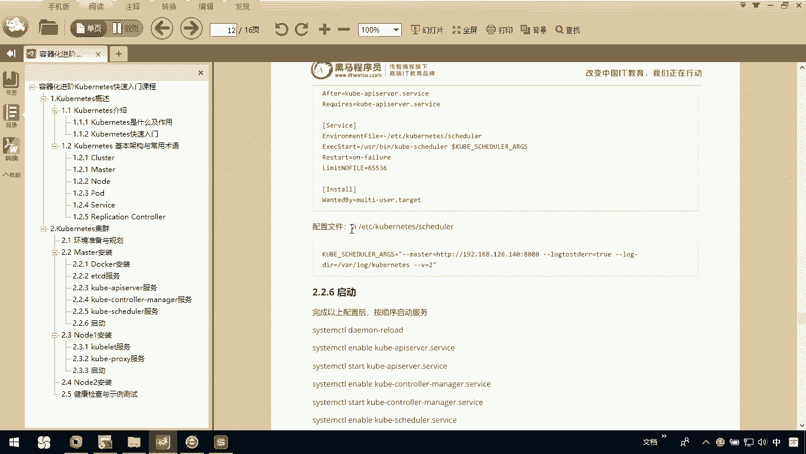

## 创建 kube-scheduler 配置文件

接下来，我们需要为`kube-scheduler`创建其专用的配置文件。这个配置文件包含了调度器运行所需的各种参数。

以下是创建配置文件的步骤：

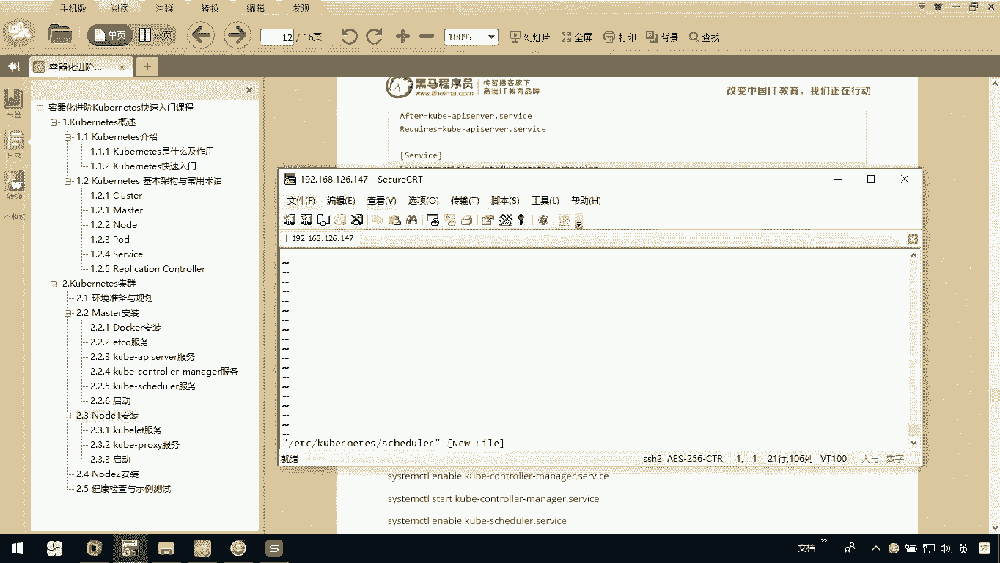

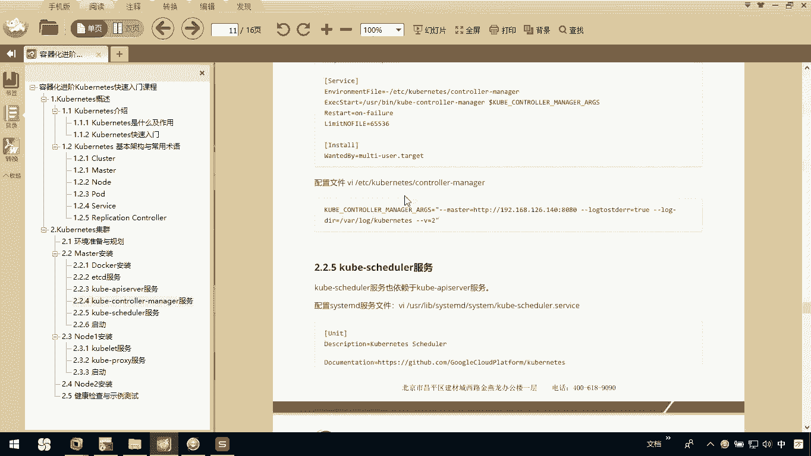

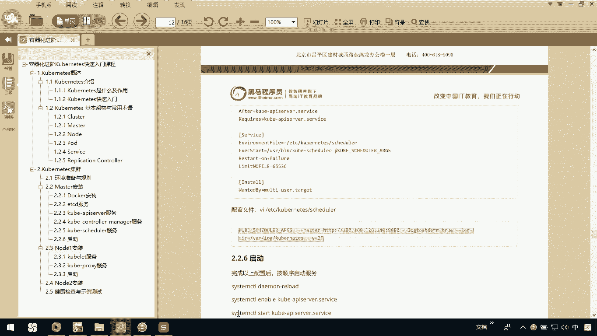

1.  使用文本编辑器创建并打开配置文件。
    ```bash
    vim /etc/kubernetes/scheduler-config.yaml
    ```
2.  将以下配置内容粘贴到文件中。**请特别注意，此处的配置项名称与`kube-controller-manager`不同，并且需要将`<MASTER_IP>`替换为您Master节点的实际IP地址（例如`192.168.1.147`）。**
    ```yaml
    apiVersion: kubescheduler.config.k8s.io/v1beta1
    kind: KubeSchedulerConfiguration
    clientConnection:
      kubeconfig: /etc/kubernetes/scheduler.kubeconfig
    leaderElection:
      leaderElect: true
      resourceName: kube-scheduler
      resourceNamespace: kube-system
    ```
3.  编辑完成后，保存并退出编辑器。

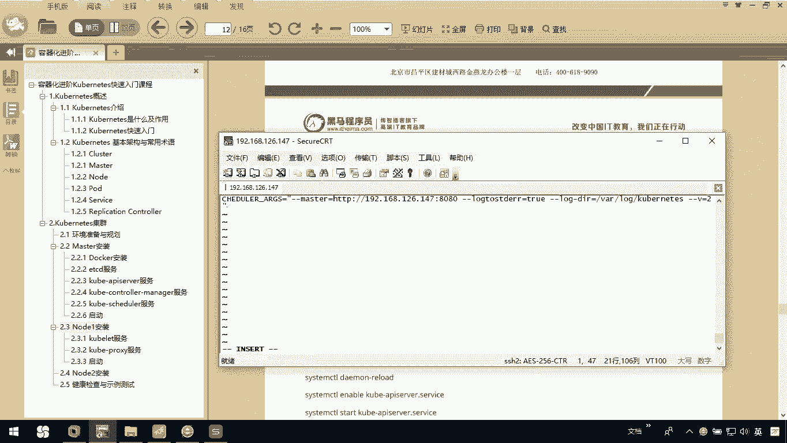

## 总结

本节课中我们一起学习了`kube-scheduler`服务的安装与配置。我们完成了两项核心工作：创建了定义服务启动方式的`kube-scheduler.service`文件，以及包含了调度器运行参数的`scheduler-config.yaml`配置文件。

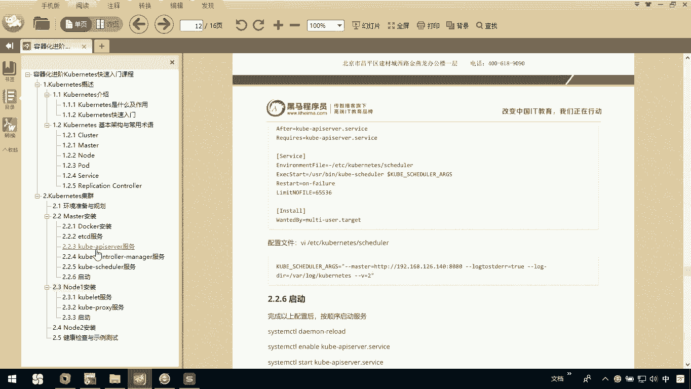

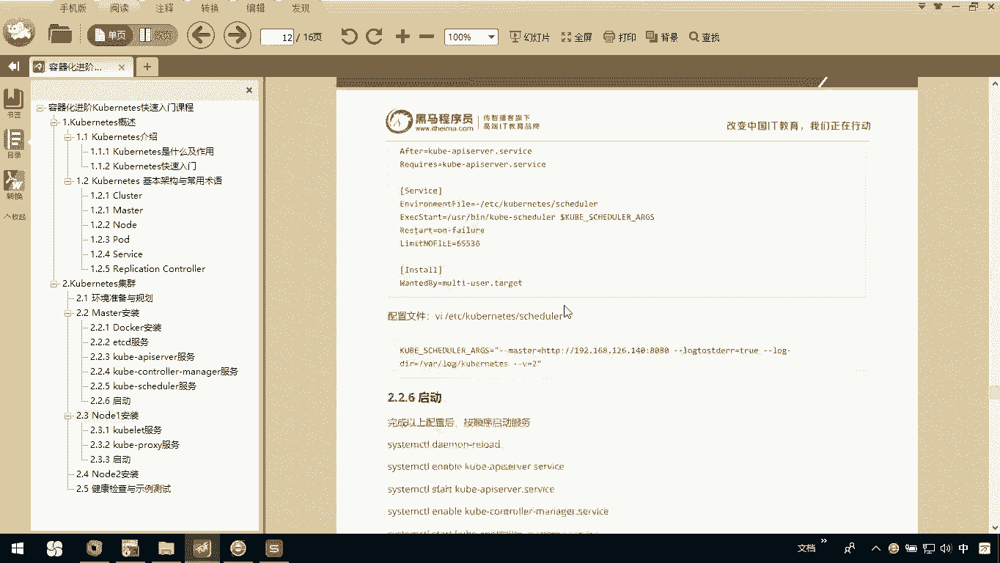

至此，Kubernetes Master节点上的三个核心控制平面服务：`kube-apiserver`、`kube-controller-manager`和`kube-scheduler`的配置文件都已准备完毕。在接下来的课程中，我们将启动这些服务，使Master节点开始运行。