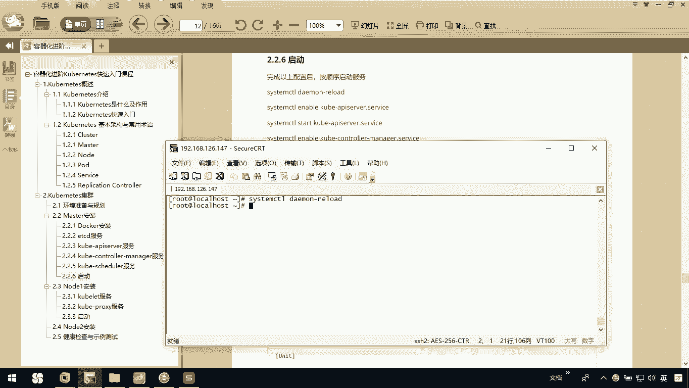
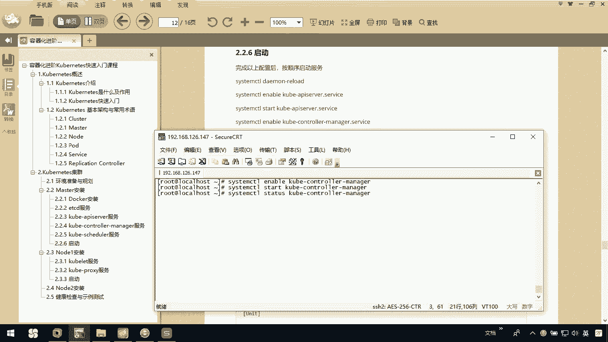
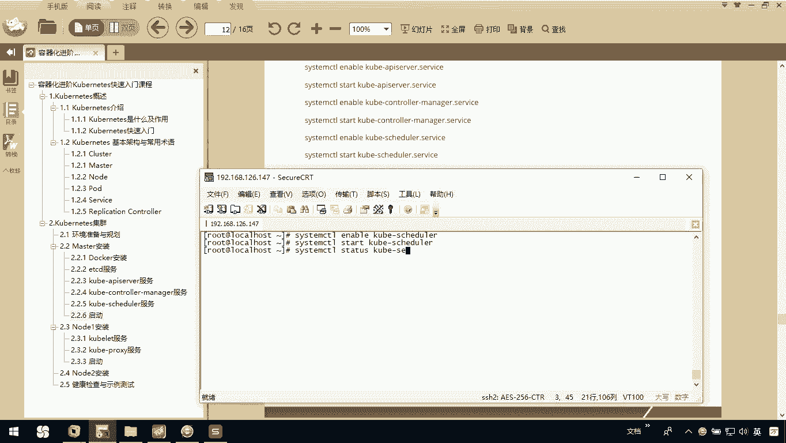
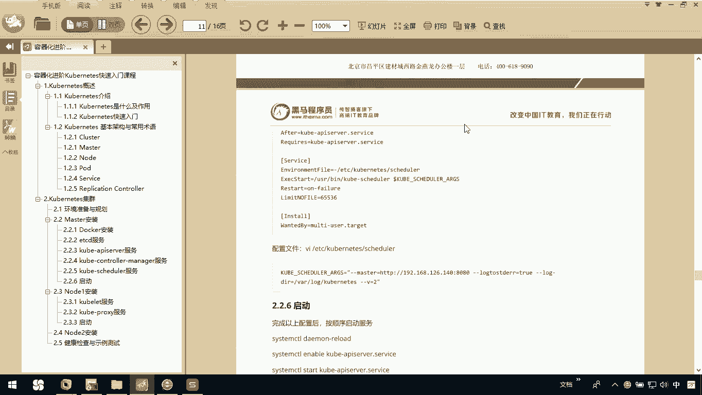
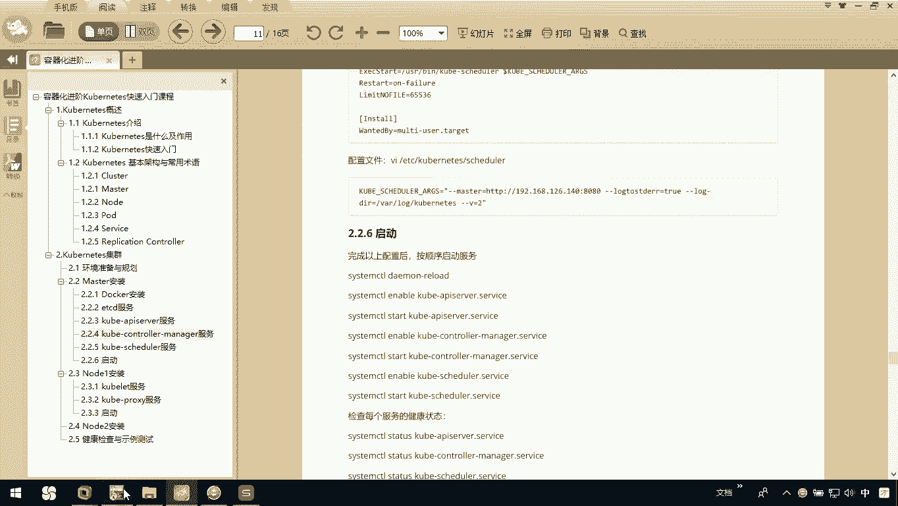
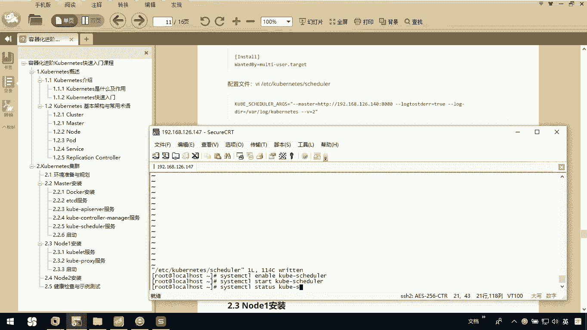
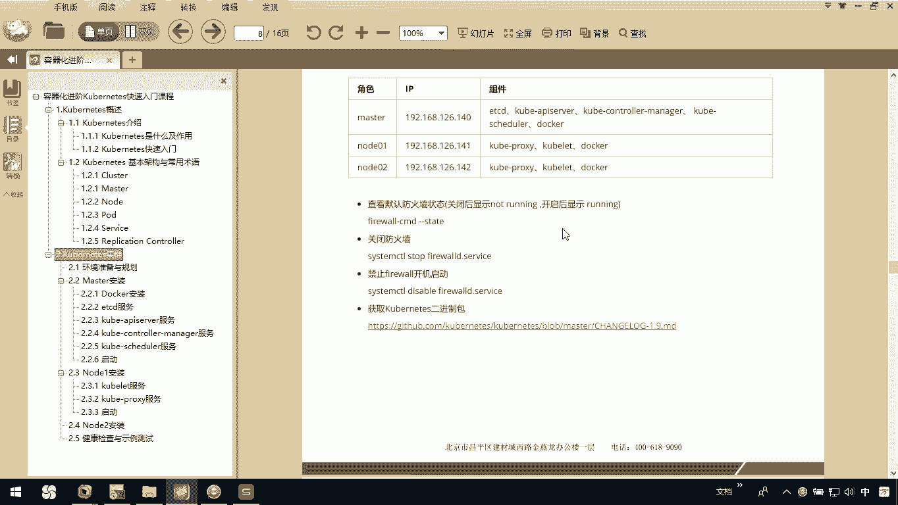

# 华为云PaaS微服务治理技术 - P58：11.Kubernetes集群搭建Master安装-启动 - 开源之家 - BV1wm4y1M7m5

接下来呢我们去把这个所有的服务啊都启动一下。那么我们先system CTLDEMN我们先去DAEMNRELOAD我先去把整个去reload一下，重新加载一下。然后呢。

我们先去启动我们当前的这个ETCD服务。

这么吧。ETCD然后呢，我再去star的ETCD大家呢可以看一下我当前的ETCD服务，它是一个activerun。然后呢我们。再把刀钩服啊起来。然后我们可以看一下当前的这个docker服务。

它也是一个running。呃，接下来我们就可以去提我们当前的这个cubnet相关的服务。首先我们起这个cubnet的 AI server服务ssem CTLAENABLEcober杠 AIERVER我们先把它进它ENABLEgober杠哎 sorryor start应该是star grouper杠 AISERVER然后呢。

你呢再起完以后啊，一定要看一下它的状态，它是。active running说明我们呢没问题的。然后呢，sst CTL。coer杠 CNTROLER杠MNHER我们把conter manager取一下。

s them4条starcoer杠 controller杠MNHER。Cem CTL4STATTUShoover CONTRMNH1。

这也是一个running。接下来呢我们要去起的是我们当前的这个schedule。Cem CTRENABLEKUBE杠SHEDULER。stateem CTL。

然后starcoer杠SHEDULER我们可以看一下呃tscoer杠SER呃杠SCHEDULER。

大家看一下我们当前的这个schedule服务，他是我报错了。他说我这里边有问题，呃，应该是我们整个服务失败了。我们看一下啊，说我们这个位置并下的coer scheduleule呃，告诉我们什么东西呢？

应该是我们在这个schedule里边呢。找不到，应该是他的配置文件有问题。我们看一下它的配置文件，我们找一下schedule，我们这个service文件应该没问题，它能找到这个服务。

那应该是我们这个配置文件里面有问题，我们可以看看啊呃。

VI一下我们的ETC下的cber nice下的SCHEDULER看一下它，你看一下这个值master没问题。我们四期找到这儿没问题。然后你看看是不是其他的呢？okK吧。

是不是前面这块我们在copy的时候应该少粘东西啊，coer杠SCH schedule。谁不到。这回我们在。重新去把我们这个。coer杠 SHEDULE进一下ststarcoer杠 SHEDULE。

我们重新起一下，这回我们再看一下它的状态。

OK吧，这样的话呢，我这个服务就起来了。那整体上我整个服务全都起来。也就是说我master这个节点呢基本搭建完了。但是大家别忘了啊，其实前期我们说过了，你应该把你的防火墙啊，都需要去禁掉。

或者说把它关闭。所以你在这里边你要去把我们的FIREWLD防火墙关了，因为你现在单击没问题。一会儿呢我们要去通过node节点去连你的master。那这个时候你要是不关防火墙，那么影响就大了。

