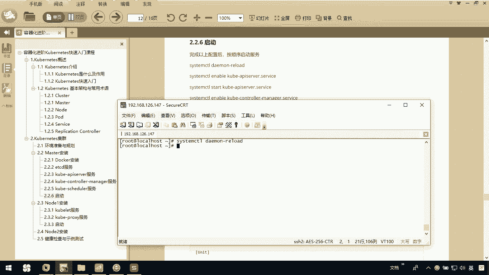
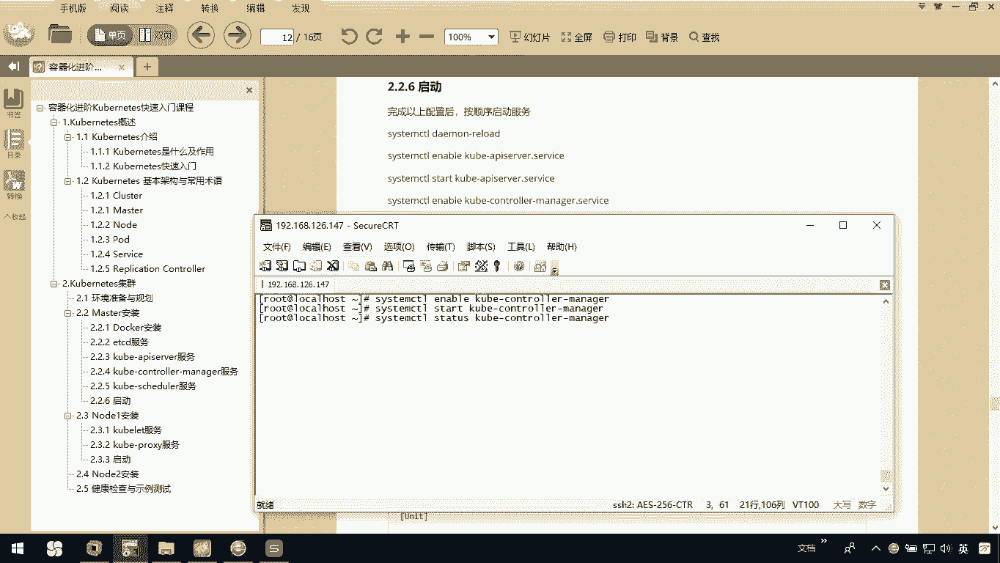
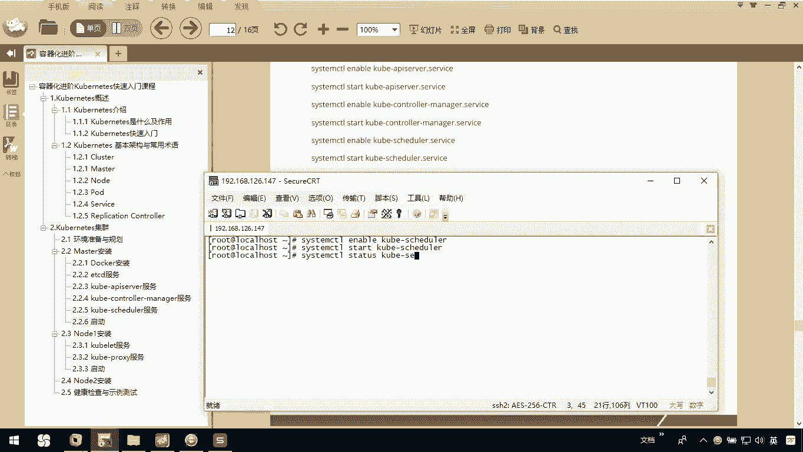
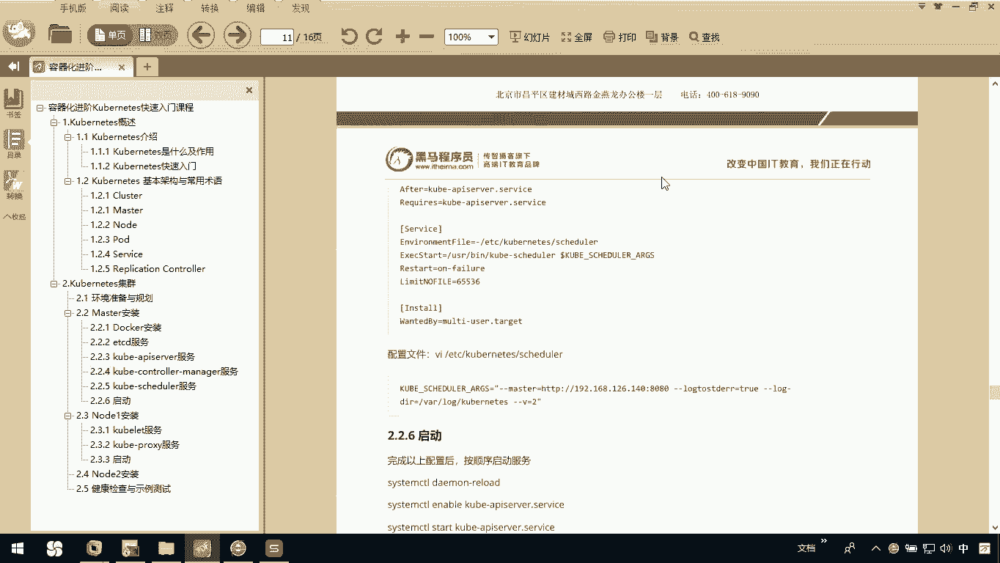
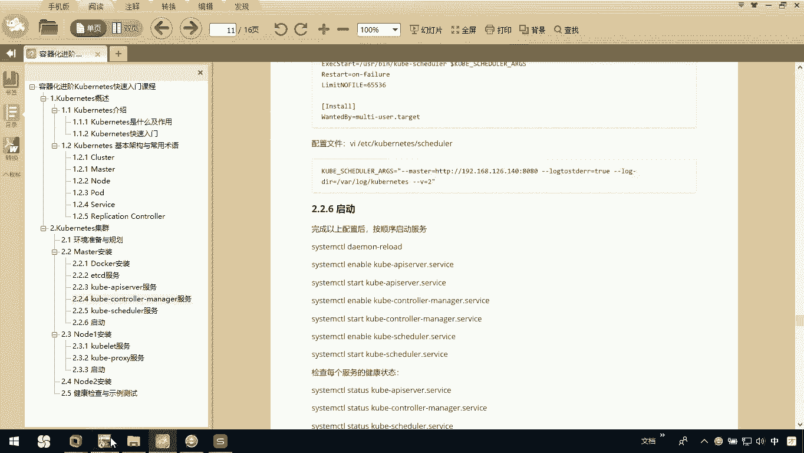
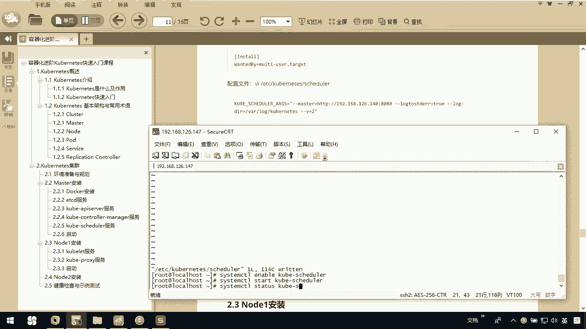
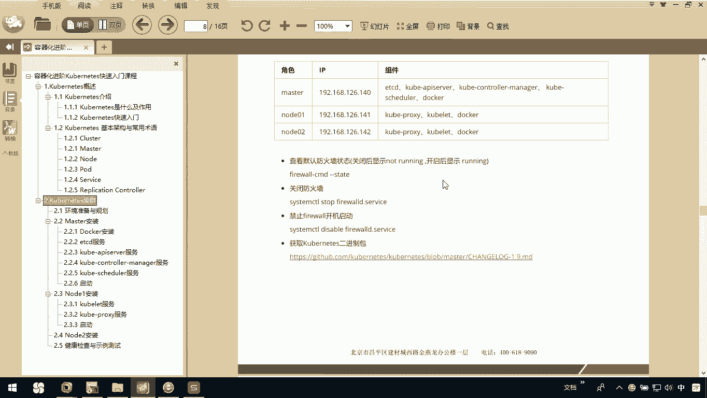

# 华为云PaaS微服务治理技术 - P58：11.Kubernetes集群搭建Master安装-启动

在本节课中，我们将学习如何启动Kubernetes Master节点上的所有核心服务，包括etcd、docker以及Kubernetes的各个组件，并确保它们正常运行。这是完成Master节点搭建的最后一步。



上一节我们完成了Kubernetes Master节点各组件的配置，本节中我们来看看如何启动这些服务并验证其状态。

## 启动前准备

首先，我们需要重新加载systemd的配置，以确保所有新创建或修改的服务单元文件生效。

以下是具体操作命令：
```
systemctl daemon-reload
```

## 启动核心服务

接下来，我们将按顺序启动etcd、docker以及Kubernetes的各个组件。

### 启动etcd服务

etcd是Kubernetes集群的后端存储，必须先启动。



以下是具体操作命令：
```
systemctl start etcd
systemctl status etcd
```
启动后，请检查状态是否为 **`active (running)`**。

### 启动Docker服务

Docker是容器运行时环境，也需要启动。



以下是具体操作命令：
```
systemctl start docker
systemctl status docker
```
同样，请确认其状态为 **`active (running)`**。

### 启动Kubernetes API Server

API Server是Kubernetes集群所有操作的入口。

以下是具体操作命令：
```
systemctl enable kube-apiserver
systemctl start kube-apiserver
systemctl status kube-apiserver
```
启动后，务必检查其状态是否为 **`active (running)`**。

### 启动Kubernetes Controller Manager



Controller Manager负责运行集群控制器。



以下是具体操作命令：
```
systemctl enable kube-controller-manager
systemctl start kube-controller-manager
systemctl status kube-controller-manager
```
确认其状态为 **`active (running)`**。

### 启动Kubernetes Scheduler

Scheduler负责将Pod调度到合适的Node节点上。

以下是具体操作命令：
```
systemctl enable kube-scheduler
systemctl start kube-scheduler
systemctl status kube-scheduler
```
如果启动失败（例如状态显示为failed），通常是由于配置文件问题。请检查配置文件 `/etc/kubernetes/scheduler` 中的关键参数（如 `--master` 地址）是否正确。修正后，再次执行启动和状态检查命令，直到状态变为 **`active (running)`**。



## 配置防火墙

所有服务启动后，必须确保防火墙不会阻止集群节点间的通信。在单机学习或测试环境中，最简单的方法是关闭防火墙。

以下是具体操作命令：
```
systemctl stop firewalld
systemctl disable firewalld
```
**注意**：在生产环境中，应配置具体的防火墙规则来开放所需端口，而不是直接关闭防火墙。

## 总结



本节课中我们一起学习了如何启动Kubernetes Master节点的所有核心服务。我们按顺序启动了etcd、docker、kube-apiserver、kube-controller-manager和kube-scheduler，并学会了使用 `systemctl status` 命令来验证每个服务的运行状态。最后，我们强调了关闭或配置防火墙以确保节点间网络通畅的重要性。至此，Kubernetes Master节点的基本搭建工作已经完成。