# 华为云PaaS微服务治理技术 - P59：12.Kubernetes集群搭建Node安装-准备工作 - 开源之家 - BV1wm4y1M7m5

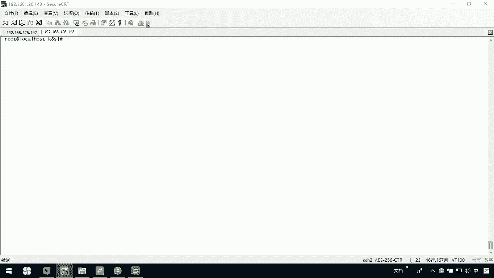

下面呢我们说一下node节点安装。那么无论我们的node一节点，还是后续我们的node2节点。那么他们在安装之前呢，都都有一些准备工作。那么第一件事呢，它是需要把我们co的一些安装的文件。

或者是一些服务啊，给它安装到我们当前的这个节点上，一个是co，还有一个是coer proxy。那我们先把这个事情做一下啊，我呢在当前的user下。

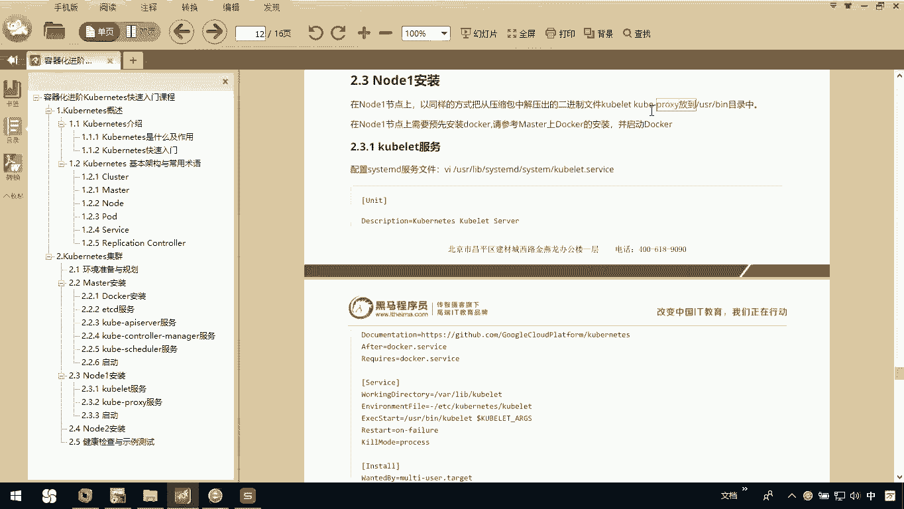

local创建了1个K8S目录。那我们可以通过RG命令啊去把我们当前的这个K8S。人家给他装过来。我先把它上传上来，上传上来以后呢，我们把它解压开，然后呢找到我们的co和cocopy到user幕下。

那第二件事就是我们必须得在node节点上啊去安装docker。那么大家可以参考我们之前master这个节点上的这个docker的安装。我们看一下这边是否传完了，马上就完事。现在呢已经84%了88。

我们这个上传完以后呢，一会儿我去把这个co和我们当前的这个copro文件呢给它找到copy到user并下。那我在这里边杠JSVF我们的它那这里边呢我们稍微等一下，等它把它解压完解压完以后呢。

我们再去操作。

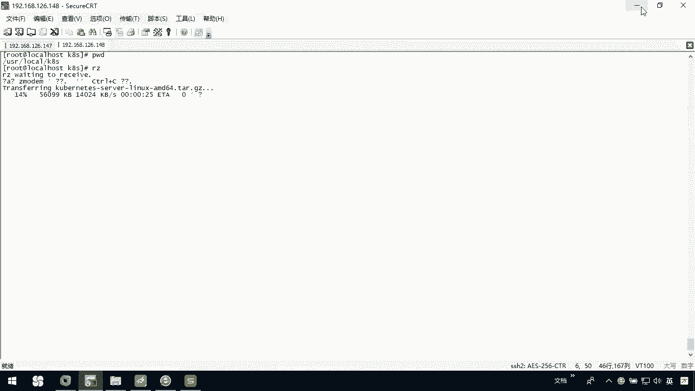

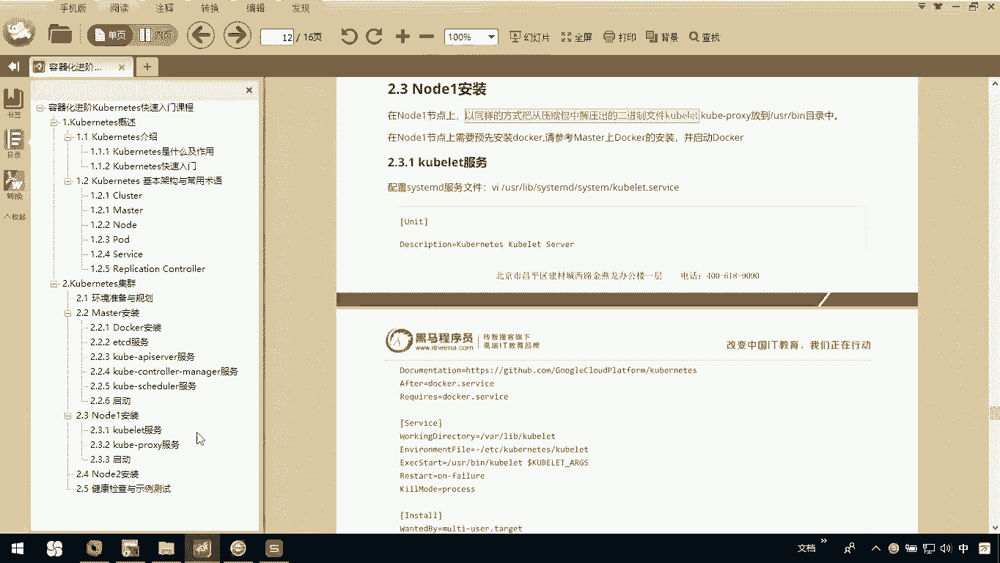

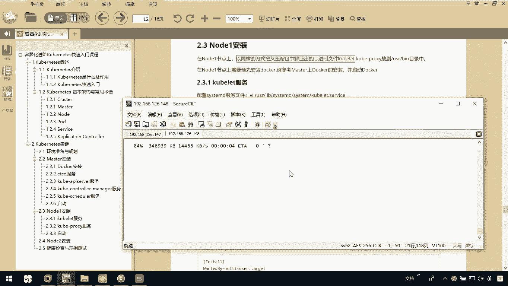

那关于这个node节点啊，这个前期准备就这么两件事，大家一定要注意了。还有就是你要注意我这个node节点跟我讲义上在最开始关于进行搭建的，我们这个IP地址是有差异的，你一定要注意了。

我们跟现在这个呃文件上写的是140和141，这是我们的master和我的node，而我真实操作中，我的master是147，我的node是148。那回来我们还看到这儿，我现在呢已经把它解开了。

然后呢我们LLD进我们的这文件，然后我们再来看CD我们的serv。然后呢CD我的目录下，找到我们要的er还有一个叫做coer我们CP一下。

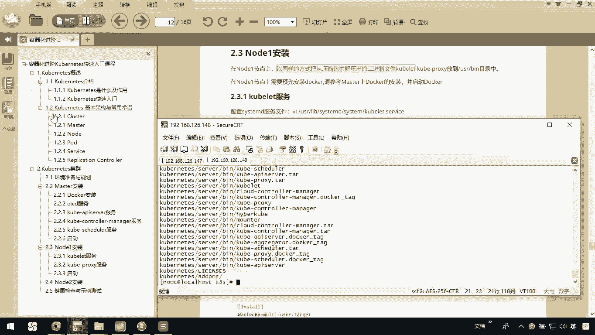

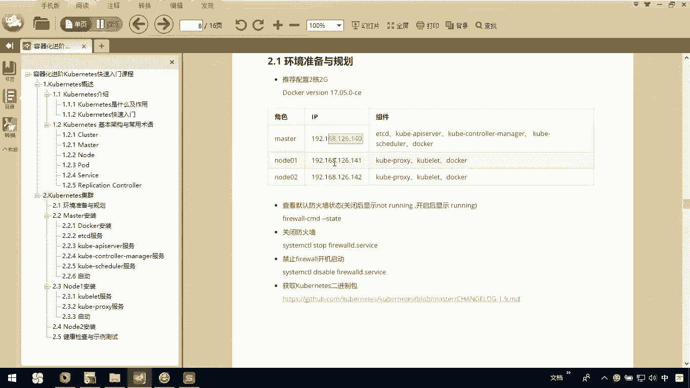

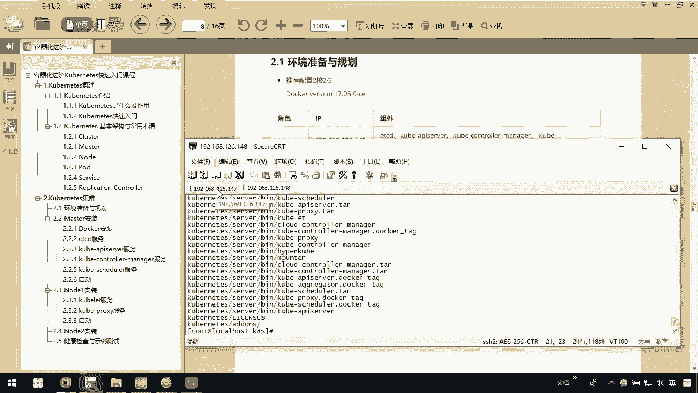

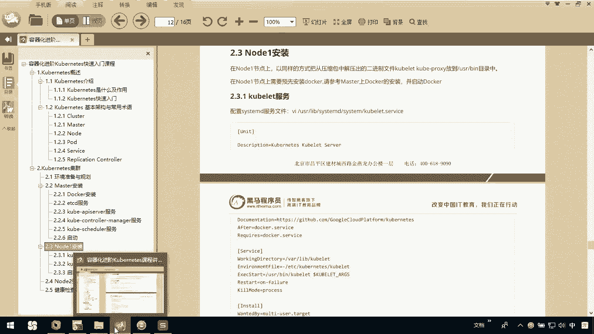

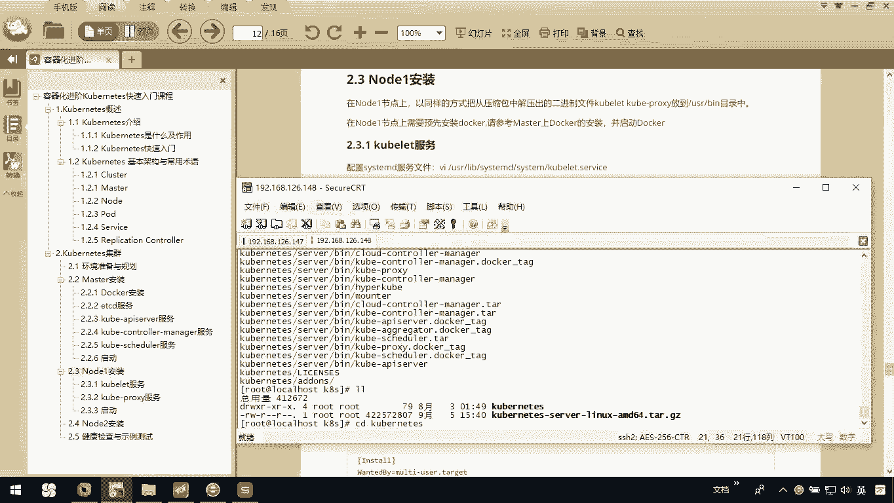

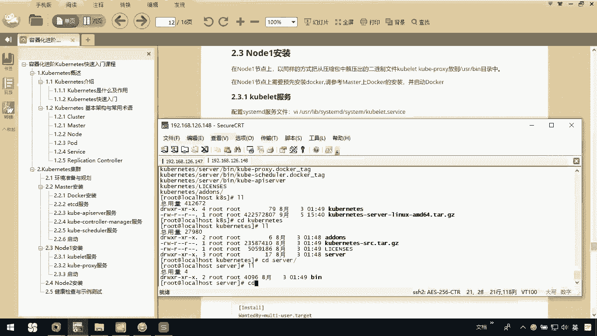

我们把这个coer light，还有这个coer。杠xy这两个文件copy到我们user下的B目录像。OK这是第一件事。我们关于这个node节点的要准备的。第二件事就是关于我们的这个do安装。我说了。

你参考我们的原来master里面的刀装我的啊，我的镜像都已经配置好了。那我只需要去store，我们的刀cker杠ENGNE然后呢，我干Y一下，我去安装它呃，把它安装完。

我们整个node节点的准备工作就完成了。

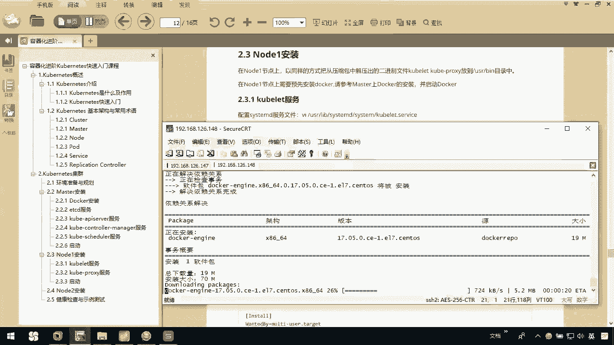