# 华为云PaaS微服务治理技术：P59：12.Kubernetes集群搭建Node安装-准备工作 🛠️

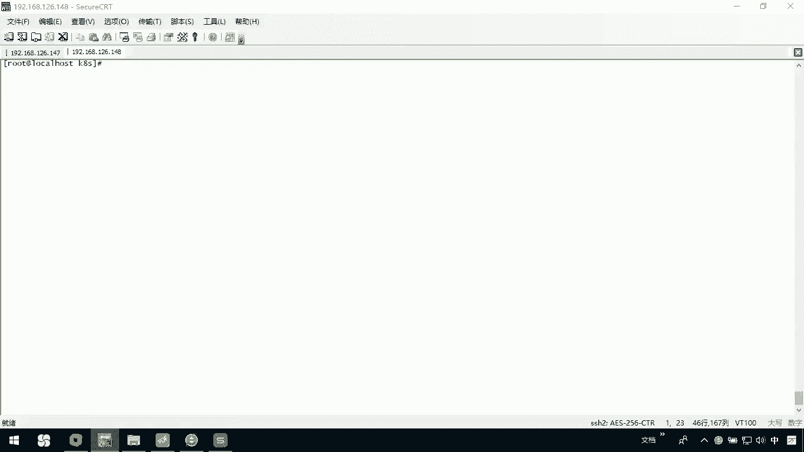

在本节课中，我们将学习如何为Kubernetes集群的Node节点进行安装前的准备工作。这包括安装必要的Kubernetes组件和Docker容器运行时。

## 概述

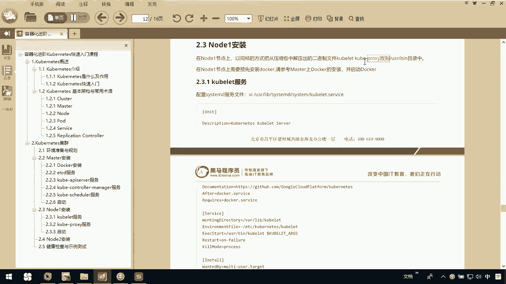

无论安装第一个Node节点还是后续的Node节点，在开始之前都需要完成一些共同的准备工作。主要有两件事：安装Kubernetes核心组件（kubelet和kube-proxy）以及安装Docker。

## 准备工作一：安装Kubernetes组件

首先，我们需要将Kubernetes的安装文件或服务安装到当前节点上。具体需要安装`kubelet`和`kube-proxy`这两个组件。

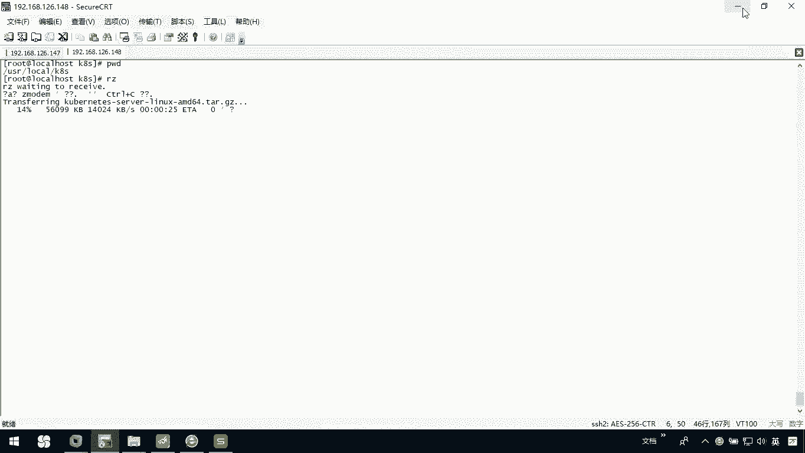

以下是具体操作步骤：

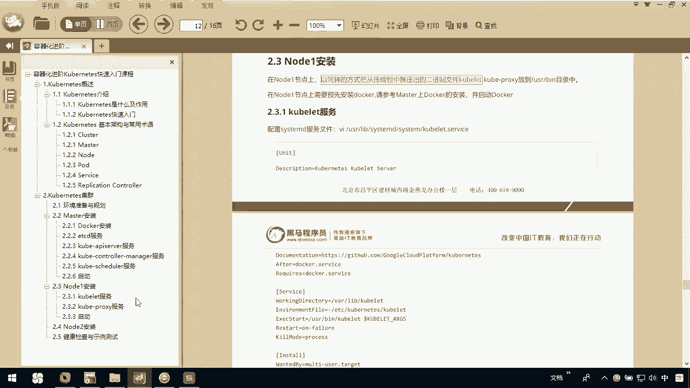

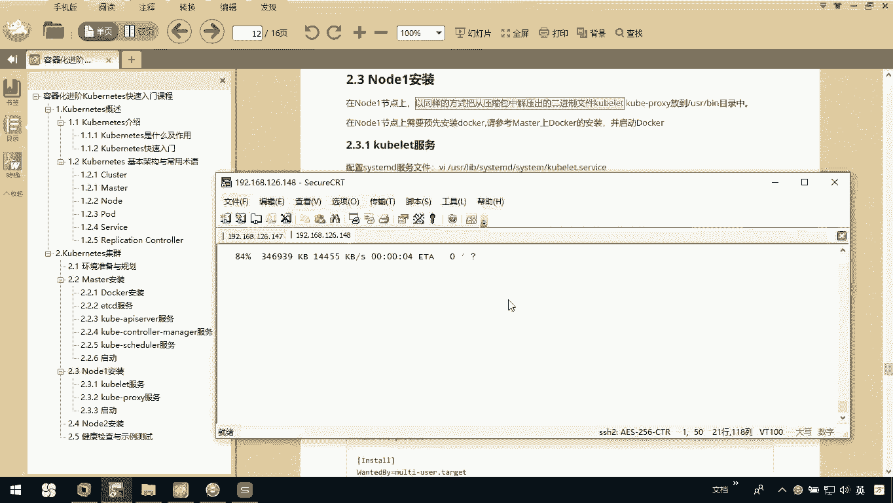

1.  在`/usr/local`目录下创建一个名为`k8s`的目录。
2.  使用`rz`命令将Kubernetes安装包上传到该目录。
3.  解压上传的安装包。
4.  从解压后的文件中找到`kubelet`和`kube-proxy`文件。
5.  将这两个文件复制到系统的`/usr/bin`目录下。

操作完成后，Kubernetes的核心组件就安装好了。

## 准备工作二：安装Docker

第二件事是在Node节点上安装Docker。安装过程可以参考之前Master节点上的Docker安装步骤。

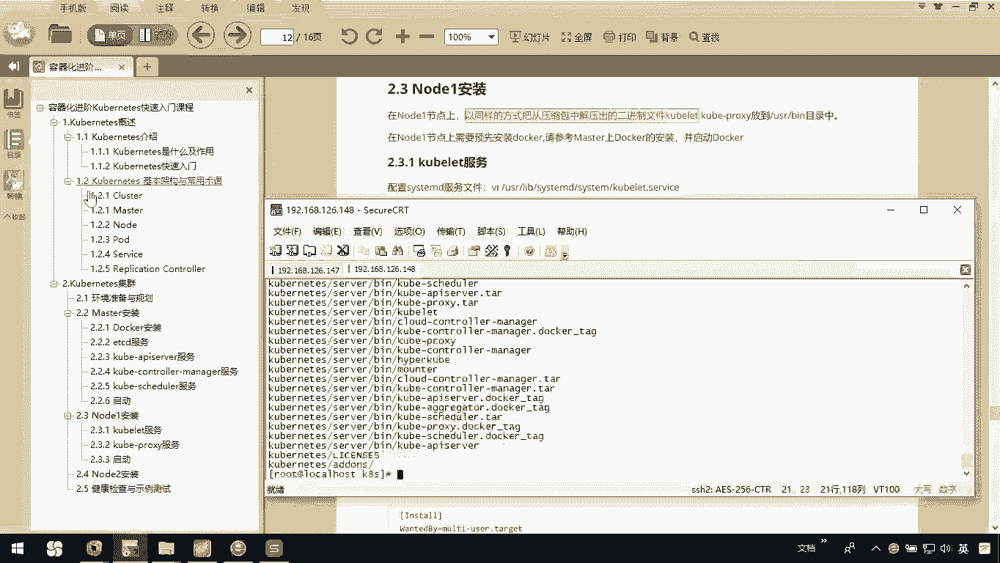

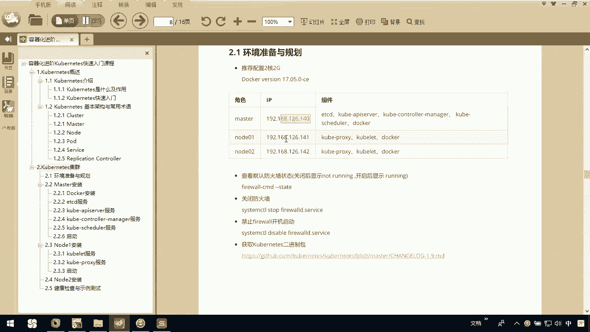

具体命令是执行 `yum install docker-engine -y` 来安装Docker引擎。安装完成后，Node节点的基本软件环境就准备就绪了。

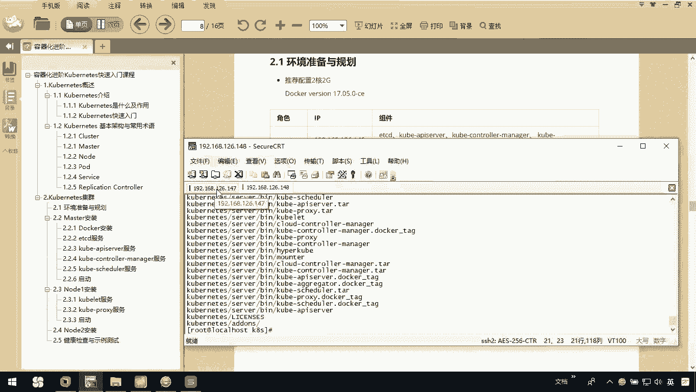

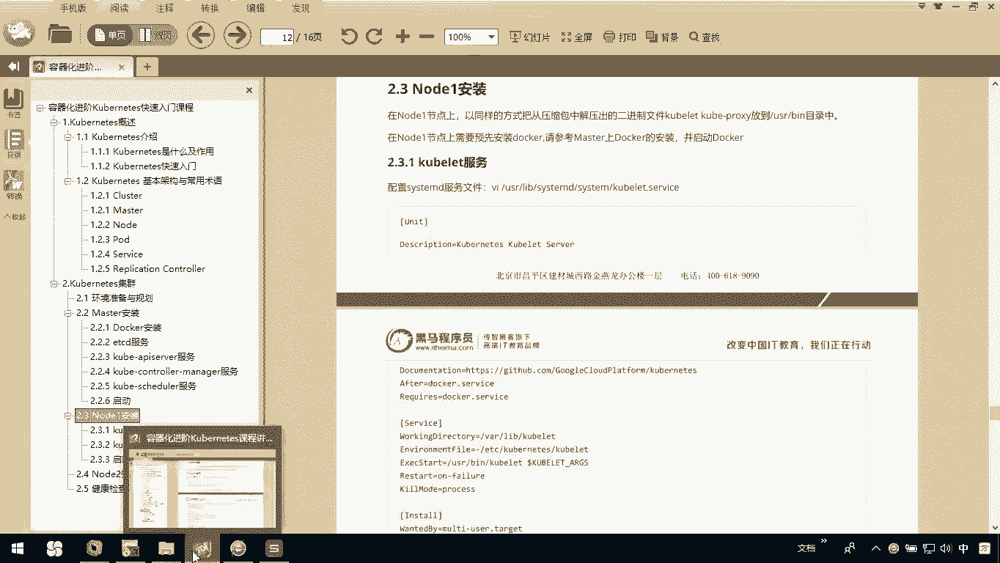

## 重要注意事项

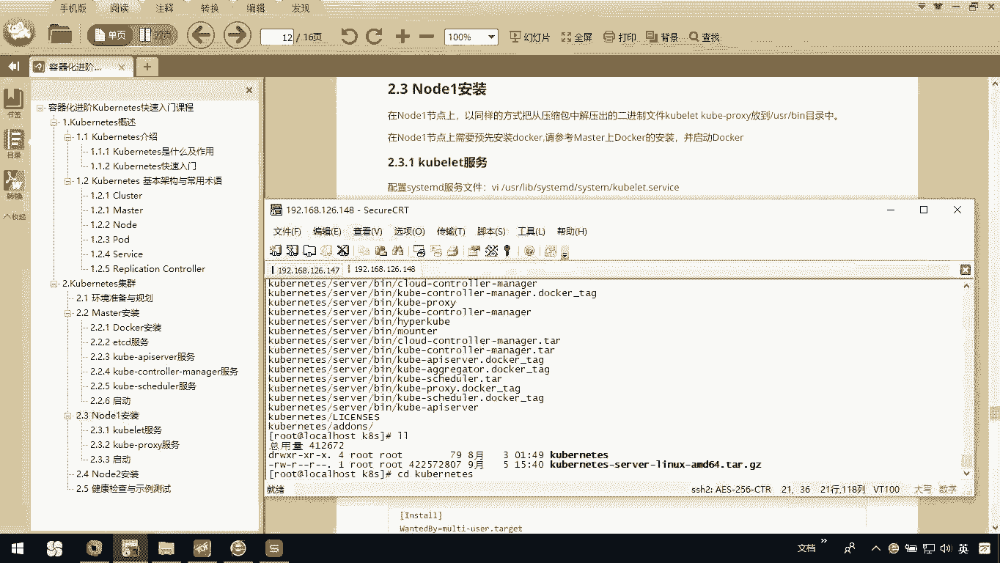

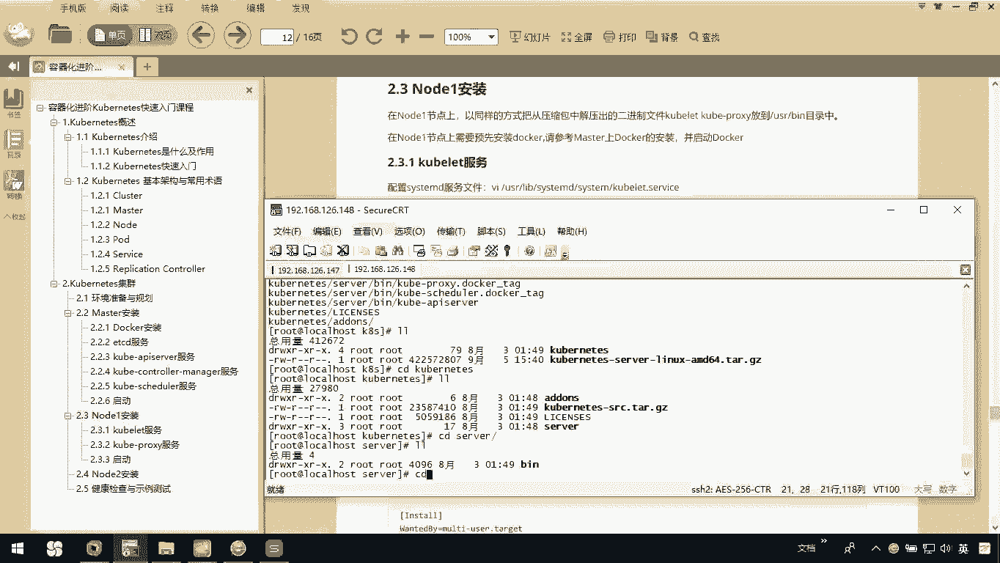

在操作过程中，有两点需要特别注意：

*   **IP地址差异**：请注意，实际操作中的IP地址（例如Master为147，Node为148）可能与讲义或文档中示例的IP地址（例如140和141）不同。请务必使用你自己环境的真实IP。
*   **操作确认**：完成上述两个步骤后，Node节点的前期准备工作就全部完成了。

## 总结

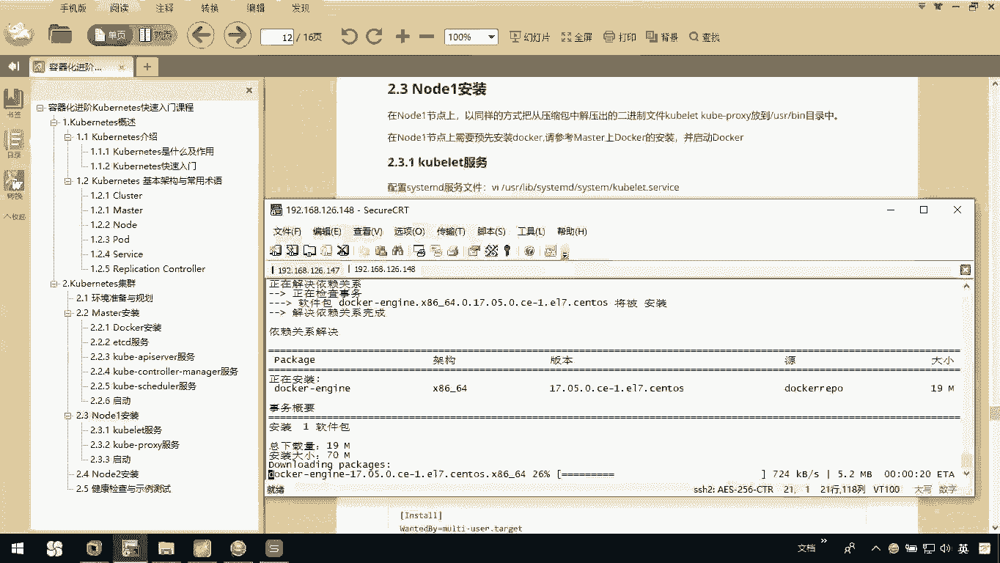

本节课我们一起学习了为Kubernetes Node节点做安装准备。核心工作包括安装`kubelet`、`kube-proxy`组件以及Docker容器运行时。完成这些步骤后，Node节点就具备了加入Kubernetes集群的基础条件。