# 华为云PaaS微服务治理技术 - P5：05.docker安装 - 开源之家 - BV1wm4y1M7m5

好接下来呢我们来讲解一下docker的安装与启动，首先我们第一个环节就是来说一下docker的安装，那docker呢官方建议在乌邦图下安装，因为我们说docker本身就是基于乌邦图来发布的啊。

这个汪图呢也是属于LINUX系统的一种呃，但是我们这个之前所学习的这个LINUX，都是CENTOS啊，所以说我们这里也可以把docker装到这个SNOS上，SIOS呢这里注意的版本啊。

用的是SUS7点X版本啊，也就是说这个建议是在装在，七点X版本版本之上，呃我们如果说在六点X版本中会有一些问题，比如说这个时候呢，你需要去安装一些其他很多环境啊，零另外呢很多刀和补丁它也不支持更新。

所以说呢如果说你采用的是三段S啊，那么就一定是采用七点X以上版本，那我们在这里呢已经给大家提供了配套的渗透，S的镜像啊，这个镜像呢是我们VR的镜像啊，你说我们这里首先应该装一个啊，这个C6S7的X。

那这个镜像都给大家已经提供了啊，大家首先把这个C6S7的这个镜像解压加，之后呢，我们这里双击这个VMX这个这个这个文件，双击一下，双击之后呢，这时候呢，就将这个镜像已经挂载到这个VV2了啊。

那这时候我们怎么办呢，我们可以启动一下，启动一下。

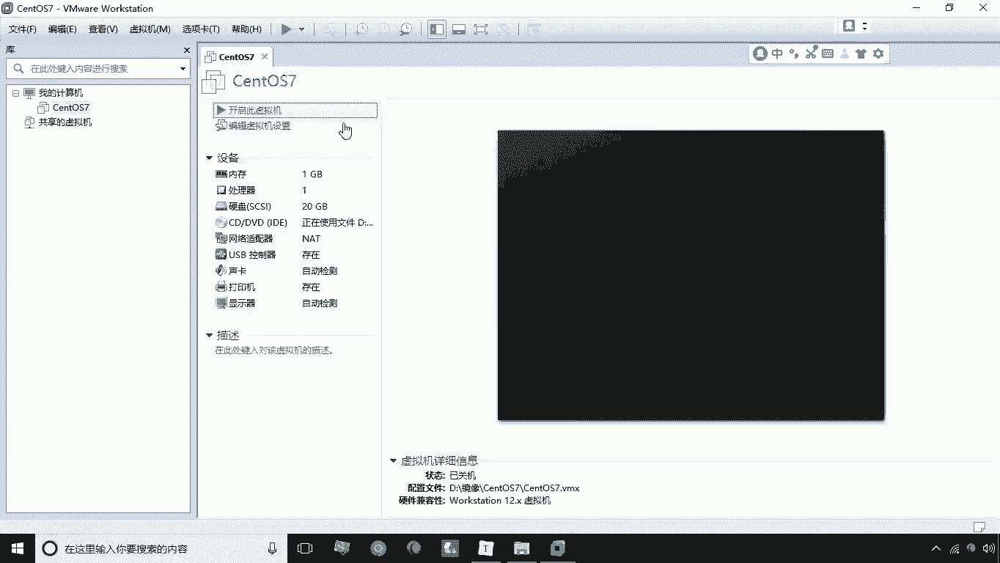

好现在正在启动，我们可以把这个三和S7呢，想象成是一个服务器啊，想成服务器啊，这里我们输入密码root it cost，密码是it cost，好，现在呢就已经进入到这个思路S7了啊。

我目前给大家提供这个版本是不带这个桌面的，那这时候呢我们可以通过IPADDR这个命令呢，我们可以查看当前的系统的这么一个IP啊，当前系统IP对当前系统IP是192。16，8。184。141啊。

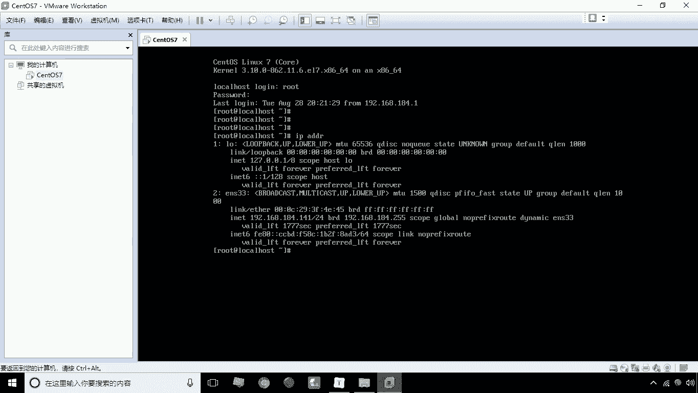

那所以说我们现在呢就通过这个通过什么呢。

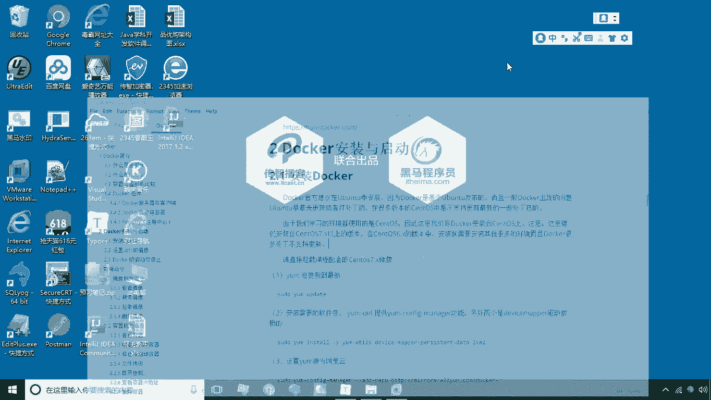

通过这个sec c RT啊，然后呢通过它来进行连接。

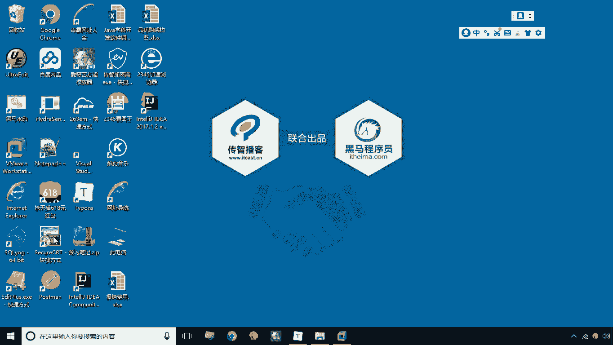

进行连接打开打开之后呢，咱们这里配一个新的这么一个连接，然后主机名192168。184。141啊，端口默认是22，用户名是root，那接下来我们点一下完成好，然后点一下连接，连之后呢。

我们这里点击选择接受并保存密码呢，我们输入it cost，点击保存密码，点确定好，现在呢我们就已经远程的连到啊，这台服务器上了啊。

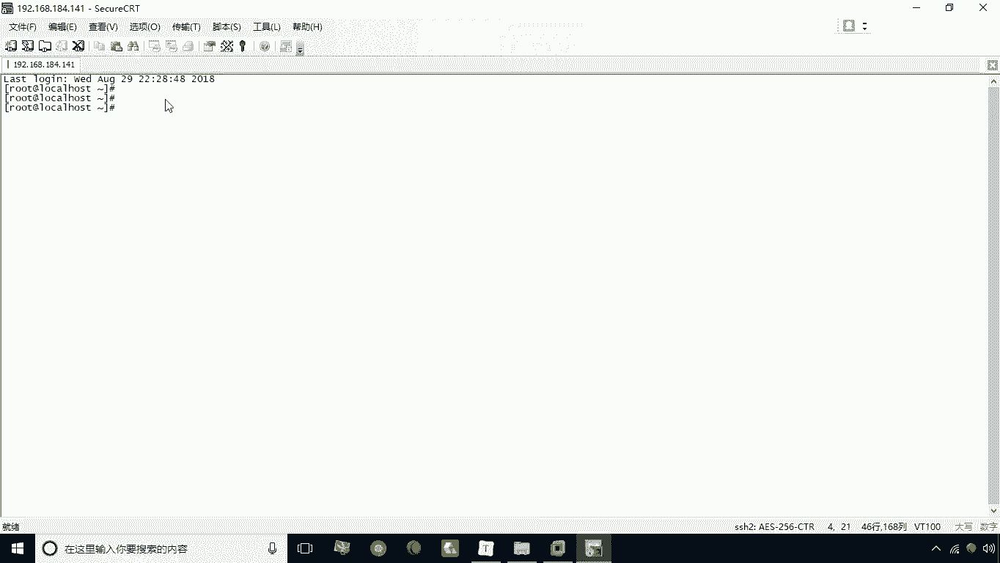

我们可以把它想象成是一个服务器，我们说这个系统本身深度S7的。

这个系统就是什么呢，就是就是我们所说的宿主机啊，后面我们多次会提到这个概念叫宿主机啊，那么把这个连接上之后呢，啊，接下来我们再做一些其他的一些啊，环境上的一个选择啊，就是环境和风格的一个选择。

比如说仿真这里我们所选择这个LINUX。

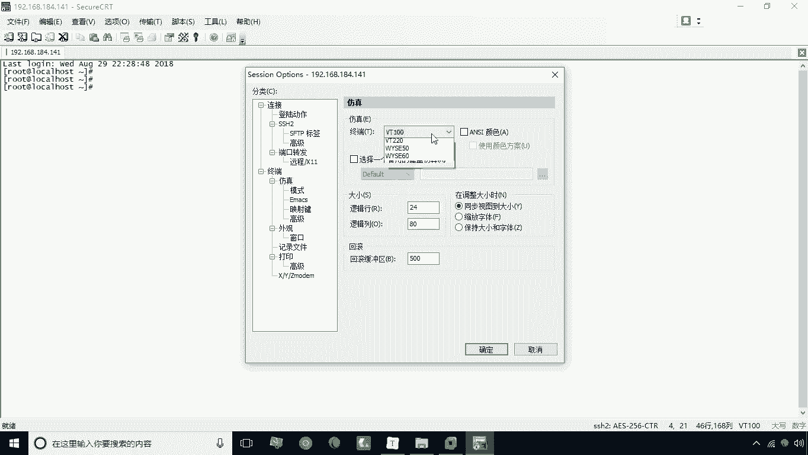

这时候呢这个界面就变成了黑色啊。

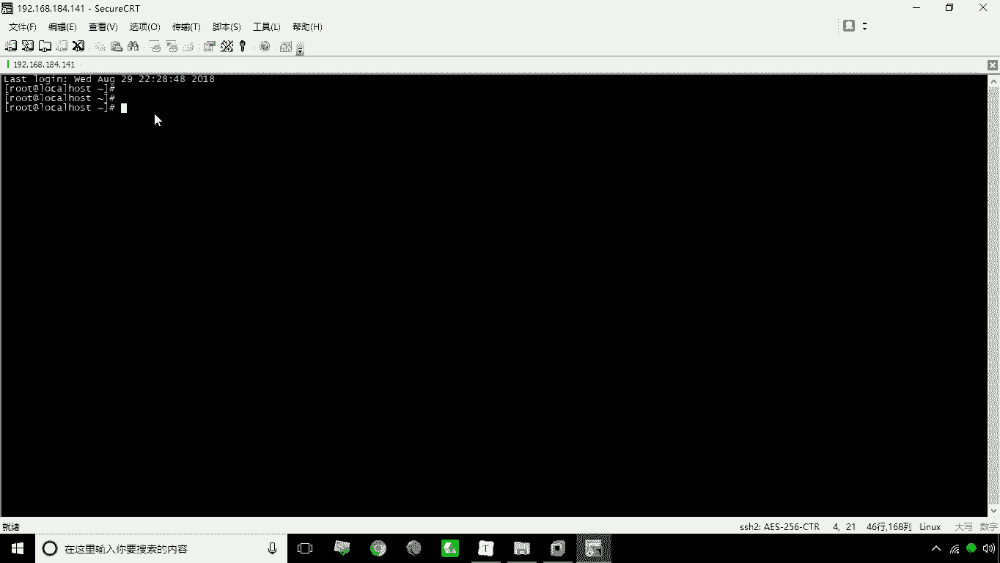

另外呢啊再改一下什么的，改一下我们的外观里的这个这个编码。

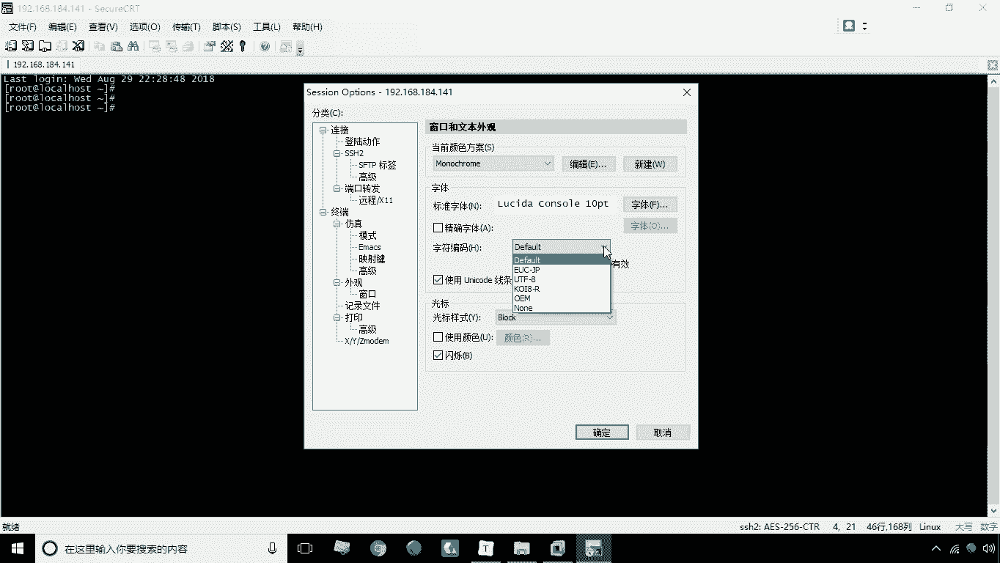

字符编码我们改成UTF杠八，否则的话呢就是在遇到一些中文的时候，就会乱码好，这是我们说的这个第一步啊。

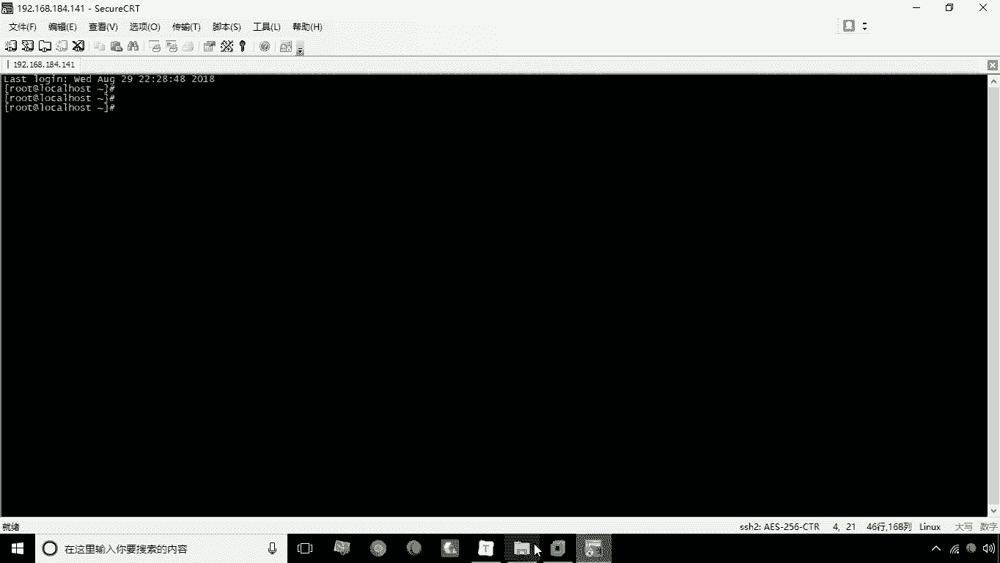

就是把环境准备好了，环境准备好之后呢，接下来咱们就说一下怎么去安装啊，安装呢其实这些步骤呢大家都不用去做了，因为我给大家所提供的这个斯诺S7镜像呢，都已经完成了这些步骤了啊。

那所以说我们在这里就简单了解一下，第一步呢，我们要去将我们的亚目包更新到最新啊，也就是说通过亚update这个命令来更新，这个样本身的这个软件，然后第二步呢就是要安装需要的这个软件包。

我们需要什么软件包呢，啊需要去用到一个什么呢，用到了一个亚目U条这么一个工具包啊，这个工具包呢需要去安装的啊，需要通过这个样明令来进行一个安装，那么安装呢这里提供了一个叫YMCONFIGMEIER。

这么一个功能啊，这个功能我们后面会用到啊，就这个工这是一个工具包啊，连工具包里提供这么一个功能会，我们会后边会用另外两个呢，就是说我们它本身的一个呃，这个驱动的一个依赖啊，驱动的一个依赖。

我们需要去执行这句话来进行安装，安装之后呢，接下来我们要什么呢，要去用到了这个ym config manager，用它干嘛的呢，哎主要是用来设置亚目的，亚目源为阿里云啊，那么如果说是你不设置个云的那个。

那个圆的话啊，要不圆的话，它就会默认找什么呢，找这个国外的这个站点啊，那这样一来呢，还有可能你后边这个安装就会有问题啊，就会通过这个网络问题，就连接不上，所以说我们这里呢通过这个改变一下这个亚目。

亚目这个原为阿里云，就是通过这句话啊啊进行一个设置，设置好之后呢，我们第四步就是要安装docker，安装docker，安装docker的话，这里注意要安装什么呢，安装这个docker ce。

也就是说docker这个软件呃，在1。313版本之后，它都分为两个版本，两个版本一个是docker的C，一个是docker意义啊，那么C就是社区版，意义呢就是企业版，那么企业版是收费的啊。

而docker的C呢是社区版是免费使用的，其实我们说的这个这个安装。

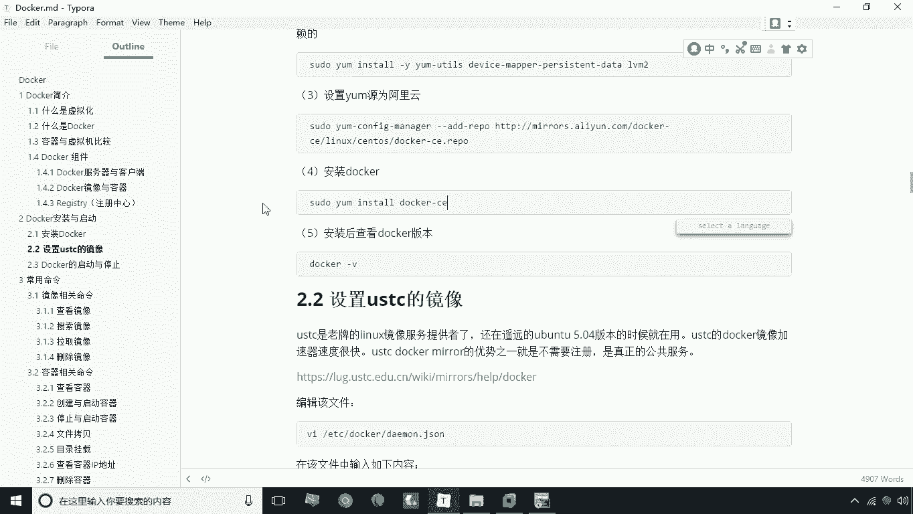

那么接下来我们说安装成之后呢，我们可以通过docker杠V，杠V来查看一下当前的这个版本啊，当前版本我们用的是18。06。1，这个版本是CE的版本好。

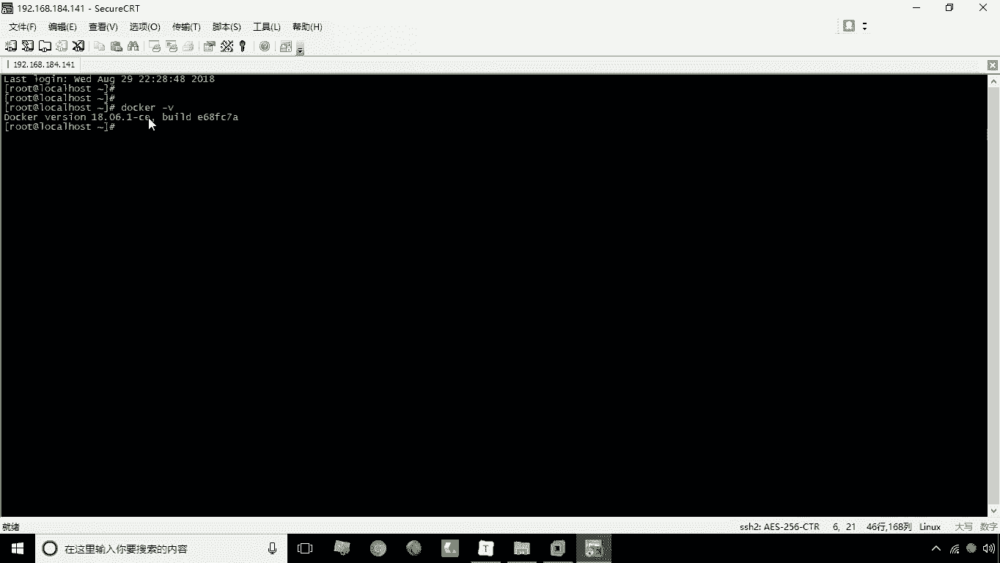

这就是关于docker的安装。

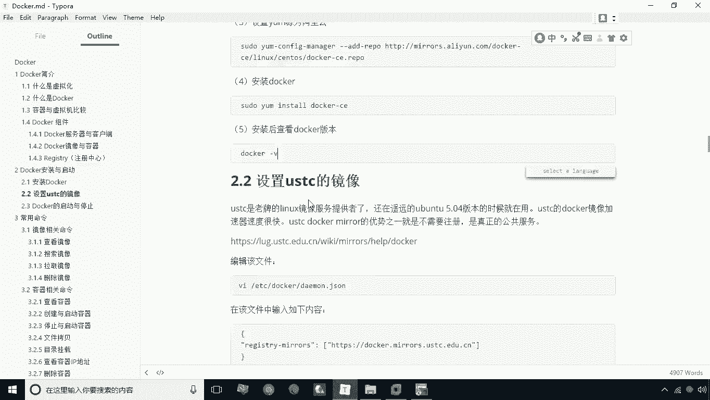