# 华为云PaaS微服务治理技术 - P5：05.docker安装 🐳

在本节课中，我们将学习如何在CentOS 7系统上安装Docker。Docker是一个开源的应用容器引擎，它可以帮助我们轻松地打包、分发和运行应用程序。我们将从环境准备开始，逐步完成Docker的安装与验证。

## 环境准备与连接

Docker官方建议在Ubuntu系统上安装，因为Docker本身是基于Ubuntu发布的。然而，我们之前学习使用的Linux系统是CentOS。因此，我们将在CentOS 7.x版本上安装Docker。请注意，不建议在CentOS 6.x版本上安装，因为可能会遇到环境依赖和补丁更新支持的问题。

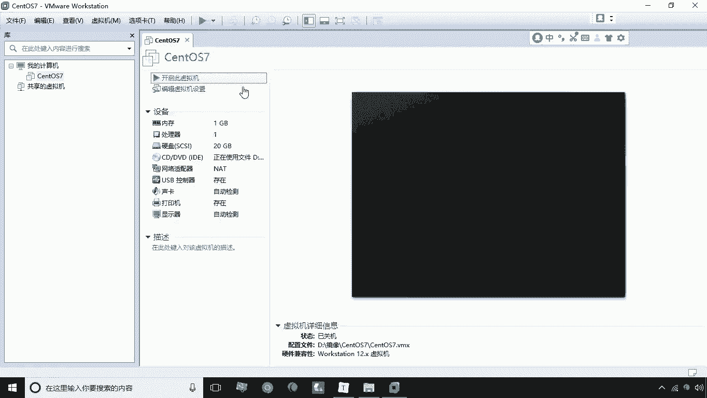

我们已为您提供了配套的CentOS 7虚拟机镜像。首先，请解压该镜像文件，并使用VMware等虚拟机软件加载其中的`.vmx`文件。启动虚拟机后，您将进入CentOS 7系统。

当前提供的CentOS 7版本不带图形化桌面。您可以通过以下命令查看系统的IP地址：

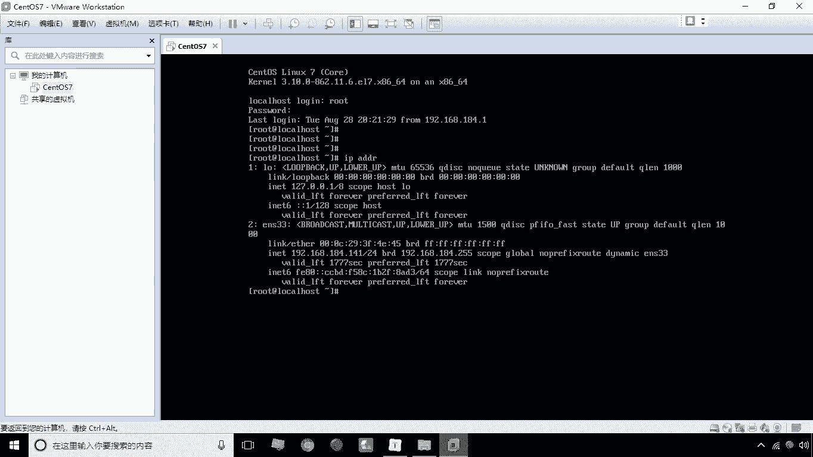

```bash
ip addr
```

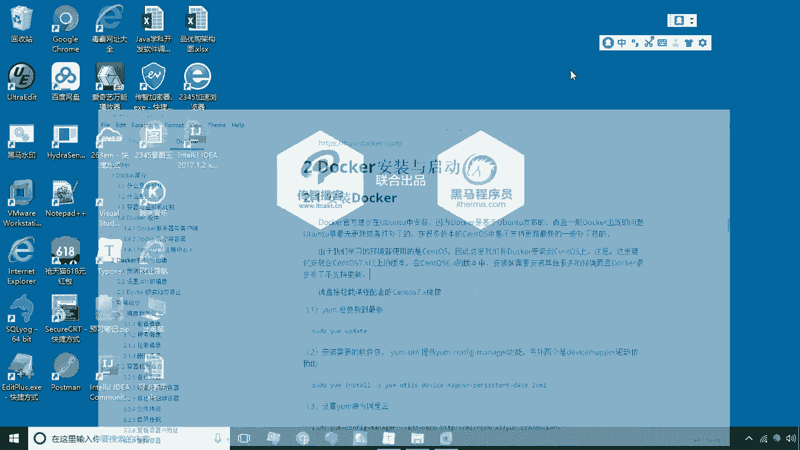

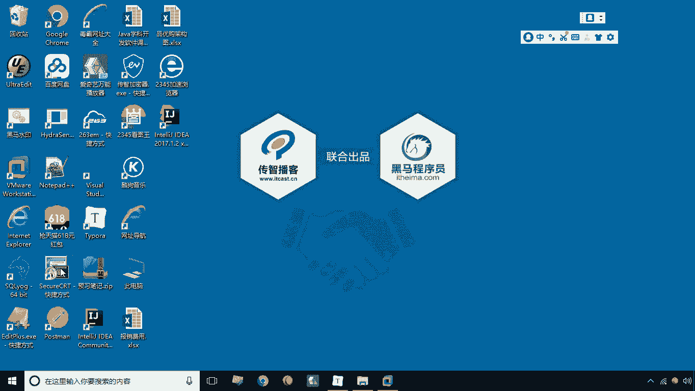

假设查看到的IP地址是`192.168.184.141`。接下来，我们可以使用SSH工具（如SecureCRT或Xshell）远程连接到这台服务器。

以下是连接步骤：
1.  打开SSH客户端，新建一个连接。
2.  主机名填写`192.168.184.141`，端口保持默认的`22`。
3.  用户名为`root`，密码为`itcast`。
4.  连接成功后，接受并保存密钥。

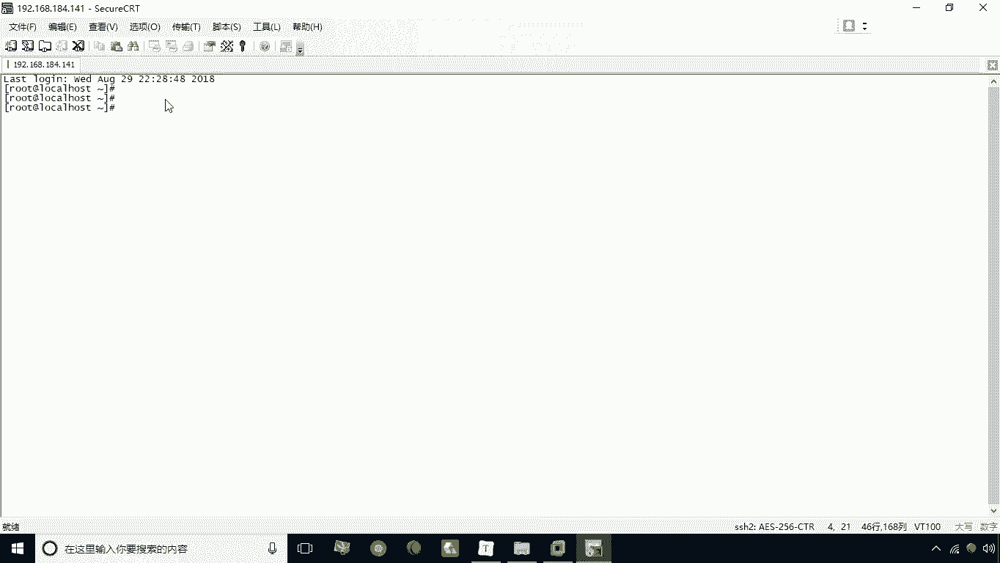

为了获得更好的操作体验，建议进行以下设置：
*   在终端仿真选项中，选择`Linux`，界面将变为黑色背景。
*   在外观或字符编码设置中，将编码改为`UTF-8`，以避免显示中文时出现乱码。


至此，我们已经成功连接到了作为**宿主机**的CentOS 7服务器，并完成了基本的环境配置。

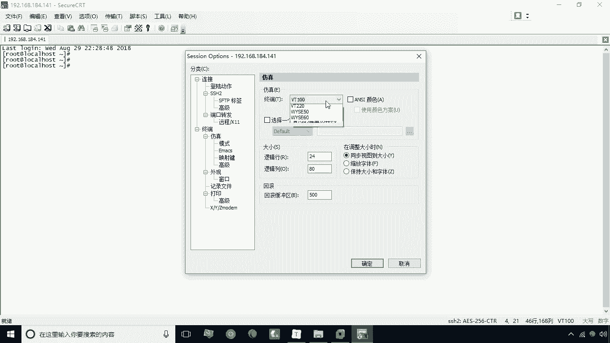

## Docker安装步骤详解

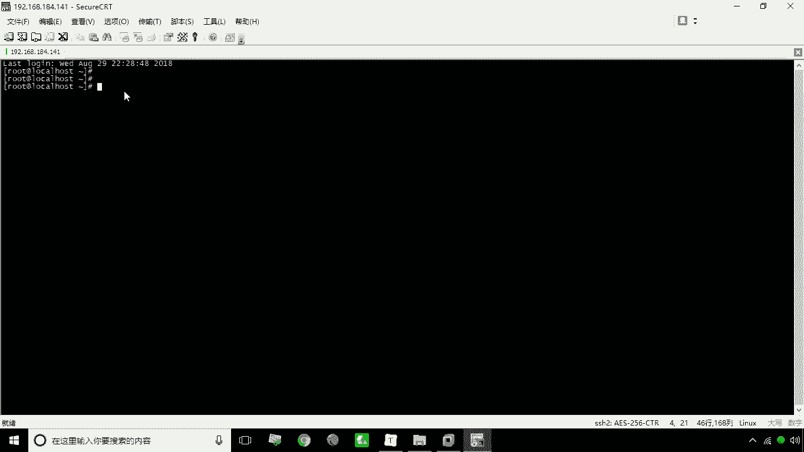

上一节我们准备好了CentOS 7环境，本节中我们来看看安装Docker的具体步骤。请注意，您所使用的镜像已经完成了以下所有步骤，此处进行讲解是为了让您了解完整的安装流程。

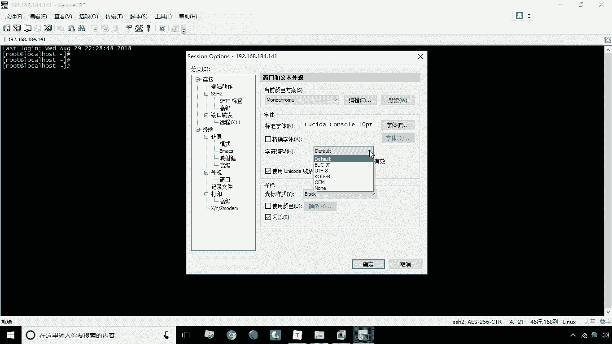

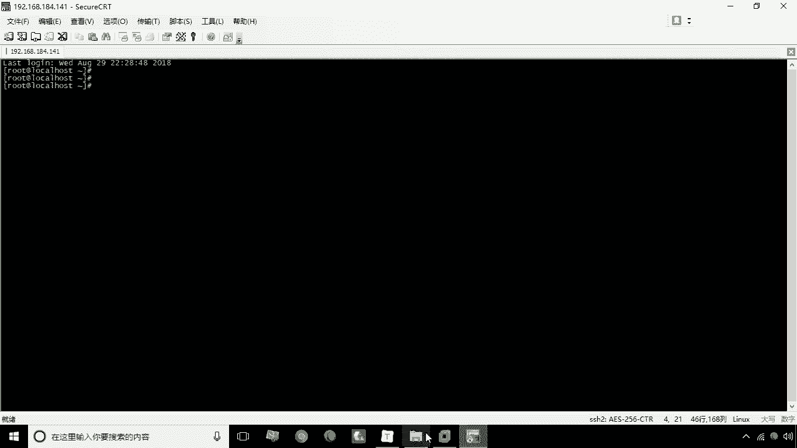

标准的Docker安装包含以下几个核心步骤：

1.  **更新Yum软件包索引**
    首先，我们需要将系统的Yum包更新到最新状态，以确保能获取到最新的软件源信息。
    ```bash
    yum update
    ```

2.  **安装必要的软件包**
    Docker的运行需要一些特定的工具和依赖。我们需要安装`yum-utils`工具包（它提供了`yum-config-manager`实用程序）以及设备映射器持久化存储和LVM2驱动依赖。
    ```bash
    yum install -y yum-utils device-mapper-persistent-data lvm2
    ```

3.  **设置稳定的Docker镜像仓库（Yum源）**
    默认的Yum源可能连接速度较慢或不稳定。为了提高安装速度和成功率，我们将Docker的Yum源设置为国内的阿里云镜像。
    ```bash
    yum-config-manager --add-repo http://mirrors.aliyun.com/docker-ce/linux/centos/docker-ce.repo
    ```

4.  **安装Docker引擎**
    从Docker 1.13版本起，Docker分为社区版（CE）和企业版（EE）。社区版免费，企业版收费。我们安装社区版。
    ```bash
    yum install -y docker-ce
    ```

## 验证安装

安装完成后，我们需要验证Docker是否成功安装并查看其版本。

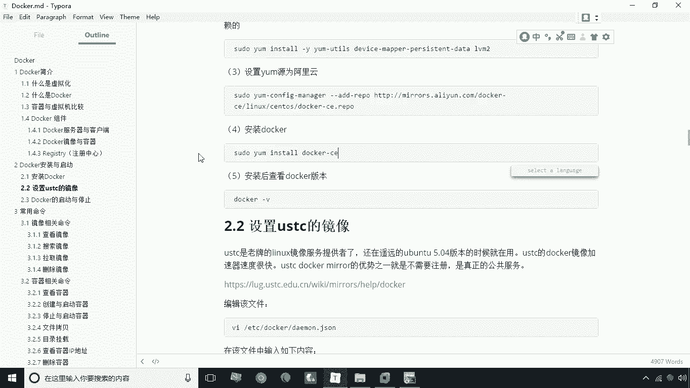

您可以通过运行以下命令来检查Docker版本：
```bash
docker -v
```
如果安装成功，命令行将输出类似 `Docker version 18.06.1-ce, build e68fc7a` 的信息，这表明您安装的是18.06.1版本的Docker社区版。

## 总结

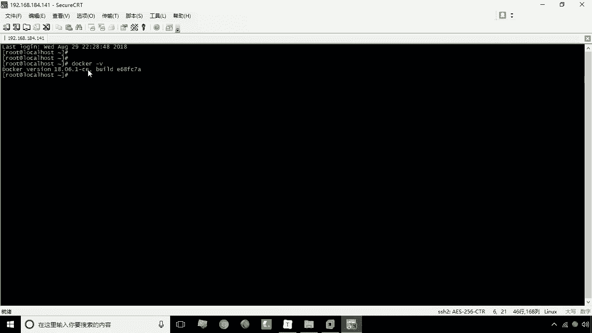

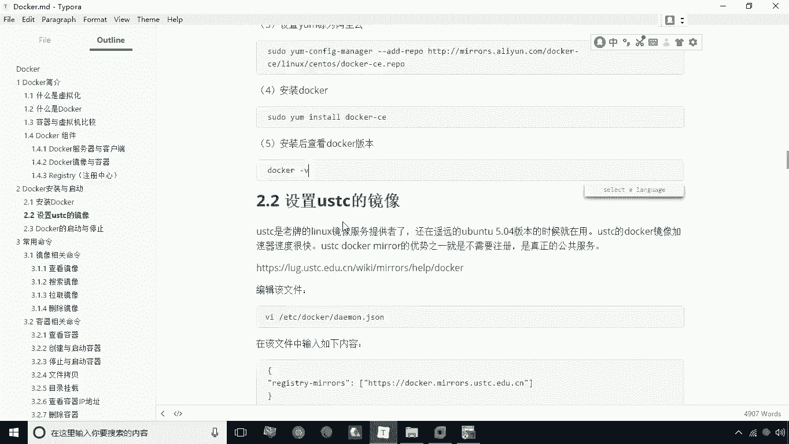

本节课中我们一起学习了在CentOS 7系统上安装Docker的完整流程。我们首先准备了CentOS 7的宿主机环境并通过SSH进行连接，然后详细讲解了更新Yum、安装依赖、配置阿里云镜像源以及安装Docker CE社区版这四个关键步骤，最后通过`docker -v`命令验证了安装结果。现在，您的系统已经具备了运行容器化应用的基础环境。