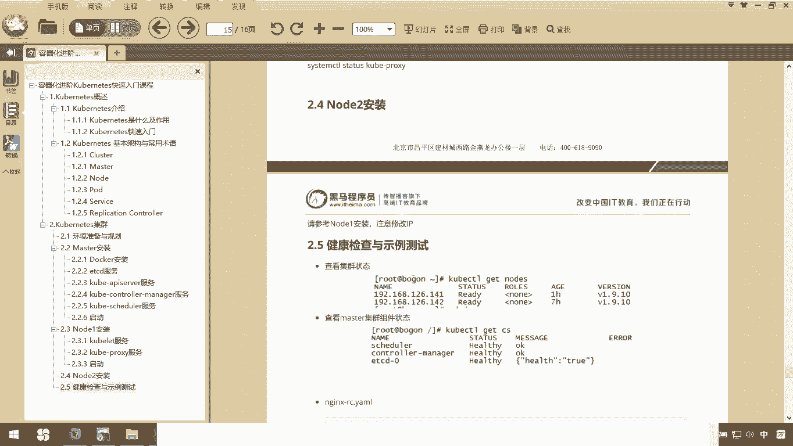
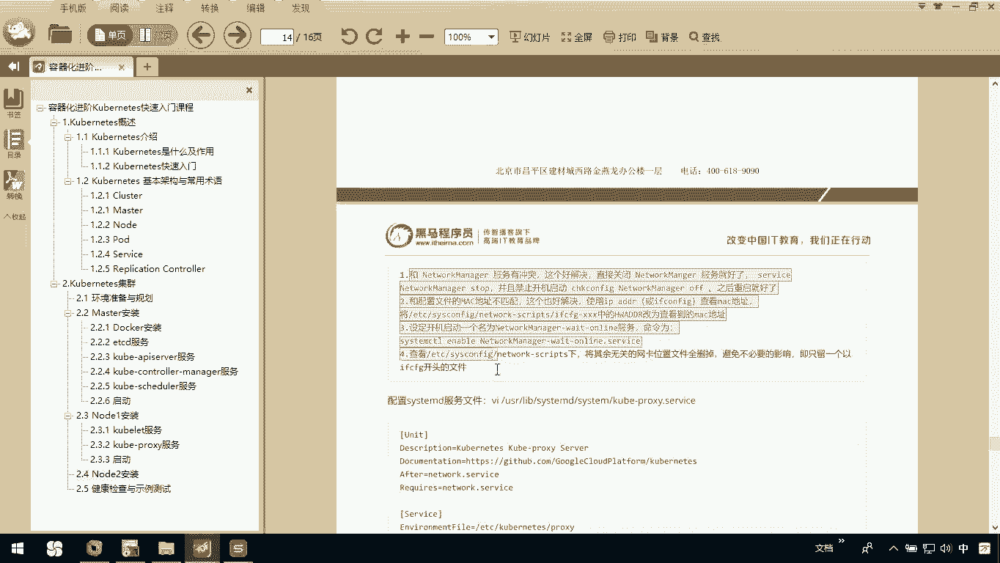
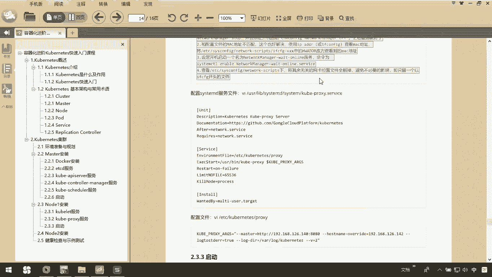
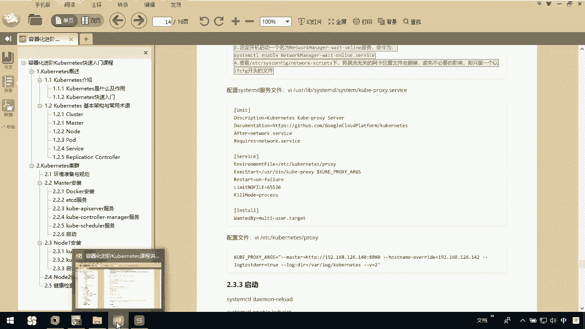
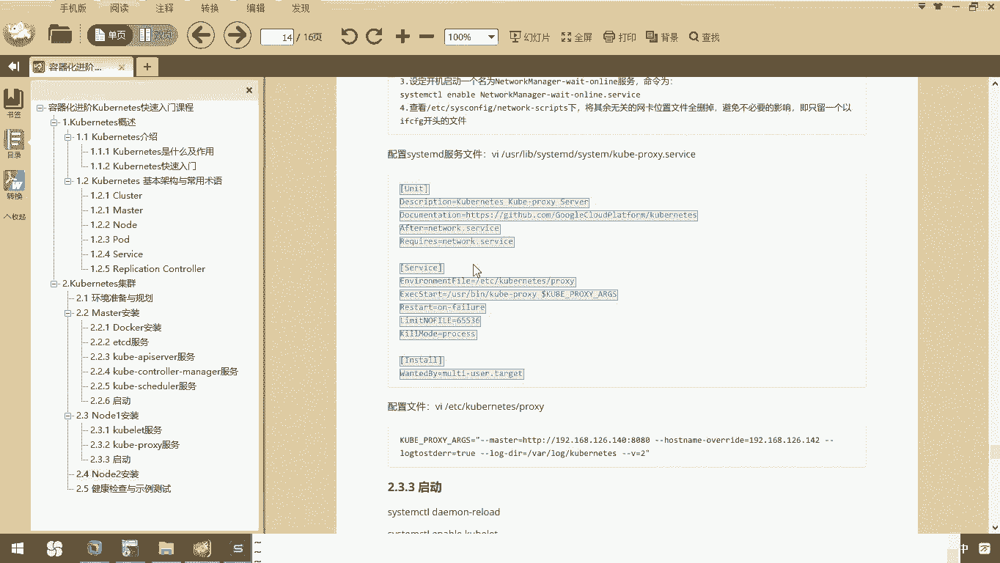
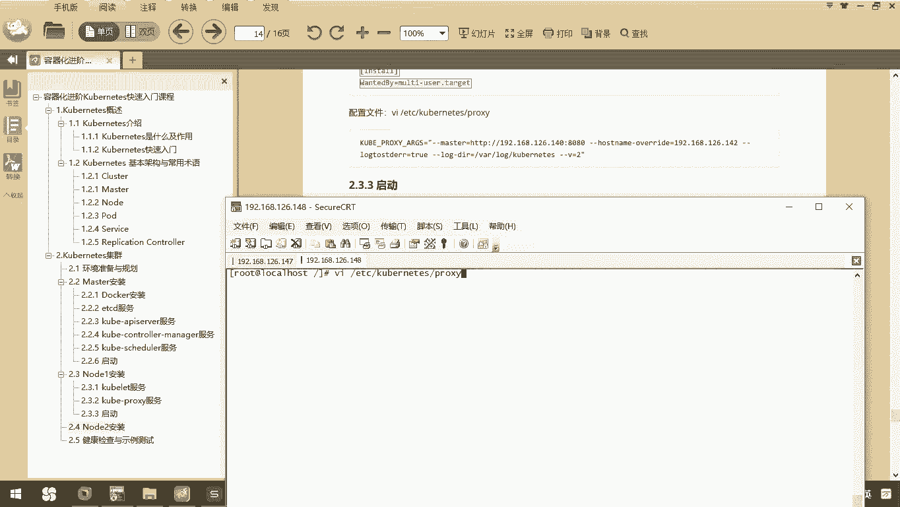
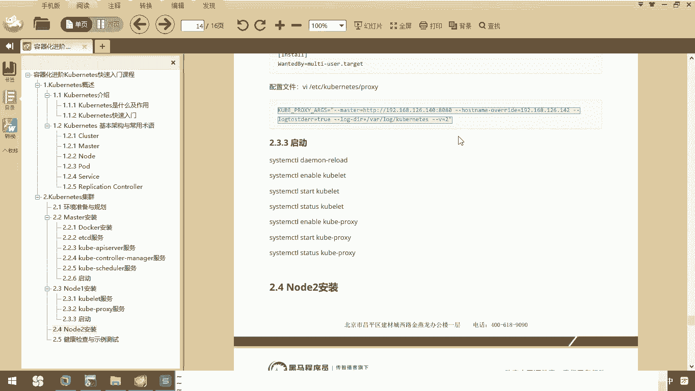
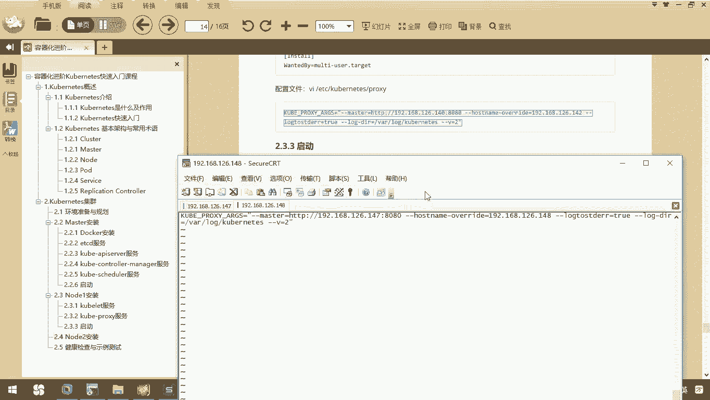
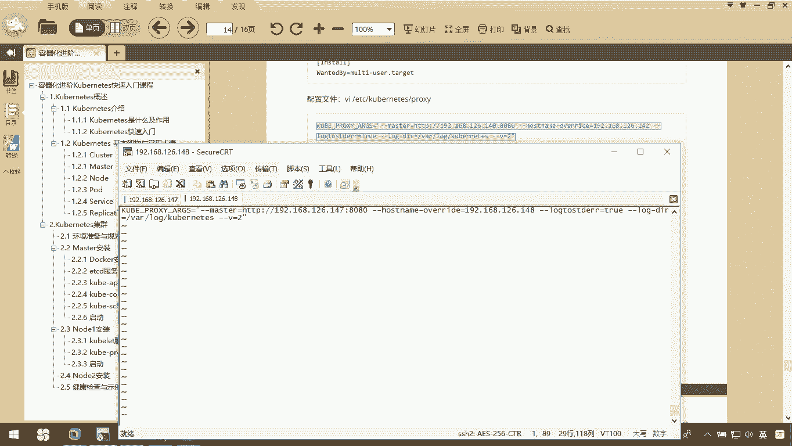
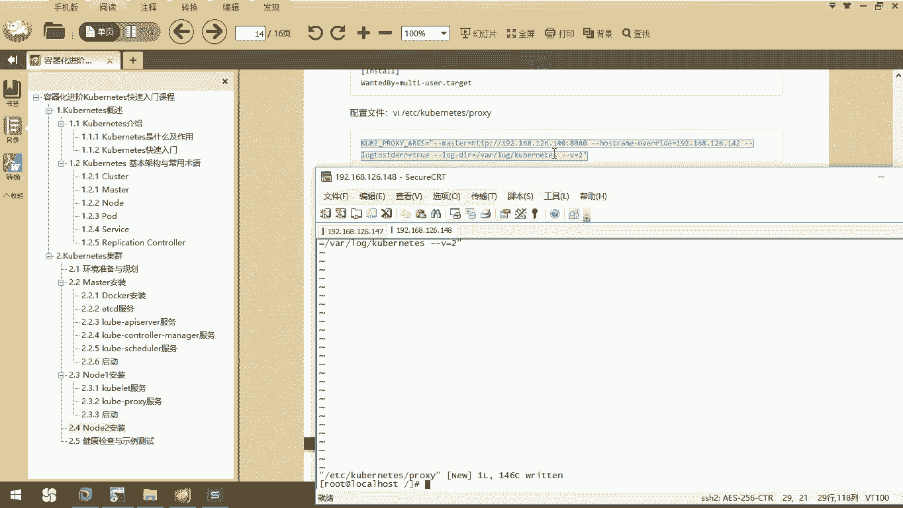

# 华为云PaaS微服务治理技术 - P61：14.Kubernetes集群搭建Node安装-kube-proxy服务 - 开源之家 - BV1wm4y1M7m5

下面呢我们说一下当前我们这个cooper proxy。

那么对于co pro来说啊，它是依赖于network的。那么net work服务呢，大家如果这个遇到了问题呢，可以参考上我讲义上给大家提供的这四种解决方案。

基本上就能解决你的network这个服务的问题。

那我们来看一下，对于这个coer proxy，我们要想操作它呢。首先第一件事啊呃，你呢需要去编辑一下这个coer proxy点service这个服务的配置文件。

所以我们在这里边VI杠USR下的lab下的我们sstem地下的 systemtem下的一个叫做coer杠 proxy点PLOSYSERVIC。

在这个文件里面呢，我们要去。

指定一下。大家来看一下啊，这里边我们是不是需要了netightwork serviceOK吧，那我们把它呢。

配置一下，然后呢，我们的CJJ退出。退出以后呢，我们接下来要配置的是conet自己的配置文件，一个叫ETC下的conet下的proxy。

也就是说我们在这里边需要VI我们ETC下的co nice下的一个叫做proxyPROSY这么一个配置文件。在这个配置文件里边，你要注意了，我们还涉及到IP地址的问题。

我们在这儿编辑他。那我呢需要把这个位置。控制一下我们要连接的master，一定要注意，它是1478080没问题，而我们自己的IP是148。

这个一定要注意啊，这是我们自己的IP，这个是masterIPO我们sZZ保存。这样的话呢，我们就已经把我们当前的coer pro配置完成。

