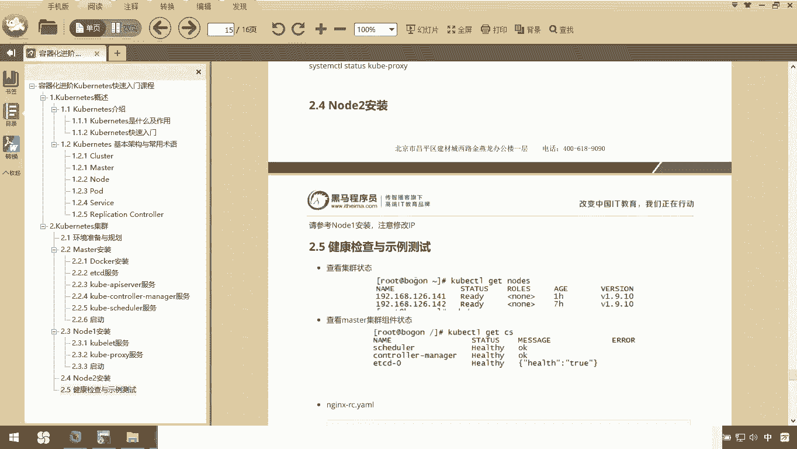
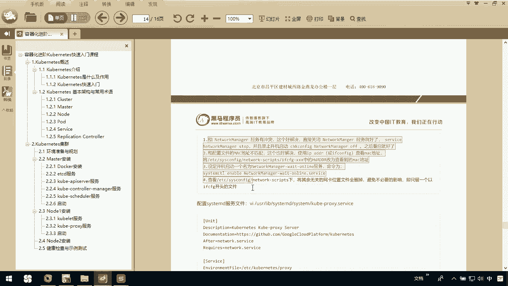
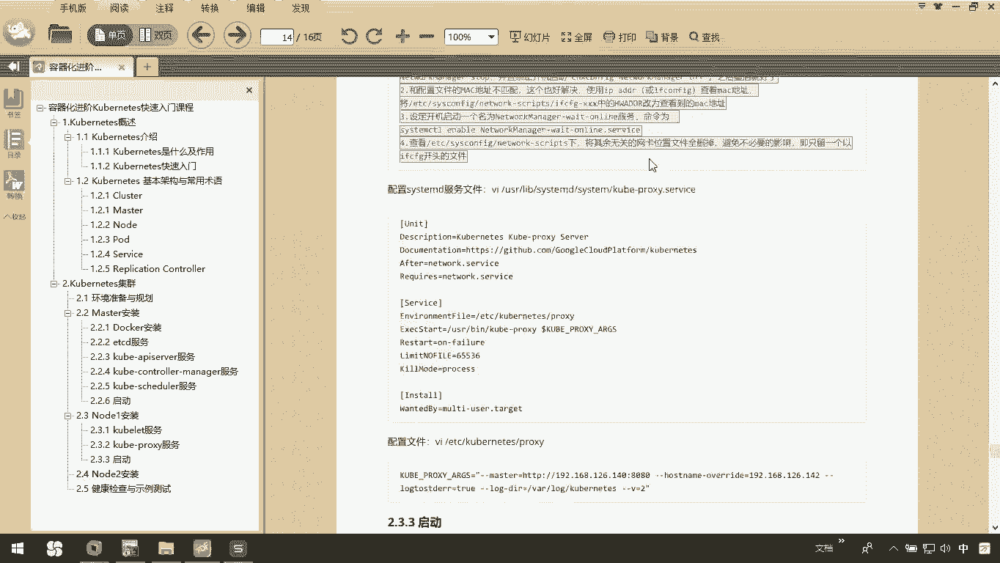
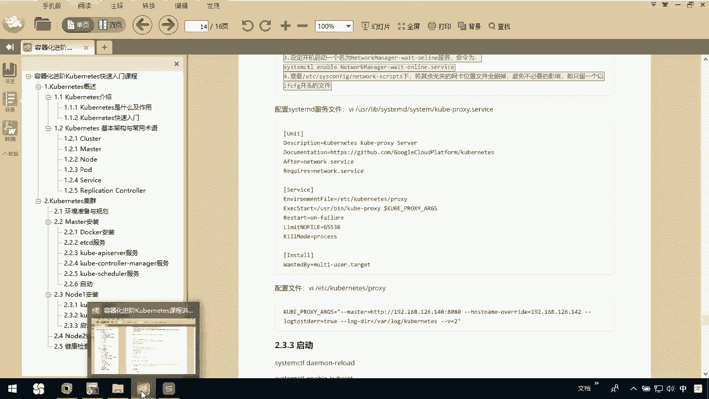
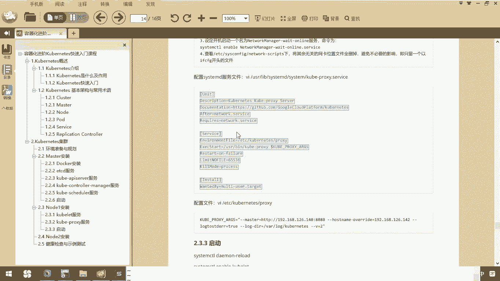
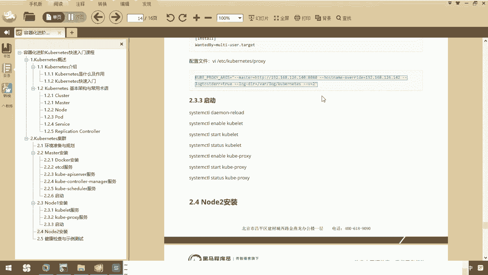
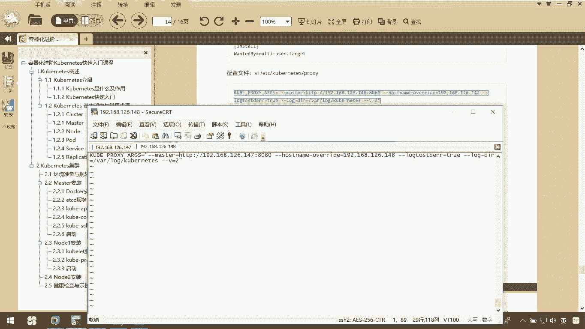

# 华为云PaaS微服务治理技术 - P61：14.Kubernetes集群搭建Node安装-kube-proxy服务



在本节课程中，我们将学习如何在Kubernetes集群的Node节点上安装和配置`kube-proxy`服务。`kube-proxy`是Kubernetes网络代理的核心组件，负责维护节点上的网络规则，实现服务发现和负载均衡。


## 概述

`kube-proxy`服务的正常运行依赖于`network`服务。如果在安装过程中遇到`network`服务相关的问题，可以参考讲义中提供的四种解决方案，通常可以解决大部分问题。




上一节我们介绍了Node节点的其他组件，本节中我们来看看`kube-proxy`的具体配置步骤。

## 配置 kube-proxy 服务

以下是配置`kube-proxy`服务的主要步骤。



### 1. 编辑 kube-proxy 服务配置文件



首先，需要编辑`kube-proxy`服务的systemd配置文件。


```bash
vi /usr/lib/systemd/system/kube-proxy.service
```



在该文件中，需要确保`kube-proxy`服务依赖于`network`服务。找到相关行并进行配置，然后保存并退出。

### 2. 配置 kube-proxy 主配置文件

接下来，需要配置`kube-proxy`自身的主配置文件。


```bash
vi /etc/kubernetes/proxy
```



在此配置文件中，需要指定两个关键的IP地址：
*   **Master节点IP地址**：用于连接API Server，例如`192.168.147.80:8080`。
*   **本Node节点IP地址**：例如`192.168.147.148`。


请根据你的实际网络环境修改这些地址，然后保存配置文件。

完成以上两步后，`kube-proxy`服务的基本配置就完成了。



## 总结


本节课中我们一起学习了`kube-proxy`服务的配置过程。我们首先编辑了其systemd服务文件以声明对`network`服务的依赖，然后配置了其主文件，正确设定了Master节点和本Node节点的IP地址。这些步骤确保了`kube-proxy`能够在节点上正确运行，为Kubernetes服务的网络通信提供支持。