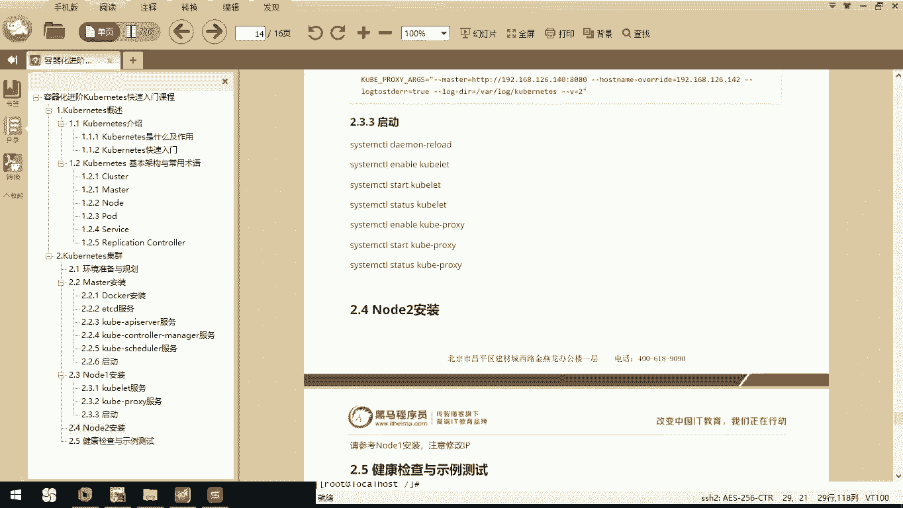
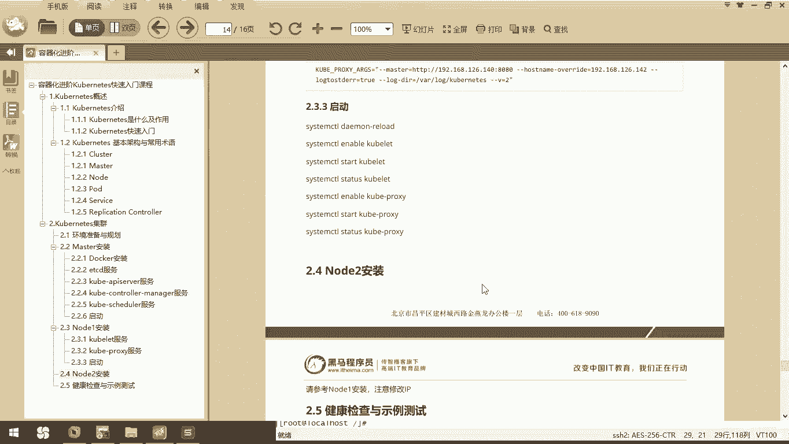
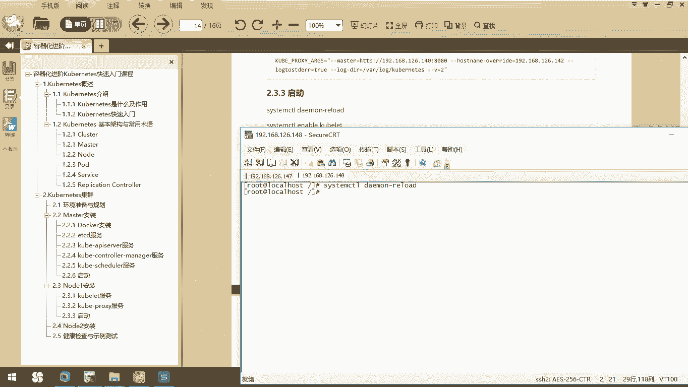
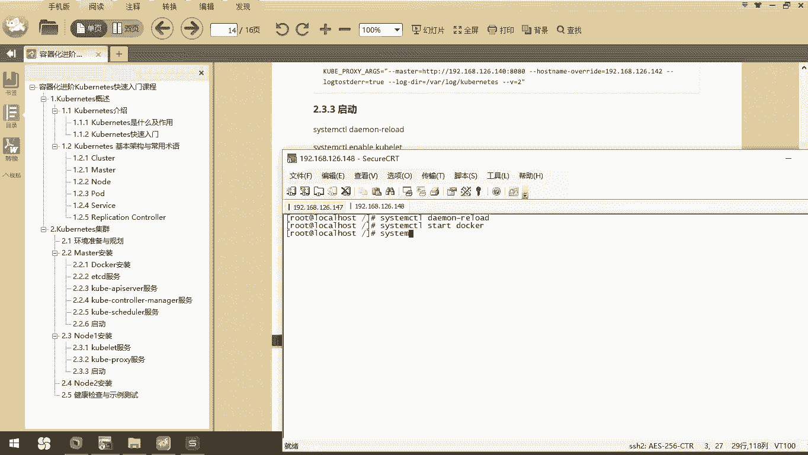
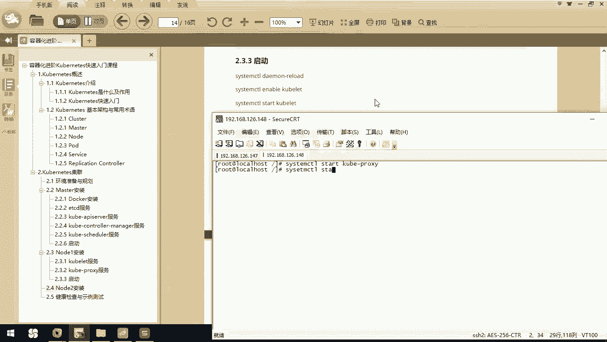
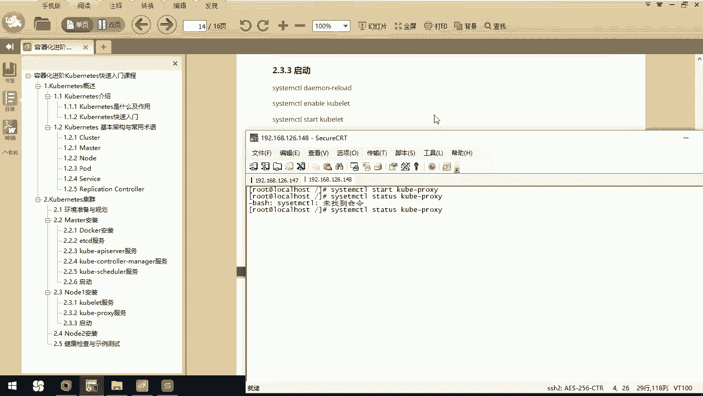

# 华为云PaaS微服务治理技术 - P62：15.Kubernetes集群搭建Node安装-启动 - 开源之家 - BV1wm4y1M7m5

接下来呢我们就把我们的这些服务啊该启动的都起来。那我们来看一下啊，首先呢我们需要去ssem cTLDAEMN杠 relateload。

然后呢，我们去star一下我们的docker吧。然后我在这里边STTUS。

docker，我们看一下是不是已经running，它是一个。然后我们把这个coer light和cooper proxy都启动一下stem startcoer light。我们看一下。

我们这也是running的，然后呢，我们syst cTL我们star sTRP我们当前的cooper杠 proxy。CCTR我们STTUSTATUScoer杠proxy。

呃，这里面应该是写错了吧。SYS。TEM。

OK我们现在呢所有的服务都启动了。那这样的话呢，我们一个节点已经做好了。那么对于我们这个note2节点呢，大家呢可以把我们当前机器啊去copy一份。然后呢，你把IP改一下，把配置文件呢也相应的改一下。

那这样的话呢，我们就可以完成多个节点的配置。