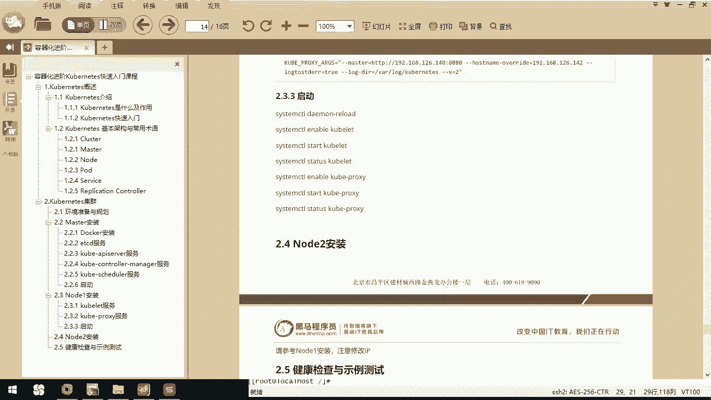
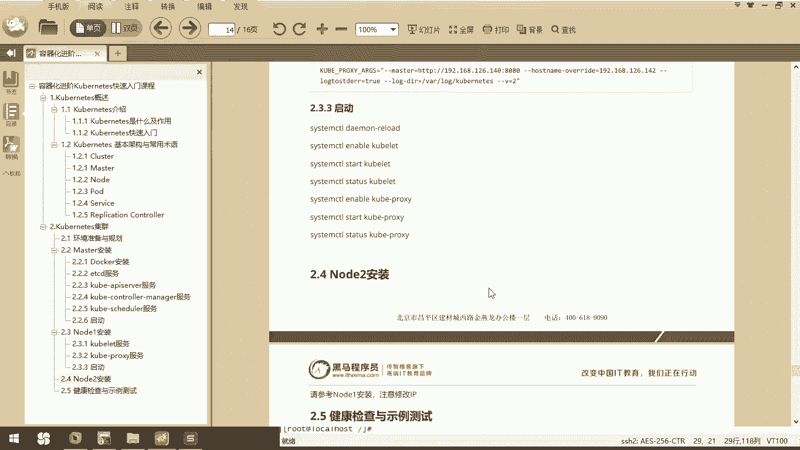
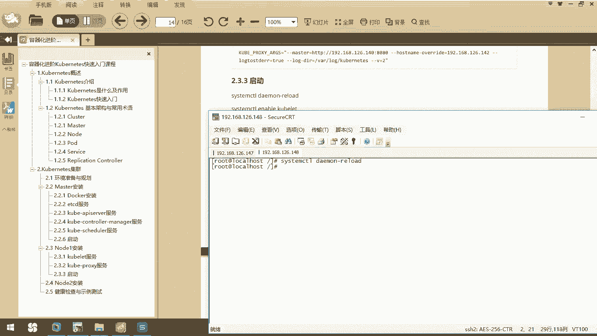
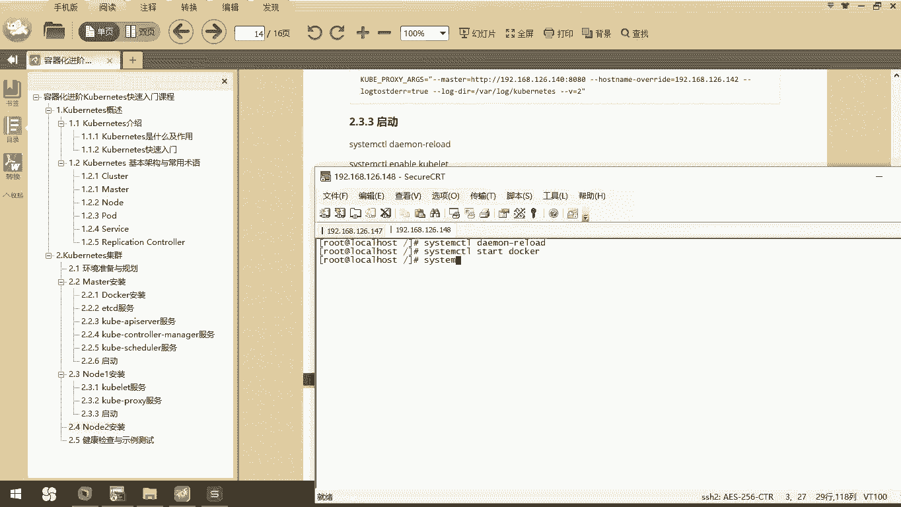
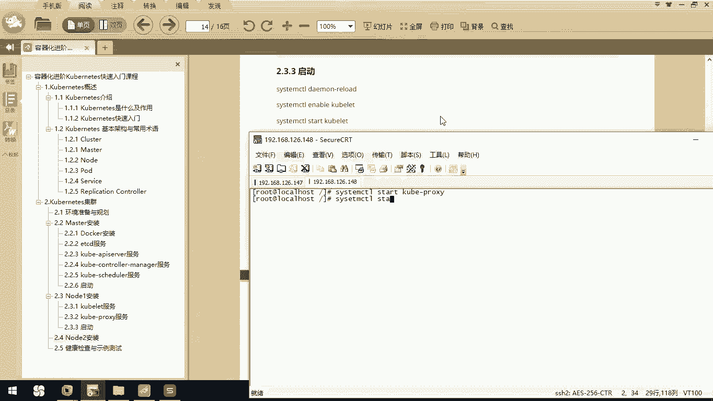
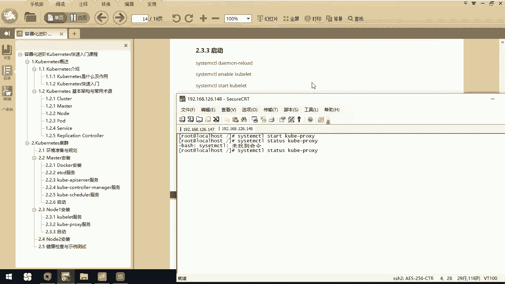

# 华为云PaaS微服务治理技术 - P62：15.Kubernetes集群搭建Node安装-启动 🚀



在本节课中，我们将学习如何启动Kubernetes节点所需的所有服务，并完成一个工作节点的配置。我们将从启动Docker和Kubernetes相关服务开始，最终得到一个可运行的节点。

上一节我们介绍了Kubernetes节点的配置文件，本节中我们来看看如何启动这些服务。

## 启动系统服务

首先，我们需要重新加载系统管理器的配置，以确保所有新的服务单元文件生效。



执行以下命令：
```bash
systemctl daemon-reload
```



## 启动Docker服务

接下来，我们需要启动容器运行时环境。以下是启动和检查Docker服务状态的步骤。



执行以下命令启动Docker：
```bash
systemctl start docker
```

启动后，我们可以检查Docker服务的运行状态。
```bash
systemctl status docker
```
如果服务正常运行，状态应显示为 **`active (running)`**。

## 启动Kubernetes Node服务

在Docker运行后，我们需要启动Kubernetes工作节点所需的核心服务。这包括`kubelet`和`kube-proxy`。

首先，启动`kubelet`服务。
```bash
systemctl start kubelet
```
然后，检查其运行状态以确认启动成功。
```bash
systemctl status kubelet
```

接着，启动`kube-proxy`服务。
```bash
systemctl start kube-proxy
```
同样，检查`kube-proxy`的运行状态。
```bash
systemctl status kube-proxy
```



至此，当前节点上的所有必需服务都已启动并运行。一个完整的Kubernetes工作节点已经配置完成。

## 配置其他节点



要扩展集群，您可以基于当前已配置好的机器快速创建更多工作节点。

以下是操作步骤：
1.  将当前虚拟机复制一份。
2.  修改新虚拟机的IP地址。
3.  根据新IP地址，相应地修改Kubernetes节点配置文件（如`kubelet`和`kube-proxy`的配置）。
4.  在新机器上重复本节的服务启动流程。

通过这种方式，您可以高效地完成多个Kubernetes工作节点的配置。

---

本节课中我们一起学习了如何启动Kubernetes节点的关键服务，包括Docker、`kubelet`和`kube-proxy`，并成功配置了一个可用的工作节点。我们还了解了如何通过复制和修改现有节点来快速扩展集群规模。