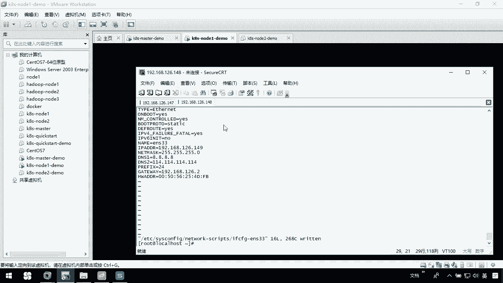

# 华为云PaaS微服务治理技术 - P63：16.Kubernetes集群搭建Node2安装 - 开源之家 - BV1wm4y1M7m5

接下来呢我们讲一下我们这个note2这个节点如何全装。那么步骤呢跟note的一是一样的。那这个时候呢我们就可以去把note一克隆一份。那么你只需要注意修改一下IP地址就可以。那么来看一下怎么去做呢？

我们这么办，首先呢回到我们当前的这个虚拟机，或者么里面。呃，在这里边我们把当前这台机器啊先停一下，我们电源关闭。

然后呢，我呢右键管理克隆，下一步下一步我创建一个完整的克隆。下一步这个呢我们就叫K8S杠。note2杠demo。那么你指定到你自己适合的位置。我就到我这个目录下。Control C。OK。那这时候呢。

他正在克隆。稍等一下，等克隆完以后呢，我们把它启动一下。好了，完成了，我们可以关闭。这个时候呢，我们就已经有个note2的demo，我们把它开启。

这时候呢note2的demo啊，它的IP地址应该跟刚才一样，还是148。因为我们是完整克隆过来的，我什么都没有修改。

我们在这里边呢，一会儿通过这个148呀，应该是可以连接上的。稍等一下，它正在启动，有点慢。应该快启动完成了。好了，我们连一下，你看我还是能把它连上的那这里边呢我要处理一下它ETC下的ssconfi。

然后呢，我的netightwork杠 script，我们把这个if cF这个文件呢重新编辑一下。首先第一件事我就要把它改了，它的IP地址呢不在148，而是149。第二件事呢。

我们要重新给它生成一个mark这里边高级。我们重新生成一个mark就C确定确定回到我们自己的这里边，我们要把这个mark呀重新给它。

Oshift JJ我们保存一下。好了，那这样的话呢，我当前这台机器啊就已经。

把它改完了，我把他的重新关了。

然后我把我这个node一样先启动。

因为note2啊让我关掉了，对吧？那我先把note一启动起来。

我们这时候再连的时候呢，其实它就是node一了。

稍等一下，证面还没起来。好了，我们再连这个是我的note一。是当前是我们当前的148，那这个呢是149，我重新起一下。

在这里呢，我可以重新去建立一个连接149账户就是root。OK那这个时候可能会连接失败。因为我当前这个149这台机器啊还没起来。关闭它，我这边应该应该有1个149，这个我们把它删掉，看着不舒服。

我这里边应该有149OK密码。我们保存密码确定okK了。那这样的话呢，我们就连接到当前if cNFIG连接到我们当前这台机器了。然后回来我在这儿呢需要去选项绘画。

我在这个终端外观这块啊指定了UT杠8ok那148和149啊，这两台机器啊，我都起来了，但是149呢是从148克隆过来的，回头你来看一下，我们现在呢这个node一节点呢，在安装的时候，我们酷呀。

是不是做了一些配置。那我们现在呢来看看我要改一些东西，改什么呢？首先第一个你就要改的是co这个配置文件，所以我们在这里边VI我们ETC下的net下的ite。

我们要把这个配置文件改它，这个配置文件要改什么呢？192168126。142这个。有点问题是吧？我看一眼我们现在这个配置文件不对啊。这么办，我把他呢。整个都删掉，我把它整个都删掉。然后呢，我们重新去。

把他这个粘贴复制一份。稍等一下。我们这个配准件。这是我们的。Coerline。那么我这个配置文件我们要知道。这儿。我们当前这台机器是149。这个这这。OK然后我们再来看VI一下。

我们这里边有一个配置文件。杠ETC下的我们的coer nice下的coer config。这个文件我好像也是有问题。他的服务器应该是147CJJ。O然后呢，我们还有一个是cooper pro的配置文件。

我们看看coer pro这个配置文件呢是这个文件。我们VI一下ETC下的kuer nice下的proxy。这个配置文件来看啊，我们要改的是当前我们服务器是147，没问题，但是我自己是149OK吧。

把这个保存CCC那这样的话呢，我们把相应的配置文件里面这些IP改完，我们当前这台机器就OK了。那也就是说我们的note2这个节点就安装完成。

