# 华为云PaaS微服务治理技术：P63：16.Kubernetes集群搭建Node2安装 🖥️

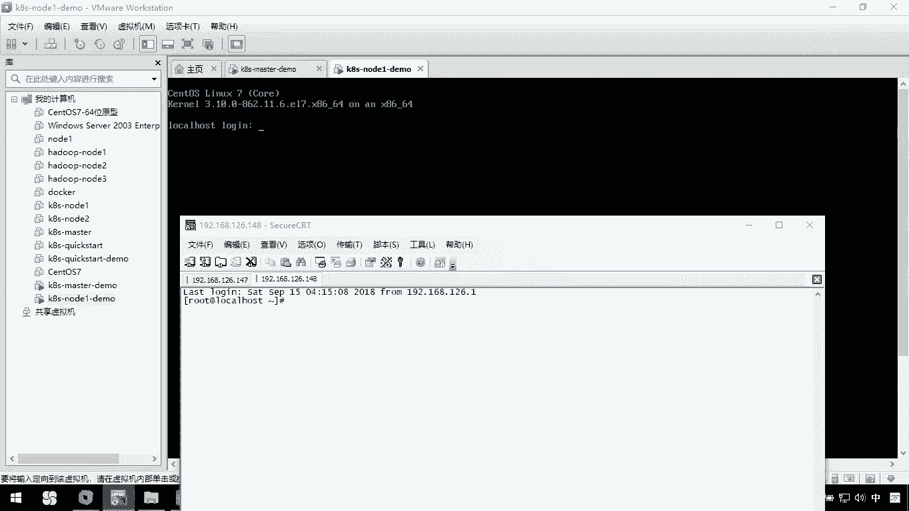

在本节课中，我们将学习如何搭建Kubernetes集群的第二个工作节点（Node2）。我们将通过克隆已配置好的Node1虚拟机，并修改其网络配置和Kubernetes相关文件，来快速完成Node2的安装。

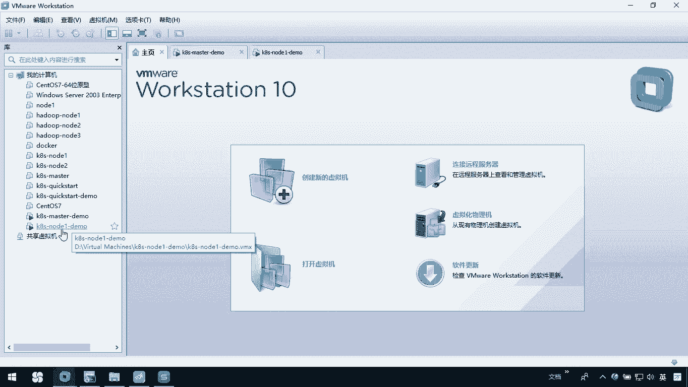

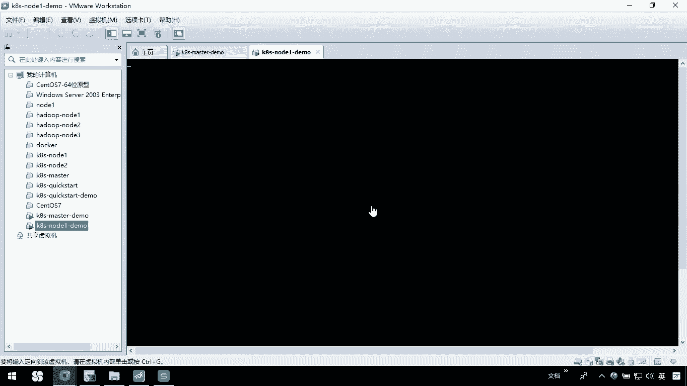

上一节我们介绍了Node1节点的安装与配置，本节中我们来看看如何基于Node1快速部署Node2节点。

## 克隆虚拟机

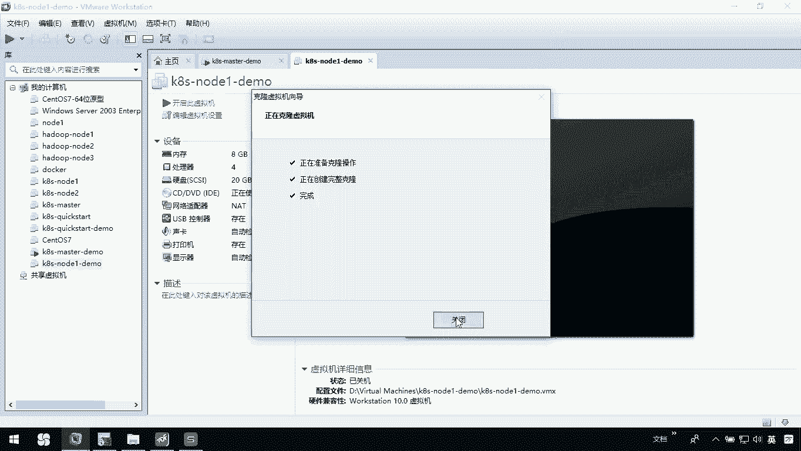

首先，我们需要基于已配置好的Node1虚拟机创建一个完整的克隆，作为Node2的基础。

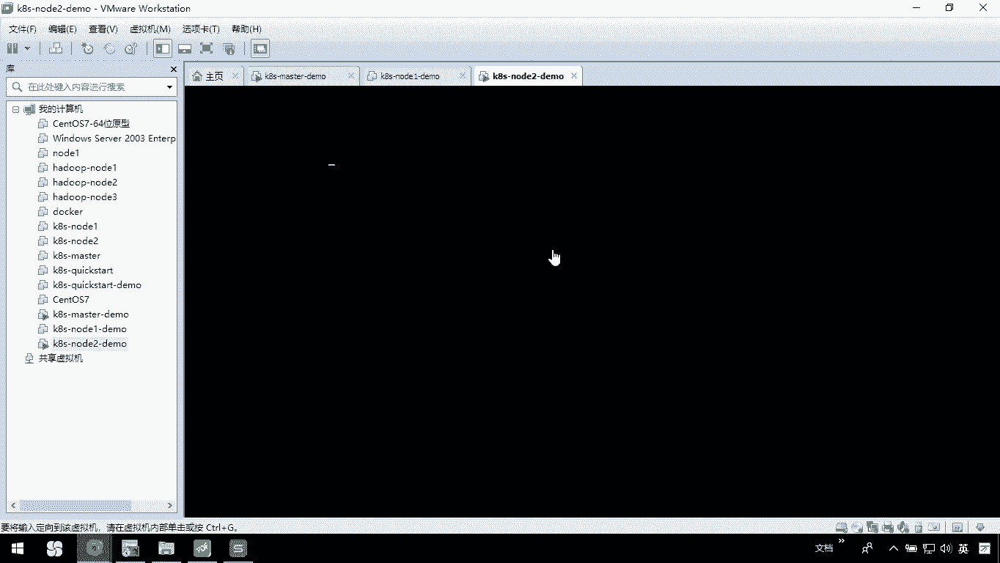

以下是克隆虚拟机的具体步骤：

1.  在虚拟机管理软件中，关闭Node1虚拟机。
2.  右键点击Node1虚拟机，选择“管理” -> “克隆”。
3.  在克隆向导中，选择“创建完整克隆”。
4.  为新虚拟机命名，例如 `K8S-node2-demo`，并指定存储位置。
5.  等待克隆过程完成。

克隆完成后，启动这台新的Node2虚拟机。由于是完整克隆，其初始IP地址与Node1相同。

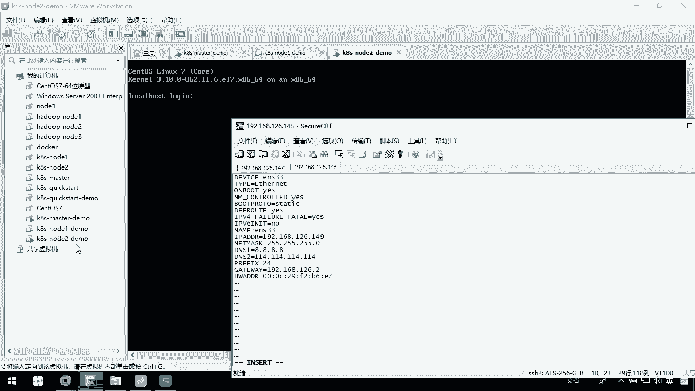

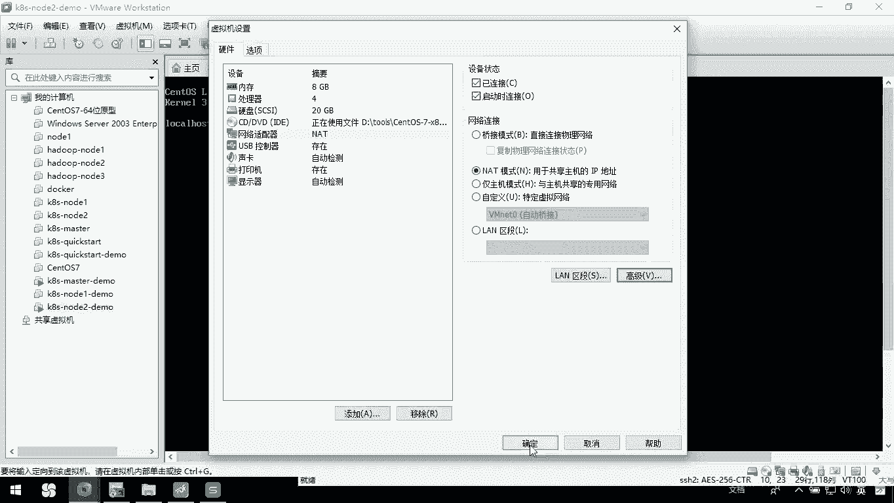

## 修改网络配置

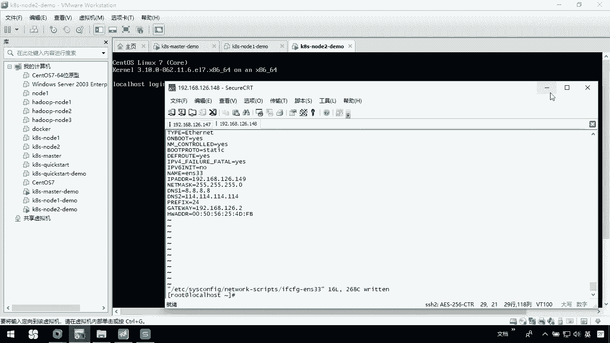

启动Node2后，我们需要修改其网络配置，赋予它独立的IP地址和MAC地址。

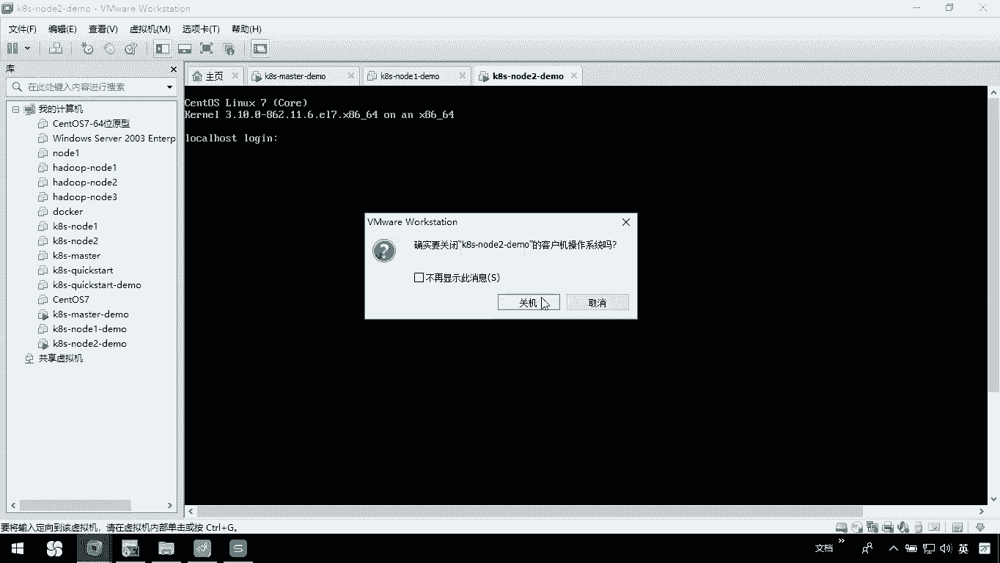

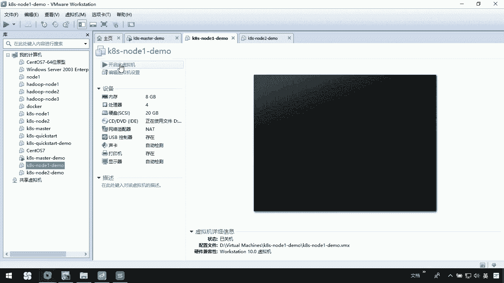

以下是修改网络配置的具体步骤：

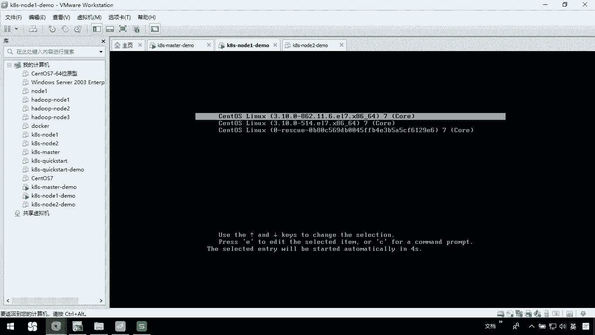

1.  使用SSH工具连接到Node2（此时IP仍与Node1相同）。
2.  编辑网络配置文件：`vi /etc/sysconfig/network-scripts/ifcfg-ens33`
3.  将文件中的 `IPADDR` 字段值修改为新的IP地址，例如 `192.168.126.149`。
4.  删除 `HWADDR`（MAC地址）这一行。
5.  保存并退出编辑器。
6.  在虚拟机设置中，为网络适配器“重新生成MAC地址”。
7.  重启网络服务或重启虚拟机使配置生效。

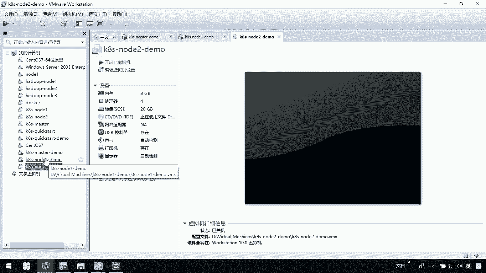

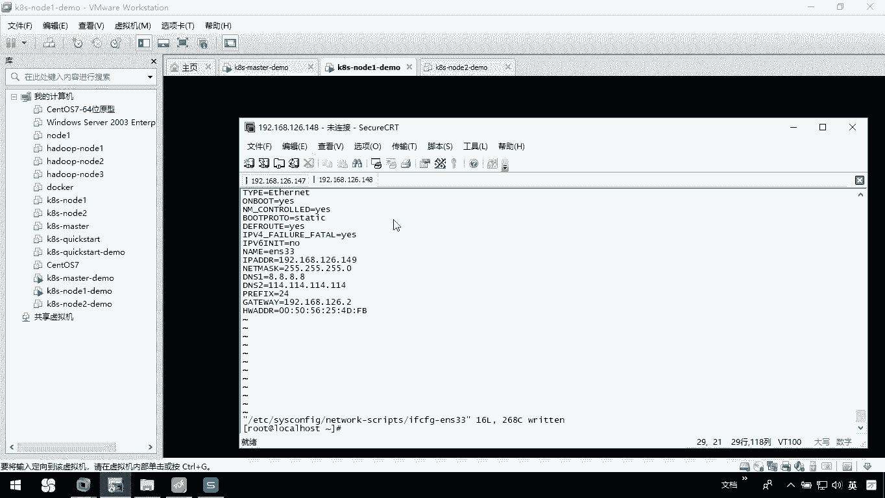

完成此步骤后，Node2将拥有独立的网络标识。

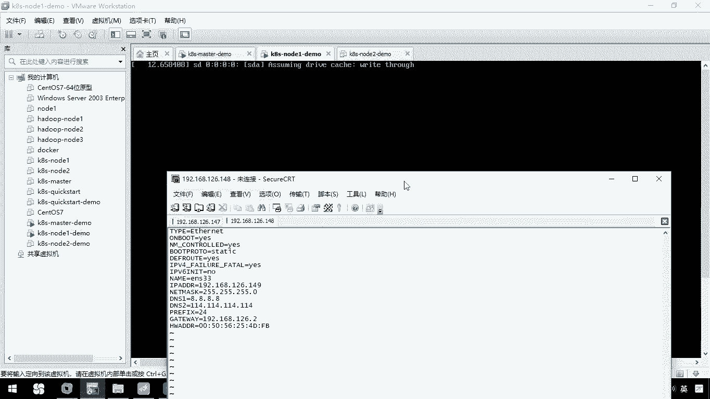

## 修改Kubernetes配置文件

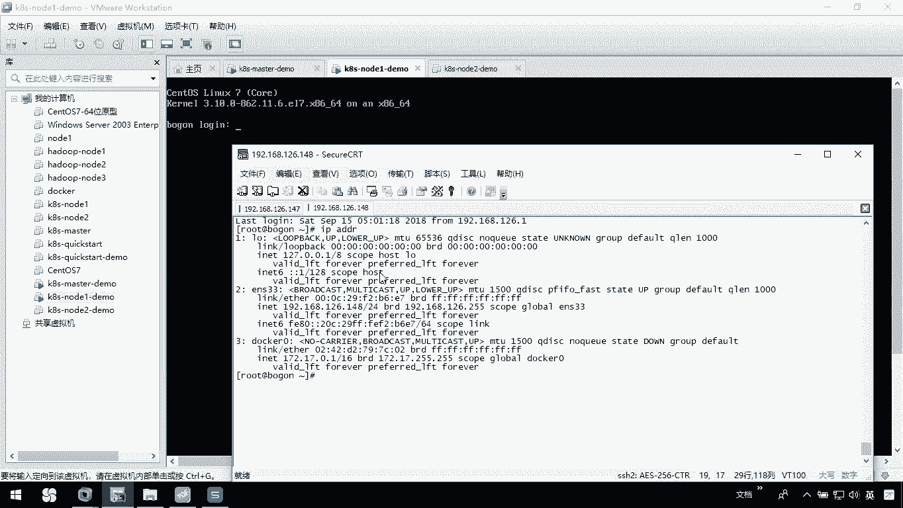

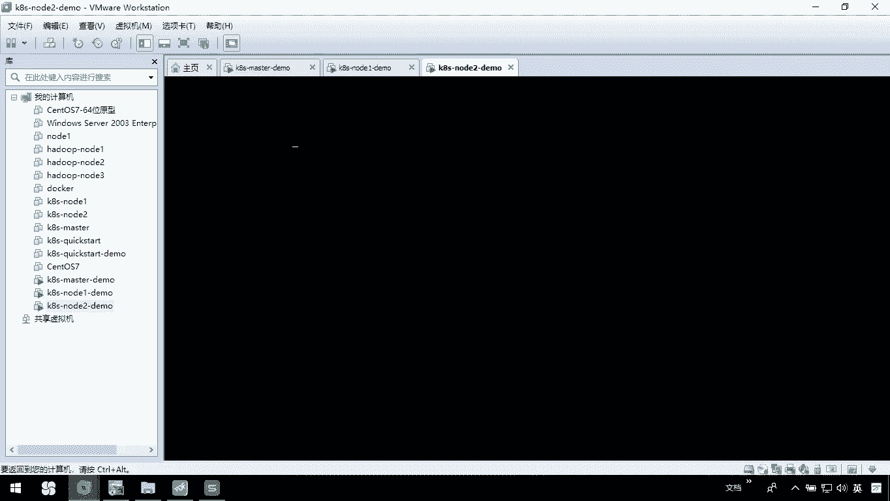

由于Node2是从Node1克隆而来，其Kubernetes配置文件中的节点信息仍然是Node1的，需要更新为Node2自身的信息。

以下是需要检查和修改的关键配置文件：

*   **kubelet配置文件**：编辑 `/etc/kubernetes/kubelet`，确保 `KUBELET_EXTRA_ARGS` 中的 `--node-ip` 参数指向Node2的新IP地址（例如 `192.168.126.149`）。
*   **kubelet kubeconfig文件**：检查 `/etc/kubernetes/kubelet.conf`，确认其中的服务器地址指向正确的Master节点IP（例如 `192.168.126.147:6443`）。
*   **kube-proxy配置文件**：编辑 `/etc/kubernetes/kube-proxy.yaml`，确保 `bindAddress` 和 `metricsBindAddress` 字段指向Node2的新IP地址（例如 `192.168.126.149`），同时检查 `clusterCIDR` 等配置与集群规划一致。

修改完成后，重启kubelet和kube-proxy服务，使配置生效。

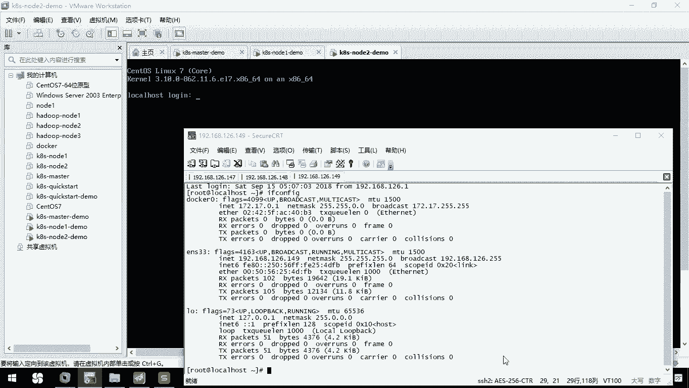

```bash
systemctl restart kubelet
systemctl restart kube-proxy
```

## 验证节点加入

所有配置修改并重启服务后，我们可以在Master节点上使用 `kubectl` 命令来验证Node2是否成功加入集群。

在Master节点上执行：
```bash
kubectl get nodes
```
如果输出列表中包含了Node2的主机名和状态为 `Ready`，则表明Node2已成功加入Kubernetes集群。

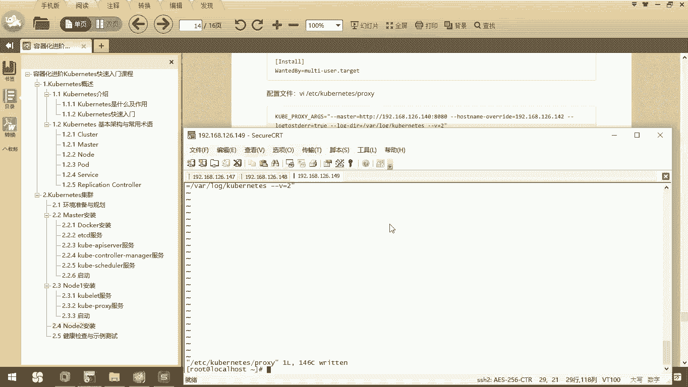

本节课中我们一起学习了如何通过克隆和修改配置的方式，快速向Kubernetes集群中添加第二个工作节点（Node2）。核心步骤包括克隆虚拟机、修改网络配置以及更新Kubernetes组件的配置文件。掌握此方法可以高效地扩展集群的节点数量。