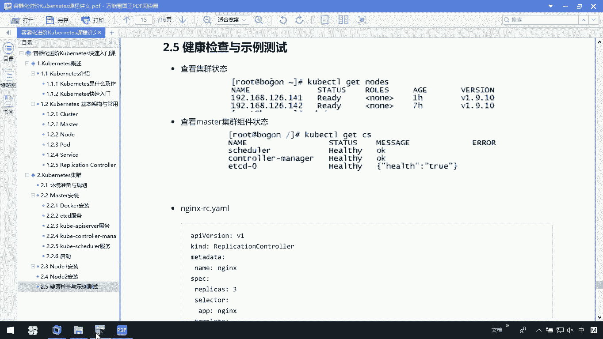
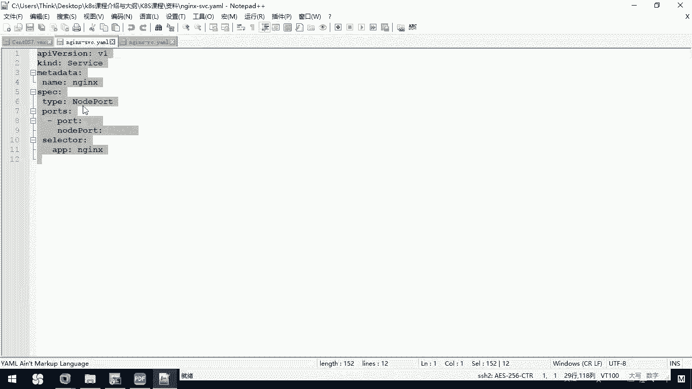

# 华为云PaaS微服务治理技术 - P64：17.Kubernetes集群健康检查与测试(1) - 开源之家 - BV1wm4y1M7m5

接下来呢我们简介绍一下我们的健康检查，以及我们的视力测试。那我们在之前呢已经把我们的master147这台机器，以及我们的两个node148和149这两台机器呢已经安装完了。那么按照我们现在这种描述呢。

说我要查看一下我的机芯状态。我可以通过coer cTLge node去查看。但你发现呢这时候它是没有找到这个命令啊。那这个原因呢是因为我在前期搭建我们的。

master的时候啊，其实我在这里边去copy文件时啊呃漏掉了一个叫做coer cL。

所以呢我们可以回到我们当前的。user local K8S这个目录下呃，进到的con这个目录，还有它的。Ser。b幕录下，在这下面呢我们CP1下。

把这个couber cTL这个命令啊copy到我们的user的 bin下面啊，sorry，写错了。user b幕录像。OK那我们call到这个目录下以后呢，我们再回到根目录下。

你执行cerCPL我们get nose。那这时候呢我们就可以看到我们当前呢有两台node，一个是148，一个是149。那么如果你在查看的时候，你发现呢它报的还是我们前期给你说的一个问题。

就是在我们的前期快速入门里边提到，如果你在get node的时候。

你发现呢你拿到的还是这种叫做这儿。

no resource found，那么你就需要去修改一下这个配置文件里边的信息啊。那OK了。那我们现在呢已经看到了我们有两个nose，也就是说我们找到它了。

那我们还可以去根据这里面提示说查看一下我们master整个机型的状态。那我们来看一下。

还是coer CTR，我们可以ge一下CS。

那这是这条命令。那么我们看到了我们当前整个集群呢是一个健康的状态。OK那这些都完成以后呢，我们接下来呀去创建一个Nd的一个replication的一个文件，以及我们的service文件。

那么我们把整个工程跑起来。那好了，我们还是到我们的user下的local下K8S这个目录下。那么我们在这里呢首先创建一个叫N杠2RC点压文件。

那在这个文件里边，我们要写一些东西，那可以拿到在我们今天的资料里边啊，我已经把这个文件呢给你copy出来了。你呢把这个文件的内容粘贴复制过去。

其实在这里边我们描述的主要就是我们创建了一个endd，然后呢，我们有三个副板，那么我们对外暴露的端口是80端口OK吧。然后我们这个image镜像呢就是我们的end。

这是我们把我们的这个replication创建完了。还有呢我们再去创建一个文件。

这个文件呢叫。eng杠SVC也就是我们的service。其实我们在这里边可以再创建一下。

VI我们1个ANGX杠SVC点压么文件。那这个文件里面呢，我们要做的事情呢也比较简单。

点开。在这里面我们只需要告诉他，我们对外映射的时候，是呃不3333这么5个3这个端口。我们采用的是这种叫做note po这种网络方式回到我们当前这个文件里面，这里边我们把它粘贴过去。

对对这这OK那这些执行完以后啊，我们可以在这里边来看一下。呃，我们呢先去创建一下我们当前的这个replication，也就是把我们的这个n执行一下。

来，我们这里边执行一下coerCTL，然后呢。Greatate。杠F n，我们要那个RC这个文件。OK那这个时候呢他就帮我已经创建了。然后呢，我们再去把我们的service也创建一下。

这里边呢也有命令叫couberLCREATE。我们杠FN减是杠SVC。ok那这样呢我就把我们当前的这个service和我们的这个replication就都创建完了。

然后我们可以通过get pose方式去看一下。那大家来看coer c点Lget pose。

那这时候你发现我们又是没有找到什么那no这个no resources放的，有说我没有找到我们当前的pose。那这个时候应该怎么解决呢？

