# 华为云PaaS微服务治理技术 - P65：18.Kubernetes集群健康检查与测试(2) - 开源之家 - BV1wm4y1M7m5

现在这个问题啊，它的产生呢其实根本原因就是因为我们现在这个镜像啊拉取有问题。还有呢我们当前这个啊默认情况下，它是从一个GC点IO这个仓库去拉取。那现在呢我们要去解决问题呢，其实比较简单。

我们只需要去指定一下，我们当前从我们自己的私有仓库去拉取。但是前提呢你得先去搭建出你自己的私有仓库。那在今天的总结文档里边呢，有一个关于私有仓库的搭建。那么我们可以先在我们的客户端。哎。

s sorry啊node这边呢，我们去搭取搭建一下我们私有仓库啊，我们可以先去刀科破一下REJSTRY。我们先去把它给拉取下来。那么拉取完以后呢，我们就可以去搭建我们当前的这个私有仓库。

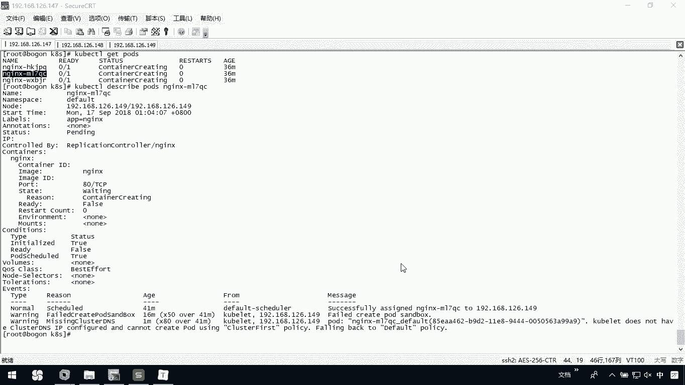

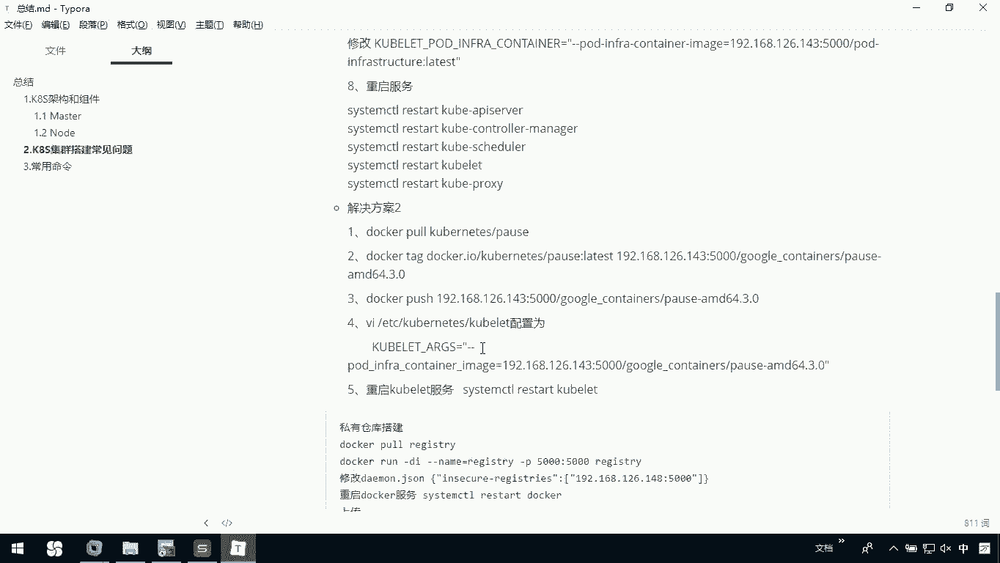

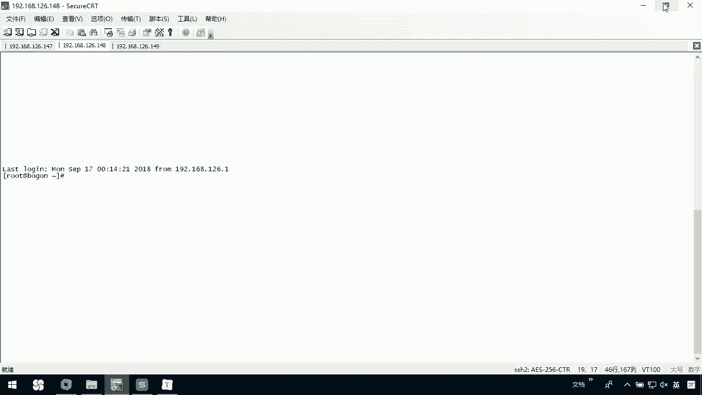

那这个呢可能会有点慢。

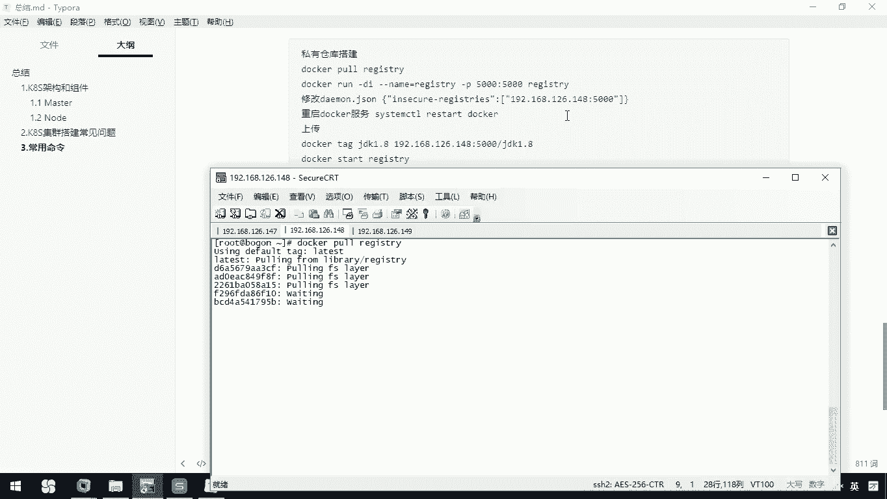

现在呢我已经把它拉起完了，然后呢，我把我这个所有仓库啊运行一下。

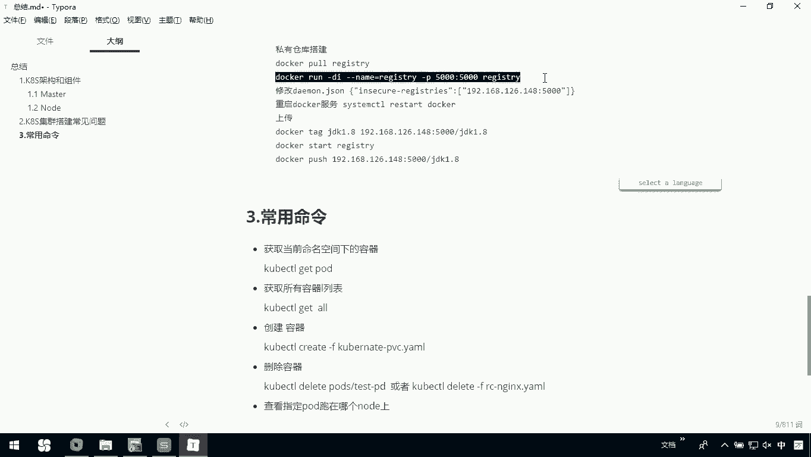

就在我本机上，我映射成这个5000端口。呃，然后呢我们可以去修改我们这个demo的接受文件啊。在这里边我们微I一下我ETC下的我们当前的docker这个配文件DEMN点接森。在这里呢我去给它加上一行。

原来这里边这个是我以前配置的一个我们的镜像拉取的一个位置。

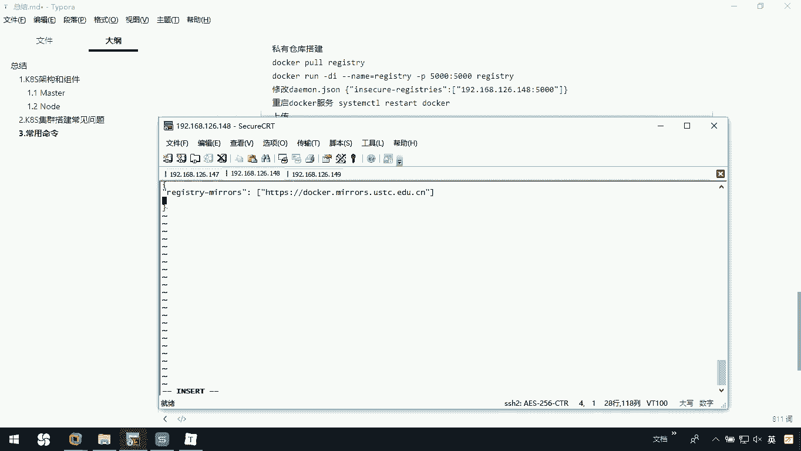

在这里呢我去把这个加进去。

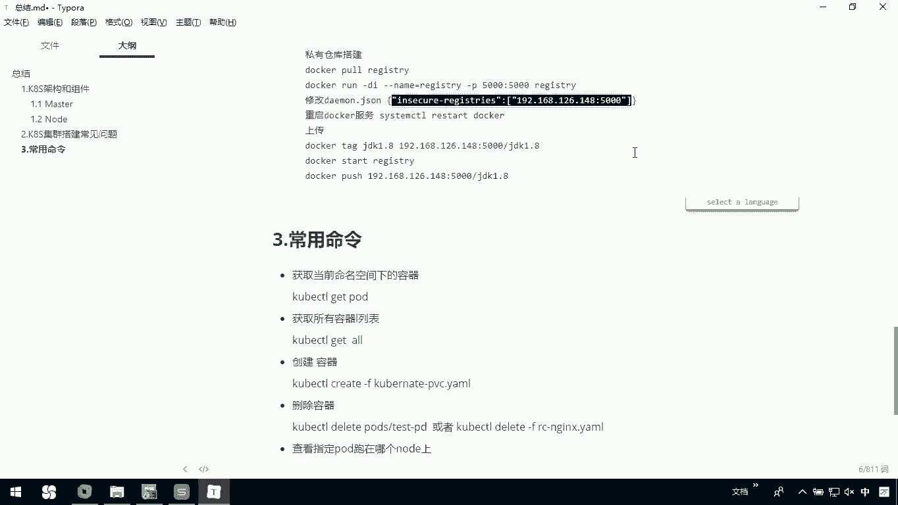

O。然后呢，你注意啊，这ID呢改成你自己的。

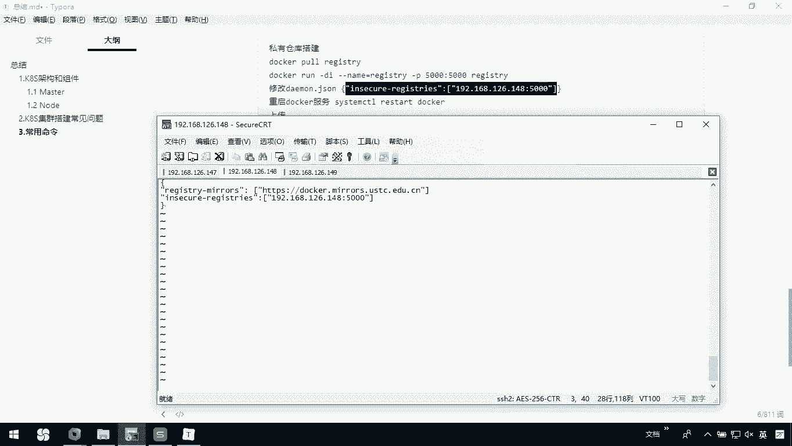

C不CC这我们把它退出一下保存。OK然后呢，你重启一下你的到客服。我拉了一个LCCTR没写错，我看啊。我看一下我的刀坑状态，先停止一下吧。清掉，我们重新执行一下SOSTMCTRRA。

start我的docker，那它里边给我报错，应该是我在刚才编辑的文件里面呢，有些东西可能写错了。ETC下的刀cker。我看一下。啊，这里面落了一个逗号啊。他们每一个分割的时候，他是有逗号的。

在这里边加一个逗号，保存一下J这这。然后我们重新去。restar一下docker。OK了。那这些执行完以后呢，我们下面呢就可以去按照我们这个方案啊去执行。首先呢我们去。

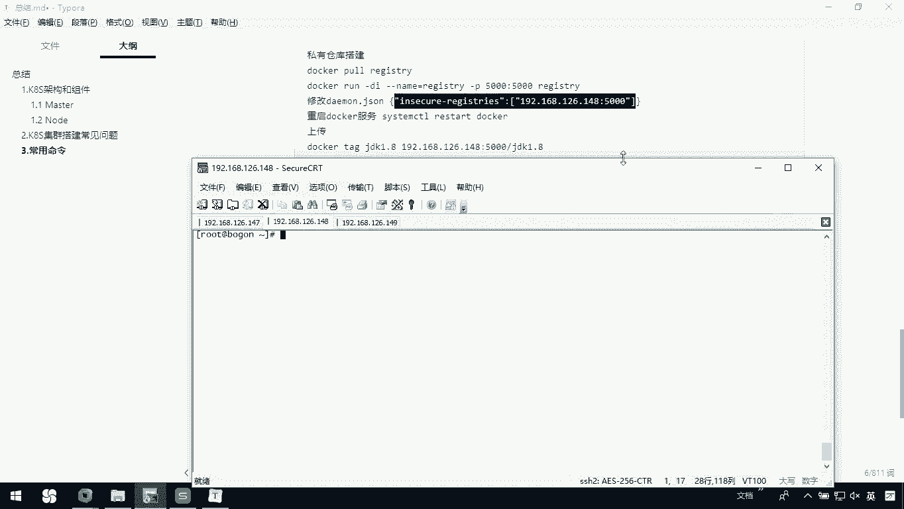

破偶下。我们先把当前的这一个镜像拉取过来，然后呢把它打成标签儿，再去安装到我们自己的仓库里边。也就是说安装到我们自己的私有仓库里。OK拉取完了。然后呢，我在这里边。把它tg一下。

在这里呢一定要改一下这个IPR，我们是148。

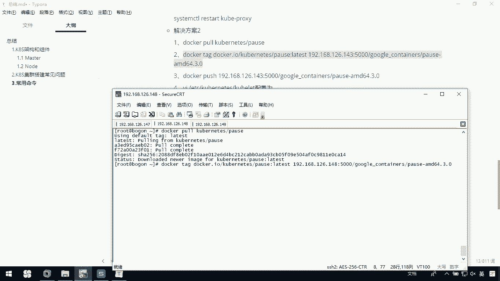

OK然后呢我们去把它push上去。

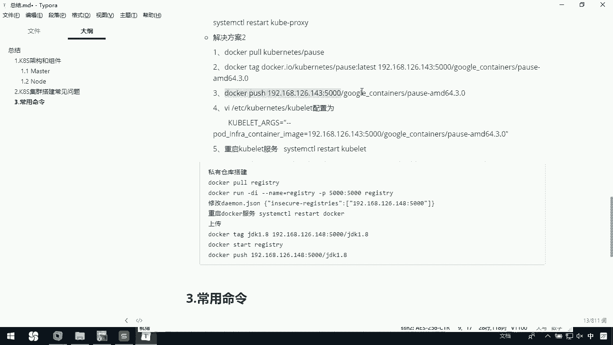

我们自己的148。OK现在成功以后呢，我们还需要去改一下我们colet这个配置文件。所以我们需要去把ETC下的kunet下的cober light的配置文件改一下。在这里呢我们需要去在这里边添加一下。

我们有一个叫杠杠POD。下划线，然后呢，INFRA杠CNTINER杠IMAGE其实这个呢就是告诉他我们在拉取镜像呢，从我们自己的192。168点126，我们自己的148这台机器。

去5000端口拉取我们的镜像。杠AMD64。3。0。OK后面这个空格啊，千万别忘了啊，然后呢，我们把它这ZJ保存，重新启动。我们的colet。服务。okK然后我们看一下啊，我们的这个。

coer light服务，它现在是启动的。那么你这个做完以后呢，我们现在呢只是一个node一这个节点，也就是说148这台机器OK了。你149这台机器呢也要去把刚才这个操作啊执行一下。

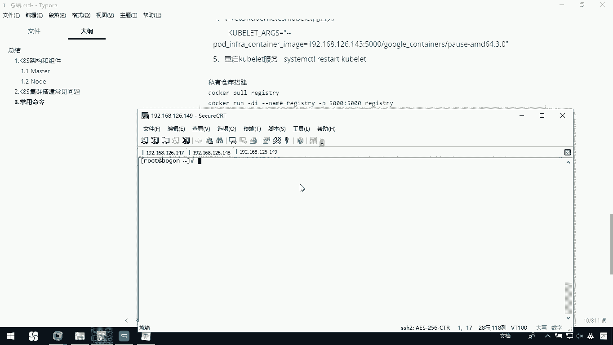

我已经把这个另外一个节点啊，149呢在这里边我已经也修改完了。那么这回我们再回到no这个master节点。那这个时候你看coer cTLge我们的po。

但这时候大家发现我们当前这个状态ready已经变成running了，对吧？那我们可以去。再来。看看我们具体的某一个节点的详细信息。嗯，这个。

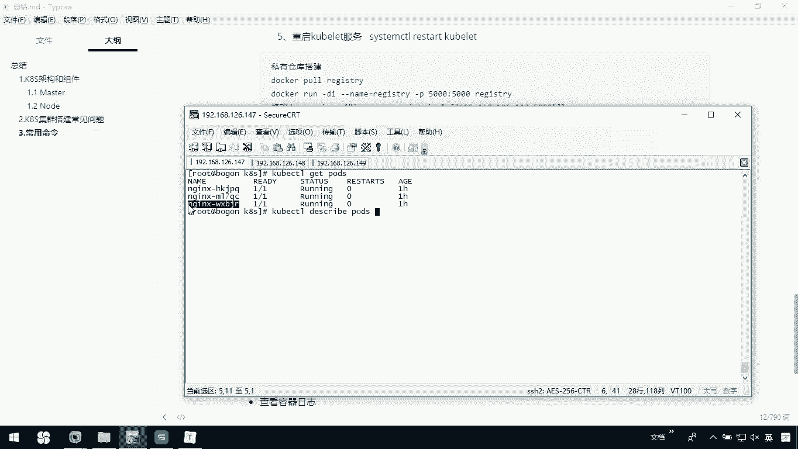

OK那你会发现我们现在在这里边呢已经把我们整个的这个呃镜像啊全拉取下来了。并且呢我们已经创建了当前我们这个n这个呃应该叫说三个N解X节点O也就是说我们根据刚才在我们配置文件里边所设置了。

我们已经有了三个当前的这个po。

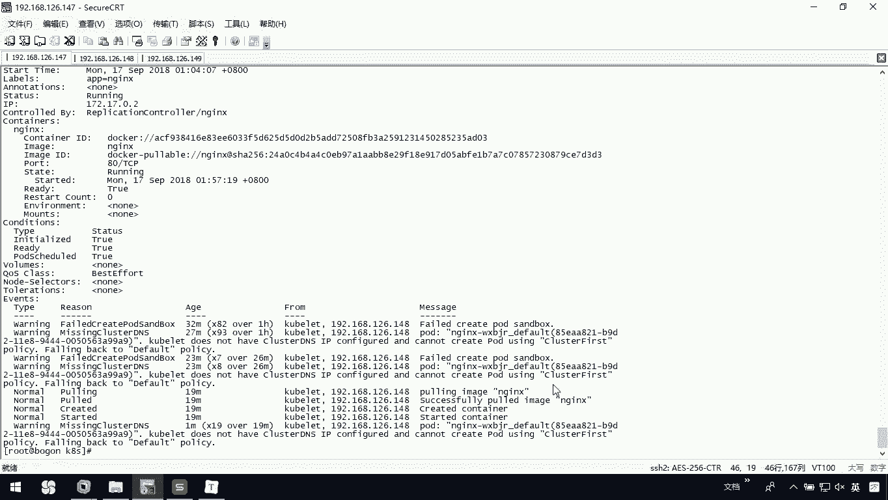

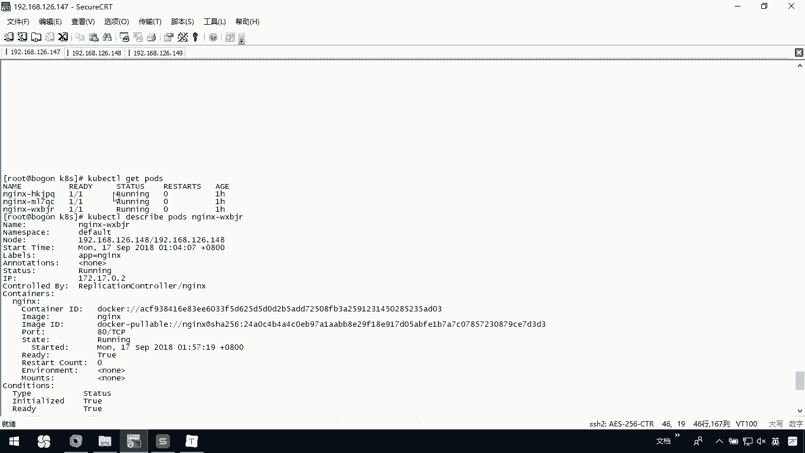

那我们I sorryor很列两个po，然后每一个po上呢有这个三个eng。那现在呢我们可以看一下，接下来我们。可以在这个note节点上啊，我们通过刀嗑。images你会发现呢我们这个NG镜像啊。

它自动把它下载下来了。那这都是因为我们在这个。当前我们优色下的local，然后我们的K8S中，我们定义了一个N g杠当前的这个叫RC这个压么文件。我们指定我们当前的意为置就是N。

那么它就会在各个节点上啊，通过我们的docker去把我们想要的这些镜像啊自动的下载下来了。

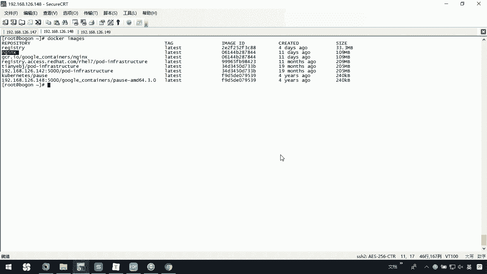